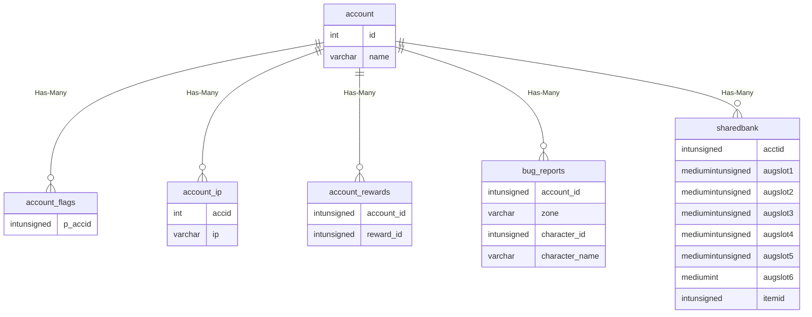

# Database Schema Reference

## Aas: aa_ability

```# aa_ability

## Relationships


| Relationship Type | Local Key | Relates to Table | Foreign Key |
| :--- | :--- | :--- | :--- |
| One-to-One | first_rank_id | [aa_ranks](../../schema/aas/aa_ranks.md) | id |


## Schema

| Column | Data Type | Description |
| :--- | :--- | :--- |
| id | int | Unique AA Identifier |
| name | text | Name |
| category | int | [AA Category](../../../../server/aas/aa-categories) |
| classes | int | [Classes](../../../../server/player/class-list) Bitmasks |
| races | int | [Races](../../../../server/npc/race-list) |
| drakkin_heritage | int | Drakkin Heritage: 127 = All |
| deities | int | [Deities](../../../../server/player/deity-list) |
| status | int | [Minimum Status](../../../../server/player/status-levels) |
| type | int | [AA Type](../../../../server/aas/aa-types) |
| charges | int | Number of Charges |
| grant_only | tinyint | Grant Only Flag: 0 = No, 1 = Yes |
| first_rank_id | int | First Rank Identifier |
| enabled | tinyint | Enabled: 0 = No, 1 = Yes |
| reset_on_death | tinyint | Reset on Death: 0 = False, 1 = True |
| auto_grant_enabled | tinyint |  |


``

## Aas: aa_rank_effects

```# aa_rank_effects

## Relationships


| Relationship Type | Local Key | Relates to Table | Foreign Key |
| :--- | :--- | :--- | :--- |
| One-to-One | rank_id | [aa_ranks](../../schema/aas/aa_ranks.md) | id |


## Schema

| Column | Data Type | Description |
| :--- | :--- | :--- |
| rank_id | int | [Rank Identifier](aa_ranks.md) |
| slot | int | AA Slot |
| effect_id | int | [Spell Effect Identifier](../../../../server/spells/spell-effect-ids) |
| base1 | int | First Base Value |
| base2 | int | Second Base Value |


``

## Aas: aa_rank_prereqs

```# aa_rank_prereqs

## Relationships


| Relationship Type | Local Key | Relates to Table | Foreign Key |
| :--- | :--- | :--- | :--- |
| One-to-One | aa_id | [aa_ranks](../../schema/aas/aa_ranks.md) | id |
| One-to-One | rank_id | [aa_ranks](../../schema/aas/aa_ranks.md) | id |


## Schema

| Column | Data Type | Description |
| :--- | :--- | :--- |
| rank_id | int | [Rank Identifier](aa_ranks.md) |
| aa_id | int | [AA Identifier](aa_ability.md) |
| points | int | Cost in AA Points |


``

## Aas: aa_ranks

```# aa_ranks

## Relationships


| Relationship Type | Local Key | Relates to Table | Foreign Key |
| :--- | :--- | :--- | :--- |
| One-to-One | id | [aa_ability](../../schema/aas/aa_ability.md) | first_rank_id |
| One-to-One | id | [aa_rank_effects](../../schema/aas/aa_rank_effects.md) | rank_id |
| One-to-One | id | [aa_rank_prereqs](../../schema/aas/aa_rank_prereqs.md) | aa_id |
| One-to-One | id | [aa_rank_prereqs](../../schema/aas/aa_rank_prereqs.md) | rank_id |
| Has-Many | id | [character_alternate_abilities](../../schema/characters/character_alternate_abilities.md) | aa_id |


## Schema

| Column | Data Type | Description |
| :--- | :--- | :--- |
| id | int | [AA Identifier](aa_ability.md) |
| upper_hotkey_sid | int | Upper Hotkey SID |
| lower_hotkey_sid | int | Lower Hotkey SID |
| title_sid | int | Title SID |
| desc_sid | int | Description SID |
| cost | int | Cost in AA Points |
| level_req | int | Level Required |
| spell | int | [Spell Identifier](../../schema/spells/spells_new.md) |
| spell_type | int | [Spell Type](../../../../server/spells/spell-types) |
| recast_time | int | Recast Timer |
| expansion | int | [Expansion Identifier](../../../../server/operation/expansion-list) |
| prev_id | int | Previous Rank Identifier |
| next_id | int | Next Rank Identifier |


``

## Account: account

```# account

## Relationships




| Relationship Type | Local Key | Relates to Table | Foreign Key |
| :--- | :--- | :--- | :--- |
| Has-Many | id | [account_flags](../../schema/account/account_flags.md) | p_accid |
| Has-Many | id | [account_ip](../../schema/account/account_ip.md) | accid |
| Has-Many | id | [account_rewards](../../schema/account/account_rewards.md) | account_id |
| Has-Many | id | [bug_reports](../../schema/admin/bug_reports.md) | account_id |
| Has-Many | id | [sharedbank](../../schema/account/sharedbank.md) | acctid |
| Has-Many | id | [eventlog](../../schema/admin/eventlog.md) | accountid |
| One-to-One | id | [gm_ips](../../schema/admin/gm_ips.md) | account_id |
| Has-Many | name | [eventlog](../../schema/admin/eventlog.md) | accountname |
| Has-Many | name | [hackers](../../schema/admin/hackers.md) | account |
| Has-Many | name | [petitions](../../schema/admin/petitions.md) | accountname |


## Schema

| Column | Data Type | Description |
| :--- | :--- | :--- |
| id | int | Unique Account Identifier |
| name | varchar | Name |
| charname | varchar | Character name last logged in on this account. |
| sharedplat | int | Platinum in Shared Bank. |
| password | varchar | Private loginserver password. |
| status | int | [Status](../../../../server/player/status-levels) |
| ls_id | varchar | Loginserver ID |
| lsaccount_id | int | Loginserver Account Identifier |
| gmspeed | tinyint | GM Speed: 0 = Disabled, 1 = Enabled |
| invulnerable | tinyint | Invulnerable: 0 = False, 1 = True |
| flymode | tinyint | [Fly Mode](../../../../server/npc/fly-modes) |
| ignore_tells | tinyint | Ignore Tells: 0 = False, 1 = True |
| revoked | tinyint | OOC Revoked: 0 = False, 1 = True |
| karma | int | Karma |
| minilogin_ip | varchar | Minilogin IP Address |
| hideme | tinyint | Hide Me: 0 = Disabled, 1 = Enabled |
| rulesflag | tinyint | Rules Flag |
| suspendeduntil | datetime | Time Suspension of the Account ends |
| time_creation | int | Time Creation UNIX Timestamp |
| ban_reason | text | Ban Reason |
| suspend_reason | text | Suspension Reason |
| crc_eqgame | text | CRC for EQGame.exe |
| crc_skillcaps | text | CRC for SkillCaps file |
| crc_basedata | text | CRC for BaseData file |


``

## Account: account_flags

```# account_flags

## Relationships


| Relationship Type | Local Key | Relates to Table | Foreign Key |
| :--- | :--- | :--- | :--- |
| One-to-One | p_accid | [account](../../schema/account/account.md) | id |


## Schema

| Column | Data Type | Description |
| :--- | :--- | :--- |
| p_accid | int | [Account Identifier](account.md) |
| p_flag | varchar | Name |
| p_value | varchar | Value |


``

## Account: account_ip

```# account_ip

## Relationships


| Relationship Type | Local Key | Relates to Table | Foreign Key |
| :--- | :--- | :--- | :--- |
| One-to-One | ip | [banned_ips](../../schema/admin/banned_ips.md) | ip_address |
| One-to-One | ip | [gm_ips](../../schema/admin/gm_ips.md) | ip_address |
| One-to-One | ip | [ip_exemptions](../../schema/admin/ip_exemptions.md) | exemption_ip |


## Schema

| Column | Data Type | Description |
| :--- | :--- | :--- |
| accid | int | [Account Identifier](account.md) |
| ip | varchar | IP Address |
| count | int | Number of times logged in from this IP |
| lastused | timestamp | Timestamp of when account was last logged in |


``

## Account: account_rewards

```# account_rewards

## Relationships


| Relationship Type | Local Key | Relates to Table | Foreign Key |
| :--- | :--- | :--- | :--- |
| One-to-One | reward_id | [veteran_reward_templates](../../schema/admin/veteran_reward_templates.md) | claim_id |


## Schema

| Column | Data Type | Description |
| :--- | :--- | :--- |
| account_id | int | [Account Identifier](account.md) |
| reward_id | int | [Veteran Reward Identifier](../../schema/admin/veteran_reward_templates.md) |
| amount | int | Amount |


``

## Account: sharedbank

```# sharedbank

## Relationships


| Relationship Type | Local Key | Relates to Table | Foreign Key |
| :--- | :--- | :--- | :--- |
| One-to-One | acctid | [account](../../schema/account/account.md) | id |
| One-to-One | augslot1 | [items](../../schema/items/items.md) | id |
| One-to-One | augslot2 | [items](../../schema/items/items.md) | id |
| One-to-One | augslot3 | [items](../../schema/items/items.md) | id |
| One-to-One | augslot4 | [items](../../schema/items/items.md) | id |
| One-to-One | augslot5 | [items](../../schema/items/items.md) | id |
| One-to-One | augslot6 | [items](../../schema/items/items.md) | id |
| One-to-One | itemid | [items](../../schema/items/items.md) | id |


## Schema

| Column | Data Type | Description |
| :--- | :--- | :--- |
| acctid | int | [Unique Account Identifier](account.md) |
| slotid | mediumint | [Slot Identifier](../../../../server/inventory/inventory-slots) |
| itemid | int | [Item Identifier](../../schema/items/items.md) |
| charges | smallint | Charges |
| augslot1 | mediumint | Augment Slot 1 |
| augslot2 | mediumint | Augment Slot 2 |
| augslot3 | mediumint | Augment Slot 3 |
| augslot4 | mediumint | Augment Slot 4 |
| augslot5 | mediumint | Augment Slot 5 |
| augslot6 | mediumint | Augment Slot 6 |
| custom_data | text | Custom Data |


``

## Admin: banned_ips

```# banned_ips

## Relationships


| Relationship Type | Local Key | Relates to Table | Foreign Key |
| :--- | :--- | :--- | :--- |
| Has-Many | ip_address | [account_ip](../../schema/account/account_ip.md) | ip |


## Schema

| Column | Data Type | Description |
| :--- | :--- | :--- |
| ip_address | varchar | [IP Address](../../schema/account/account_ip.md) |
| notes | varchar | Ban reason |


``

## Admin: bug_reports

```# bug_reports

## Relationships


| Relationship Type | Local Key | Relates to Table | Foreign Key |
| :--- | :--- | :--- | :--- |
| One-to-One | zone | [zone](../../schema/zone/zone.md) | short_name |
| One-to-One | account_id | [account](../../schema/account/account.md) | id |
| One-to-One | character_id | [character_data](../../schema/characters/character_data.md) | id |
| One-to-One | character_name | [character_data](../../schema/characters/character_data.md) | name |


## Schema

| Column | Data Type | Description |
| :--- | :--- | :--- |
| id | int | Unique Bug Report Identifier |
| zone | varchar | [Zone Short Name](../../../../server/zones/zone-list) |
| client_version_id | int | [Client Version Identifier](../../../../server/player/client-version-bitmasks) |
| client_version_name | varchar | [Client Version Name](../../../../server/player/client-version-bitmasks) |
| account_id | int | [Account Identifier](../../schema/account/account.md) |
| character_id | int | [Character Identifier](../../schema/characters/character_data.md) |
| character_name | varchar | [Character Name](../../schema/characters/character_data.md) |
| reporter_spoof | tinyint | Reporter Spoof |
| category_id | int | Category Identifier |
| category_name | varchar | Category Name |
| reporter_name | varchar | Reporter Name |
| ui_path | varchar | UI Path |
| pos_x | float | Position X Coordinate |
| pos_y | float | Position Y Coordinate |
| pos_z | float | Position Z Coordinate |
| heading | int | Heading Coordinate |
| time_played | int | Time Played in Seconds |
| target_id | int | Target Identifier |
| target_name | varchar | Target Name |
| optional_info_mask | int | Optional Info Mask: 0 = False, 1 = True |
| _can_duplicate | tinyint | Can Duplicate: 0 = False, 1 = True |
| _crash_bug | tinyint | Crash Bug |
| _target_info | tinyint | Target Info |
| _character_flags | tinyint | Character Flags |
| _unknown_value | tinyint | Unknown |
| bug_report | varchar | Bug Report |
| system_info | varchar | System Information |
| report_datetime | datetime | Report Datetime |
| bug_status | tinyint | Bug Status |
| last_review | datetime | Last Review Datetime |
| last_reviewer | varchar | Last Reviewer |
| reviewer_notes | varchar | Reviewer Notes |


``

## Admin: bugs

```# bugs

## Relationships


| Relationship Type | Local Key | Relates to Table | Foreign Key |
| :--- | :--- | :--- | :--- |
| One-to-One | zone | [zone](../../schema/zone/zone.md) | short_name |
| One-to-One | name | [character_data](../../schema/characters/character_data.md) | name |


## Schema

| Column | Data Type | Description |
| :--- | :--- | :--- |
| id | int | Unique Bug Identifier |
| zone | varchar | [Zone Short Name](../../../../server/zones/zone-list) |
| name | varchar | Player Name |
| ui | varchar | UI |
| x | float | X Coordinate |
| y | float | Y Coordinate |
| z | float | Z Coordinate |
| type | varchar | Type |
| flag | tinyint | Flag |
| target | varchar | Target when reported |
| bug | varchar | Bug reported |
| date | date | Date when reported |
| status | tinyint | [Account Status of Reporter]([../../../../server/player/status-levels](../../../../server/player/status-levels) |


``

## Admin: chatchannel_reserved_names

```# chatchannel_reserved_names

## Schema

| Column | Data Type | Description |
| :--- | :--- | :--- |
| id | int | Unique Chat Channel Reserved Name Identifier |
| name | varchar | Name |


``

## Admin: chatchannels

```# chatchannels

## Schema

| Column | Data Type | Description |
| :--- | :--- | :--- |
| id | int | Unique Chat Channel Identifier |
| name | varchar | Name |
| owner | varchar | [Owner Character Identifier](../../schema/characters/character_data.md) |
| password | varchar | Password |
| minstatus | int | [Minimum Status](../../../../server/player/status-levels) |


``

## Admin: command_settings

```# command_settings

## Schema

| Column | Data Type | Description |
| :--- | :--- | :--- |
| command | varchar | Unique Command Identifier |
| access | int | [Required Status](../../../../server/player/status-levels) |
| aliases | varchar | Aliases |


``

## Admin: command_subsettings

```# command_subsettings

## Schema

| Column | Data Type | Description |
| :--- | :--- | :--- |
| id | int | Unique Subcommand Identifier |
| parent_command | varchar | [Parent Command](../../schema/admin/command_settings.md) |
| sub_command | varchar | Subcommand Identifier |
| access_level | int | [Required Status](../../../../server/player/status-levels) |
| top_level_aliases | varchar | Top Level Aliases |


``

## Admin: db_version

```# db_version

## Schema

| Column | Data Type | Description |
| :--- | :--- | :--- |
| version | int | Database Version |
| bots_version | int | Bots Version |


``

## Admin: discord_webhooks

```# discord_webhooks

## Relationships


| Relationship Type | Local Key | Relates to Table | Foreign Key |
| :--- | :--- | :--- | :--- |
| Has-Many | id | [logsys_categories](../../schema/admin/logsys_categories.md) | discord_webhook_id |


## Schema

| Column | Data Type | Description |
| :--- | :--- | :--- |
| id | int | Unique Webhook Identifier |
| webhook_name | varchar | Webhook Name |
| webhook_url | varchar | Webhook URL |
| created_at | datetime | Created At |
| deleted_at | datetime | Deleted At |


``

## Admin: discovered_items

```# discovered_items

## Relationships


| Relationship Type | Local Key | Relates to Table | Foreign Key |
| :--- | :--- | :--- | :--- |
| One-to-One | char_name | [character_data](../../schema/characters/character_data.md) | name |
| One-to-One | item_id | [items](../../schema/items/items.md) | id |


## Schema

| Column | Data Type | Description |
| :--- | :--- | :--- |
| item_id | int | [Item Identifier](../../schema/items/items.md) |
| char_name | varchar | [Character Name](../../schema/characters/character_data.md) |
| discovered_date | int | Discovered Date UNIX Timestamp |
| account_status | int | [Account Status](../../../../server/player/status-levels) |


``

## Admin: eqtime

```# eqtime

## Schema

| Column | Data Type | Description |
| :--- | :--- | :--- |
| minute | tinyint | Minute |
| hour | tinyint | Hour |
| day | tinyint | Day |
| month | tinyint | Month |
| year | int | Year |
| realtime | int | Real Time |


``

## Admin: eventlog

```# eventlog

## Relationships


| Relationship Type | Local Key | Relates to Table | Foreign Key |
| :--- | :--- | :--- | :--- |
| One-to-One | accountid | [account](../../schema/account/account.md) | id |
| One-to-One | accountname | [account](../../schema/account/account.md) | name |
| One-to-One | charname | [character_data](../../schema/characters/character_data.md) | name |


## Schema

| Column | Data Type | Description |
| :--- | :--- | :--- |
| id | int | Unique Event Identifier |
| accountname | varchar | [Account Name](../../schema/account/account.md) |
| accountid | int | [Account Identifier](../../schema/account/account.md) |
| status | int | [Status](../../../../server/player/status-levels) |
| charname | varchar | [Character Name](../../schema/characters/character_data.md) |
| target | varchar | Target |
| time | timestamp | TIme Timestamp |
| descriptiontype | varchar | Description Type |
| description | text | Description |
| event_nid | int | Event Identifier |


``

## Admin: gm_ips

```# gm_ips

## Relationships


| Relationship Type | Local Key | Relates to Table | Foreign Key |
| :--- | :--- | :--- | :--- |
| One-to-One | account_id | [account](../../schema/account/account.md) | id |
| Has-Many | ip_address | [account_ip](../../schema/account/account_ip.md) | ip |


## Schema

| Column | Data Type | Description |
| :--- | :--- | :--- |
| name | varchar | [Character Name](../../schema/characters/character_data.md) |
| account_id | int | [Account Identifier](../../schema/account/account.md) |
| ip_address | varchar | [IP Address](../../schema/account/account_ip.md) |


``

## Admin: hackers

```# hackers

## Relationships


| Relationship Type | Local Key | Relates to Table | Foreign Key |
| :--- | :--- | :--- | :--- |
| One-to-One | account | [account](../../schema/account/account.md) | name |
| One-to-One | name | [character_data](../../schema/characters/character_data.md) | name |
| One-to-One | zone | [zone](../../schema/zone/zone.md) | short_name |


## Schema

| Column | Data Type | Description |
| :--- | :--- | :--- |
| id | int | Unique Hacker Identifier |
| account | text | [Account Identifier](../../schema/account/account.md) |
| name | text | [Character Name](../../schema/characters/character_data.md) |
| hacked | text | Hacked |
| zone | text | [Zone Short Name](../../../../server/zones/zone-list) |
| date | timestamp | Date Timestamp |


``

## Admin: ip_exemptions

```# ip_exemptions

## Relationships


| Relationship Type | Local Key | Relates to Table | Foreign Key |
| :--- | :--- | :--- | :--- |
| Has-Many | exemption_ip | [account_ip](../../schema/account/account_ip.md) | ip |


## Schema

| Column | Data Type | Description |
| :--- | :--- | :--- |
| exemption_id | int | Exemption Identifier |
| exemption_ip | varchar | [Exemption IP Address](../../schema/account/account_ip.md) |
| exemption_amount | int | Exemption Amount |


``

## Admin: level_exp_mods

```# level_exp_mods

## Schema

| Column | Data Type | Description |
| :--- | :--- | :--- |
| level | int | Level |
| exp_mod | float | Experience Modifier: 0.5 = 50%, 1 = 100%, 1.5 = 150% |
| aa_exp_mod | float | AA Experience Modifier: 0.5 = 50%, 1 = 100%, 1.5 = 150% |


``

## Admin: logsys_categories

```# logsys_categories

## Relationships


| Relationship Type | Local Key | Relates to Table | Foreign Key |
| :--- | :--- | :--- | :--- |
| One-to-One | discord_webhook_id | [discord_webhooks](../../schema/admin/discord_webhooks.md) | id |


## Schema

| Column | Data Type | Description |
| :--- | :--- | :--- |
| log_category_id | int | Unique Log Category Identifier |
| log_category_description | varchar | Log Category Description |
| log_to_console | smallint | Log to Console: 0 = False, 1 = True |
| log_to_file | smallint | Log to File: 0 = False, 1 = True |
| log_to_gmsay | smallint | Log to GMSay: 0 = False, 1 = True |
| log_to_discord | smallint | Log To Discord: 0 = False, 1 = True |
| discord_webhook_id | int | Unique Webhook Identifier |


``

## Admin: name_filter

```# name_filter

## Schema

| Column | Data Type | Description |
| :--- | :--- | :--- |
| id | int | Unique Name Filter Identifier |
| name | varchar | Name |


``

## Admin: peq_admin

```# peq_admin

## Schema

| Column | Data Type | Description |
| :--- | :--- | :--- |
| id | int | Account ID |
| login | varchar | Username |
| password | varchar | MD5 Encoded Password |
| administrator | int | Administrator: 0 = False, 1 = True |


``

## Admin: perl_event_export_settings

```# perl_event_export_settings

## Schema

| Column | Data Type | Description |
| :--- | :--- | :--- |
| event_id | int | [Unique Perl Event Identifier](https://eqemu.gitbook.io/quest-api/events) |
| event_description | varchar | Event Description |
| export_qglobals | smallint | Export QGlobals: 0 = False, 1 = True |
| export_mob | smallint | Export Mob: 0 = False, 1 = True |
| export_zone | smallint | Export Zone: 0 = False, 1 = True |
| export_item | smallint | Export Item: 0 = False, 1 = True |
| export_event | smallint | Export Event: 0 = False, 1 = True |


``

## Admin: petitions

```# petitions

## Relationships

```mermaid
erDiagram
    petitions {
        varchar accountname
        varchar charname
        varchar lastgm
        varchar zone
    }
    character_data {
        intunsigned id
        varchar name
        varchar nane
        intunsigned zone_instance
        intunsigned zone_id
    }
    account {
        int id
        varchar name
    }
    zone {
        int zoneidnumber
        varchar short_name
        tinyintunsigned version
        varchar content_flags
        varchar content_flags_disabled
    }
    petitions ||--o{ character_data : "One-to-One"
    petitions ||--o{ account : "One-to-One"
    petitions ||--o{ character_data : "One-to-One"
    petitions ||--o{ zone : "One-to-One"


```


| Relationship Type | Local Key | Relates to Table | Foreign Key |
| :--- | :--- | :--- | :--- |
| One-to-One | charname | [character_data](../../schema/characters/character_data.md) | name |
| One-to-One | accountname | [account](../../schema/account/account.md) | name |
| One-to-One | lastgm | [character_data](../../schema/characters/character_data.md) | name |
| One-to-One | zone | [zone](../../schema/zone/zone.md) | zoneidnumber |


## Schema

| Column | Data Type | Description |
| :--- | :--- | :--- |
| dib | int | Unknown |
| petid | int | Unique Petition Entry Identifier |
| charname | varchar | [Character Name](../../schema/characters/character_data.md) |
| accountname | varchar | [Account Name](../../schema/account/account.md) |
| lastgm | varchar | Last GM |
| petitiontext | text | Petition Text |
| gmtext | text | GM Text |
| zone | varchar | [Zone Short Name](../../../../server/zones/zone-list) |
| urgency | int | Urgency |
| charclass | int | [Character Class](../../../../server/player/class-list) |
| charrace | int | [Character Race](../../../../server/npc/race-list) |
| charlevel | int | Character Level |
| checkouts | int | Checkouts |
| unavailables | int | Unavailables |
| ischeckedout | tinyint | Is Checked Out: 0 = False, 1 = True |
| senttime | bigint | Sent Time UNIX Timestamp |


``

## Admin: player_event_log_settings

```# player_event_log_settings

## Schema

| Column | Data Type | Description |
| :--- | :--- | :--- |
| id | bigint | Unique Event Identifier |
| event_name | varchar | Event Name |
| event_enabled | tinyint | Event Enabled: 0 = False, 1 = True |
| retention_days | int | Retention Days: 0 for Permanent |
| discord_webhook_id | int | [Discord Webhook Identifier](../../schema/admin/discord_webhooks.md) |


``

## Admin: player_event_logs

```# player_event_logs

## Schema

| Column | Data Type | Description |
| :--- | :--- | :--- |
| id | bigint | Unique Player Event Log Identifier |
| account_id | bigint | [Account Identifier](../../schema/account/account.md) |
| character_id | bigint | [Character Identifier](../../schema/characters/character_data.md) |
| zone_id | int | [Zone Identifier](../../../../server/zones/zone-list) |
| instance_id | int | [Instance Identifier](../../schema/instances/instance_list.md) |
| x | float | X Coordinate |
| y | float | Y  Coordinate |
| z | float | Z  Coordinate |
| heading | float | Heading Coordinate |
| event_type_id | int | [Event Type Identifier](../../schema/admin/player_event_log_settings.md) |
| event_type_name | varchar | [Event Type Name](../../schema/admin/player_event_log_settings.md) |
| event_data | longtext | Event Data JSON |
| created_at | datetime | Created At |


``

## Admin: profanity_list

```# profanity_list

## Schema

| Column | Data Type | Description |
| :--- | :--- | :--- |
| word | varchar | Word |


``

## Admin: reports

```# reports

## Relationships

```mermaid
erDiagram
    reports {
        varchar name
    }
    character_data {
        intunsigned id
        varchar name
        varchar nane
        intunsigned zone_instance
        intunsigned zone_id
    }
    reports ||--o{ character_data : "One-to-One"


```


| Relationship Type | Local Key | Relates to Table | Foreign Key |
| :--- | :--- | :--- | :--- |
| One-to-One | name | [character_data](../../schema/characters/character_data.md) | name |


## Schema

| Column | Data Type | Description |
| :--- | :--- | :--- |
| id | int | Unique Report Identifier |
| name | varchar | Name |
| reported | varchar | Reported |
| reported_text | text | Reported Text |


``

## Admin: saylink

```# saylink

## Schema

| Column | Data Type | Description |
| :--- | :--- | :--- |
| id | int | Unique Saylink Identifier |
| phrase | varchar | Phrase |


``

## Admin: start_zones

```# start_zones

## Relationships

```mermaid
erDiagram
    start_zones {
        varchar content_flags
        varchar content_flags_disabled
        int start_zone
        int zone_id
    }
    content_flags {
        varchar flag_name
    }
    zone {
        int zoneidnumber
        varchar short_name
        tinyintunsigned version
        varchar content_flags
        varchar content_flags_disabled
    }
    start_zones ||--o{ content_flags : "One-to-One"
    start_zones ||--o{ content_flags : "One-to-One"
    start_zones ||--o{ zone : "One-to-One"
    start_zones ||--o{ zone : "One-to-One"


```


| Relationship Type | Local Key | Relates to Table | Foreign Key |
| :--- | :--- | :--- | :--- |
| One-to-One | content_flags | [content_flags](../../schema/flagging/content_flags.md) | flag_name |
| One-to-One | content_flags_disabled | [content_flags](../../schema/flagging/content_flags.md) | flag_name |
| One-to-One | start_zone | [zone](../../schema/zone/zone.md) | zoneidnumber |
| One-to-One | zone_id | [zone](../../schema/zone/zone.md) | zoneidnumber |


## Schema

| Column | Data Type | Description |
| :--- | :--- | :--- |
| x | float | X Coordinate |
| y | float | Y Coordinate |
| z | float | Z Coordinate |
| heading | float | Heading Coordinate |
| zone_id | int | [Zone Identifier](../../../../server/zones/zone-list) |
| bind_id | int | Bind Identifier |
| player_choice | int | Player Choice |
| player_class | int | [Player Class](../../../../server/player/class-list) |
| player_deity | int | [Player Deity](../../../../server/player/deity-list) |
| player_race | int | [Player Race](../../../../server/npc/race-list) |
| start_zone | int | [Zone Identifier](../../../../server/zones/zone-list) |
| bind_x | float | Bind X Coordinate |
| bind_y | float | Bind Y Coordinate |
| bind_z | float | Bind Z Coordinate |
| select_rank | tinyint | Select Rank: Always 50 |
| min_expansion | tinyint | [Minimum Expansion](../../../../server/operation/expansion-list) |
| max_expansion | tinyint | [Maximum Expansion](../../../../server/operation/expansion-list) |
| content_flags | varchar | Content Flags Required to be Enabled |
| content_flags_disabled | varchar | Content Flags Required to be Disabled |


``

## Admin: starting_items

```# starting_items

## Relationships

```mermaid
erDiagram
    starting_items {
        varchar content_flags
        varchar content_flags_disabled
        varchar itemid
        varchar zone_id
        varchar zoneid
    }
    content_flags {
        varchar flag_name
    }
    items {
        int id
        int book
        varchar name
        int recasttype
        int icon
        mediumint bardeffect
        int clickeffect
        int focuseffect
        int proceffect
        int scrolleffect
        int worneffect
    }
    zone {
        int zoneidnumber
        varchar short_name
        tinyintunsigned version
        varchar content_flags
        varchar content_flags_disabled
    }
    starting_items ||--o{ content_flags : "One-to-One"
    starting_items ||--o{ content_flags : "One-to-One"
    starting_items ||--o{ items : "One-to-One"
    starting_items ||--o{ zone : "One-to-One"


```


| Relationship Type | Local Key | Relates to Table | Foreign Key |
| :--- | :--- | :--- | :--- |
| One-to-One | content_flags | [content_flags](../../schema/flagging/content_flags.md) | flag_name |
| One-to-One | content_flags_disabled | [content_flags](../../schema/flagging/content_flags.md) | flag_name |
| One-to-One | itemid | [items](../../schema/items/items.md) | id |
| One-to-One | zone_id | [zone](../../schema/zone/zone.md) | zoneidnumber |


## Schema

| Column | Data Type | Description |
| :--- | :--- | :--- |
| id | int | Unique Starting Items Entry Identifier |
| class_list | text |  |
| class | int | [Class](../../../../server/player/class-list): 0 = All |
| deityid | int | [Deity](../../../../server/player/deity-list): 0 = Alll |
| zone_id_list | text |  |
| itemid | int | [Item Identifier](../../schema/items/items.md) |
| item_charges | tinyint | Item Charges |
| status | mediumint |  |
| slot | mediumint | [Slot](../../../../server/inventory/inventory-slots) |
| min_expansion | tinyint | [Minimum Expansion](../../../../server/operation/expansion-list) |
| max_expansion | tinyint | [Maximum Expansion](../../../../server/operation/expansion-list) |
| content_flags | varchar | Content Flags Required to be Enabled |
| content_flags_disabled | varchar | Content Flags Required to be Disabled |


``

## Admin: variables

```# variables

## Schema

| Column | Data Type | Description |
| :--- | :--- | :--- |
| id | int |  |
| varname | varchar | Variable Name |
| value | text | Value |
| information | text | Information |
| ts | timestamp | Timestamp |


``

## Admin: veteran_reward_templates

```# veteran_reward_templates

## Relationships

```mermaid
erDiagram
    veteran_reward_templates {
        intunsigned claim_id
        intunsigned item_id
    }
    account_rewards {
        intunsigned account_id
        intunsigned reward_id
    }
    items {
        int id
        int book
        varchar name
        int recasttype
        int icon
        mediumint bardeffect
        int clickeffect
        int focuseffect
        int proceffect
        int scrolleffect
        int worneffect
    }
    veteran_reward_templates ||--o{ account_rewards : "Has-Many"
    veteran_reward_templates ||--o{ items : "One-to-One"


```


| Relationship Type | Local Key | Relates to Table | Foreign Key |
| :--- | :--- | :--- | :--- |
| Has-Many | claim_id | [account_rewards](../../schema/account/account_rewards.md) | reward_id |
| One-to-One | item_id | [items](../../schema/items/items.md) | id |


## Schema

| Column | Data Type | Description |
| :--- | :--- | :--- |
| claim_id | int | Unique Claim Identifier |
| name | varchar | Name |
| item_id | int | [Item Identifier](../../schema/items/items.md) |
| charges | smallint | Charges |
| reward_slot | tinyint | Reward Slot |


``

## Adventures: adventure_details

```# adventure_details

## Relationships

```mermaid
erDiagram
    adventure_details {
        intunsigned id
        smallintunsigned adventure_id
        int instance_id
    }
    adventure_members {
        intunsigned id
        intunsigned charid
    }
    adventure_template {
        intunsigned id
        intunsigned graveyard_zone_id
        varchar zone
        smallintunsigned zone_in_zone_id
        tinyintunsigned zone_version
        varchar version
    }
    adventure_template_entry {
        intunsigned id
        intunsigned template_id
    }
    adventure_template_entry_flavor {
        intunsigned id
    }
    instance_list {
        int id
        tinyintunsigned version
        intunsigned zone
    }
    adventure_details ||--o{ adventure_members : "Has-Many"
    adventure_details ||--o{ adventure_template : "One-to-One"
    adventure_details ||--o{ adventure_template_entry : "Has-Many"
    adventure_details ||--o{ adventure_template_entry_flavor : "Has-Many"
    adventure_details ||--o{ adventure_template : "One-to-One"
    adventure_details ||--o{ instance_list : "One-to-One"


```


| Relationship Type | Local Key | Relates to Table | Foreign Key |
| :--- | :--- | :--- | :--- |
| Has-Many | id | [adventure_members](../../schema/adventures/adventure_members.md) | id |
| One-to-One | id | [adventure_template](../../schema/adventures/adventure_template.md) | id |
| Has-Many | id | [adventure_template_entry](../../schema/adventures/adventure_template_entry.md) | id |
| Has-Many | id | [adventure_template_entry_flavor](../../schema/adventures/adventure_template_entry_flavor.md) | id |
| One-to-One | adventure_id | [adventure_template](../../schema/adventures/adventure_template.md) | id |
| One-to-One | instance_id | [instance_list](../../schema/instances/instance_list.md) | id |


## Schema

| Column | Data Type | Description |
| :--- | :--- | :--- |
| id | int | Unique Entry Identifier |
| adventure_id | smallint | Unique Adventure Identifier |
| instance_id | int | [Instance Identifier](../../schema/instances/instance_list.md) |
| count | smallint | Count |
| assassinate_count | smallint | Assassinate Count |
| status | tinyint | Status |
| time_created | int | Time Created UNIX Timestamp |
| time_zoned | int | Time Zoned UNIX Timestamp |
| time_completed | int | Time Completed UNIX Timestamp |


``

## Adventures: adventure_members

```# adventure_members

## Relationships

```mermaid
erDiagram
    adventure_members {
        intunsigned id
        intunsigned charid
    }
    adventure_details {
        intunsigned id
        smallintunsigned adventure_id
        int instance_id
    }
    character_data {
        intunsigned id
        varchar name
        varchar nane
        intunsigned zone_instance
        intunsigned zone_id
    }
    adventure_members ||--o{ adventure_details : "One-to-One"
    adventure_members ||--o{ character_data : "One-to-One"


```


| Relationship Type | Local Key | Relates to Table | Foreign Key |
| :--- | :--- | :--- | :--- |
| One-to-One | id | [adventure_details](../../schema/adventures/adventure_details.md) | id |
| One-to-One | charid | [character_data](../../schema/characters/character_data.md) | id |


## Schema

| Column | Data Type | Description |
| :--- | :--- | :--- |
| id | int | [Adventure Identifier](adventure_details.md) |
| charid | int | [Character Identifier](../../schema/characters/character_data.md) |


``

## Adventures: adventure_stats

```# adventure_stats

## Relationships

```mermaid
erDiagram
    adventure_stats {
        intunsigned player_id
    }
    character_data {
        intunsigned id
        varchar name
        varchar nane
        intunsigned zone_instance
        intunsigned zone_id
    }
    adventure_stats ||--o{ character_data : "One-to-One"


```


| Relationship Type | Local Key | Relates to Table | Foreign Key |
| :--- | :--- | :--- | :--- |
| One-to-One | player_id | [character_data](../../schema/characters/character_data.md) | id |


## Schema

| Column | Data Type | Description |
| :--- | :--- | :--- |
| player_id | int | [Character Identifier](../../schema/characters/character_data.md) |
| guk_wins | mediumint | Deepest Guk Wins |
| mir_wins | mediumint | Miragul's Menagerie Wins |
| mmc_wins | mediumint | Mistmoore Catacombs Wins |
| ruj_wins | mediumint | Rujarkian Hills Wins |
| tak_wins | mediumint | Takish-Hiz Wins |
| guk_losses | mediumint | Deepest Guk Losses |
| mir_losses | mediumint | Miragul's Menagerie Losses |
| mmc_losses | mediumint | Mistmoore Catacombs Losses |
| ruj_losses | mediumint | Rujarkian Hills Losses |
| tak_losses | mediumint | Takish-Hiz Losses |


``

## Adventures: adventure_template

```# adventure_template

## Relationships

```mermaid
erDiagram
    adventure_template {
        intunsigned id
        intunsigned graveyard_zone_id
        varchar zone
        smallintunsigned zone_in_zone_id
        tinyintunsigned zone_version
        varchar version
    }
    zone {
        int zoneidnumber
        varchar short_name
        tinyintunsigned version
        varchar content_flags
        varchar content_flags_disabled
    }
    adventure_details {
        intunsigned id
        smallintunsigned adventure_id
        int instance_id
    }
    adventure_template ||--o{ zone : "One-to-One"
    adventure_template ||--o{ adventure_details : "One-to-One"
    adventure_template ||--o{ zone : "One-to-One"
    adventure_template ||--o{ zone : "One-to-One"
    adventure_template ||--o{ zone : "One-to-One"


```


| Relationship Type | Local Key | Relates to Table | Foreign Key |
| :--- | :--- | :--- | :--- |
| One-to-One | graveyard_zone_id | [zone](../../schema/zone/zone.md) | zoneidnumber |
| One-to-One | id | [adventure_details](../../schema/adventures/adventure_details.md) | id |
| One-to-One | zone | [zone](../../schema/zone/zone.md) | short_name |
| One-to-One | zone_in_zone_id | [zone](../../schema/zone/zone.md) | zoneidnumber |
| One-to-One | zone_version | [zone](../../schema/zone/zone.md) | version |


## Schema

| Column | Data Type | Description |
| :--- | :--- | :--- |
| id | int | [Adventure Identifier](adventure_details.md) |
| zone | varchar | [Zone Short Name](../../../../server/zones/zone-list) |
| zone_version | tinyint | Zone Version |
| is_hard | tinyint | Hard: 0 = False, 1 = True |
| is_raid | tinyint | Raid: 0 = False, 1 = True |
| min_level | tinyint | Minimum Level |
| max_level | tinyint | Maximum Level |
| type | tinyint | Type |
| type_data | int | Type Data |
| type_count | smallint | Type Count |
| assa_x | float | Assassination X Coordinate |
| assa_y | float | Assassination Y Coordinate |
| assa_z | float | Assassination Z Coordinate |
| assa_h | float | Assassination Heading Coordinate |
| text | varchar | Text |
| duration | int | Duration |
| zone_in_time | int | Zone In Duration |
| win_points | smallint | LDoN Points for Winning |
| lose_points | smallint | LDoN Points for Losing |
| theme | tinyint | [LDoN Theme](../../../../server/zones/ldon-themes) |
| zone_in_zone_id | smallint | [Zone In Zone Identifier](../../../../server/zones/zone-list) |
| zone_in_x | float | Zone In X Coordinate |
| zone_in_y | float | Zone In Y Coordinate |
| zone_in_object_id | smallint | Zone In Object Identifier |
| dest_x | float | Destination X Coordinate |
| dest_y | float | Destination Y Coordinate |
| dest_z | float | Destination Z Coordinate |
| dest_h | float | Destination Heading Coordinate |
| graveyard_zone_id | int | [Zone Identifier](../../../../server/zones/zone-list) |
| graveyard_x | float | Graveyard X Coordinate |
| graveyard_y | float | Graveyard Y Coordinate |
| graveyard_z | float | Graveyard Z Coordinate |
| graveyard_radius | float | Graveyard Radius |


``

## Adventures: adventure_template_entry

```# adventure_template_entry

## Relationships

```mermaid
erDiagram
    adventure_template_entry {
        intunsigned id
        intunsigned template_id
    }
    adventure_details {
        intunsigned id
        smallintunsigned adventure_id
        int instance_id
    }
    adventure_template {
        intunsigned id
        intunsigned graveyard_zone_id
        varchar zone
        smallintunsigned zone_in_zone_id
        tinyintunsigned zone_version
        varchar version
    }
    adventure_template_entry ||--o{ adventure_details : "One-to-One"
    adventure_template_entry ||--o{ adventure_template : "One-to-One"


```


| Relationship Type | Local Key | Relates to Table | Foreign Key |
| :--- | :--- | :--- | :--- |
| One-to-One | id | [adventure_details](../../schema/adventures/adventure_details.md) | id |
| One-to-One | template_id | [adventure_template](../../schema/adventures/adventure_template.md) | id |


## Schema

| Column | Data Type | Description |
| :--- | :--- | :--- |
| id | int | [Adventure Identifier](adventure_details.md) |
| template_id | int | [Template Identifier](adventure_template.md) |


``

## Adventures: adventure_template_entry_flavor

```# adventure_template_entry_flavor

## Relationships

```mermaid
erDiagram
    adventure_template_entry_flavor {
        intunsigned id
    }
    adventure_details {
        intunsigned id
        smallintunsigned adventure_id
        int instance_id
    }
    adventure_template_entry_flavor ||--o{ adventure_details : "One-to-One"


```


| Relationship Type | Local Key | Relates to Table | Foreign Key |
| :--- | :--- | :--- | :--- |
| One-to-One | id | [adventure_details](../../schema/adventures/adventure_details.md) | id |


## Schema

| Column | Data Type | Description |
| :--- | :--- | :--- |
| id | int | [Adventure Identifier](adventure_details.md) |
| text | varchar | Text |


``

## Alternate-currency: alternate_currency

```# alternate_currency

## Relationships

```mermaid
erDiagram
    alternate_currency {
        int id
        int item_id
    }
    character_alt_currency {
        intunsigned currency_id
        intunsigned char_id
    }
    npc_types {
        intunsigned alt_currency_id
        int id
        int npc_faction_id
        text name
        intunsigned loottable_id
        intunsigned merchant_id
        intunsigned emoteid
        intunsigned adventure_template_id
        intunsigned armortint_id
        intunsigned npc_spells_id
        intunsigned npc_spells_effects_id
        intunsigned trap_template
    }
    items {
        int id
        int book
        varchar name
        int recasttype
        int icon
        mediumint bardeffect
        int clickeffect
        int focuseffect
        int proceffect
        int scrolleffect
        int worneffect
    }
    alternate_currency ||--o{ character_alt_currency : "Has-Many"
    alternate_currency ||--o{ npc_types : "Has-Many"
    alternate_currency ||--o{ items : "Has-Many"


```


| Relationship Type | Local Key | Relates to Table | Foreign Key |
| :--- | :--- | :--- | :--- |
| Has-Many | id | [character_alt_currency](../../schema/characters/character_alt_currency.md) | currency_id |
| Has-Many | id | [npc_types](../../schema/npcs/npc_types.md) | alt_currency_id |
| Has-Many | item_id | [items](../../schema/items/items.md) | id |


## Schema

| Column | Data Type | Description |
| :--- | :--- | :--- |
| id | int | [Alternate Currency Identifier](../../../../server/items/alternate-currencies) |
| item_id | int | [Item Identifier](../../schema/items/items.md) |


``

## Books: books

```# books

## Relationships

```mermaid
erDiagram
    books {
        int id
    }
    items {
        int id
        int book
        varchar name
        int recasttype
        int icon
        mediumint bardeffect
        int clickeffect
        int focuseffect
        int proceffect
        int scrolleffect
        int worneffect
    }
    books ||--o{ items : "Has-Many"


```


| Relationship Type | Local Key | Relates to Table | Foreign Key |
| :--- | :--- | :--- | :--- |
| Has-Many | id | [items](../../schema/items/items.md) | book |


## Schema

| Column | Data Type | Description |
| :--- | :--- | :--- |
| id | int | Book Identifier |
| name | varchar | Unique Book Identifier |
| txtfile | text | The text in the book. ` Represents line spaces, `` is two line spaces, ``` is three line spaces, etc. (13 lines per book page) |
| language | int | [Language](../../../../server/player/languages) |


``

## Bots: bot_buffs

```# bot_buffs

## Relationships

```mermaid
erDiagram
    bot_buffs {
        varchar bot_id
        varchar spell_id
    }
    bot_data {
        varchar bot_id
        varchar owner_id
        varchar spells_id
        varchar zone_id
    }
    spells_new {
        int id
        int descnum
        int effectdescnum
        int effectdescnum2
        int typedescnum
        varchar teleport_zone
    }
    bot_buffs ||--o{ bot_data : "One-to-One"
    bot_buffs ||--o{ spells_new : "One-to-One"


```


| Relationship Type | Local Key | Relates to Table | Foreign Key |
| :--- | :--- | :--- | :--- |
| One-to-One | bot_id | [bot_data](../../schema/bots/bot_data.md) | bot_id |
| One-to-One | spell_id | [spells_new](../../schema/spells/spells_new.md) | id |


## Schema

| Column | Data Type | Description |
| :--- | :--- | :--- |
| buffs_index | int | Unique Entry Identifier |
| bot_id | int | [Bot Identifier](bot_data.md) |
| spell_id | int | [Spell Identifier](../../schema/spells/spells_new.md) |
| caster_level | tinyint | Caster level |
| duration_formula | int | Duration Formula |
| tics_remaining | int | Tics Remaining |
| poison_counters | int | Poison Counter |
| disease_counters | int | Disease Counter |
| curse_counters | int | Curse Counter |
| corruption_counters | int | Corruption Counter |
| numhits | int | Number of Hits |
| melee_rune | int | Melee Rune |
| magic_rune | int | Magic Rune |
| dot_rune | int | Damage Over Time Rune |
| persistent | tinyint | Persistent: 0 = False, 1 = True |
| caston_x | int | X Coordinate |
| caston_y | int | Y Coordinate |
| caston_z | int | Z Coordinate |
| extra_di_chance | int | Extra DI Chance |
| instrument_mod | int | Instrument Modifier |


``

## Bots: bot_command_settings

```# bot_command_settings

## Schema

| Column | Data Type | Description |
| :--- | :--- | :--- |
| bot_command | varchar | Unique Bot Command Identifier |
| access | int | [Required Status](../../schema/account/account.md) |
| aliases | varchar | Aliases |


``

## Bots: bot_create_combinations

```# bot_create_combinations

## Schema

| Column | Data Type | Description |
| :--- | :--- | :--- |
| race | int | [Races Bitmask](../../../../categories/npc/race-list) |
| classes | int | [Classes Bitmask](../../../../server/player/class-list) |


``

## Bots: bot_data

```# bot_data

## Relationships

```mermaid
erDiagram
    bot_data {
        varchar bot_id
        varchar owner_id
        varchar spells_id
        varchar zone_id
    }
    bot_guild_members {
        varchar bot_id
        varchar guild_id
    }
    bot_heal_rotation_members {
        varchar bot_id
        varchar heal_rotation_index
    }
    bot_inspect_messages {
        varchar bot_id
    }
    bot_inventories {
        varchar bot_id
        varchar item_id
        varchar augment_1
        varchar augment_2
        varchar augment_3
        varchar augment_4
        varchar augment_5
        varchar augment_6
    }
    bot_pets {
        varchar bot_id
        varchar pets_index
        varchar spell_id
    }
    bot_data ||--o{ bot_guild_members : "One-to-One"
    bot_data ||--o{ bot_heal_rotation_members : "Has-Many"
    bot_data ||--o{ bot_inspect_messages : "One-to-One"
    bot_data ||--o{ bot_inventories : "Has-Many"
    bot_data ||--o{ bot_pets : "One-to-One"


```

```mermaid
erDiagram
    bot_data {
        varchar bot_id
        varchar owner_id
        varchar spells_id
        varchar zone_id
    }
    bot_stances {
        varchar bot_id
        varchar stance_id
    }
    bot_timers {
        varchar bot_id
        varchar bot_data
    }
    character_data {
        intunsigned id
        varchar name
        varchar nane
        intunsigned zone_instance
        intunsigned zone_id
    }
    npc_spells {
        intunsigned id
        intunsigned parent_list
    }
    zone {
        int zoneidnumber
        varchar short_name
        tinyintunsigned version
        varchar content_flags
        varchar content_flags_disabled
    }
    bot_data ||--o{ bot_stances : "One-to-One"
    bot_data ||--o{ bot_timers : "Has-Many"
    bot_data ||--o{ character_data : "One-to-One"
    bot_data ||--o{ npc_spells : "One-to-One"
    bot_data ||--o{ zone : "One-to-One"


```


| Relationship Type | Local Key | Relates to Table | Foreign Key |
| :--- | :--- | :--- | :--- |
| One-to-One | bot_id | [bot_guild_members](../../schema/bots/bot_guild_members.md) | bot_id |
| Has-Many | bot_id | [bot_heal_rotation_members](../../schema/bots/bot_heal_rotation_members.md) | bot_id |
| One-to-One | bot_id | [bot_inspect_messages](../../schema/bots/bot_inspect_messages.md) | bot_id |
| Has-Many | bot_id | [bot_inventories](../../schema/bots/bot_inventories.md) | bot_id |
| One-to-One | bot_id | [bot_pets](../../schema/bots/bot_pets.md) | bot_id |
| One-to-One | bot_id | [bot_stances](../../schema/bots/bot_stances.md) | bot_id |
| Has-Many | bot_id | [bot_timers](../../schema/bots/bot_timers.md) | bot_id |
| One-to-One | owner_id | [character_data](../../schema/characters/character_data.md) | id |
| One-to-One | spells_id | [npc_spells](../../schema/npcs/npc_spells.md) | id |
| One-to-One | zone_id | [zone](../../schema/zone/zone.md) | zoneidnumber |


## Schema

| Column | Data Type | Description |
| :--- | :--- | :--- |
| bot_id | int | Unique Bot Identifier |
| owner_id | int | [Owner Character Identifier](../../schema/characters/character_data.md) |
| spells_id | int | [Bot Spell List Identifier](../../../../categories/spells/bot-spell-list-ids) |
| name | varchar | Name |
| last_name | varchar | Last Name |
| title | varchar | Title |
| suffix | varchar | Suffix |
| zone_id | smallint | [Zone Identifier](../../../../server/zones/zone-list) |
| gender | tinyint | [Gender](../../../../server/npc/genders) |
| race | smallint | [Race](../../../../categories/npc/race-list) |
| class | tinyint | [Class](../../../../server/player/class-list) |
| level | tinyint | Level |
| deity | int | [Deity](../../../../categories/player/deity-list) |
| creation_day | int | UNIX Timestamp of creation date |
| last_spawn | int | UNIX Timestamp of last spawn_conditions |
| time_spawned | int | Time spawned |
| size | float | Size |
| face | int | Face |
| hair_color | int | Hair Color |
| hair_style | int | Hair Style |
| beard | int | Beard |
| beard_color | int | Beard Color |
| eye_color_1 | int | Eye Color 1 |
| eye_color_2 | int | Eye Color 2 |
| drakkin_heritage | int | Drakkin Heritage |
| drakkin_tattoo | int | Drakkin Tattoo |
| drakkin_details | int | Drakkin Details |
| ac | smallint | Armor Class |
| atk | mediumint | Attack |
| hp | int | Health |
| mana | int | Mana |
| str | mediumint | Strength |
| sta | mediumint | Stamina |
| cha | mediumint | Charisma |
| dex | mediumint | Dexterity |
| int | mediumint | Intelligence |
| agi | mediumint | Agility |
| wis | mediumint | Wisdom |
| fire | smallint | Fire Resistance |
| cold | smallint | Cold Resistance |
| magic | smallint | Magic Resistance |
| poison | smallint | Poison Resistance |
| disease | smallint | Disease Resistance |
| corruption | smallint | Corruption Resistance |
| show_helm | int | Show Helm: 0 = False, 1= True |
| follow_distance | int | Follow Distance |
| stop_melee_level | tinyint | Stop Melee Level |
| expansion_bitmask | int | [Expansion Bitmask](../../../../categories/operation/expansion-list) |
| enforce_spell_settings | tinyint | Enforce Spell Settings: 0 = False, 1 = True |
| archery_setting | tinyint | Archery Setting: 0 = False, 1 = True |
| caster_range | int | Caster Range |


``

## Bots: bot_guild_members

```# bot_guild_members

## Relationships

```mermaid
erDiagram
    bot_guild_members {
        varchar bot_id
        varchar guild_id
    }
    bot_data {
        varchar bot_id
        varchar owner_id
        varchar spells_id
        varchar zone_id
    }
    guilds {
        int id
        int leader
        varchar motd_setter
    }
    bot_guild_members ||--o{ bot_data : "One-to-One"
    bot_guild_members ||--o{ guilds : "One-to-One"


```


| Relationship Type | Local Key | Relates to Table | Foreign Key |
| :--- | :--- | :--- | :--- |
| One-to-One | bot_id | [bot_data](../../schema/bots/bot_data.md) | bot_id |
| One-to-One | guild_id | [guilds](../../schema/guilds/guilds.md) | id |


## Schema

| Column | Data Type | Description |
| :--- | :--- | :--- |
| bot_id | int | [Bot Identifier](bot_data.md) |
| guild_id | mediumint | [Guild Identifier](../../schema/guilds/guilds.md) |
| rank | tinyint | [Guild Rank](../../../../categories/player/guild-ranks) |
| tribute_enable | tinyint | Tribute Enabled: 0 = False, 1= True |
| total_tribute | int | Total Tribute |
| last_tribute | int | Last Tribute |
| banker | tinyint | Banker: 0 = False, 1 = True |
| public_note | text | Public Note |
| alt | tinyint | Alt: 0 = False, 1 = True |


``

## Bots: bot_heal_rotation_members

```# bot_heal_rotation_members

## Relationships

```mermaid
erDiagram
    bot_heal_rotation_members {
        varchar bot_id
        varchar heal_rotation_index
    }
    bot_data {
        varchar bot_id
        varchar owner_id
        varchar spells_id
        varchar zone_id
    }
    bot_heal_rotations {
        varchar heal_rotation_index
        varchar bot_id
    }
    bot_heal_rotation_members ||--o{ bot_data : "One-to-One"
    bot_heal_rotation_members ||--o{ bot_heal_rotations : "One-to-One"


```


| Relationship Type | Local Key | Relates to Table | Foreign Key |
| :--- | :--- | :--- | :--- |
| One-to-One | bot_id | [bot_data](../../schema/bots/bot_data.md) | bot_id |
| One-to-One | heal_rotation_index | [bot_heal_rotations](../../schema/bots/bot_heal_rotations.md) | heal_rotation_index |


## Schema

| Column | Data Type | Description |
| :--- | :--- | :--- |
| member_index | int | Unique Bot Heal Rotation Member Identifier |
| heal_rotation_index | int | [Heal Rotation Identifier](bot_heal_rotations.md) |
| bot_id | int | [Bot Identifier](bot_data.md) |


``

## Bots: bot_heal_rotation_targets

```# bot_heal_rotation_targets

## Relationships

```mermaid
erDiagram
    bot_heal_rotation_targets {
        varchar heal_rotation_index
    }
    bot_heal_rotations {
        varchar heal_rotation_index
        varchar bot_id
    }
    bot_heal_rotation_targets ||--o{ bot_heal_rotations : "One-to-One"


```


| Relationship Type | Local Key | Relates to Table | Foreign Key |
| :--- | :--- | :--- | :--- |
| One-to-One | heal_rotation_index | [bot_heal_rotations](../../schema/bots/bot_heal_rotations.md) | heal_rotation_index |


## Schema

| Column | Data Type | Description |
| :--- | :--- | :--- |
| target_index | int | Unique Bot Heal Rotation Target Identifier |
| heal_rotation_index | int | [Heal Rotation Identifier](bot_heal_rotations.md) |
| target_name | varchar | Target Name |


``

## Bots: bot_heal_rotations

```# bot_heal_rotations

## Relationships

```mermaid
erDiagram
    bot_heal_rotations {
        varchar heal_rotation_index
        varchar bot_id
    }
    bot_data {
        varchar bot_id
        varchar owner_id
        varchar spells_id
        varchar zone_id
    }
    bot_heal_rotation_members {
        varchar bot_id
        varchar heal_rotation_index
    }
    bot_heal_rotation_targets {
        varchar heal_rotation_index
    }
    bot_heal_rotations ||--o{ bot_data : "One-to-One"
    bot_heal_rotations ||--o{ bot_heal_rotation_members : "Has-Many"
    bot_heal_rotations ||--o{ bot_heal_rotation_targets : "Has-Many"


```


| Relationship Type | Local Key | Relates to Table | Foreign Key |
| :--- | :--- | :--- | :--- |
| One-to-One | bot_id | [bot_data](../../schema/bots/bot_data.md) | bot_id |
| Has-Many | heal_rotation_index | [bot_heal_rotation_members](../../schema/bots/bot_heal_rotation_members.md) | heal_rotation_index |
| Has-Many | heal_rotation_index | [bot_heal_rotation_targets](../../schema/bots/bot_heal_rotation_targets.md) | heal_rotation_index |


## Schema

| Column | Data Type | Description |
| :--- | :--- | :--- |
| heal_rotation_index | int | Unique Heal Rotation Identifier |
| bot_id | int | [Bot Identifier](bot_data.md) |
| interval | int | Interval |
| fast_heals | int | Fast Heals |
| adaptive_targeting | int | Adaptive Targeting |
| casting_override | int | Casting Override |
| safe_hp_base | float | Safe Health Base |
| safe_hp_cloth | float | Safe Health Cloth |
| safe_hp_leather | float | Safe Health Leather |
| safe_hp_chain | float | Safe Health Chain |
| safe_hp_plate | float | Safe Health Plate |
| critical_hp_base | float | Critical Health Base |
| critical_hp_cloth | float | Critical Health Cloth |
| critical_hp_leather | float | Critical Health Leather |
| critical_hp_chain | float | Critical Health Chain |
| critical_hp_plate | float | Critical Health Plate |


``

## Bots: bot_inspect_messages

```# bot_inspect_messages

## Relationships

```mermaid
erDiagram
    bot_inspect_messages {
        varchar bot_id
    }
    bot_data {
        varchar bot_id
        varchar owner_id
        varchar spells_id
        varchar zone_id
    }
    bot_inspect_messages ||--o{ bot_data : "One-to-One"


```


| Relationship Type | Local Key | Relates to Table | Foreign Key |
| :--- | :--- | :--- | :--- |
| One-to-One | bot_id | [bot_data](../../schema/bots/bot_data.md) | bot_id |


## Schema

| Column | Data Type | Description |
| :--- | :--- | :--- |
| bot_id | int | [Bot Identifier](bot_data.md) |
| inspect_message | varchar | Inspect Message |


``

## Bots: bot_inventories

```# bot_inventories

## Relationships

```mermaid
erDiagram
    bot_inventories {
        varchar bot_id
        varchar item_id
        varchar augment_1
        varchar augment_2
        varchar augment_3
        varchar augment_4
        varchar augment_5
        varchar augment_6
    }
    bot_data {
        varchar bot_id
        varchar owner_id
        varchar spells_id
        varchar zone_id
    }
    items {
        int id
        int book
        varchar name
        int recasttype
        int icon
        mediumint bardeffect
        int clickeffect
        int focuseffect
        int proceffect
        int scrolleffect
        int worneffect
    }
    bot_inventories ||--o{ bot_data : "One-to-One"
    bot_inventories ||--o{ items : "One-to-One"
    bot_inventories ||--o{ items : "One-to-One"
    bot_inventories ||--o{ items : "One-to-One"
    bot_inventories ||--o{ items : "One-to-One"
    bot_inventories ||--o{ items : "One-to-One"
    bot_inventories ||--o{ items : "One-to-One"
    bot_inventories ||--o{ items : "One-to-One"


```


| Relationship Type | Local Key | Relates to Table | Foreign Key |
| :--- | :--- | :--- | :--- |
| One-to-One | bot_id | [bot_data](../../schema/bots/bot_data.md) | bot_id |
| One-to-One | item_id | [items](../../schema/items/items.md) | id |
| One-to-One | augment_1 | [items](../../schema/items/items.md) | id |
| One-to-One | augment_2 | [items](../../schema/items/items.md) | id |
| One-to-One | augment_3 | [items](../../schema/items/items.md) | id |
| One-to-One | augment_4 | [items](../../schema/items/items.md) | id |
| One-to-One | augment_5 | [items](../../schema/items/items.md) | id |
| One-to-One | augment_6 | [items](../../schema/items/items.md) | id |


## Schema

| Column | Data Type | Description |
| :--- | :--- | :--- |
| inventories_index | int | Unique Bot Inventory Identifier |
| bot_id | int | [Bot Identifier](bot_data.md) |
| slot_id | mediumint | [Slot Identifier](../../../../categories/inventory/inventory-slots) |
| item_id | int | [Item Identifier](../items/items.md) |
| inst_charges | smallint | Charges |
| inst_color | int | Color |
| inst_no_drop | tinyint | No Drop: 0 = False, 1=  True |
| inst_custom_data | text | Custom Data |
| ornament_icon | int | Ornamentation Icon |
| ornament_id_file | int | Ornamentation Item Texture |
| ornament_hero_model | int | Ornamentation Hero's Forge Model |
| augment_1 | mediumint | Augment Slot 1 |
| augment_2 | mediumint | Augment Slot 2 |
| augment_3 | mediumint | Augment Slot 3 |
| augment_4 | mediumint | Augment Slot 4 |
| augment_5 | mediumint | Augment Slot 5 |
| augment_6 | mediumint | Augment Slot 6 |


``

## Bots: bot_owner_options

```# bot_owner_options

## Relationships

```mermaid
erDiagram
    bot_owner_options {
        varchar owner_id
    }
    character_data {
        intunsigned id
        varchar name
        varchar nane
        intunsigned zone_instance
        intunsigned zone_id
    }
    bot_owner_options ||--o{ character_data : "One-to-One"


```


| Relationship Type | Local Key | Relates to Table | Foreign Key |
| :--- | :--- | :--- | :--- |
| One-to-One | owner_id | [character_data](../../schema/characters/character_data.md) | id |


## Schema

| Column | Data Type | Description |
| :--- | :--- | :--- |
| owner_id | int | [Owner Character Identifier](../../schema/characters/character_data.md) |
| option_type | smallint | Option Type |
| option_value | smallint | Option Value |


``

## Bots: bot_pet_buffs

```# bot_pet_buffs

## Relationships

```mermaid
erDiagram
    bot_pet_buffs {
        varchar pets_index
        varchar spell_id
    }
    bot_pets {
        varchar bot_id
        varchar pets_index
        varchar spell_id
    }
    spells_new {
        int id
        int descnum
        int effectdescnum
        int effectdescnum2
        int typedescnum
        varchar teleport_zone
    }
    bot_pet_buffs ||--o{ bot_pets : "One-to-One"
    bot_pet_buffs ||--o{ spells_new : "One-to-One"


```


| Relationship Type | Local Key | Relates to Table | Foreign Key |
| :--- | :--- | :--- | :--- |
| One-to-One | pets_index | [bot_pets](../../schema/bots/bot_pets.md) | pets_index |
| One-to-One | spell_id | [spells_new](../../schema/spells/spells_new.md) | id |


## Schema

| Column | Data Type | Description |
| :--- | :--- | :--- |
| pet_buffs_index | int | Unique Bot Pet Buffs Identifier |
| pets_index | int | [Bot Pet Identifier](bot_pets.md) |
| spell_id | int | [Spell Identifier](../../schema/spells/spells_new.md) |
| caster_level | int | Caster Level |
| duration | int | Duration of buff |


``

## Bots: bot_pet_inventories

```# bot_pet_inventories

## Relationships

```mermaid
erDiagram
    bot_pet_inventories {
        varchar pets_index
        varchar item_id
    }
    bot_pets {
        varchar bot_id
        varchar pets_index
        varchar spell_id
    }
    items {
        int id
        int book
        varchar name
        int recasttype
        int icon
        mediumint bardeffect
        int clickeffect
        int focuseffect
        int proceffect
        int scrolleffect
        int worneffect
    }
    bot_pet_inventories ||--o{ bot_pets : "One-to-One"
    bot_pet_inventories ||--o{ items : "One-to-One"


```


| Relationship Type | Local Key | Relates to Table | Foreign Key |
| :--- | :--- | :--- | :--- |
| One-to-One | pets_index | [bot_pets](../../schema/bots/bot_pets.md) | pets_index |
| One-to-One | item_id | [items](../../schema/items/items.md) | id |


## Schema

| Column | Data Type | Description |
| :--- | :--- | :--- |
| pet_inventories_index | int | Unique Bot Pet Inventory Identifier |
| pets_index | int | [Bot Pet Identifier](bot_pets.md) |
| item_id | int | [Item Identifier](../../schema/items/items.md) |


``

## Bots: bot_pets

```# bot_pets

## Relationships

```mermaid
erDiagram
    bot_pets {
        varchar bot_id
        varchar pets_index
        varchar spell_id
    }
    bot_data {
        varchar bot_id
        varchar owner_id
        varchar spells_id
        varchar zone_id
    }
    bot_pet_buffs {
        varchar pets_index
        varchar spell_id
    }
    bot_pet_inventories {
        varchar pets_index
        varchar item_id
    }
    spells_new {
        int id
        int descnum
        int effectdescnum
        int effectdescnum2
        int typedescnum
        varchar teleport_zone
    }
    bot_pets ||--o{ bot_data : "One-to-One"
    bot_pets ||--o{ bot_pet_buffs : "Has-Many"
    bot_pets ||--o{ bot_pet_inventories : "Has-Many"
    bot_pets ||--o{ spells_new : "One-to-One"


```


| Relationship Type | Local Key | Relates to Table | Foreign Key |
| :--- | :--- | :--- | :--- |
| One-to-One | bot_id | [bot_data](../../schema/bots/bot_data.md) | bot_id |
| Has-Many | pets_index | [bot_pet_buffs](../../schema/bots/bot_pet_buffs.md) | pets_index |
| Has-Many | pets_index | [bot_pet_inventories](../../schema/bots/bot_pet_inventories.md) | pets_index |
| One-to-One | spell_id | [spells_new](../../schema/spells/spells_new.md) | id |


## Schema

| Column | Data Type | Description |
| :--- | :--- | :--- |
| pets_index | int | Unique Bot Pet Identifier |
| spell_id | int | [Spell Identifier](../../schema/spells/spells_new.md) |
| bot_id | int | [Bot Identifier](bot_data.md) |
| name | varchar | Name |
| mana | int | Mana |
| hp | int | Health |


``

## Bots: bot_spell_casting_chances

```# bot_spell_casting_chances

## Relationships

```mermaid
erDiagram
    bot_spell_casting_chances {
        varchar spell_type_index
        varchar stance_index
    }
    bot_spells_entries {
        varchar type
        varchar npc_spells_id
        varchar spell_id
        varchar spellid
    }
    bot_spell_casting_chances ||--o{ bot_spells_entries : "Has-Many"


```


| Relationship Type | Local Key | Relates to Table | Foreign Key |
| :--- | :--- | :--- | :--- |
| Has-Many | spell_type_index | [bot_spells_entries](../../schema/bots/bot_spells_entries.md) | type |


## Schema

| Column | Data Type | Description |
| :--- | :--- | :--- |
| id | int | Unique Bot Spell Casting Chance Identifier |
| spell_type_index | tinyint | [Spell Type Identifier](../../../../categories/spells/spell-types) |
| class_id | tinyint | [Class Identifier](../../../../server/player/class-list) |
| stance_index | tinyint | [Stance Type Identifier](../../../../categories/bots/stance-types) |
| nHSND_value | tinyint | Negative Healer/Slower/Nuker/Doter Value |
| pH_value | tinyint | Positive Healer Value |
| pS_value | tinyint | Positive Slower Value |
| pHS_value | tinyint | Positive Healer/Slower Value |
| pN_value | tinyint | Positive Nuker Value |
| pHN_value | tinyint | Positive Healer/Nuker Value |
| pSN_value | tinyint | Positive Slower/Nuker Value |
| pHSN_value | tinyint | Positive Healer/Slower/Nuker Value |
| pD_value | tinyint | Positive Doter Value |
| pHD_value | tinyint | Positive Healer/Doter Value |
| pSD_value | tinyint | Positive Slower/Doter Value |
| pHSD_value | tinyint | Positive Healer/Slower/Doter Value |
| pND_value | tinyint | Positive Nuker/Doter Value |
| pHND_value | tinyint | Positive Healer/Nuker/Doter Value |
| pSND_value | tinyint | Positive Slower/Nuker/Doter Value |
| pHSND_value | tinyint | Positive Healer/Slower/Nuker/Doter Value |


``

## Bots: bot_spell_settings

```# bot_spell_settings

## Schema

| Column | Data Type | Description |
| :--- | :--- | :--- |
| id | int | Unique Bot Spell Setting Identifier |
| bot_id | int | [Bot Identifier](bot_data.md) |
| spell_id | smallint | [Spell Identifier](../../schema/spells/spells_new.md) |
| priority | smallint | Priority |
| min_hp | smallint | Minimum Health Percentage |
| max_hp | smallint | Maximum Health Percentage |
| is_enabled | tinyint | Is Enabled: 0 = False, 1 = True |


``

## Bots: bot_spells_entries

```# bot_spells_entries

## Relationships

```mermaid
erDiagram
    bot_spells_entries {
        varchar type
        varchar npc_spells_id
        varchar spell_id
        varchar spellid
    }
    npc_spells {
        intunsigned id
        intunsigned parent_list
    }
    spells_new {
        int id
        int descnum
        int effectdescnum
        int effectdescnum2
        int typedescnum
        varchar teleport_zone
    }
    bot_spells_entries ||--o{ npc_spells : "One-to-One"
    bot_spells_entries ||--o{ spells_new : "One-to-One"


```


| Relationship Type | Local Key | Relates to Table | Foreign Key |
| :--- | :--- | :--- | :--- |
| One-to-One | npc_spells_id | [npc_spells](../../schema/npcs/npc_spells.md) | id |
| One-to-One | spell_id | [spells_new](../../schema/spells/spells_new.md) | id |


## Schema

| Column | Data Type | Description |
| :--- | :--- | :--- |
| id | int | Unique Bot Spell Entry Identifier |
| npc_spells_id | int | [Bot Spell List Identifier](../../../../categories/spells/bot-spell-list-ids) |
| spellid | smallint | [Spell Identifier](../../schema/spells/spells_new.md) |
| type | int | [Spell Type](../../../../categories/spells/spell-types) |
| minlevel | tinyint | Minimum Level |
| maxlevel | tinyint | Maximum Level |
| manacost | smallint | Mana Cost |
| recast_delay | int | Recast Delay |
| priority | smallint | Bot Spell Priority: Lower is better |
| resist_adjust | int | Resist Adjustment |
| min_hp | smallint | Minimum Health Percentage |
| max_hp | smallint | Maximum Health Percentage |
| bucket_name | varchar | Bucket Name |
| bucket_value | varchar | Bucket Value |
| bucket_comparison | tinyint | [Bucket Comparison](../../../../server/scripting/merchant-data-buckets) |


``

## Bots: bot_stances

```# bot_stances

## Relationships

```mermaid
erDiagram
    bot_stances {
        varchar bot_id
        varchar stance_id
    }
    bot_data {
        varchar bot_id
        varchar owner_id
        varchar spells_id
        varchar zone_id
    }
    bot_spell_casting_chances {
        varchar spell_type_index
        varchar stance_index
    }
    bot_stances ||--o{ bot_data : "One-to-One"
    bot_stances ||--o{ bot_spell_casting_chances : "Has-Many"


```


| Relationship Type | Local Key | Relates to Table | Foreign Key |
| :--- | :--- | :--- | :--- |
| One-to-One | bot_id | [bot_data](../../schema/bots/bot_data.md) | bot_id |
| Has-Many | stance_id | [bot_spell_casting_chances](../../schema/bots/bot_spell_casting_chances.md) | stance_index |


## Schema

| Column | Data Type | Description |
| :--- | :--- | :--- |
| bot_id | int | [Bot Identifier](bot_data.md) |
| stance_id | tinyint | [Stance Identifier](../../../../server/bots/stance-types) |


``

## Bots: bot_timers

```# bot_timers

## Relationships

```mermaid
erDiagram
    bot_timers {
        varchar bot_id
        varchar bot_data
    }
    bot_data {
        varchar bot_id
        varchar owner_id
        varchar spells_id
        varchar zone_id
    }
    bot_timers ||--o{ bot_data : "One-to-One"


```


| Relationship Type | Local Key | Relates to Table | Foreign Key |
| :--- | :--- | :--- | :--- |
| One-to-One | bot_data | [bot_data](../../schema/bots/bot_data.md) | bot_id |


## Schema

| Column | Data Type | Description |
| :--- | :--- | :--- |
| bot_id | int | [Unique Bot Identifier](bot_data.md) |
| timer_id | int | Timer Identifier |
| timer_value | int | Timer Expiration |


``

## Buyers: buyer

```# buyer

## Relationships

```mermaid
erDiagram
    buyer {
        int charid
        int itemid
        varchar itemname
    }
    character_data {
        intunsigned id
        varchar name
        varchar nane
        intunsigned zone_instance
        intunsigned zone_id
    }
    items {
        int id
        int book
        varchar name
        int recasttype
        int icon
        mediumint bardeffect
        int clickeffect
        int focuseffect
        int proceffect
        int scrolleffect
        int worneffect
    }
    buyer ||--o{ character_data : "One-to-One"
    buyer ||--o{ items : "One-to-One"
    buyer ||--o{ items : "One-to-One"


```


| Relationship Type | Local Key | Relates to Table | Foreign Key |
| :--- | :--- | :--- | :--- |
| One-to-One | charid | [character_data](../../schema/characters/character_data.md) | id |
| One-to-One | itemid | [items](../../schema/items/items.md) | id |
| One-to-One | itemname | [items](../../schema/items/items.md) | name |


## Schema

| Column | Data Type | Description |
| :--- | :--- | :--- |
| charid | int | [Character Identifier](../../schema/characters/character_data.md) |
| buyslot | int | Slot |
| itemid | int | [Item Identifier](../../schema/items/items.md) |
| itemname | varchar | [Item Name](../../schema/items/items.md) |
| quantity | int | Quantity |
| price | int | Price |


``

## Characters: char_create_combinations

```# char_create_combinations

## Relationships

```mermaid
erDiagram
    char_create_combinations {
        intunsigned allocation_id
        intunsigned start_zone
    }
    char_create_point_allocations {
        intunsigned id
    }
    zone {
        int zoneidnumber
        varchar short_name
        tinyintunsigned version
        varchar content_flags
        varchar content_flags_disabled
    }
    char_create_combinations ||--o{ char_create_point_allocations : "One-to-One"
    char_create_combinations ||--o{ zone : "One-to-One"


```


| Relationship Type | Local Key | Relates to Table | Foreign Key |
| :--- | :--- | :--- | :--- |
| One-to-One | allocation_id | [char_create_point_allocations](../../schema/characters/char_create_point_allocations.md) | id |
| One-to-One | start_zone | [zone](../../schema/zone/zone.md) | zoneidnumber |


## Schema

| Column | Data Type | Description |
| :--- | :--- | :--- |
| allocation_id | int | [Allocation Identifier](char_create_point_allocations.md) |
| race | int | [Race](../../../../server/npc/race-list) |
| class | int | [Class](../../../../server/player/class-list) |
| deity | int | [Deity](../../../../server/player/deity-list) |
| start_zone | int | [Start Zone Identifier](../../../../server/zones/zone-list) |
| expansions_req | int | [Expansions Required](../../../../server/operation/expansion-bitmasks) |


``

## Characters: char_create_point_allocations

```# char_create_point_allocations

## Relationships

```mermaid
erDiagram
    char_create_point_allocations {
        intunsigned id
    }
    char_create_combinations {
        intunsigned allocation_id
        intunsigned start_zone
    }
    char_create_point_allocations ||--o{ char_create_combinations : "Has-Many"


```


| Relationship Type | Local Key | Relates to Table | Foreign Key |
| :--- | :--- | :--- | :--- |
| Has-Many | id | [char_create_combinations](../../schema/characters/char_create_combinations.md) | allocation_id |


## Schema

| Column | Data Type | Description |
| :--- | :--- | :--- |
| id | int | Allocation Identifier |
| base_str | int | Base Strength |
| base_sta | int | Base Stamina |
| base_dex | int | Base Dexterity |
| base_agi | int | Base Agility |
| base_int | int | Base Intelligence |
| base_wis | int | Base Wisdom |
| base_cha | int | Base Charisma |
| alloc_str | int | Allocated Strength |
| alloc_sta | int | Allocated Stamina |
| alloc_dex | int | Allocated Dexterity |
| alloc_agi | int | Allocated Agility |
| alloc_int | int | Allocated Intelligence |
| alloc_wis | int | Allocated Wisdom |
| alloc_cha | int | Allocated Charisma |


``

## Characters: char_recipe_list

```# char_recipe_list

## Relationships

```mermaid
erDiagram
    char_recipe_list {
        int char_id
        int recipe_id
    }
    character_data {
        intunsigned id
        varchar name
        varchar nane
        intunsigned zone_instance
        intunsigned zone_id
    }
    tradeskill_recipe {
        int id
        varchar content_flags
        varchar content_flags_disabled
    }
    char_recipe_list ||--o{ character_data : "One-to-One"
    char_recipe_list ||--o{ tradeskill_recipe : "One-to-One"


```


| Relationship Type | Local Key | Relates to Table | Foreign Key |
| :--- | :--- | :--- | :--- |
| One-to-One | char_id | [character_data](../../schema/characters/character_data.md) | id |
| One-to-One | recipe_id | [tradeskill_recipe](../../schema/tradeskills/tradeskill_recipe.md) | id |


## Schema

| Column | Data Type | Description |
| :--- | :--- | :--- |
| char_id | int | [Character Identifier](character_data.md) |
| recipe_id | int | [Recipe Identifier](../../schema/tradeskills/tradeskill_recipe.md) |
| madecount | int | Made Count |


``

## Characters: character_activities

```# character_activities

## Relationships

```mermaid
erDiagram
    character_activities {
        intunsigned charid
        intunsigned taskid
        intunsigned activityid
    }
    character_data {
        intunsigned id
        varchar name
        varchar nane
        intunsigned zone_instance
        intunsigned zone_id
    }
    tasks {
        intunsigned id
        tinyint type
        intunsigned dz_template_id
    }
    task_activities {
        intunsigned activityid
        varchar goalid
        varchar delivertonpc
        intunsigned taskid
        varchar zones
    }
    character_activities ||--o{ character_data : "One-to-One"
    character_activities ||--o{ tasks : "One-to-One"
    character_activities ||--o{ task_activities : "Has-Many"


```


| Relationship Type | Local Key | Relates to Table | Foreign Key |
| :--- | :--- | :--- | :--- |
| One-to-One | charid | [character_data](../../schema/characters/character_data.md) | id |
| One-to-One | taskid | [tasks](../../schema/tasks/tasks.md) | id |
| Has-Many | activityid | [task_activities](../../schema/tasks/task_activities.md) | activityid |


## Schema

| Column | Data Type | Description |
| :--- | :--- | :--- |
| charid | int | [Character Identifier](character_data.md) |
| taskid | int | [Task Identifier](../../schema/tasks/tasks.md) |
| activityid | int | [Activity Identifier](../../schema/tasks/task_activities.md) |
| donecount | int | Done Count |
| completed | tinyint | Completed: 0 = False, 1 = True |


``

## Characters: character_alt_currency

```# character_alt_currency

## Relationships

```mermaid
erDiagram
    character_alt_currency {
        intunsigned currency_id
        intunsigned char_id
    }
    character_data {
        intunsigned id
        varchar name
        varchar nane
        intunsigned zone_instance
        intunsigned zone_id
    }
    alternate_currency {
        int id
        int item_id
    }
    character_alt_currency ||--o{ character_data : "One-to-One"
    character_alt_currency ||--o{ alternate_currency : "One-to-One"


```


| Relationship Type | Local Key | Relates to Table | Foreign Key |
| :--- | :--- | :--- | :--- |
| One-to-One | char_id | [character_data](../../schema/characters/character_data.md) | id |
| One-to-One | currency_id | [alternate_currency](../../schema/alternate-currency/alternate_currency.md) | id |


## Schema

| Column | Data Type | Description |
| :--- | :--- | :--- |
| char_id | int | [Character Identifier](character_data.md) |
| currency_id | int | [Currency Identifier](../../schema/alternate-currency/alternate_currency.md) |
| amount | int | Amount |


``

## Characters: character_alternate_abilities

```# character_alternate_abilities

## Relationships

```mermaid
erDiagram
    character_alternate_abilities {
        smallintunsigned aa_id
        intunsigned id
    }
    character_data {
        intunsigned id
        varchar name
        varchar nane
        intunsigned zone_instance
        intunsigned zone_id
    }
    aa_ranks {
        intunsigned id
    }
    character_alternate_abilities ||--o{ character_data : "One-to-One"
    character_alternate_abilities ||--o{ aa_ranks : "One-to-One"


```


| Relationship Type | Local Key | Relates to Table | Foreign Key |
| :--- | :--- | :--- | :--- |
| One-to-One | id | [character_data](../../schema/characters/character_data.md) | id |
| One-to-One | aa_id | [aa_ranks](../../schema/aas/aa_ranks.md) | id |


## Schema

| Column | Data Type | Description |
| :--- | :--- | :--- |
| id | int | [Character Identifier](character_data.md) |
| aa_id | smallint | [AA Identifier](../../schema/aas/aa_ability.md) |
| aa_value | smallint | AA Value |
| charges | smallint | Charges |


``

## Characters: character_auras

```# character_auras

## Relationships

```mermaid
erDiagram
    character_auras {
        int id
        int spell_id
    }
    character_data {
        intunsigned id
        varchar name
        varchar nane
        intunsigned zone_instance
        intunsigned zone_id
    }
    spells_new {
        int id
        int descnum
        int effectdescnum
        int effectdescnum2
        int typedescnum
        varchar teleport_zone
    }
    character_auras ||--o{ character_data : "One-to-One"
    character_auras ||--o{ spells_new : "One-to-One"


```


| Relationship Type | Local Key | Relates to Table | Foreign Key |
| :--- | :--- | :--- | :--- |
| One-to-One | id | [character_data](../../schema/characters/character_data.md) | id |
| One-to-One | spell_id | [spells_new](../../schema/spells/spells_new.md) | id |


## Schema

| Column | Data Type | Description |
| :--- | :--- | :--- |
| id | int | [Unique Character Identifier](character_data.md) |
| slot | tinyint | Slot |
| spell_id | int | [Spell Identifier](../../schema/spells/spells_new.md) |


``

## Characters: character_bandolier

```# character_bandolier

## Relationships

```mermaid
erDiagram
    character_bandolier {
        intunsigned id
        intunsigned item_id
    }
    character_data {
        intunsigned id
        varchar name
        varchar nane
        intunsigned zone_instance
        intunsigned zone_id
    }
    items {
        int id
        int book
        varchar name
        int recasttype
        int icon
        mediumint bardeffect
        int clickeffect
        int focuseffect
        int proceffect
        int scrolleffect
        int worneffect
    }
    character_bandolier ||--o{ character_data : "One-to-One"
    character_bandolier ||--o{ items : "One-to-One"


```


| Relationship Type | Local Key | Relates to Table | Foreign Key |
| :--- | :--- | :--- | :--- |
| One-to-One | id | [character_data](../../schema/characters/character_data.md) | id |
| One-to-One | item_id | [items](../../schema/items/items.md) | id |


## Schema

| Column | Data Type | Description |
| :--- | :--- | :--- |
| id | int | [Character Identifier](character_data.md) |
| bandolier_id | tinyint | Bandolier Identifier |
| bandolier_slot | tinyint | Slot |
| item_id | int | [Item Identifier](../../schema/items/items.md) |
| icon | int | Icon |
| bandolier_name | varchar | Name |


``

## Characters: character_bind

```# character_bind

## Relationships

```mermaid
erDiagram
    character_bind {
        intunsigned id
        smallintunsigned zone_id
        mediumintunsigned instance_id
    }
    character_data {
        intunsigned id
        varchar name
        varchar nane
        intunsigned zone_instance
        intunsigned zone_id
    }
    zone {
        int zoneidnumber
        varchar short_name
        tinyintunsigned version
        varchar content_flags
        varchar content_flags_disabled
    }
    instance_list {
        int id
        tinyintunsigned version
        intunsigned zone
    }
    character_bind ||--o{ character_data : "One-to-One"
    character_bind ||--o{ zone : "One-to-One"
    character_bind ||--o{ instance_list : "One-to-One"


```


| Relationship Type | Local Key | Relates to Table | Foreign Key |
| :--- | :--- | :--- | :--- |
| One-to-One | id | [character_data](../../schema/characters/character_data.md) | id |
| One-to-One | zone_id | [zone](../../schema/zone/zone.md) | zoneidnumber |
| One-to-One | instance_id | [instance_list](../../schema/instances/instance_list.md) | id |


## Schema

| Column | Data Type | Description |
| :--- | :--- | :--- |
| id | int | [Character Identifier](character_data.md) |
| slot | int | Slot |
| zone_id | smallint | [Zone Identifier](../../../../server/zones/zone-list) |
| instance_id | mediumint | Instance Identifier |
| x | float | X Coordinate |
| y | float | Y Coordinate |
| z | float | Z Coordinate |
| heading | float | Heading Coordinate |


``

## Characters: character_buffs

```# character_buffs

## Relationships

```mermaid
erDiagram
    character_buffs {
        intunsigned character_id
        smallintunsigned spell_id
    }
    character_data {
        intunsigned id
        varchar name
        varchar nane
        intunsigned zone_instance
        intunsigned zone_id
    }
    spells_new {
        int id
        int descnum
        int effectdescnum
        int effectdescnum2
        int typedescnum
        varchar teleport_zone
    }
    character_buffs ||--o{ character_data : "One-to-One"
    character_buffs ||--o{ spells_new : "One-to-One"


```


| Relationship Type | Local Key | Relates to Table | Foreign Key |
| :--- | :--- | :--- | :--- |
| One-to-One | character_id | [character_data](../../schema/characters/character_data.md) | id |
| One-to-One | spell_id | [spells_new](../../schema/spells/spells_new.md) | id |


## Schema

| Column | Data Type | Description |
| :--- | :--- | :--- |
| character_id | int | [Character Identifier](../../schema/characters/character_data.md) |
| slot_id | tinyint | Buff Slot |
| spell_id | smallint | [Buff Spell Identifier](../../schema/spells/spells_new.md) |
| caster_level | tinyint | Caster Level |
| caster_name | varchar | Caster Name |
| ticsremaining | int | Tics Remaining |
| counters | int | Counters |
| numhits | int | Number of Hits |
| melee_rune | int | Melee Rune |
| magic_rune | int | Magic Rune |
| persistent | tinyint | Persistent: 0 = False, 1 = True |
| dot_rune | int | Damage Over Time Rune |
| caston_x | int | X Coordinate |
| caston_y | int | Y Coordinate |
| caston_z | int | Z Coordinate |
| ExtraDIChance | int | Extra DI Chance |
| instrument_mod | int | Instrument Modifier |


``

## Characters: character_corpse_items

```# character_corpse_items

## Relationships

```mermaid
erDiagram
    character_corpse_items {
        intunsigned corpse_id
        intunsigned item_id
        intunsigned aug_1
        intunsigned aug_2
        intunsigned aug_3
        intunsigned aug_4
        intunsigned aug_5
        int aug_6
    }
    character_corpses {
        intunsigned id
        intunsigned charid
        varchar charname
        smallintunsigned instance_id
        smallint zone_id
    }
    items {
        int id
        int book
        varchar name
        int recasttype
        int icon
        mediumint bardeffect
        int clickeffect
        int focuseffect
        int proceffect
        int scrolleffect
        int worneffect
    }
    character_corpse_items ||--o{ character_corpses : "One-to-One"
    character_corpse_items ||--o{ items : "One-to-One"
    character_corpse_items ||--o{ items : "One-to-One"
    character_corpse_items ||--o{ items : "One-to-One"
    character_corpse_items ||--o{ items : "One-to-One"
    character_corpse_items ||--o{ items : "One-to-One"
    character_corpse_items ||--o{ items : "One-to-One"
    character_corpse_items ||--o{ items : "One-to-One"


```


| Relationship Type | Local Key | Relates to Table | Foreign Key |
| :--- | :--- | :--- | :--- |
| One-to-One | corpse_id | [character_corpses](../../schema/characters/character_corpses.md) | id |
| One-to-One | item_id | [items](../../schema/items/items.md) | id |
| One-to-One | aug_1 | [items](../../schema/items/items.md) | id |
| One-to-One | aug_2 | [items](../../schema/items/items.md) | id |
| One-to-One | aug_3 | [items](../../schema/items/items.md) | id |
| One-to-One | aug_4 | [items](../../schema/items/items.md) | id |
| One-to-One | aug_5 | [items](../../schema/items/items.md) | id |
| One-to-One | aug_6 | [items](../../schema/items/items.md) | id |


## Schema

| Column | Data Type | Description |
| :--- | :--- | :--- |
| corpse_id | int | [Corpse Identifier](character_corpses.md) |
| equip_slot | int | Equipment Slot |
| item_id | int | [Item Identifier](../../schema/items/items.md) |
| charges | int | Item Charges |
| aug_1 | int | Item Augment Slot 1 |
| aug_2 | int | Item Augment Slot 2 |
| aug_3 | int | Item Augment Slot 3 |
| aug_4 | int | Item Augment Slot 4 |
| aug_5 | int | Item Augment Slot 5 |
| aug_6 | int | Item Augment Slot 6 |
| attuned | smallint | Item Attuned: 0 = False, 1 = True |
| custom_data | text | Custom Data |
| ornamenticon | int | Ornamentation Icon |
| ornamentidfile | int | Ornamentation IDFile |
| ornament_hero_model | int | Ornamentation Hero's Forge Model |


``

## Characters: character_corpses

```# character_corpses

## Relationships

```mermaid
erDiagram
    character_corpses {
        intunsigned id
        intunsigned charid
        varchar charname
        smallintunsigned instance_id
        smallint zone_id
    }
    character_data {
        intunsigned id
        varchar name
        varchar nane
        intunsigned zone_instance
        intunsigned zone_id
    }
    character_corpse_items {
        intunsigned corpse_id
        intunsigned item_id
        intunsigned aug_1
        intunsigned aug_2
        intunsigned aug_3
        intunsigned aug_4
        intunsigned aug_5
        int aug_6
    }
    instance_list {
        int id
        tinyintunsigned version
        intunsigned zone
    }
    zone {
        int zoneidnumber
        varchar short_name
        tinyintunsigned version
        varchar content_flags
        varchar content_flags_disabled
    }
    character_corpses ||--o{ character_data : "One-to-One"
    character_corpses ||--o{ character_data : "One-to-One"
    character_corpses ||--o{ character_corpse_items : "Has-Many"
    character_corpses ||--o{ instance_list : "One-to-One"
    character_corpses ||--o{ zone : "One-to-One"


```


| Relationship Type | Local Key | Relates to Table | Foreign Key |
| :--- | :--- | :--- | :--- |
| One-to-One | charid | [character_data](../../schema/characters/character_data.md) | id |
| One-to-One | charname | [character_data](../../schema/characters/character_data.md) | name |
| Has-Many | id | [character_corpse_items](../../schema/characters/character_corpse_items.md) | corpse_id |
| One-to-One | instance_id | [instance_list](../../schema/instances/instance_list.md) | id |
| One-to-One | zone_id | [zone](../../schema/zone/zone.md) | zoneidnumber |


## Schema

| Column | Data Type | Description |
| :--- | :--- | :--- |
| id | int | Unique Corpse Identifier |
| charid | int | [Character Identifier](character_data.md) |
| charname | varchar | Character Name |
| zone_id | smallint | [Zone Identifier](../../../../server/zones/zone-list) |
| instance_id | smallint | Instance Identifier |
| x | float | X Coordinate |
| y | float | Y Coordinate |
| z | float | Z Coordinate |
| heading | float | Heading Coordinate |
| time_of_death | datetime | Time of Death |
| guild_consent_id | int | Guild Consent Identifier |
| is_rezzed | tinyint | Is Rezzed: 0 = False, 1 = True |
| is_buried | tinyint | Is Buried: 0 = False, 1 = True |
| was_at_graveyard | tinyint | Was At Graveyard: 0 = False, 1 = True |
| is_locked | tinyint | Is Locked: 0 = False, 1 = True |
| exp | int | Experience |
| size | int | Size |
| level | int | Level |
| race | int | [Race](../../../../server/npc/race-list) |
| gender | int | [Gender](../../../../server/npc/genders) |
| class | int | [Class](../../../../server/player/class-list) |
| deity | int | [Deity](../../../../server/player/deity-list) |
| texture | int | [Texture](../../../../server/npc/textures) |
| helm_texture | int | [Helm Texture](../../../../server/npc/textures) |
| copper | int | Copper |
| silver | int | Silver |
| gold | int | Gold |
| platinum | int | Platinum |
| hair_color | int | Hair Color |
| beard_color | int | Beard Color |
| eye_color_1 | int | Eye Color 1 |
| eye_color_2 | int | Eye Color 2 |
| hair_style | int | Hair Style |
| face | int | Face |
| beard | int | Beard |
| drakkin_heritage | int | Drakkin Heritage |
| drakkin_tattoo | int | Drakkin Tattoo |
| drakkin_details | int | Drakkin Details |
| wc_1 | int | Wear Change 1 |
| wc_2 | int | Wear Change 2 |
| wc_3 | int | Wear Change 3 |
| wc_4 | int | Wear Change 4 |
| wc_5 | int | Wear Change 5 |
| wc_6 | int | Wear Change 6 |
| wc_7 | int | Wear Change 7 |
| wc_8 | int | Wear Change 8 |
| wc_9 | int | Wear Change 9 |
| rez_time | int |  |
| gm_exp | int |  |
| killed_by | int |  |
| rezzable | tinyint |  |


``

## Characters: character_currency

```# character_currency

## Relationships

```mermaid
erDiagram
    character_currency {
        intunsigned id
    }
    character_data {
        intunsigned id
        varchar name
        varchar nane
        intunsigned zone_instance
        intunsigned zone_id
    }
    character_currency ||--o{ character_data : "One-to-One"


```


| Relationship Type | Local Key | Relates to Table | Foreign Key |
| :--- | :--- | :--- | :--- |
| One-to-One | id | [character_data](../../schema/characters/character_data.md) | id |


## Schema

| Column | Data Type | Description |
| :--- | :--- | :--- |
| id | int | [Character Identifier](character_data.md) |
| platinum | int | Platinum |
| gold | int | Gold |
| silver | int | Silver |
| copper | int | Copper |
| platinum_bank | int | Banked Platinum |
| gold_bank | int | Banked Gold |
| silver_bank | int | Banked Silver |
| copper_bank | int | Banked Copper |
| platinum_cursor | int | Cursor Platinum |
| gold_cursor | int | Cursor Gold |
| silver_cursor | int | Cursor Silver |
| copper_cursor | int | Cursor Copper |
| radiant_crystals | int | Radiant Crystals |
| career_radiant_crystals | int | Career Radiant Crystals |
| ebon_crystals | int | Ebon Crystals |
| career_ebon_crystals | int | Career Ebon Crystals |


``

## Characters: character_data

```# character_data

## Relationships

```mermaid
erDiagram
    character_data {
        intunsigned id
        varchar name
        varchar nane
        intunsigned zone_instance
        intunsigned zone_id
    }
    adventure_members {
        intunsigned id
        intunsigned charid
    }
    adventure_stats {
        intunsigned player_id
    }
    char_recipe_list {
        int char_id
        int recipe_id
    }
    character_pet_buffs {
        int char_id
        int spell_id
    }
    character_pet_info {
        int char_id
        int spell_id
    }
    character_data ||--o{ adventure_members : "Has-Many"
    character_data ||--o{ adventure_stats : "Has-Many"
    character_data ||--o{ char_recipe_list : "Has-Many"
    character_data ||--o{ character_pet_buffs : "Has-Many"
    character_data ||--o{ character_pet_info : "Has-Many"
    character_data ||--o{ character_pet_buffs : "Has-Many"
    character_data ||--o{ character_pet_info : "Has-Many"


```

```mermaid
erDiagram
    character_data {
        intunsigned id
        varchar name
        varchar nane
        intunsigned zone_instance
        intunsigned zone_id
    }
    character_pet_inventory {
        int char_id
        int item_id
    }
    faction_values {
        int char_id
        int faction_id
    }
    guild_members {
        int char_id
        mediumintunsigned guild_id
    }
    keyring {
        int char_id
        int item_id
    }
    player_titlesets {
        intunsigned char_id
        intunsigned title_set
    }
    character_data ||--o{ character_pet_inventory : "Has-Many"
    character_data ||--o{ faction_values : "Has-Many"
    character_data ||--o{ guild_members : "Has-Many"
    character_data ||--o{ keyring : "Has-Many"
    character_data ||--o{ player_titlesets : "Has-Many"
    character_data ||--o{ character_pet_inventory : "Has-Many"
    character_data ||--o{ faction_values : "Has-Many"
    character_data ||--o{ guild_members : "One-to-One"
    character_data ||--o{ keyring : "Has-Many"
    character_data ||--o{ player_titlesets : "Has-Many"


```

```mermaid
erDiagram
    character_data {
        intunsigned id
        varchar name
        varchar nane
        intunsigned zone_instance
        intunsigned zone_id
    }
    buyer {
        int charid
        int itemid
        varchar itemname
    }
    character_activities {
        intunsigned charid
        intunsigned taskid
        intunsigned activityid
    }
    character_alt_currency {
        intunsigned currency_id
        intunsigned char_id
    }
    character_alternate_abilities {
        smallintunsigned aa_id
        intunsigned id
    }
    character_auras {
        int id
        int spell_id
    }
    character_data ||--o{ buyer : "Has-Many"
    character_data ||--o{ character_activities : "Has-Many"
    character_data ||--o{ character_alt_currency : "Has-Many"
    character_data ||--o{ character_alternate_abilities : "Has-Many"
    character_data ||--o{ character_auras : "Has-Many"


```

```mermaid
erDiagram
    character_data {
        intunsigned id
        varchar name
        varchar nane
        intunsigned zone_instance
        intunsigned zone_id
    }
    character_bandolier {
        intunsigned id
        intunsigned item_id
    }
    character_bind {
        intunsigned id
        smallintunsigned zone_id
        mediumintunsigned instance_id
    }
    character_buffs {
        intunsigned character_id
        smallintunsigned spell_id
    }
    character_corpses {
        intunsigned id
        intunsigned charid
        varchar charname
        smallintunsigned instance_id
        smallint zone_id
    }
    character_currency {
        intunsigned id
    }
    character_data ||--o{ character_bandolier : "Has-Many"
    character_data ||--o{ character_bind : "Has-Many"
    character_data ||--o{ character_buffs : "Has-Many"
    character_data ||--o{ character_corpses : "Has-Many"
    character_data ||--o{ character_currency : "Has-Many"
    character_data ||--o{ character_corpses : "Has-Many"


```

```mermaid
erDiagram
    character_data {
        intunsigned id
        varchar name
        varchar nane
        intunsigned zone_instance
        intunsigned zone_id
    }
    character_disciplines {
        intunsigned id
        smallintunsigned disc_id
    }
    character_enabledtasks {
        intunsigned charid
        intunsigned taskid
    }
    character_exp_modifiers {
        int character_id
        int zone_id
    }
    character_expedition_lockouts {
        intunsigned character_id
    }
    character_inspect_messages {
        intunsigned id
    }
    character_data ||--o{ character_disciplines : "Has-Many"
    character_data ||--o{ character_enabledtasks : "Has-Many"
    character_data ||--o{ character_exp_modifiers : "Has-Many"
    character_data ||--o{ character_expedition_lockouts : "Has-Many"
    character_data ||--o{ character_inspect_messages : "Has-Many"


```

```mermaid
erDiagram
    character_data {
        intunsigned id
        varchar name
        varchar nane
        intunsigned zone_instance
        intunsigned zone_id
    }
    character_instance_safereturns {
        intunsigned character_id
        int instance_zone_id
        int instance_id
        int safe_zone_id
    }
    character_item_recast {
        intunsigned id
        intunsigned recast_type
    }
    character_languages {
        intunsigned id
    }
    character_leadership_abilities {
        intunsigned id
    }
    character_material {
        intunsigned id
    }
    character_data ||--o{ character_instance_safereturns : "Has-Many"
    character_data ||--o{ character_item_recast : "Has-Many"
    character_data ||--o{ character_languages : "Has-Many"
    character_data ||--o{ character_leadership_abilities : "Has-Many"
    character_data ||--o{ character_material : "Has-Many"


```

```mermaid
erDiagram
    character_data {
        intunsigned id
        varchar name
        varchar nane
        intunsigned zone_instance
        intunsigned zone_id
    }
    character_memmed_spells {
        intunsigned id
        smallintunsigned spell_id
    }
    character_peqzone_flags {
        int id
        int zone_id
    }
    character_potionbelt {
        intunsigned id
        intunsigned icon
        intunsigned item_id
    }
    character_skills {
        intunsigned id
    }
    character_spells {
        intunsigned id
        smallintunsigned spell_id
    }
    character_data ||--o{ character_memmed_spells : "Has-Many"
    character_data ||--o{ character_peqzone_flags : "Has-Many"
    character_data ||--o{ character_potionbelt : "Has-Many"
    character_data ||--o{ character_skills : "Has-Many"
    character_data ||--o{ character_spells : "Has-Many"


```

```mermaid
erDiagram
    character_data {
        intunsigned id
        varchar name
        varchar nane
        intunsigned zone_instance
        intunsigned zone_id
    }
    character_task_timers {
        intunsigned character_id
        intunsigned task_id
    }
    character_tasks {
        intunsigned charid
        intunsigned taskid
        tinyint type
    }
    character_tribute {
        intunsigned character_id
        int id
    }
    completed_shared_task_members {
        bigint character_id
        bigint shared_task_id
    }
    completed_tasks {
        intunsigned charid
        intunsigned taskid
        int activityid
    }
    character_data ||--o{ character_task_timers : "Has-Many"
    character_data ||--o{ character_tasks : "Has-Many"
    character_data ||--o{ character_tribute : "Has-Many"
    character_data ||--o{ completed_shared_task_members : "Has-Many"
    character_data ||--o{ completed_tasks : "Has-Many"


```

```mermaid
erDiagram
    character_data {
        intunsigned id
        varchar name
        varchar nane
        intunsigned zone_instance
        intunsigned zone_id
    }
    dynamic_zone_members {
        intunsigned character_id
        intunsigned dynamic_zone_id
    }
    friends {
        intunsigned charid
        varchar name
    }
    group_id {
        int charid
        int groupid
    }
    guilds {
        int id
        int leader
        varchar motd_setter
    }
    instance_list_player {
        intunsigned charid
        intunsigned id
    }
    character_data ||--o{ dynamic_zone_members : "Has-Many"
    character_data ||--o{ friends : "Has-Many"
    character_data ||--o{ group_id : "One-to-One"
    character_data ||--o{ guilds : "One-to-One"
    character_data ||--o{ instance_list_player : "Has-Many"
    character_data ||--o{ guilds : "One-to-One"


```

```mermaid
erDiagram
    character_data {
        intunsigned id
        varchar name
        varchar nane
        intunsigned zone_instance
        intunsigned zone_id
    }
    inventory {
        intunsigned charid
        intunsigned itemid
        mediumintunsigned augslot1
        mediumintunsigned augslot2
        mediumintunsigned augslot3
        mediumintunsigned augslot4
        mediumintunsigned augslot5
        mediumint augslot6
    }
    inventory_snapshots {
        intunsigned charid
        intunsigned itemid
        mediumintunsigned augslot1
        mediumintunsigned augslot2
        mediumintunsigned augslot3
        mediumintunsigned augslot4
        mediumintunsigned augslot5
        mediumint augslot6
    }
    mail {
        intunsigned charid
        varchar from
    }
    mercs {
        intunsigned OwnerCharacterID
        intunsigned TemplateID
        intunsigned MercID
        tinyintunsigned StanceID
    }
    qs_merchant_transaction_record {
        int char_id
        int merchant_id
        int zone_id
    }
    character_data ||--o{ inventory : "Has-Many"
    character_data ||--o{ inventory_snapshots : "Has-Many"
    character_data ||--o{ mail : "Has-Many"
    character_data ||--o{ mercs : "Has-Many"
    character_data ||--o{ qs_merchant_transaction_record : "Has-Many"


```

```mermaid
erDiagram
    character_data {
        intunsigned id
        varchar name
        varchar nane
        intunsigned zone_instance
        intunsigned zone_id
    }
    qs_player_aa_rate_hourly {
        int char_id
    }
    qs_player_delete_record {
        int char_id
    }
    qs_player_events {
        int char_id
    }
    qs_player_handin_record {
        int char_id
        int npc_id
    }
    qs_player_move_record {
        int char_id
    }
    character_data ||--o{ qs_player_aa_rate_hourly : "Has-Many"
    character_data ||--o{ qs_player_delete_record : "Has-Many"
    character_data ||--o{ qs_player_events : "Has-Many"
    character_data ||--o{ qs_player_handin_record : "Has-Many"
    character_data ||--o{ qs_player_move_record : "Has-Many"


```

```mermaid
erDiagram
    character_data {
        intunsigned id
        varchar name
        varchar nane
        intunsigned zone_instance
        intunsigned zone_id
    }
    qs_player_npc_kill_record_entries {
        int char_id
    }
    qs_player_speech {
        varchar from
        varchar to
        int guilddbid
    }
    qs_player_trade_record {
        int char1_id
        int char2_id
    }
    qs_player_trade_record_entries {
        int from_id
        int to_id
        int item_id
        int aug_1
        int aug_2
        int aug_3
        int aug_4
        int aug_5
    }
    quest_globals {
        int charid
        varchar name
        int npcid
        int zoneid
    }
    character_data ||--o{ qs_player_npc_kill_record_entries : "Has-Many"
    character_data ||--o{ qs_player_speech : "Has-Many"
    character_data ||--o{ qs_player_speech : "Has-Many"
    character_data ||--o{ qs_player_trade_record : "Has-Many"
    character_data ||--o{ qs_player_trade_record : "Has-Many"
    character_data ||--o{ qs_player_trade_record_entries : "Has-Many"
    character_data ||--o{ qs_player_trade_record_entries : "Has-Many"
    character_data ||--o{ quest_globals : "Has-Many"


```

```mermaid
erDiagram
    character_data {
        intunsigned id
        varchar name
        varchar nane
        intunsigned zone_instance
        intunsigned zone_id
    }
    raid_members {
        int charid
        varchar name
        int raidid
    }
    shared_task_members {
        bigint character_id
        bigint shared_task_id
    }
    timers {
        int char_id
    }
    titles {
        int char_id
        int title_set
        int item_id
    }
    trader {
        intunsigned char_id
        intunsigned item_id
    }
    character_data ||--o{ raid_members : "One-to-One"
    character_data ||--o{ shared_task_members : "One-to-One"
    character_data ||--o{ timers : "Has-Many"
    character_data ||--o{ titles : "Has-Many"
    character_data ||--o{ trader : "Has-Many"
    character_data ||--o{ raid_members : "One-to-One"


```

```mermaid
erDiagram
    character_data {
        intunsigned id
        varchar name
        varchar nane
        intunsigned zone_instance
        intunsigned zone_id
    }
    zone_flags {
        int charID
        int zoneID
        varchar zoneid
    }
    discovered_items {
        varchar char_name
        intunsigned item_id
    }
    eventlog {
        varchar accountid
        varchar accountname
        varchar charname
    }
    group_leaders {
        varchar assist
        varchar leadername
        varchar maintank
        varchar mentoree
        varchar puller
        int gid
    }
    hackers {
        varchar account
        varchar name
        varchar zone
    }
    character_data ||--o{ zone_flags : "Has-Many"
    character_data ||--o{ discovered_items : "Has-Many"
    character_data ||--o{ eventlog : "Has-Many"
    character_data ||--o{ group_leaders : "Has-Many"
    character_data ||--o{ group_leaders : "Has-Many"
    character_data ||--o{ group_leaders : "Has-Many"
    character_data ||--o{ group_leaders : "Has-Many"
    character_data ||--o{ group_leaders : "Has-Many"
    character_data ||--o{ hackers : "One-to-One"


```

```mermaid
erDiagram
    character_data {
        intunsigned id
        varchar name
        varchar nane
        intunsigned zone_instance
        intunsigned zone_id
    }
    lfguild {
        varchar name
    }
    petitions {
        varchar accountname
        varchar charname
        varchar lastgm
        varchar zone
    }
    reports {
        varchar name
    }
    trader_audit {
        varchar buyer
        varchar seller
        varchar itemname
    }
    character_data ||--o{ lfguild : "One-to-One"
    character_data ||--o{ petitions : "Has-Many"
    character_data ||--o{ reports : "Has-Many"
    character_data ||--o{ trader_audit : "Has-Many"
    character_data ||--o{ trader_audit : "Has-Many"


```


| Relationship Type | Local Key | Relates to Table | Foreign Key |
| :--- | :--- | :--- | :--- |
| Has-Many | id | [adventure_members](../../schema/adventures/adventure_members.md) | charid |
| Has-Many | id | [adventure_stats](../../schema/adventures/adventure_stats.md) | player_id |
| Has-Many | id | [char_recipe_list](../../schema/characters/char_recipe_list.md) | char_id |
| Has-Many | id | [character_pet_buffs](../../schema/characters/character_pet_buffs.md) | char_id |
| Has-Many | id | [character_pet_info](../../schema/characters/character_pet_info.md) | char_id |
| Has-Many | id | [character_pet_inventory](../../schema/characters/character_pet_inventory.md) | char_id |
| Has-Many | id | [faction_values](../../schema/factions/faction_values.md) | char_id |
| Has-Many | id | [guild_members](../../schema/views/vw_guild_members.md) | char_id |
| Has-Many | id | [keyring](../../schema/characters/keyring.md) | char_id |
| Has-Many | id | [player_titlesets](../../schema/characters/player_titlesets.md) | char_id |
| Has-Many | id | [buyer](../../schema/buyers/buyer.md) | charid |
| Has-Many | id | [character_activities](../../schema/characters/character_activities.md) | charid |
| Has-Many | id | [character_alt_currency](../../schema/characters/character_alt_currency.md) | char_id |
| Has-Many | id | [character_alternate_abilities](../../schema/characters/character_alternate_abilities.md) | id |
| Has-Many | id | [character_auras](../../schema/characters/character_auras.md) | id |
| Has-Many | id | [character_bandolier](../../schema/characters/character_bandolier.md) | id |
| Has-Many | id | [character_bind](../../schema/characters/character_bind.md) | id |
| Has-Many | id | [character_buffs](../../schema/characters/character_buffs.md) | character_id |
| Has-Many | id | [character_corpses](../../schema/characters/character_corpses.md) | charid |
| Has-Many | id | [character_currency](../../schema/characters/character_currency.md) | id |
| Has-Many | id | [character_disciplines](../../schema/characters/character_disciplines.md) | id |
| Has-Many | id | [character_enabledtasks](../../schema/characters/character_enabledtasks.md) | charid |
| Has-Many | id | [character_exp_modifiers](../../schema/characters/character_exp_modifiers.md) | character_id |
| Has-Many | id | [character_expedition_lockouts](../../schema/characters/character_expedition_lockouts.md) | character_id |
| Has-Many | id | [character_inspect_messages](../../schema/characters/character_inspect_messages.md) | id |
| Has-Many | id | [character_instance_safereturns](../../schema/characters/character_instance_safereturns.md) | character_id |
| Has-Many | id | [character_item_recast](../../schema/characters/character_item_recast.md) | id |
| Has-Many | id | [character_languages](../../schema/characters/character_languages.md) | id |
| Has-Many | id | [character_leadership_abilities](../../schema/characters/character_leadership_abilities.md) | id |
| Has-Many | id | [character_material](../../schema/characters/character_material.md) | id |
| Has-Many | id | [character_memmed_spells](../../schema/characters/character_memmed_spells.md) | id |
| Has-Many | id | [character_peqzone_flags](../../schema/characters/character_peqzone_flags.md) | id |
| Has-Many | id | [character_pet_buffs](../../schema/characters/character_pet_buffs.md) | char_id |
| Has-Many | id | [character_pet_info](../../schema/characters/character_pet_info.md) | char_id |
| Has-Many | id | [character_pet_inventory](../../schema/characters/character_pet_inventory.md) | char_id |
| Has-Many | id | [character_potionbelt](../../schema/characters/character_potionbelt.md) | id |
| Has-Many | id | [character_skills](../../schema/characters/character_skills.md) | id |
| Has-Many | id | [character_spells](../../schema/characters/character_spells.md) | id |
| Has-Many | id | [character_task_timers](../../schema/characters/character_task_timers.md) | character_id |
| Has-Many | id | [character_tasks](../../schema/characters/character_tasks.md) | charid |
| Has-Many | id | [character_tribute](../../schema/characters/character_tribute.md) | character_id |
| Has-Many | id | [completed_shared_task_members](../../schema/tasks/completed_shared_task_members.md) | character_id |
| Has-Many | id | [completed_tasks](../../schema/tasks/completed_tasks.md) | charid |
| Has-Many | id | [dynamic_zone_members](../../schema/dynamic-zones/dynamic_zone_members.md) | character_id |
| Has-Many | id | [faction_values](../../schema/factions/faction_values.md) | char_id |
| Has-Many | id | [friends](../../schema/characters/friends.md) | charid |
| One-to-One | id | [group_id](../../schema/groups/group_id.md) | charid |
| One-to-One | id | [guild_members](../../schema/views/vw_guild_members.md) | char_id |
| One-to-One | id | [guilds](../../schema/guilds/guilds.md) | leader |
| Has-Many | id | [instance_list_player](../../schema/instances/instance_list_player.md) | charid |
| Has-Many | id | [inventory](../../schema/mercenaries/merc_inventory.md) | charid |
| Has-Many | id | [inventory_snapshots](../../schema/inventory/inventory_snapshots.md) | charid |
| Has-Many | id | [keyring](../../schema/characters/keyring.md) | char_id |
| Has-Many | id | [mail](../../schema/characters/mail.md) | charid |
| Has-Many | id | [mercs](../../schema/mercenaries/mercs.md) | OwnerCharacterID |
| Has-Many | id | [player_titlesets](../../schema/characters/player_titlesets.md) | char_id |
| Has-Many | id | [qs_merchant_transaction_record](../../schema/query-server/qs_merchant_transaction_record.md) | char_id |
| Has-Many | id | [qs_player_aa_rate_hourly](../../schema/query-server/qs_player_aa_rate_hourly.md) | char_id |
| Has-Many | id | [qs_player_delete_record](../../schema/query-server/qs_player_delete_record.md) | char_id |
| Has-Many | id | [qs_player_events](../../schema/query-server/qs_player_events.md) | char_id |
| Has-Many | id | [qs_player_handin_record](../../schema/query-server/qs_player_handin_record.md) | char_id |
| Has-Many | id | [qs_player_move_record](../../schema/query-server/qs_player_move_record.md) | char_id |
| Has-Many | id | [qs_player_npc_kill_record_entries](../../schema/query-server/qs_player_npc_kill_record_entries.md) | char_id |
| Has-Many | id | [qs_player_speech](../../schema/query-server/qs_player_speech.md) | from |
| Has-Many | id | [qs_player_speech](../../schema/query-server/qs_player_speech.md) | to |
| Has-Many | id | [qs_player_trade_record](../../schema/query-server/qs_player_trade_record.md) | char1_id |
| Has-Many | id | [qs_player_trade_record](../../schema/query-server/qs_player_trade_record.md) | char2_id |
| Has-Many | id | [qs_player_trade_record_entries](../../schema/query-server/qs_player_trade_record_entries.md) | from_id |
| Has-Many | id | [qs_player_trade_record_entries](../../schema/query-server/qs_player_trade_record_entries.md) | to_id |
| Has-Many | id | [quest_globals](../../schema/data-storage/quest_globals.md) | charid |
| One-to-One | id | [raid_members](../../schema/raids/raid_members.md) | charid |
| One-to-One | id | [shared_task_members](../../schema/tasks/shared_task_members.md) | character_id |
| Has-Many | id | [timers](../../schema/timers/timers.md) | char_id |
| Has-Many | id | [titles](../../schema/titles/titles.md) | char_id |
| Has-Many | id | [trader](../../schema/trader/trader.md) | char_id |
| Has-Many | id | [zone_flags](../../schema/zone/zone_flags.md) | charID |
| Has-Many | name | [character_corpses](../../schema/characters/character_corpses.md) | charname |
| Has-Many | name | [discovered_items](../../schema/admin/discovered_items.md) | char_name |
| Has-Many | name | [eventlog](../../schema/admin/eventlog.md) | charname |
| Has-Many | name | [group_leaders](../../schema/groups/group_leaders.md) | assist |
| Has-Many | name | [group_leaders](../../schema/groups/group_leaders.md) | leadername |
| Has-Many | name | [group_leaders](../../schema/groups/group_leaders.md) | maintank |
| Has-Many | name | [group_leaders](../../schema/groups/group_leaders.md) | mentoree |
| Has-Many | name | [group_leaders](../../schema/groups/group_leaders.md) | puller |
| One-to-One | name | [guilds](../../schema/guilds/guilds.md) | motd_setter |
| One-to-One | name | [hackers](../../schema/admin/hackers.md) | name |
| One-to-One | nane | [lfguild](../../schema/characters/lfguild.md) | name |
| Has-Many | name | [petitions](../../schema/admin/petitions.md) | charname |
| One-to-One | name | [raid_members](../../schema/raids/raid_members.md) | name |
| Has-Many | name | [reports](../../schema/admin/reports.md) | name |
| Has-Many | name | [trader_audit](../../schema/trader/trader_audit.md) | buyer |
| Has-Many | name | [trader_audit](../../schema/trader/trader_audit.md) | seller |


## Schema

| Column | Data Type | Description |
| :--- | :--- | :--- |
| id | int | Unique Character Identifier |
| account_id | int | [Account Identifier](../../schema/account/account.md) |
| name | varchar | Name |
| last_name | varchar | Last Name |
| title | varchar | Title |
| suffix | varchar | Suffix |
| zone_id | int | [Zone Identifier](../../../../server/zones/zone-list) |
| zone_instance | int | Zone Instance Identifier |
| y | float | Y Coordinate |
| x | float | X Coordinate |
| z | float | Z Coordinate |
| heading | float | Heading Coordinate |
| gender | tinyint | [Gender](../../../../server/npc/genders) |
| race | smallint | [Race](../../../../server/npc/race-list) |
| class | tinyint | [Class](../../../../server/player/class-list) |
| level | int | Level |
| deity | int | [Deity](../../../../server/player/deity-list) |
| birthday | int | UNIX Timestamp of Birthday |
| last_login | int | UNIX Timestamp of Last Login |
| time_played | int | Time Played |
| level2 | tinyint | Level 2 |
| anon | tinyint | Anon: 0 = False, 1 = Anonymous, 2 = Roleplaying |
| gm | tinyint | GM: 0 = False, 1 = True |
| face | int | Face |
| hair_color | tinyint | Hair Color |
| hair_style | tinyint | Hair Style |
| beard | tinyint | Beard |
| beard_color | tinyint | Beard Color |
| eye_color_1 | tinyint | Eye Color 1 |
| eye_color_2 | tinyint | Eye Color 2 |
| drakkin_heritage | int | Drakkin Heritage |
| drakkin_tattoo | int | Drakkin Tattoo |
| drakkin_details | int | Drakkin Details |
| ability_time_seconds | tinyint | Ability Timer in Seconds |
| ability_number | tinyint | [Ability Number](../../schema/aas/aa_ability.md) |
| ability_time_minutes | tinyint | Ability Timer in Minutes |
| ability_time_hours | tinyint | Ability Timer in Hours |
| exp | int | Experience |
| exp_enabled | tinyint | Experience Enabled: 0 = False, 1 = True |
| aa_points_spent | int | AA Points Spent |
| aa_exp | int | AA Experience |
| aa_points | int | AA Points |
| group_leadership_exp | int | Group Leadership Experience |
| raid_leadership_exp | int | Raid Leadership Experience |
| group_leadership_points | int | Group Leadership Points |
| raid_leadership_points | int | Raid Leadership Points |
| points | int | Points |
| cur_hp | int | Health |
| mana | int | Mana |
| endurance | int | Endurance |
| intoxication | int | Intoxication |
| str | int | Strength |
| sta | int | Stamina |
| cha | int | Charisma |
| dex | int | Dexterity |
| int | int | Intelligence |
| agi | int | Agility |
| wis | int | Wisdom |
| zone_change_count | int | Zone Change Count |
| toxicity | int | Toxicity |
| hunger_level | int | Hunger Level |
| thirst_level | int | Thirst Level |
| ability_up | int | Ability Up |
| ldon_points_guk | int | LDoN Points - [Deepest Guk](../../../../server/zones/ldon-themes) |
| ldon_points_mir | int | LDoN Points - [Miragul's Menagerie](../../../../server/zones/ldon-themes) |
| ldon_points_mmc | int | LDoN Points - [Mistmoore Catacombs](../../../../server/zones/ldon-themes) |
| ldon_points_ruj | int | LDoN Points - [Rujarkian Hills](../../../../server/zones/ldon-themes) |
| ldon_points_tak | int | LDoN Points - [Takish-Hiz](../../../../server/zones/ldon-themes) |
| ldon_points_available | int | LDoN Points Available |
| tribute_time_remaining | int | Tribute Time Remaining |
| career_tribute_points | int | Career Tribute Points |
| tribute_points | int | Tribute Points |
| tribute_active | int | Tribute Active: 0 = False, 1 = True |
| pvp_status | tinyint | PVP Status: 0 = False, 1 = True |
| pvp_kills | int | PVP Kills |
| pvp_deaths | int | PVP Deaths |
| pvp_current_points | int | PVP Points |
| pvp_career_points | int | Career PVP Points |
| pvp_best_kill_streak | int | Best Kill Streak |
| pvp_worst_death_streak | int | Worse Death Streak |
| pvp_current_kill_streak | int | Current Kill Streak |
| pvp2 | int | PVP Status: 0 = False, 1 = True |
| pvp_type | int | PVP Type |
| show_helm | int | Show Helm: 0 = False, 1 = True |
| group_auto_consent | tinyint | Group Auto Consent: 0 = False, 1 = True |
| raid_auto_consent | tinyint | Raid Auto Consent: 0 = False, 1 = True |
| guild_auto_consent | tinyint | Guild Auto Consent: 0 = False, 1 = True |
| leadership_exp_on | tinyint | Leadership Experience On : 0 = False, 1 = True |
| RestTimer | int | Rest Timer |
| air_remaining | int | Air Remaining |
| autosplit_enabled | int | Autosplit Enabled: 0 = False, 1 = True |
| lfp | tinyint | Looking For Party: 0 = False, 1 = True |
| lfg | tinyint | Looking For Guild: 0 = False, 1 = True |
| mailkey | char | Mail Key |
| xtargets | tinyint | XTargets |
| firstlogon | tinyint | First Logon |
| e_aa_effects | int | Experience AA Effects |
| e_percent_to_aa | int | Experience Percentage to AA Points |
| e_expended_aa_spent | int | Expended AA Points Spent |
| aa_points_spent_old | int | AA Points Spent Old |
| aa_points_old | int | AA Points Old |
| e_last_invsnapshot | int | Last Inventory Snapshot |
| deleted_at | datetime | Deleted At Unix Timestamp |


``

## Characters: character_disciplines

```# character_disciplines

## Relationships

```mermaid
erDiagram
    character_disciplines {
        intunsigned id
        smallintunsigned disc_id
    }
    spells_new {
        int id
        int descnum
        int effectdescnum
        int effectdescnum2
        int typedescnum
        varchar teleport_zone
    }
    character_data {
        intunsigned id
        varchar name
        varchar nane
        intunsigned zone_instance
        intunsigned zone_id
    }
    character_disciplines ||--o{ spells_new : "One-to-One"
    character_disciplines ||--o{ character_data : "One-to-One"


```


| Relationship Type | Local Key | Relates to Table | Foreign Key |
| :--- | :--- | :--- | :--- |
| One-to-One | disc_id | [spells_new](../../schema/spells/spells_new.md) | id |
| One-to-One | id | [character_data](../../schema/characters/character_data.md) | id |


## Schema

| Column | Data Type | Description |
| :--- | :--- | :--- |
| id | int | [Character Identifier](character_data.md) |
| slot_id | smallint | Slot Identifier |
| disc_id | smallint | [Discipline Identifier](../../schema/spells/spells_new.md) |


``

## Characters: character_enabledtasks

```# character_enabledtasks

## Relationships

```mermaid
erDiagram
    character_enabledtasks {
        intunsigned charid
        intunsigned taskid
    }
    character_data {
        intunsigned id
        varchar name
        varchar nane
        intunsigned zone_instance
        intunsigned zone_id
    }
    tasks {
        intunsigned id
        tinyint type
        intunsigned dz_template_id
    }
    character_enabledtasks ||--o{ character_data : "One-to-One"
    character_enabledtasks ||--o{ tasks : "One-to-One"


```


| Relationship Type | Local Key | Relates to Table | Foreign Key |
| :--- | :--- | :--- | :--- |
| One-to-One | charid | [character_data](../../schema/characters/character_data.md) | id |
| One-to-One | taskid | [tasks](../../schema/tasks/tasks.md) | id |


## Schema

| Column | Data Type | Description |
| :--- | :--- | :--- |
| charid | int | [Character Identifier](character_data.md) |
| taskid | int | [Task Identifier](../../schema/tasks/tasks.md) |


``

## Characters: character_exp_modifiers

```# character_exp_modifiers

## Relationships

```mermaid
erDiagram
    character_exp_modifiers {
        int character_id
        int zone_id
    }
    character_data {
        intunsigned id
        varchar name
        varchar nane
        intunsigned zone_instance
        intunsigned zone_id
    }
    zone {
        int zoneidnumber
        varchar short_name
        tinyintunsigned version
        varchar content_flags
        varchar content_flags_disabled
    }
    character_exp_modifiers ||--o{ character_data : "One-to-One"
    character_exp_modifiers ||--o{ zone : "One-to-One"


```


| Relationship Type | Local Key | Relates to Table | Foreign Key |
| :--- | :--- | :--- | :--- |
| One-to-One | character_id | [character_data](../../schema/characters/character_data.md) | id |
| One-to-One | zone_id | [zone](../../schema/zone/zone.md) | zoneidnumber |


## Schema

| Column | Data Type | Description |
| :--- | :--- | :--- |
| character_id | int | [Character Identifier](character_data.md) |
| zone_id | int | [Zone Identifier](../../../../server/zones/zone-list) (0 for Global) |
| instance_version | int | Instance Version |
| aa_modifier | float | AA Experience Modifier (.5 = 50%, 1 = 100%, 1.5 = 150%) |
| exp_modifier | float | Experience Modifier (.5 = 50%, 1 = 100%, 1.5 = 150%) |


``

## Characters: character_expedition_lockouts

```# character_expedition_lockouts

## Relationships

```mermaid
erDiagram
    character_expedition_lockouts {
        intunsigned character_id
    }
    character_data {
        intunsigned id
        varchar name
        varchar nane
        intunsigned zone_instance
        intunsigned zone_id
    }
    character_expedition_lockouts ||--o{ character_data : "One-to-One"


```


| Relationship Type | Local Key | Relates to Table | Foreign Key |
| :--- | :--- | :--- | :--- |
| One-to-One | character_id | [character_data](../../schema/characters/character_data.md) | id |


## Schema

| Column | Data Type | Description |
| :--- | :--- | :--- |
| id | int | Lockout Identifier |
| character_id | int | [Character Identifier](../../schema/characters/character_data.md) |
| expedition_name | varchar | Expedition Name |
| event_name | varchar | Event Name |
| expire_time | datetime | Expire Time |
| duration | int | Duration in Seconds |
| from_expedition_uuid | varchar | From Expedition UUID |


``

## Characters: character_inspect_messages

```# character_inspect_messages

## Relationships

```mermaid
erDiagram
    character_inspect_messages {
        intunsigned id
    }
    character_data {
        intunsigned id
        varchar name
        varchar nane
        intunsigned zone_instance
        intunsigned zone_id
    }
    character_inspect_messages ||--o{ character_data : "One-to-One"


```


| Relationship Type | Local Key | Relates to Table | Foreign Key |
| :--- | :--- | :--- | :--- |
| One-to-One | id | [character_data](../../schema/characters/character_data.md) | id |


## Schema

| Column | Data Type | Description |
| :--- | :--- | :--- |
| id | int | [Character Identifier](character_data.md) |
| inspect_message | varchar | Inspect Message |


``

## Characters: character_instance_safereturns

```# character_instance_safereturns

## Relationships

```mermaid
erDiagram
    character_instance_safereturns {
        intunsigned character_id
        int instance_zone_id
        int instance_id
        int safe_zone_id
    }
    character_data {
        intunsigned id
        varchar name
        varchar nane
        intunsigned zone_instance
        intunsigned zone_id
    }
    zone {
        int zoneidnumber
        varchar short_name
        tinyintunsigned version
        varchar content_flags
        varchar content_flags_disabled
    }
    instance_list {
        int id
        tinyintunsigned version
        intunsigned zone
    }
    character_instance_safereturns ||--o{ character_data : "One-to-One"
    character_instance_safereturns ||--o{ zone : "One-to-One"
    character_instance_safereturns ||--o{ instance_list : "One-to-One"
    character_instance_safereturns ||--o{ zone : "One-to-One"


```


| Relationship Type | Local Key | Relates to Table | Foreign Key |
| :--- | :--- | :--- | :--- |
| One-to-One | character_id | [character_data](../../schema/characters/character_data.md) | id |
| One-to-One | instance_zone_id | [zone](../../schema/zone/zone.md) | zoneidnumber |
| One-to-One | instance_id | [instance_list](../../schema/instances/instance_list.md) | id |
| One-to-One | safe_zone_id | [zone](../../schema/zone/zone.md) | zoneidnumber |


## Schema

| Column | Data Type | Description |
| :--- | :--- | :--- |
| id | int | Safe Return Identifier |
| character_id | int | [Character Identifier](character_data.md) |
| instance_zone_id | int | [Instance Zone Identifier](../../../../server/zones/zone-list) |
| instance_id | int | [Instance Identifier](../../schema/instances/instance_list.md) |
| safe_zone_id | int | [Save Zone Identifier](../../../../server/zones/zone-list) |
| safe_x | float | Safe X Coordinate |
| safe_y | float | Safe Y Coordinate |
| safe_z | float | Safe Z Coordinate |
| safe_heading | float | Safe Heading Coordinate |


``

## Characters: character_item_recast

```# character_item_recast

## Relationships

```mermaid
erDiagram
    character_item_recast {
        intunsigned id
        intunsigned recast_type
    }
    character_data {
        intunsigned id
        varchar name
        varchar nane
        intunsigned zone_instance
        intunsigned zone_id
    }
    items {
        int id
        int book
        varchar name
        int recasttype
        int icon
        mediumint bardeffect
        int clickeffect
        int focuseffect
        int proceffect
        int scrolleffect
        int worneffect
    }
    character_item_recast ||--o{ character_data : "One-to-One"
    character_item_recast ||--o{ items : "Has-Many"


```


| Relationship Type | Local Key | Relates to Table | Foreign Key |
| :--- | :--- | :--- | :--- |
| One-to-One | id | [character_data](../../schema/characters/character_data.md) | id |
| Has-Many | recast_type | [items](../../schema/items/items.md) | recasttype |


## Schema

| Column | Data Type | Description |
| :--- | :--- | :--- |
| id | int | [Character Identifier](character_data.md) |
| recast_type | int | Recast Type |
| timestamp | int | Recast Timestamp |


``

## Characters: character_languages

```# character_languages

## Relationships

```mermaid
erDiagram
    character_languages {
        intunsigned id
    }
    character_data {
        intunsigned id
        varchar name
        varchar nane
        intunsigned zone_instance
        intunsigned zone_id
    }
    character_languages ||--o{ character_data : "One-to-One"


```


| Relationship Type | Local Key | Relates to Table | Foreign Key |
| :--- | :--- | :--- | :--- |
| One-to-One | id | [character_data](../../schema/characters/character_data.md) | id |


## Schema

| Column | Data Type | Description |
| :--- | :--- | :--- |
| id | int | [Character Identifier](character_data.md) |
| lang_id | smallint | [Language Identifier](../../../../server/player/languages) |
| value | smallint | Skill Level |


``

## Characters: character_leadership_abilities

```# character_leadership_abilities

## Relationships

```mermaid
erDiagram
    character_leadership_abilities {
        intunsigned id
    }
    character_data {
        intunsigned id
        varchar name
        varchar nane
        intunsigned zone_instance
        intunsigned zone_id
    }
    character_leadership_abilities ||--o{ character_data : "One-to-One"


```


| Relationship Type | Local Key | Relates to Table | Foreign Key |
| :--- | :--- | :--- | :--- |
| One-to-One | id | [character_data](../../schema/characters/character_data.md) | id |


## Schema

| Column | Data Type | Description |
| :--- | :--- | :--- |
| id | int | [Character Identifier](character_data.md) |
| slot | smallint | Slot |
| rank | smallint | Rank |


``

## Characters: character_material

```# character_material

## Relationships

```mermaid
erDiagram
    character_material {
        intunsigned id
    }
    character_data {
        intunsigned id
        varchar name
        varchar nane
        intunsigned zone_instance
        intunsigned zone_id
    }
    character_material ||--o{ character_data : "One-to-One"


```


| Relationship Type | Local Key | Relates to Table | Foreign Key |
| :--- | :--- | :--- | :--- |
| One-to-One | id | [character_data](../../schema/characters/character_data.md) | id |


## Schema

| Column | Data Type | Description |
| :--- | :--- | :--- |
| id | int | [Character Identifier](character_data.md) |
| slot | tinyint | Slot |
| blue | tinyint | Blue: 0 = None, 255 = Max |
| green | tinyint | Green: 0 = None, 255 = Max |
| red | tinyint | Red: 0 = None, 255 = Max |
| use_tint | tinyint | Tint: 0 = None, 255 = MAx |
| color | int | Color |


``

## Characters: character_memmed_spells

```# character_memmed_spells

## Relationships

```mermaid
erDiagram
    character_memmed_spells {
        intunsigned id
        smallintunsigned spell_id
    }
    character_data {
        intunsigned id
        varchar name
        varchar nane
        intunsigned zone_instance
        intunsigned zone_id
    }
    spells_new {
        int id
        int descnum
        int effectdescnum
        int effectdescnum2
        int typedescnum
        varchar teleport_zone
    }
    character_memmed_spells ||--o{ character_data : "One-to-One"
    character_memmed_spells ||--o{ spells_new : "One-to-One"


```


| Relationship Type | Local Key | Relates to Table | Foreign Key |
| :--- | :--- | :--- | :--- |
| One-to-One | id | [character_data](../../schema/characters/character_data.md) | id |
| One-to-One | spell_id | [spells_new](../../schema/spells/spells_new.md) | id |


## Schema

| Column | Data Type | Description |
| :--- | :--- | :--- |
| id | int | [Character Identifier](character_data.md) |
| slot_id | smallint | Slot Identifier |
| spell_id | smallint | [Spell Identifier](../../schema/spells/spells_new.md) |


``

## Characters: character_peqzone_flags

```# character_peqzone_flags

## Relationships

```mermaid
erDiagram
    character_peqzone_flags {
        int id
        int zone_id
    }
    character_data {
        intunsigned id
        varchar name
        varchar nane
        intunsigned zone_instance
        intunsigned zone_id
    }
    zone {
        int zoneidnumber
        varchar short_name
        tinyintunsigned version
        varchar content_flags
        varchar content_flags_disabled
    }
    character_peqzone_flags ||--o{ character_data : "One-to-One"
    character_peqzone_flags ||--o{ zone : "One-to-One"


```


| Relationship Type | Local Key | Relates to Table | Foreign Key |
| :--- | :--- | :--- | :--- |
| One-to-One | id | [character_data](../../schema/characters/character_data.md) | id |
| One-to-One | zone_id | [zone](../../schema/zone/zone.md) | zoneidnumber |


## Schema

| Column | Data Type | Description |
| :--- | :--- | :--- |
| id | int | Unique Flag Identifier |
| zone_id | int | [Zone Identifier](../../../../server/zones/zone-list) |


``

## Characters: character_pet_buffs

```# character_pet_buffs

## Relationships

```mermaid
erDiagram
    character_pet_buffs {
        int char_id
        int spell_id
    }
    character_data {
        intunsigned id
        varchar name
        varchar nane
        intunsigned zone_instance
        intunsigned zone_id
    }
    spells_new {
        int id
        int descnum
        int effectdescnum
        int effectdescnum2
        int typedescnum
        varchar teleport_zone
    }
    character_pet_buffs ||--o{ character_data : "One-to-One"
    character_pet_buffs ||--o{ spells_new : "One-to-One"


```


| Relationship Type | Local Key | Relates to Table | Foreign Key |
| :--- | :--- | :--- | :--- |
| One-to-One | char_id | [character_data](../../schema/characters/character_data.md) | id |
| One-to-One | spell_id | [spells_new](../../schema/spells/spells_new.md) | id |


## Schema

| Column | Data Type | Description |
| :--- | :--- | :--- |
| char_id | int | [Character Identifier](character_data.md) |
| pet | int | Pet |
| slot | int | Slot |
| spell_id | int | [Spell Identifier](../../schema/spells/spells_new.md) |
| caster_level | tinyint | Caster Level |
| castername | varchar | Caster Name |
| ticsremaining | int | Tics Remaining |
| counters | int | Counters |
| numhits | int | Number of Hits |
| rune | int | Rune |
| instrument_mod | tinyint | Instrument Modifier |


``

## Characters: character_pet_info

```# character_pet_info

## Relationships

```mermaid
erDiagram
    character_pet_info {
        int char_id
        int spell_id
    }
    character_data {
        intunsigned id
        varchar name
        varchar nane
        intunsigned zone_instance
        intunsigned zone_id
    }
    spells_new {
        int id
        int descnum
        int effectdescnum
        int effectdescnum2
        int typedescnum
        varchar teleport_zone
    }
    character_pet_info ||--o{ character_data : "One-to-One"
    character_pet_info ||--o{ spells_new : "One-to-One"


```


| Relationship Type | Local Key | Relates to Table | Foreign Key |
| :--- | :--- | :--- | :--- |
| One-to-One | char_id | [character_data](../../schema/characters/character_data.md) | id |
| One-to-One | spell_id | [spells_new](../../schema/spells/spells_new.md) | id |


## Schema

| Column | Data Type | Description |
| :--- | :--- | :--- |
| char_id | int | [Character Identifier](character_data.md) |
| pet | int | Pet |
| petname | varchar | Pet Name |
| petpower | int | Pet Power |
| spell_id | int | [Spell Identifier](../../schema/spells/spells_new.md) |
| hp | int | Health |
| mana | int | Mana |
| size | float | Size |
| taunting | tinyint | Taunting: 0 = False, 1 = True |


``

## Characters: character_pet_inventory

```# character_pet_inventory

## Relationships

```mermaid
erDiagram
    character_pet_inventory {
        int char_id
        int item_id
    }
    character_data {
        intunsigned id
        varchar name
        varchar nane
        intunsigned zone_instance
        intunsigned zone_id
    }
    items {
        int id
        int book
        varchar name
        int recasttype
        int icon
        mediumint bardeffect
        int clickeffect
        int focuseffect
        int proceffect
        int scrolleffect
        int worneffect
    }
    character_pet_inventory ||--o{ character_data : "One-to-One"
    character_pet_inventory ||--o{ items : "One-to-One"


```


| Relationship Type | Local Key | Relates to Table | Foreign Key |
| :--- | :--- | :--- | :--- |
| One-to-One | char_id | [character_data](../../schema/characters/character_data.md) | id |
| One-to-One | item_id | [items](../../schema/items/items.md) | id |


## Schema

| Column | Data Type | Description |
| :--- | :--- | :--- |
| char_id | int | [Character Identifier](character_data.md) |
| pet | int | Pet |
| slot | int | Slot |
| item_id | int | [Item Identifier](../../schema/items/items.md) |


``

## Characters: character_potionbelt

```# character_potionbelt

## Relationships

```mermaid
erDiagram
    character_potionbelt {
        intunsigned id
        intunsigned icon
        intunsigned item_id
    }
    character_data {
        intunsigned id
        varchar name
        varchar nane
        intunsigned zone_instance
        intunsigned zone_id
    }
    items {
        int id
        int book
        varchar name
        int recasttype
        int icon
        mediumint bardeffect
        int clickeffect
        int focuseffect
        int proceffect
        int scrolleffect
        int worneffect
    }
    character_potionbelt ||--o{ character_data : "One-to-One"
    character_potionbelt ||--o{ items : "One-to-One"
    character_potionbelt ||--o{ items : "One-to-One"


```


| Relationship Type | Local Key | Relates to Table | Foreign Key |
| :--- | :--- | :--- | :--- |
| One-to-One | id | [character_data](../../schema/characters/character_data.md) | id |
| One-to-One | icon | [items](../../schema/items/items.md) | icon |
| One-to-One | item_id | [items](../../schema/items/items.md) | id |


## Schema

| Column | Data Type | Description |
| :--- | :--- | :--- |
| id | int | [Character Identifier](character_data.md) |
| potion_id | tinyint | Potion Identifier |
| item_id | int | [Item Identifier](../../schema/items/items.md) |
| icon | int | Icon |


``

## Characters: character_skills

```# character_skills

## Relationships

```mermaid
erDiagram
    character_skills {
        intunsigned id
    }
    character_data {
        intunsigned id
        varchar name
        varchar nane
        intunsigned zone_instance
        intunsigned zone_id
    }
    character_skills ||--o{ character_data : "One-to-One"


```


| Relationship Type | Local Key | Relates to Table | Foreign Key |
| :--- | :--- | :--- | :--- |
| One-to-One | id | [character_data](../../schema/characters/character_data.md) | id |


## Schema

| Column | Data Type | Description |
| :--- | :--- | :--- |
| id | int | [Character Identifier](character_data.md) |
| skill_id | smallint | [Skill Identifier](../../../../server/player/skills) |
| value | smallint | Skill Level |


``

## Characters: character_spells

```# character_spells

## Relationships

```mermaid
erDiagram
    character_spells {
        intunsigned id
        smallintunsigned spell_id
    }
    character_data {
        intunsigned id
        varchar name
        varchar nane
        intunsigned zone_instance
        intunsigned zone_id
    }
    spells_new {
        int id
        int descnum
        int effectdescnum
        int effectdescnum2
        int typedescnum
        varchar teleport_zone
    }
    character_spells ||--o{ character_data : "One-to-One"
    character_spells ||--o{ spells_new : "One-to-One"


```


| Relationship Type | Local Key | Relates to Table | Foreign Key |
| :--- | :--- | :--- | :--- |
| One-to-One | id | [character_data](../../schema/characters/character_data.md) | id |
| One-to-One | spell_id | [spells_new](../../schema/spells/spells_new.md) | id |


## Schema

| Column | Data Type | Description |
| :--- | :--- | :--- |
| id | int | [Character Identifier](character_data.md) |
| slot_id | smallint | Slot Identifier |
| spell_id | smallint | [Spell Identifier](../../schema/spells/spells_new.md) |


``

## Characters: character_task_timers

```# character_task_timers

## Relationships

```mermaid
erDiagram
    character_task_timers {
        intunsigned character_id
        intunsigned task_id
    }
    character_data {
        intunsigned id
        varchar name
        varchar nane
        intunsigned zone_instance
        intunsigned zone_id
    }
    tasks {
        intunsigned id
        tinyint type
        intunsigned dz_template_id
    }
    character_task_timers ||--o{ character_data : "One-to-One"
    character_task_timers ||--o{ tasks : "One-to-One"


```


| Relationship Type | Local Key | Relates to Table | Foreign Key |
| :--- | :--- | :--- | :--- |
| One-to-One | character_id | [character_data](../../schema/characters/character_data.md) | id |
| One-to-One | task_id | [tasks](../../schema/tasks/tasks.md) | id |


## Schema

| Column | Data Type | Description |
| :--- | :--- | :--- |
| id | int | Unique Task Timer Identifier |
| character_id | int | [Character Identifer](character_data.md) |
| task_id | int | [Task Identifier](../../schema/tasks/tasks.md) |
| timer_type | int | Timer Type (0 = Replay, 1 = Request) |
| timer_group | int | Group Timer |
| expire_time | datetime | Expire Time |


``

## Characters: character_tasks

```# character_tasks

## Relationships

```mermaid
erDiagram
    character_tasks {
        intunsigned charid
        intunsigned taskid
        tinyint type
    }
    character_data {
        intunsigned id
        varchar name
        varchar nane
        intunsigned zone_instance
        intunsigned zone_id
    }
    tasks {
        intunsigned id
        tinyint type
        intunsigned dz_template_id
    }
    character_tasks ||--o{ character_data : "One-to-One"
    character_tasks ||--o{ tasks : "One-to-One"
    character_tasks ||--o{ tasks : "One-to-One"


```


| Relationship Type | Local Key | Relates to Table | Foreign Key |
| :--- | :--- | :--- | :--- |
| One-to-One | charid | [character_data](../../schema/characters/character_data.md) | id |
| One-to-One | taskid | [tasks](../../schema/tasks/tasks.md) | id |
| One-to-One | type | [tasks](../../schema/tasks/tasks.md) | type |


## Schema

| Column | Data Type | Description |
| :--- | :--- | :--- |
| charid | int | [Character Identifier](character_data.md) |
| taskid | int | [Task Identifier](../../schema/tasks/tasks.md) |
| slot | int | Slot |
| type | tinyint | [Task Type](../../../../server/task-system-guide/task-types) |
| acceptedtime | int | Accepted Time UNIX Timestamp |
| was_rewarded | tinyint | Was Rewarded: 0 = False, 1 = True |


``

## Characters: character_tribute

```# character_tribute

## Relationships

```mermaid
erDiagram
    character_tribute {
        intunsigned character_id
        int id
    }
    character_data {
        intunsigned id
        varchar name
        varchar nane
        intunsigned zone_instance
        intunsigned zone_id
    }
    character_tribute ||--o{ character_data : "One-to-One"


```


| Relationship Type | Local Key | Relates to Table | Foreign Key |
| :--- | :--- | :--- | :--- |
| One-to-One | id | [character_data](../../schema/characters/character_data.md) | id |


## Schema

| Column | Data Type | Description |
| :--- | :--- | :--- |
| id | int | Unique Tribute Identifier |
| character_id | int | [Character Identifier](character_data.md) |
| tier | tinyint | Tier |
| tribute | int | Tribute |


``

## Characters: friends

```# friends

## Relationships

```mermaid
erDiagram
    friends {
        intunsigned charid
        varchar name
    }
    character_data {
        intunsigned id
        varchar name
        varchar nane
        intunsigned zone_instance
        intunsigned zone_id
    }
    friends ||--o{ character_data : "One-to-One"
    friends ||--o{ character_data : "One-to-One"


```


| Relationship Type | Local Key | Relates to Table | Foreign Key |
| :--- | :--- | :--- | :--- |
| One-to-One | charid | [character_data](../../schema/characters/character_data.md) | id |
| One-to-One | name | [character_data](../../schema/characters/character_data.md) | name |


## Schema

| Column | Data Type | Description |
| :--- | :--- | :--- |
| charid | int | [Character Identifier](character_data.md) |
| type | tinyint | Type: 0 = Ignore, 1 = Friend |
| name | varchar | [Friend Name](character_data.md) |


``

## Characters: keyring

```# keyring

## Relationships

```mermaid
erDiagram
    keyring {
        int char_id
        int item_id
    }
    character_data {
        intunsigned id
        varchar name
        varchar nane
        intunsigned zone_instance
        intunsigned zone_id
    }
    items {
        int id
        int book
        varchar name
        int recasttype
        int icon
        mediumint bardeffect
        int clickeffect
        int focuseffect
        int proceffect
        int scrolleffect
        int worneffect
    }
    keyring ||--o{ character_data : "One-to-One"
    keyring ||--o{ items : "One-to-One"


```


| Relationship Type | Local Key | Relates to Table | Foreign Key |
| :--- | :--- | :--- | :--- |
| One-to-One | char_id | [character_data](../../schema/characters/character_data.md) | id |
| One-to-One | item_id | [items](../../schema/items/items.md) | id |


## Schema

| Column | Data Type | Description |
| :--- | :--- | :--- |
| id | int |  |
| char_id | int | [Character Identifier](character_data.md) |
| item_id | int | [Item Identifier](../../schema/items/items.md) |


``

## Characters: lfguild

```# lfguild

## Relationships

```mermaid
erDiagram
    lfguild {
        varchar name
    }
    character_data {
        intunsigned id
        varchar name
        varchar nane
        intunsigned zone_instance
        intunsigned zone_id
    }
    lfguild ||--o{ character_data : "One-to-One"


```


| Relationship Type | Local Key | Relates to Table | Foreign Key |
| :--- | :--- | :--- | :--- |
| One-to-One | name | [character_data](../../schema/characters/character_data.md) | name |


## Schema

| Column | Data Type | Description |
| :--- | :--- | :--- |
| type | tinyint | Type |
| name | varchar | Name |
| comment | varchar | Comment |
| fromlevel | tinyint | From Level |
| tolevel | tinyint | To Level |
| classes | int | [Classes](../../../../server/player/class-list) |
| aacount | int | AA Count |
| timezone | int | Time Zone |
| timeposted | int | Time Posted UNIX Timestamp |


``

## Characters: mail

```# mail

## Relationships

```mermaid
erDiagram
    mail {
        intunsigned charid
        varchar from
    }
    character_data {
        intunsigned id
        varchar name
        varchar nane
        intunsigned zone_instance
        intunsigned zone_id
    }
    mail ||--o{ character_data : "One-to-One"
    mail ||--o{ character_data : "One-to-One"


```


| Relationship Type | Local Key | Relates to Table | Foreign Key |
| :--- | :--- | :--- | :--- |
| One-to-One | charid | [character_data](../../schema/characters/character_data.md) | id |
| One-to-One | from | [character_data](../../schema/characters/character_data.md) | name |


## Schema

| Column | Data Type | Description |
| :--- | :--- | :--- |
| msgid | int | Unique Message Identifier |
| charid | int | [Character Identifier](character_data.md) |
| timestamp | int | UNIX Timestamp |
| from | varchar | [From Character Name](character_data.md) |
| subject | varchar | Subject |
| body | text | Body |
| to | text | [To Character Name](character_data.md) |
| status | tinyint | [Status](../../../../server/player/status-levels) |


``

## Characters: player_titlesets

```# player_titlesets

## Relationships

```mermaid
erDiagram
    player_titlesets {
        intunsigned char_id
        intunsigned title_set
    }
    character_data {
        intunsigned id
        varchar name
        varchar nane
        intunsigned zone_instance
        intunsigned zone_id
    }
    titles {
        int char_id
        int title_set
        int item_id
    }
    player_titlesets ||--o{ character_data : "One-to-One"
    player_titlesets ||--o{ titles : "Has-Many"


```


| Relationship Type | Local Key | Relates to Table | Foreign Key |
| :--- | :--- | :--- | :--- |
| One-to-One | char_id | [character_data](../../schema/characters/character_data.md) | id |
| Has-Many | title_set | [titles](../../schema/titles/titles.md) | title_set |


## Schema

| Column | Data Type | Description |
| :--- | :--- | :--- |
| id | int | Unique Title Set Identifier |
| char_id | int | [Character Identifier](character_data.md) |
| title_set | int | Title Set |


``

## Client-files: base_data

```# base_data

## Schema

| Column | Data Type | Description |
| :--- | :--- | :--- |
| level | tinyint | Level |
| class | tinyint | [Class Identifier](../../../../server/player/class-list) |
| hp | double | Health |
| mana | double | Mana |
| end | double | Endurance |
| unk1 | double | Unknown |
| end_regen | double |  |
| hp_fac | double | Health Factor |
| mana_fac | double | Mana Factor |
| end_fac | double | Endurance Factor |


``

## Client-files: db_str

```# db_str

## Relationships

```mermaid
erDiagram
    db_str {
        int id
    }
    merc_templates {
        varchar dbstring
        varchar merc_template_id
        varchar name_type_id
        varchar merc_npc_type_id
        varchar merc_subtype_id
        varchar merc_type_id
    }
    merc_types {
        varchar dbstring
        varchar merc_type_id
    }
    spells_new {
        int id
        int descnum
        int effectdescnum
        int effectdescnum2
        int typedescnum
        varchar teleport_zone
    }
    db_str ||--o{ merc_templates : "One-to-One"
    db_str ||--o{ merc_types : "One-to-One"
    db_str ||--o{ spells_new : "One-to-One"
    db_str ||--o{ spells_new : "One-to-One"
    db_str ||--o{ spells_new : "One-to-One"
    db_str ||--o{ spells_new : "One-to-One"


```


| Relationship Type | Local Key | Relates to Table | Foreign Key |
| :--- | :--- | :--- | :--- |
| One-to-One | id | [merc_templates](../../schema/mercenaries/merc_templates.md) | dbstring |
| One-to-One | id | [merc_types](../../schema/mercenaries/merc_types.md) | dbstring |
| One-to-One | id | [spells_new](../../schema/spells/spells_new.md) | descnum |
| One-to-One | id | [spells_new](../../schema/spells/spells_new.md) | effectdescnum |
| One-to-One | id | [spells_new](../../schema/spells/spells_new.md) | effectdescnum2 |
| One-to-One | id | [spells_new](../../schema/spells/spells_new.md) | typedescnum |


## Schema

| Column | Data Type | Description |
| :--- | :--- | :--- |
| id | int | Unique Database String Identifier |
| type | int | Type |
| value | text | Value |


``

## Client-files: skill_caps

```# skill_caps

## Schema

| Column | Data Type | Description |
| :--- | :--- | :--- |
| skillID | tinyint | [Skill Identifier](../../../../server/player/skills) |
| class | tinyint | [Class](../../../../server/player/class-list) |
| level | tinyint | Level |
| cap | mediumint | Cap |
| class_ | tinyint | Unknown |


``

## Data-storage: data_buckets

```# data_buckets

## Relationships

```mermaid
erDiagram
    data_buckets {
        varchar key
    }
    merchantlist {
        varchar content_flags
        varchar content_flags_disabled
        varchar bucket_name
        int item
        varchar merchant_id
        int merchantid
    }
    spell_buckets {
        varchar key
        bigintunsigned spellid
    }
    data_buckets ||--o{ merchantlist : "Has-Many"
    data_buckets ||--o{ spell_buckets : "Has-Many"


```


| Relationship Type | Local Key | Relates to Table | Foreign Key |
| :--- | :--- | :--- | :--- |
| Has-Many | key | [merchantlist](../../schema/merchants/merchantlist.md) | bucket_name |
| Has-Many | key | [spell_buckets](../../schema/spells/spell_buckets.md) | key |


## Schema

| Column | Data Type | Description |
| :--- | :--- | :--- |
| id | bigint | Unique Data Bucket Identifier |
| key | varchar | Key |
| value | text | Value |
| expires | int | Expiration UNIX Timestamp |
| character_id | bigint |  |
| npc_id | bigint |  |
| bot_id | bigint |  |


``

## Data-storage: quest_globals

```# quest_globals

## Relationships

```mermaid
erDiagram
    quest_globals {
        int charid
        varchar name
        int npcid
        int zoneid
    }
    character_data {
        intunsigned id
        varchar name
        varchar nane
        intunsigned zone_instance
        intunsigned zone_id
    }
    item_tick {
        varchar it_itemid
        varchar it_qglobal
    }
    merc_merchant_templates {
        varchar merc_merchant_template_id
        varchar qglobal
    }
    spell_globals {
        varchar qglobal
        int spellid
    }
    npc_types {
        intunsigned alt_currency_id
        int id
        int npc_faction_id
        text name
        intunsigned loottable_id
        intunsigned merchant_id
        intunsigned emoteid
        intunsigned adventure_template_id
        intunsigned armortint_id
        intunsigned npc_spells_id
        intunsigned npc_spells_effects_id
        intunsigned trap_template
    }
    quest_globals ||--o{ character_data : "One-to-One"
    quest_globals ||--o{ item_tick : "Has-Many"
    quest_globals ||--o{ merc_merchant_templates : "Has-Many"
    quest_globals ||--o{ spell_globals : "Has-Many"
    quest_globals ||--o{ npc_types : "One-to-One"


```

```mermaid
erDiagram
    quest_globals {
        int charid
        varchar name
        int npcid
        int zoneid
    }
    zone {
        int zoneidnumber
        varchar short_name
        tinyintunsigned version
        varchar content_flags
        varchar content_flags_disabled
    }
    quest_globals ||--o{ zone : "One-to-One"


```


| Relationship Type | Local Key | Relates to Table | Foreign Key |
| :--- | :--- | :--- | :--- |
| One-to-One | charid | [character_data](../../schema/characters/character_data.md) | id |
| Has-Many | name | [item_tick](../../schema/items/item_tick.md) | it_qglobal |
| Has-Many | name | [merc_merchant_templates](../../schema/mercenaries/merc_merchant_templates.md) | qglobal |
| Has-Many | name | [spell_globals](../../schema/spells/spell_globals.md) | qglobal |
| One-to-One | npcid | [npc_types](../../schema/npcs/npc_types.md) | id |
| One-to-One | zoneid | [zone](../../schema/zone/zone.md) | zoneidnumber |


## Schema

| Column | Data Type | Description |
| :--- | :--- | :--- |
| charid | int | [Character Identifier](../../schema/characters/character_data.md) |
| npcid | int | [NPC Type Identifier](../../schema/npcs/npc_types.md) |
| zoneid | int | [Zone Identifier](../../../../server/zones/zone-list) |
| name | varchar | Name |
| value | varchar | Value |
| expdate | int | Expiration Date UNIX Timestamp |


``

## Doors: doors

```# doors

## Relationships

```mermaid
erDiagram
    doors {
        varchar content_flags
        varchar content_flags_disabled
        int dz_switch_id
        int keyitem
        varchar zone
        varchar dest_zone
        intunsigned dest_instance
        smallint version
    }
    content_flags {
        varchar flag_name
    }
    dynamic_zones {
        int dz_switch_id
        intunsigned id
        intunsigned compass_zone_id
        int instance_id
        intunsigned safe_return_zone_id
    }
    items {
        int id
        int book
        varchar name
        int recasttype
        int icon
        mediumint bardeffect
        int clickeffect
        int focuseffect
        int proceffect
        int scrolleffect
        int worneffect
    }
    zone {
        int zoneidnumber
        varchar short_name
        tinyintunsigned version
        varchar content_flags
        varchar content_flags_disabled
    }
    doors ||--o{ content_flags : "One-to-One"
    doors ||--o{ content_flags : "One-to-One"
    doors ||--o{ dynamic_zones : "One-to-One"
    doors ||--o{ items : "One-to-One"
    doors ||--o{ zone : "One-to-One"
    doors ||--o{ zone : "One-to-One"


```


| Relationship Type | Local Key | Relates to Table | Foreign Key |
| :--- | :--- | :--- | :--- |
| One-to-One | content_flags | [content_flags](../../schema/flagging/content_flags.md) | flag_name |
| One-to-One | content_flags_disabled | [content_flags](../../schema/flagging/content_flags.md) | flag_name |
| One-to-One | dz_switch_id | [dynamic_zones](../../schema/tasks/shared_task_dynamic_zones.md) | dz_switch_id |
| One-to-One | keyitem | [items](../../schema/items/items.md) | id |
| One-to-One | zone | [zone](../../schema/zone/zone.md) | short_name |
| One-to-One | dest_zone | [zone](../../schema/zone/zone.md) | short_name |


## Schema

| Column | Data Type | Description |
| :--- | :--- | :--- |
| id | int | Unique Entry Identifier |
| doorid | smallint | Unique Door Identifier |
| zone | varchar | [Zone Short Name](../../../../server/zones/zone-list) |
| version | smallint | Zone Version: -1 For All |
| name | varchar | This is the name of the door, such as 'IT11161' or 'POPCREATE501', for names of objects you can see. |
| pos_y | float | Door Y Coordinate |
| pos_x | float | Door X Coordinate |
| pos_z | float | Door Z Coordinate |
| heading | float | Door Heading Coordinate |
| opentype | smallint | [Door Open Type](../../../../server/zones/door-open-types) |
| guild | smallint | [Guild Identifier](../../schema/guilds/guilds.md) |
| lockpick | smallint | Lockpicking Skill Required: -1 = Unpickable |
| keyitem | int | [Item Identifier](../../schema/items/items.md) |
| nokeyring | tinyint | No Key Ring: 0 = False, 1 = True |
| triggerdoor | smallint | Trigger Door: 0 For Current Door or use a Unique Door Identifier |
| triggertype | smallint | Trigger Type: 1 = Open a Type 255 door, 255 = Will Not Open |
| disable_timer | tinyint | Disable Timer |
| doorisopen | smallint | Door Is Open: 0 = False, 1 = True |
| door_param | int | Door Parameter |
| dest_zone | varchar | [Zone Short Name](../../../../server/zones/zone-list) |
| dest_instance | int | [Destination Instance](../../schema/instances/instance_list.md) |
| dest_x | float | Destination X Coordinate |
| dest_y | float | Destination Y Coordinate |
| dest_z | float | Destination Z Coordinate |
| dest_heading | float | Destination Heading Coordinate |
| invert_state | int | This column will basically behave like such: if the door has a click type and it is to raise up like a door, it will be raised on spawn of the door. Meaning it is inverted. Another example: If a [Door Open Type](../../../../server/zones/door-open-types) is set to a spinning object on click, you could set this to 1 to have the door be spinning on spawn. |
| incline | int | Incline |
| size | smallint | Size |
| buffer | float | Unused |
| client_version_mask | int | [Client Version Mask](../../../../server/player/client-version-bitmasks) |
| is_ldon_door | smallint | Is LDoN Door: 0 = False, 1 = True |
| dz_switch_id | int | [Dynamic Zone Switch Identifier](../../schema/dynamic-zones/dynamic_zones.md) |
| min_expansion | tinyint | Minimum Expansion](../../../../server/operation/expansion-list) |
| max_expansion | tinyint | Maximum Expansion](../../../../server/operation/expansion-list) |
| content_flags | varchar | Content Flags Required to be Enabled |
| content_flags_disabled | varchar | Content Flags Required to be Disabled |


``

## Dynamic-zones: dynamic_zone_members

```# dynamic_zone_members

## Relationships

```mermaid
erDiagram
    dynamic_zone_members {
        intunsigned character_id
        intunsigned dynamic_zone_id
    }
    character_data {
        intunsigned id
        varchar name
        varchar nane
        intunsigned zone_instance
        intunsigned zone_id
    }
    dynamic_zones {
        int dz_switch_id
        intunsigned id
        intunsigned compass_zone_id
        int instance_id
        intunsigned safe_return_zone_id
    }
    dynamic_zone_members ||--o{ character_data : "One-to-One"
    dynamic_zone_members ||--o{ dynamic_zones : "One-to-One"


```


| Relationship Type | Local Key | Relates to Table | Foreign Key |
| :--- | :--- | :--- | :--- |
| One-to-One | character_id | [character_data](../../schema/characters/character_data.md) | id |
| One-to-One | dynamic_zone_id | [dynamic_zones](../../schema/tasks/shared_task_dynamic_zones.md) | id |


## Schema

| Column | Data Type | Description |
| :--- | :--- | :--- |
| id | int | Unique Dynamic Zone Member Identifier |
| dynamic_zone_id | int | [Dynamic Zone Identifier](dynamic_zones.md) |
| character_id | int | [Character Identifier](../../schema/characters/character_data.md) |


``

## Dynamic-zones: dynamic_zone_templates

```# dynamic_zone_templates

## Relationships

```mermaid
erDiagram
    dynamic_zone_templates {
        intunsigned id
    }
    tasks {
        intunsigned id
        tinyint type
        intunsigned dz_template_id
    }
    dynamic_zone_templates ||--o{ tasks : "Has-Many"


```


| Relationship Type | Local Key | Relates to Table | Foreign Key |
| :--- | :--- | :--- | :--- |
| Has-Many | id | [tasks](../../schema/tasks/tasks.md) | dz_template_id |


## Schema

| Column | Data Type | Description |
| :--- | :--- | :--- |
| id | int | Dynamic Zone Template Unique Identifier |
| zone_id | int | [Dynamic Zone Template Zone Identifier](../../../../server/zones/zone-list) |
| zone_version | int | Zone Version |
| name | varchar | Dynamic Zone Template Name |
| min_players | int | Minimum Players |
| max_players | int | Maximum Players |
| duration_seconds | int | Duration in Seconds |
| dz_switch_id | int | [Dynamic Zone Switch Identifier](../../schema/doors/doors.md) |
| compass_zone_id | int | [Compass Zone Identifier](../../../../server/zones/zone-list) |
| compass_x | float | Compass X Coordinate |
| compass_y | float | Compass Y Coordinate |
| compass_z | float | Compass Z Coordinatet |
| return_zone_id | int | [Return Zone Identifier](../../../../server/zones/zone-list) |
| return_x | float | Return X Coordinate |
| return_y | float | Return Y Coordinate |
| return_z | float | Return Z Coordinate |
| return_h | float | Return Heading Coordinate |
| override_zone_in | tinyint | Override Zone In: 0 = False, 1 = True |
| zone_in_x | float | Zone In X Coordinate |
| zone_in_y | float | Zone In Y Coordinate |
| zone_in_z | float | Zone In Z Coordinate |
| zone_in_h | float | Zone In Heading Coordinate |


``

## Dynamic-zones: dynamic_zones

```# dynamic_zones

## Relationships

```mermaid
erDiagram
    dynamic_zones {
        int dz_switch_id
        intunsigned id
        intunsigned compass_zone_id
        int instance_id
        intunsigned safe_return_zone_id
    }
    zone {
        int zoneidnumber
        varchar short_name
        tinyintunsigned version
        varchar content_flags
        varchar content_flags_disabled
    }
    doors {
        varchar content_flags
        varchar content_flags_disabled
        int dz_switch_id
        int keyitem
        varchar zone
        varchar dest_zone
        intunsigned dest_instance
        smallint version
    }
    dynamic_zone_members {
        intunsigned character_id
        intunsigned dynamic_zone_id
    }
    instance_list {
        int id
        tinyintunsigned version
        intunsigned zone
    }
    dynamic_zones ||--o{ zone : "One-to-One"
    dynamic_zones ||--o{ doors : "Has-Many"
    dynamic_zones ||--o{ dynamic_zone_members : "Has-Many"
    dynamic_zones ||--o{ instance_list : "One-to-One"
    dynamic_zones ||--o{ zone : "One-to-One"


```


| Relationship Type | Local Key | Relates to Table | Foreign Key |
| :--- | :--- | :--- | :--- |
| One-to-One | compass_zone_id | [zone](../../schema/zone/zone.md) | zoneidnumber |
| Has-Many | dz_switch_id | [doors](../../schema/doors/doors.md) | dz_switch_id |
| Has-Many | id | [dynamic_zone_members](../../schema/dynamic-zones/dynamic_zone_members.md) | dynamic_zone_id |
| One-to-One | instance_id | [instance_list](../../schema/instances/instance_list.md) | id |
| One-to-One | safe_return_zone_id | [zone](../../schema/zone/zone.md) | zoneidnumber |


## Schema

| Column | Data Type | Description |
| :--- | :--- | :--- |
| id | int | Unique Dynamic Zone Identifier |
| instance_id | int | [Instance Identifier](../../schema/instances/instance_list.md) |
| type | tinyint | Type |
| uuid | varchar | UUID |
| name | varchar | Name |
| leader_id | int | [Leader Character Identifier](../../schema/characters/character_data.md) |
| min_players | int | Minimum Players |
| max_players | int | Maximum Players |
| dz_switch_id | int | Dynamic Zone Switch Identifier](../../schema/doors/doors.md) |
| compass_zone_id | int | [Compass Zone Identifier](../../../../server/zones/zone-list) |
| compass_x | float | Compass X Coordinate |
| compass_y | float | Compass Y Coordinate |
| compass_z | float | Compass Z Coordinate |
| safe_return_zone_id | int | [Safe Return Zone Identifier](../../../../server/zones/zone-list) |
| safe_return_x | float | Safe Return X Coordinate |
| safe_return_y | float | Safe Return Y Coordinate |
| safe_return_z | float | Safe Return Z Coordinate |
| safe_return_heading | float | Safe Return Heading Coordinate |
| zone_in_x | float | Zone In X Coordinate |
| zone_in_y | float | Zone In Y Coordinate |
| zone_in_z | float | Zone In Z Coordinate |
| zone_in_heading | float | Zone In Heading Coordinate |
| has_zone_in | tinyint | Has Zone In: 0 = False, 1 = True |


``

## Expeditions: expedition_lockouts

```# expedition_lockouts

## Relationships

```mermaid
erDiagram
    expedition_lockouts {
        intunsigned expedition_id
    }
    expeditions {
        intunsigned id
        intunsigned dynamic_zone_id
    }
    expedition_lockouts ||--o{ expeditions : "One-to-One"


```


| Relationship Type | Local Key | Relates to Table | Foreign Key |
| :--- | :--- | :--- | :--- |
| One-to-One | expedition_id | [expeditions](../../schema/expeditions/expeditions.md) | id |


## Schema

| Column | Data Type | Description |
| :--- | :--- | :--- |
| id | int | Unique Expedition Lockout Identifier |
| expedition_id | int | [Expedition Identifier](expeditions.md) |
| event_name | varchar | Event Name |
| expire_time | datetime | Expire Time |
| duration | int | Duration in Seconds |
| from_expedition_uuid | varchar | From Expedition UUID |


``

## Expeditions: expeditions

```# expeditions

## Relationships

```mermaid
erDiagram
    expeditions {
        intunsigned id
        intunsigned dynamic_zone_id
    }
    dynamic_zones {
        int dz_switch_id
        intunsigned id
        intunsigned compass_zone_id
        int instance_id
        intunsigned safe_return_zone_id
    }
    expeditions ||--o{ dynamic_zones : "One-to-One"


```


| Relationship Type | Local Key | Relates to Table | Foreign Key |
| :--- | :--- | :--- | :--- |
| One-to-One | dynamic_zone_id | [dynamic_zones](../../schema/tasks/shared_task_dynamic_zones.md) | id |


## Schema

| Column | Data Type | Description |
| :--- | :--- | :--- |
| id | int | Unique Expedition Identifier |
| dynamic_zone_id | int | [Dynamic Zone Identifier](../../schema/dynamic-zones/dynamic_zones.md) |
| add_replay_on_join | tinyint | Add Replay On Join: 0 = False, 1 = True |
| is_locked | tinyint | Is Locked: 0 = False, 1 = True |


``

## Factions: client_faction_associations

```# client_faction_associations

## Schema

| Column | Data Type | Description |
| :--- | :--- | :--- |
| faction_id | int | [Faction Identifier](faction_list.md) |
| other_faction_id | int | [Other Faction Identifier](faction_list.md) |
| mod | int | Modifier |


``

## Factions: client_faction_names

```# client_faction_names

## Schema

| Column | Data Type | Description |
| :--- | :--- | :--- |
| id | int | [Faction Identifier](faction_list.md) |
| name | varchar | Name |


``

## Factions: client_server_faction_map

```# client_server_faction_map

## Schema

| Column | Data Type | Description |
| :--- | :--- | :--- |
| clientid | int | [Client Faction Identifier](faction_list.md) |
| serverid | int | [Server Faction Identifier](faction_list.md) |


``

## Factions: faction_association

```# faction_association

## Schema

| Column | Data Type | Description |
| :--- | :--- | :--- |
| id | int | Unique Faction Association Identifier |
| id_1 | int | Faction 1 Identifier |
| mod_1 | float | Faction 1 Modifier |
| id_2 | int | Faction 2 Identifier |
| mod_2 | float | Faction 2 Modifier |
| id_3 | int | Faction 3 Identifier |
| mod_3 | float | Faction 3 Modifier |
| id_4 | int | Faction 4 Identifier |
| mod_4 | float | Faction 4 Modifier |
| id_5 | int | Faction 5 Identifier |
| mod_5 | float | Faction 5 Modifier |
| id_6 | int | Faction 6 Identifier |
| mod_6 | float | Faction 6 Modifier |
| id_7 | int | Faction 7 Identifier |
| mod_7 | float | Faction 7 Modifier |
| id_8 | int | Faction 8 Identifier |
| mod_8 | float | Faction 8 Modifier |
| id_9 | int | Faction 9 Identifier |
| mod_9 | float | Faction 9 Modifier |
| id_10 | int | Faction 10 Identifier |
| mod_10 | float | Faction 10 Modifier |


``

## Factions: faction_base_data

```# faction_base_data

## Relationships

```mermaid
erDiagram
    faction_base_data {
        smallint client_faction_id
    }
    faction_list {
        int id
    }
    faction_base_data ||--o{ faction_list : "One-to-One"


```


| Relationship Type | Local Key | Relates to Table | Foreign Key |
| :--- | :--- | :--- | :--- |
| One-to-One | client_faction_id | [faction_list](../../schema/factions/faction_list.md) | id |


## Schema

| Column | Data Type | Description |
| :--- | :--- | :--- |
| client_faction_id | smallint | [Client Faction Identifier](faction_list.md) |
| min | smallint | Minimum Faction |
| max | smallint | Maximum Faction |
| unk_hero1 | smallint | Unknown |
| unk_hero2 | smallint | Unknown |
| unk_hero3 | smallint | Unknown |


``

## Factions: faction_list

```# faction_list

## Relationships

```mermaid
erDiagram
    faction_list {
        int id
    }
    faction_list_mod {
        intunsigned faction_id
    }
    npc_types {
        intunsigned alt_currency_id
        int id
        int npc_faction_id
        text name
        intunsigned loottable_id
        intunsigned merchant_id
        intunsigned emoteid
        intunsigned adventure_template_id
        intunsigned armortint_id
        intunsigned npc_spells_id
        intunsigned npc_spells_effects_id
        intunsigned trap_template
    }
    faction_list ||--o{ faction_list_mod : "Has-Many"
    faction_list ||--o{ npc_types : "Has-Many"


```


| Relationship Type | Local Key | Relates to Table | Foreign Key |
| :--- | :--- | :--- | :--- |
| Has-Many | id | [faction_list_mod](../../schema/factions/faction_list_mod.md) | faction_id |
| Has-Many | id | [npc_types](../../schema/npcs/npc_types.md) | npc_faction_id |


## Schema

| Column | Data Type | Description |
| :--- | :--- | :--- |
| id | int | Unique Faction Identifier |
| name | varchar | Name |
| base | smallint | Base |


``

## Factions: faction_list_mod

```# faction_list_mod

## Relationships

```mermaid
erDiagram
    faction_list_mod {
        intunsigned faction_id
    }
    faction_list {
        int id
    }
    faction_list_mod ||--o{ faction_list : "One-to-One"


```


| Relationship Type | Local Key | Relates to Table | Foreign Key |
| :--- | :--- | :--- | :--- |
| One-to-One | faction_id | [faction_list](../../schema/factions/faction_list.md) | id |


## Schema

| Column | Data Type | Description |
| :--- | :--- | :--- |
| id | int | Unique Faction List Modifier Identifier |
| faction_id | int | [Faction Identifier](faction_list.md) |
| mod | smallint | Modifier |
| mod_name | varchar | Modifier Name: r# = [Race Identifier](../../../../server/npc/race-list), c# = [Class Identifier](../../../../server/player/class-list), d# = [Deity Identifier](../../../../server/player/deity-list) |


``

## Factions: faction_values

```# faction_values

## Relationships

```mermaid
erDiagram
    faction_values {
        int char_id
        int faction_id
    }
    character_data {
        intunsigned id
        varchar name
        varchar nane
        intunsigned zone_instance
        intunsigned zone_id
    }
    faction_list {
        int id
    }
    faction_values ||--o{ character_data : "One-to-One"
    faction_values ||--o{ faction_list : "One-to-One"


```


| Relationship Type | Local Key | Relates to Table | Foreign Key |
| :--- | :--- | :--- | :--- |
| One-to-One | char_id | [character_data](../../schema/characters/character_data.md) | id |
| One-to-One | faction_id | [faction_list](../../schema/factions/faction_list.md) | id |


## Schema

| Column | Data Type | Description |
| :--- | :--- | :--- |
| char_id | int | [Character Identifier](../../schema/characters/character_data.md) |
| faction_id | int | [Faction Identifier](faction_list.md) |
| current_value | smallint | Current Value |
| temp | tinyint | Temporary: 0 = False, 1 = True |


``

## Flagging: content_flags

```# content_flags

## Relationships

```mermaid
erDiagram
    content_flags {
        varchar flag_name
    }
    doors {
        varchar content_flags
        varchar content_flags_disabled
        int dz_switch_id
        int keyitem
        varchar zone
        varchar dest_zone
        intunsigned dest_instance
        smallint version
    }
    fishing {
        varchar content_flags
        varchar content_flags_disabled
        int Itemid
        int zoneid
        int npc_id
    }
    forage {
        varchar content_flags
        varchar content_flags_disabled
        int Itemid
        int zoneid
    }
    global_loot {
        varchar content_flags
        varchar content_flags_disabled
        int loottable_id
        mediumtext zone
    }
    ground_spawns {
        varchar content_flags
        varchar content_flags_disabled
        intunsigned item
        smallint version
        intunsigned zoneid
    }
    content_flags ||--o{ doors : "Has-Many"
    content_flags ||--o{ doors : "Has-Many"
    content_flags ||--o{ fishing : "Has-Many"
    content_flags ||--o{ fishing : "Has-Many"
    content_flags ||--o{ forage : "Has-Many"
    content_flags ||--o{ forage : "Has-Many"
    content_flags ||--o{ global_loot : "Has-Many"
    content_flags ||--o{ global_loot : "Has-Many"
    content_flags ||--o{ ground_spawns : "Has-Many"
    content_flags ||--o{ ground_spawns : "Has-Many"


```

```mermaid
erDiagram
    content_flags {
        varchar flag_name
    }
    lootdrop {
        varchar content_flags
        varchar content_flags_disabled
        intunsigned id
    }
    loottable {
        varchar content_flags
        varchar content_flags_disabled
        intunsigned id
    }
    merchantlist {
        varchar content_flags
        varchar content_flags_disabled
        varchar bucket_name
        int item
        varchar merchant_id
        int merchantid
    }
    object {
        varchar content_flags
        varchar content_flags_disabled
        int itemid
        int id
        smallint version
        intunsigned zoneid
    }
    spawn2 {
        varchar content_flags
        varchar content_flags_disabled
        int pathgrid
        int id
        int spawngroupID
        smallint version
        varchar zone
    }
    content_flags ||--o{ lootdrop : "Has-Many"
    content_flags ||--o{ lootdrop : "Has-Many"
    content_flags ||--o{ loottable : "Has-Many"
    content_flags ||--o{ loottable : "Has-Many"
    content_flags ||--o{ merchantlist : "Has-Many"
    content_flags ||--o{ merchantlist : "Has-Many"
    content_flags ||--o{ object : "Has-Many"
    content_flags ||--o{ object : "Has-Many"
    content_flags ||--o{ spawn2 : "Has-Many"
    content_flags ||--o{ spawn2 : "Has-Many"


```

```mermaid
erDiagram
    content_flags {
        varchar flag_name
    }
    spawnentry {
        varchar content_flags
        varchar content_flags_disabled
        int npcID
        int spawngroupID
    }
    start_zones {
        varchar content_flags
        varchar content_flags_disabled
        int start_zone
        int zone_id
    }
    starting_items {
        varchar content_flags
        varchar content_flags_disabled
        varchar itemid
        varchar zone_id
        varchar zoneid
    }
    tradeskill_recipe {
        int id
        varchar content_flags
        varchar content_flags_disabled
    }
    traps {
        varchar content_flags
        varchar content_flags_disabled
        smallintunsigned version
        varchar zone
    }
    content_flags ||--o{ spawnentry : "Has-Many"
    content_flags ||--o{ spawnentry : "Has-Many"
    content_flags ||--o{ start_zones : "Has-Many"
    content_flags ||--o{ start_zones : "Has-Many"
    content_flags ||--o{ starting_items : "Has-Many"
    content_flags ||--o{ starting_items : "Has-Many"
    content_flags ||--o{ tradeskill_recipe : "Has-Many"
    content_flags ||--o{ tradeskill_recipe : "Has-Many"
    content_flags ||--o{ traps : "Has-Many"
    content_flags ||--o{ traps : "Has-Many"


```

```mermaid
erDiagram
    content_flags {
        varchar flag_name
    }
    zone {
        int zoneidnumber
        varchar short_name
        tinyintunsigned version
        varchar content_flags
        varchar content_flags_disabled
    }
    zone_points {
        varchar content_flags
        varchar content_flags_disabled
        intunsigned target_instance
        varchar zone
        intunsigned target_zone_id
        int version
    }
    content_flags ||--o{ zone : "Has-Many"
    content_flags ||--o{ zone : "Has-Many"
    content_flags ||--o{ zone_points : "Has-Many"
    content_flags ||--o{ zone_points : "Has-Many"


```


| Relationship Type | Local Key | Relates to Table | Foreign Key |
| :--- | :--- | :--- | :--- |
| Has-Many | flag_name | [doors](../../schema/doors/doors.md) | content_flags |
| Has-Many | flag_name | [doors](../../schema/doors/doors.md) | content_flags_disabled |
| Has-Many | flag_name | [fishing](../../schema/tradeskills/fishing.md) | content_flags |
| Has-Many | flag_name | [fishing](../../schema/tradeskills/fishing.md) | content_flags_disabled |
| Has-Many | flag_name | [forage](../../schema/tradeskills/forage.md) | content_flags |
| Has-Many | flag_name | [forage](../../schema/tradeskills/forage.md) | content_flags_disabled |
| Has-Many | flag_name | [global_loot](../../schema/loot/global_loot.md) | content_flags |
| Has-Many | flag_name | [global_loot](../../schema/loot/global_loot.md) | content_flags_disabled |
| Has-Many | flag_name | [ground_spawns](../../schema/ground-spawns/ground_spawns.md) | content_flags |
| Has-Many | flag_name | [ground_spawns](../../schema/ground-spawns/ground_spawns.md) | content_flags_disabled |
| Has-Many | flag_name | [lootdrop](../../schema/loot/lootdrop.md) | content_flags |
| Has-Many | flag_name | [lootdrop](../../schema/loot/lootdrop.md) | content_flags_disabled |
| Has-Many | flag_name | [loottable](../../schema/loot/loottable.md) | content_flags |
| Has-Many | flag_name | [loottable](../../schema/loot/loottable.md) | content_flags_disabled |
| Has-Many | flag_name | [merchantlist](../../schema/merchants/merchantlist.md) | content_flags |
| Has-Many | flag_name | [merchantlist](../../schema/merchants/merchantlist.md) | content_flags_disabled |
| Has-Many | flag_name | [object](../../schema/objects/object.md) | content_flags |
| Has-Many | flag_name | [object](../../schema/objects/object.md) | content_flags_disabled |
| Has-Many | flag_name | [spawn2](../../schema/spawns/spawn2.md) | content_flags |
| Has-Many | flag_name | [spawn2](../../schema/spawns/spawn2.md) | content_flags_disabled |
| Has-Many | flag_name | [spawnentry](../../schema/spawns/spawnentry.md) | content_flags |
| Has-Many | flag_name | [spawnentry](../../schema/spawns/spawnentry.md) | content_flags_disabled |
| Has-Many | flag_name | [start_zones](../../schema/admin/start_zones.md) | content_flags |
| Has-Many | flag_name | [start_zones](../../schema/admin/start_zones.md) | content_flags_disabled |
| Has-Many | flag_name | [starting_items](../../schema/admin/starting_items.md) | content_flags |
| Has-Many | flag_name | [starting_items](../../schema/admin/starting_items.md) | content_flags_disabled |
| Has-Many | flag_name | [tradeskill_recipe](../../schema/tradeskills/tradeskill_recipe.md) | content_flags |
| Has-Many | flag_name | [tradeskill_recipe](../../schema/tradeskills/tradeskill_recipe.md) | content_flags_disabled |
| Has-Many | flag_name | [traps](../../schema/traps/traps.md) | content_flags |
| Has-Many | flag_name | [traps](../../schema/traps/traps.md) | content_flags_disabled |
| Has-Many | flag_name | [zone](../../schema/zone/zone.md) | content_flags |
| Has-Many | flag_name | [zone](../../schema/zone/zone.md) | content_flags_disabled |
| Has-Many | flag_name | [zone_points](../../schema/zone/zone_points.md) | content_flags |
| Has-Many | flag_name | [zone_points](../../schema/zone/zone_points.md) | content_flags_disabled |


## Schema

| Column | Data Type | Description |
| :--- | :--- | :--- |
| id | int | Unique Flag Identifier |
| flag_name | varchar | Flag Name |
| enabled | tinyint | Enabled: 0 = False, 1 = True |
| notes | text | Notes |


``

## Graveyards: graveyard

```# graveyard

## Relationships

```mermaid
erDiagram
    graveyard {
        int zone_id
    }
    zone {
        int zoneidnumber
        varchar short_name
        tinyintunsigned version
        varchar content_flags
        varchar content_flags_disabled
    }
    graveyard ||--o{ zone : "One-to-One"


```


| Relationship Type | Local Key | Relates to Table | Foreign Key |
| :--- | :--- | :--- | :--- |
| One-to-One | zone_id | [zone](../../schema/zone/zone.md) | zoneidnumber |


## Schema

| Column | Data Type | Description |
| :--- | :--- | :--- |
| id | int | Unique Graveyard Identifier |
| zone_id | int | [Zone Identifier](../../../../server/zones/zone-list) |
| x | float | X Coordinate |
| y | float | Y Coordinate |
| z | float | Z Coordinate |
| heading | float | Heading Coordinate |


``

## Grids: grid

```# grid

## Relationships

```mermaid
erDiagram
    grid {
        int id
        int zoneid
    }
    grid_entries {
        int gridid
        varchar grid_id
        int zoneid
    }
    spawn2 {
        varchar content_flags
        varchar content_flags_disabled
        int pathgrid
        int id
        int spawngroupID
        smallint version
        varchar zone
    }
    zone {
        int zoneidnumber
        varchar short_name
        tinyintunsigned version
        varchar content_flags
        varchar content_flags_disabled
    }
    grid ||--o{ grid_entries : "Has-Many"
    grid ||--o{ spawn2 : "Has-Many"
    grid ||--o{ zone : "One-to-One"


```


| Relationship Type | Local Key | Relates to Table | Foreign Key |
| :--- | :--- | :--- | :--- |
| Has-Many | id | [grid_entries](../../schema/grids/grid_entries.md) | gridid |
| Has-Many | id | [spawn2](../../schema/spawns/spawn2.md) | pathgrid |
| One-to-One | zoneid | [zone](../../schema/zone/zone.md) | zoneidnumber |


## Schema

| Column | Data Type | Description |
| :--- | :--- | :--- |
| id | int | Unique Grid Identifier |
| zoneid | int | [Zone Identifier](../../../../server/zones/zone-list) |
| type | int | [Wander Type](../../../../server/npc/spawns/wander-types) |
| type2 | int | [Pause Type](../../../../server/npc/spawns/pause-types) |


``

## Grids: grid_entries

```# grid_entries

## Relationships

```mermaid
erDiagram
    grid_entries {
        int gridid
        varchar grid_id
        int zoneid
    }
    grid {
        int id
        int zoneid
    }
    zone {
        int zoneidnumber
        varchar short_name
        tinyintunsigned version
        varchar content_flags
        varchar content_flags_disabled
    }
    grid_entries ||--o{ grid : "One-to-One"
    grid_entries ||--o{ zone : "One-to-One"


```


| Relationship Type | Local Key | Relates to Table | Foreign Key |
| :--- | :--- | :--- | :--- |
| One-to-One | grid_id | [grid](../../schema/grids/grid.md) | id |
| One-to-One | zoneid | [zone](../../schema/zone/zone.md) | zoneidnumber |


## Schema

| Column | Data Type | Description |
| :--- | :--- | :--- |
| gridid | int | [Grid Identifier](grid.md) |
| zoneid | int | [Zone Identifier](../../../../server/zones/zone-list) |
| number | int | Waypoint Identifier |
| x | float | X Coordinate |
| y | float | Y Coordinate |
| z | float | Z Coordinate |
| heading | float | Heading Coordinate |
| pause | int | Pause in Seconds |
| centerpoint | tinyint | Center Point: 0 = False, 1 = True |


``

## Ground-spawns: ground_spawns

```# ground_spawns

## Relationships

```mermaid
erDiagram
    ground_spawns {
        varchar content_flags
        varchar content_flags_disabled
        intunsigned item
        smallint version
        intunsigned zoneid
    }
    content_flags {
        varchar flag_name
    }
    items {
        int id
        int book
        varchar name
        int recasttype
        int icon
        mediumint bardeffect
        int clickeffect
        int focuseffect
        int proceffect
        int scrolleffect
        int worneffect
    }
    zone {
        int zoneidnumber
        varchar short_name
        tinyintunsigned version
        varchar content_flags
        varchar content_flags_disabled
    }
    ground_spawns ||--o{ content_flags : "One-to-One"
    ground_spawns ||--o{ content_flags : "One-to-One"
    ground_spawns ||--o{ items : "One-to-One"
    ground_spawns ||--o{ zone : "One-to-One"
    ground_spawns ||--o{ zone : "One-to-One"


```


| Relationship Type | Local Key | Relates to Table | Foreign Key |
| :--- | :--- | :--- | :--- |
| One-to-One | content_flags | [content_flags](../../schema/flagging/content_flags.md) | flag_name |
| One-to-One | content_flags_disabled | [content_flags](../../schema/flagging/content_flags.md) | flag_name |
| One-to-One | item | [items](../../schema/items/items.md) | id |
| One-to-One | version | [zone](../../schema/zone/zone.md) | version |
| One-to-One | zoneid | [zone](../../schema/zone/zone.md) | zoneidnumber |


## Schema

| Column | Data Type | Description |
| :--- | :--- | :--- |
| id | int | Unique Ground Spawn Identifier |
| zoneid | int | [Zone Identifier](../../../../server/zones/zone-list) |
| version | smallint | Version: -1 For All |
| max_x | float | Maximum X Coordinate |
| max_y | float | Maximum Y Coordinate |
| max_z | float | Maximum Z Coordinate |
| min_x | float | Minimum X Coordinate |
| min_y | float | Minimum Y Coordinate |
| heading | float | Heading Coordinate |
| name | varchar | Name |
| item | int | [Item Identifier](../../schema/items/items.md) |
| max_allowed | int | Max Allowed |
| comment | varchar | Comment |
| respawn_timer | int | Respawn Timer in Seconds |
| fix_z | tinyint |  |
| min_expansion | tinyint | [Minimum Expansion](../../../../server/operation/expansion-list) |
| max_expansion | tinyint | [Maximum Expansion](../../../../server/operation/expansion-list) |
| content_flags | varchar | Content Flags Required to be Enabled |
| content_flags_disabled | varchar | Content Flags Required to be Disabled |


``

## Groups: group_id

```# group_id

## Relationships

```mermaid
erDiagram
    group_id {
        int charid
        int groupid
    }
    character_data {
        intunsigned id
        varchar name
        varchar nane
        intunsigned zone_instance
        intunsigned zone_id
    }
    group_leaders {
        varchar assist
        varchar leadername
        varchar maintank
        varchar mentoree
        varchar puller
        int gid
    }
    group_id ||--o{ character_data : "One-to-One"
    group_id ||--o{ group_leaders : "One-to-One"


```


| Relationship Type | Local Key | Relates to Table | Foreign Key |
| :--- | :--- | :--- | :--- |
| One-to-One | charid | [character_data](../../schema/characters/character_data.md) | id |
| One-to-One | groupid | [group_leaders](../../schema/groups/group_leaders.md) | gid |


## Schema

| Column | Data Type | Description |
| :--- | :--- | :--- |
| groupid | int | Unique Group Identifier |
| charid | int | [Character Identifier](../../schema/characters/character_data.md) |
| name | varchar | Name |
| ismerc | tinyint | Is Mercenary: 0 = False, 1 = True |


``

## Groups: group_leaders

```# group_leaders

## Relationships

```mermaid
erDiagram
    group_leaders {
        varchar assist
        varchar leadername
        varchar maintank
        varchar mentoree
        varchar puller
        int gid
    }
    group_id {
        int charid
        int groupid
    }
    character_data {
        intunsigned id
        varchar name
        varchar nane
        intunsigned zone_instance
        intunsigned zone_id
    }
    group_leaders ||--o{ group_id : "Has-Many"
    group_leaders ||--o{ character_data : "One-to-One"


```


| Relationship Type | Local Key | Relates to Table | Foreign Key |
| :--- | :--- | :--- | :--- |
| Has-Many | gid | [group_id](../../schema/groups/group_id.md) | groupid |
| One-to-One | leadername | [character_data](../../schema/characters/character_data.md) | name |


## Schema

| Column | Data Type | Description |
| :--- | :--- | :--- |
| gid | int | [Group Identifier](group_id.md) |
| leadername | varchar | Leader Name |
| marknpc | varchar | Mark NPC: 0 = False, 1 = True |
| leadershipaa | tinyblob | Leadership AA |
| maintank | varchar | Main Tank: 0 = False, 1 = True |
| assist | varchar | Assist: 0 = False, 1 = True |
| puller | varchar | Puller: 0 = False, 1 = True |
| mentoree | varchar | Mentoree: 0 = False, 1 = True |
| mentor_percent | int | Main Tank: 0 = None, 100 = Max |


``

## Guilds: guild_bank

```# guild_bank

## Relationships

```mermaid
erDiagram
    guild_bank {
        varchar donator
        intunsigned guildid
        intunsigned itemid
    }
    character_data {
        intunsigned id
        varchar name
        varchar nane
        intunsigned zone_instance
        intunsigned zone_id
    }
    guilds {
        int id
        int leader
        varchar motd_setter
    }
    items {
        int id
        int book
        varchar name
        int recasttype
        int icon
        mediumint bardeffect
        int clickeffect
        int focuseffect
        int proceffect
        int scrolleffect
        int worneffect
    }
    guild_bank ||--o{ character_data : "One-to-One"
    guild_bank ||--o{ guilds : "One-to-One"
    guild_bank ||--o{ items : "One-to-One"


```


| Relationship Type | Local Key | Relates to Table | Foreign Key |
| :--- | :--- | :--- | :--- |
| One-to-One | donator | [character_data](../../schema/characters/character_data.md) | name |
| One-to-One | guildid | [guilds](../../schema/guilds/guilds.md) | id |
| One-to-One | itemid | [items](../../schema/items/items.md) | id |


## Schema

| Column | Data Type | Description |
| :--- | :--- | :--- |
| guildid | int | [Guild Identifier](guilds.md) |
| area | tinyint | Area |
| slot | int | Slot Identifier |
| itemid | int | [Item Identifier](../../schema/items/items.md) |
| qty | int | Quantity |
| donator | varchar | [Character Identifier](../../schema/characters/character_data.md) |
| permissions | tinyint | Permissions |
| whofor | varchar | Who For |


``

## Guilds: guild_members

```# guild_members

## Relationships

```mermaid
erDiagram
    guild_members {
        int char_id
        mediumintunsigned guild_id
    }
    character_data {
        intunsigned id
        varchar name
        varchar nane
        intunsigned zone_instance
        intunsigned zone_id
    }
    guilds {
        int id
        int leader
        varchar motd_setter
    }
    guild_members ||--o{ character_data : "One-to-One"
    guild_members ||--o{ guilds : "One-to-One"


```


| Relationship Type | Local Key | Relates to Table | Foreign Key |
| :--- | :--- | :--- | :--- |
| One-to-One | char_id | [character_data](../../schema/characters/character_data.md) | id |
| One-to-One | guild_id | [guilds](../../schema/guilds/guilds.md) | id |


## Schema

| Column | Data Type | Description |
| :--- | :--- | :--- |
| char_id | int | [Character Identifier](../../schema/characters/character_data.md) |
| guild_id | mediumint | [Guild Identifier](guilds.md) |
| rank | tinyint | [Rank](../../../../server/player/guild-ranks) |
| tribute_enable | tinyint | Tribute Enable: 0 = False, 1 = True |
| total_tribute | int | Total Tribute |
| last_tribute | int | Last Tribute |
| banker | tinyint | Banked: 0 = False, 1 = True |
| public_note | text | Public Note |
| alt | tinyint | Alt: 0 = False, 1 = True |
| online | tinyint |  |


``

## Guilds: guild_ranks

```# guild_ranks

## Relationships

```mermaid
erDiagram
    guild_ranks {
        mediumintunsigned guild_id
    }
    guilds {
        int id
        int leader
        varchar motd_setter
    }
    guild_ranks ||--o{ guilds : "One-to-One"


```


| Relationship Type | Local Key | Relates to Table | Foreign Key |
| :--- | :--- | :--- | :--- |
| One-to-One | guild_id | [guilds](../../schema/guilds/guilds.md) | id |


## Schema

| Column | Data Type | Description |
| :--- | :--- | :--- |
| guild_id | mediumint | [Guild Identifier](guilds.md) |
| rank | tinyint | Rank Identifier |
| title | varchar | Title |
| can_hear | tinyint | Can Hear: 0 = False, 1 = True |
| can_speak | tinyint | Can Speak: 0 = False, 1 = True |
| can_invite | tinyint | Can Invite: 0 = False, 1 = True |
| can_remove | tinyint | Can Remove: 0 = False, 1 = True |
| can_promote | tinyint | Can Promote: 0 = False, 1 = True |
| can_demote | tinyint | Can Demote: 0 = False, 1 = True |
| can_motd | tinyint | Can MOTD: 0 = False, 1 = True |
| can_warpeace | tinyint | Can War Peace: 0 = False, 1 = True |


``

## Guilds: guild_relations

```# guild_relations

## Relationships

```mermaid
erDiagram
    guild_relations {
        mediumintunsigned guild1
        mediumintunsigned guild2
    }
    guilds {
        int id
        int leader
        varchar motd_setter
    }
    guild_relations ||--o{ guilds : "One-to-One"
    guild_relations ||--o{ guilds : "One-to-One"


```


| Relationship Type | Local Key | Relates to Table | Foreign Key |
| :--- | :--- | :--- | :--- |
| One-to-One | guild1 | [guilds](../../schema/guilds/guilds.md) | id |
| One-to-One | guild2 | [guilds](../../schema/guilds/guilds.md) | id |


## Schema

| Column | Data Type | Description |
| :--- | :--- | :--- |
| guild1 | mediumint | [Unique Guild Identifier 1](guilds.md) |
| guild2 | mediumint | [Unique Guild Identifier 2](guilds.md) |
| relation | tinyint | Relation |


``

## Guilds: guilds

```# guilds

## Relationships

```mermaid
erDiagram
    guilds {
        int id
        int leader
        varchar motd_setter
    }
    guild_bank {
        varchar donator
        intunsigned guildid
        intunsigned itemid
    }
    guild_ranks {
        mediumintunsigned guild_id
    }
    guild_members {
        int char_id
        mediumintunsigned guild_id
    }
    guild_relations {
        mediumintunsigned guild1
        mediumintunsigned guild2
    }
    qs_player_speech {
        varchar from
        varchar to
        int guilddbid
    }
    guilds ||--o{ guild_bank : "Has-Many"
    guilds ||--o{ guild_ranks : "Has-Many"
    guilds ||--o{ guild_members : "Has-Many"
    guilds ||--o{ guild_relations : "Has-Many"
    guilds ||--o{ guild_relations : "Has-Many"
    guilds ||--o{ qs_player_speech : "Has-Many"


```

```mermaid
erDiagram
    guilds {
        int id
        int leader
        varchar motd_setter
    }
    character_data {
        intunsigned id
        varchar name
        varchar nane
        intunsigned zone_instance
        intunsigned zone_id
    }
    guilds ||--o{ character_data : "One-to-One"
    guilds ||--o{ character_data : "One-to-One"


```


| Relationship Type | Local Key | Relates to Table | Foreign Key |
| :--- | :--- | :--- | :--- |
| Has-Many | id | [guild_bank](../../schema/guilds/guild_bank.md) | guildid |
| Has-Many | id | [guild_ranks](../../schema/guilds/guild_ranks.md) | guild_id |
| Has-Many | id | [guild_members](../../schema/views/vw_guild_members.md) | guild_id |
| Has-Many | id | [guild_relations](../../schema/guilds/guild_relations.md) | guild1 |
| Has-Many | id | [guild_relations](../../schema/guilds/guild_relations.md) | guild2 |
| Has-Many | id | [qs_player_speech](../../schema/query-server/qs_player_speech.md) | guilddbid |
| One-to-One | leader | [character_data](../../schema/characters/character_data.md) | id |
| One-to-One | motd_setter | [character_data](../../schema/characters/character_data.md) | name |


## Schema

| Column | Data Type | Description |
| :--- | :--- | :--- |
| id | int | Unique Guild Identifier |
| name | varchar | Name |
| leader | int | [Character Identifier](../../schema/characters/character_data.md) |
| minstatus | smallint | [Minimum Status](../../../../server/player/status-levels) |
| motd | text | Message of the Day |
| tribute | int | Tribute |
| motd_setter | varchar | [Character Identifier](../../schema/characters/character_data.md) |
| channel | varchar | Channel |
| url | varchar | Website URL |
| favor | int |  |


``

## Horses: horses

```# horses

## Relationships

```mermaid
erDiagram
    horses {
        varchar filename
    }
    npc_types {
        intunsigned alt_currency_id
        int id
        int npc_faction_id
        text name
        intunsigned loottable_id
        intunsigned merchant_id
        intunsigned emoteid
        intunsigned adventure_template_id
        intunsigned armortint_id
        intunsigned npc_spells_id
        intunsigned npc_spells_effects_id
        intunsigned trap_template
    }
    horses ||--o{ npc_types : "One-to-One"


```


| Relationship Type | Local Key | Relates to Table | Foreign Key |
| :--- | :--- | :--- | :--- |
| One-to-One | filename | [npc_types](../../schema/npcs/npc_types.md) | name |


## Schema

| Column | Data Type | Description |
| :--- | :--- | :--- |
| id | int | Unique Horse Identifier |
| filename | varchar | [NPC Type Name](../../schema/npcs/npc_types.md) |
| race | smallint | [Race](../../../../server/npc/race-list) |
| gender | tinyint | [Gender](../../../../server/npc/genders) |
| texture | tinyint | [Texture](../../../../server/npc/textures) |
| mountspeed | float | Mount Run Speed |
| notes | varchar | Notes |


``

## Instances: instance_list

```# instance_list

## Relationships

```mermaid
erDiagram
    instance_list {
        int id
        tinyintunsigned version
        intunsigned zone
    }
    adventure_details {
        intunsigned id
        smallintunsigned adventure_id
        int instance_id
    }
    character_bind {
        intunsigned id
        smallintunsigned zone_id
        mediumintunsigned instance_id
    }
    character_corpses {
        intunsigned id
        intunsigned charid
        varchar charname
        smallintunsigned instance_id
        smallint zone_id
    }
    character_data {
        intunsigned id
        varchar name
        varchar nane
        intunsigned zone_instance
        intunsigned zone_id
    }
    character_instance_safereturns {
        intunsigned character_id
        int instance_zone_id
        int instance_id
        int safe_zone_id
    }
    instance_list ||--o{ adventure_details : "Has-Many"
    instance_list ||--o{ character_bind : "Has-Many"
    instance_list ||--o{ character_corpses : "Has-Many"
    instance_list ||--o{ character_data : "Has-Many"
    instance_list ||--o{ character_instance_safereturns : "Has-Many"
    instance_list ||--o{ character_instance_safereturns : "Has-Many"


```

```mermaid
erDiagram
    instance_list {
        int id
        tinyintunsigned version
        intunsigned zone
    }
    doors {
        varchar content_flags
        varchar content_flags_disabled
        int dz_switch_id
        int keyitem
        varchar zone
        varchar dest_zone
        intunsigned dest_instance
        smallint version
    }
    dynamic_zones {
        int dz_switch_id
        intunsigned id
        intunsigned compass_zone_id
        int instance_id
        intunsigned safe_return_zone_id
    }
    respawn_times {
        smallint instance_id
        int id
    }
    spawn_condition_values {
        intunsigned instance_id
        intunsigned id
        varchar zone
    }
    zone_points {
        varchar content_flags
        varchar content_flags_disabled
        intunsigned target_instance
        varchar zone
        intunsigned target_zone_id
        int version
    }
    instance_list ||--o{ doors : "Has-Many"
    instance_list ||--o{ dynamic_zones : "Has-Many"
    instance_list ||--o{ respawn_times : "Has-Many"
    instance_list ||--o{ spawn_condition_values : "Has-Many"
    instance_list ||--o{ zone_points : "Has-Many"


```

```mermaid
erDiagram
    instance_list {
        int id
        tinyintunsigned version
        intunsigned zone
    }
    zone {
        int zoneidnumber
        varchar short_name
        tinyintunsigned version
        varchar content_flags
        varchar content_flags_disabled
    }
    instance_list ||--o{ zone : "One-to-One"
    instance_list ||--o{ zone : "One-to-One"


```


| Relationship Type | Local Key | Relates to Table | Foreign Key |
| :--- | :--- | :--- | :--- |
| Has-Many | id | [adventure_details](../../schema/adventures/adventure_details.md) | instance_id |
| Has-Many | id | [character_bind](../../schema/characters/character_bind.md) | instance_id |
| Has-Many | id | [character_corpses](../../schema/characters/character_corpses.md) | instance_id |
| Has-Many | id | [character_data](../../schema/characters/character_data.md) | zone_instance |
| Has-Many | id | [character_instance_safereturns](../../schema/characters/character_instance_safereturns.md) | instance_id |
| Has-Many | id | [character_instance_safereturns](../../schema/characters/character_instance_safereturns.md) | instance_zone_id |
| Has-Many | id | [doors](../../schema/doors/doors.md) | dest_instance |
| Has-Many | id | [dynamic_zones](../../schema/tasks/shared_task_dynamic_zones.md) | instance_id |
| Has-Many | id | [respawn_times](../../schema/spawns/respawn_times.md) | instance_id |
| Has-Many | id | [spawn_condition_values](../../schema/spawns/spawn_condition_values.md) | instance_id |
| Has-Many | id | [zone_points](../../schema/zone/zone_points.md) | target_instance |
| One-to-One | version | [zone](../../schema/zone/zone.md) | version |
| One-to-One | zone | [zone](../../schema/zone/zone.md) | zoneidnumber |


## Schema

| Column | Data Type | Description |
| :--- | :--- | :--- |
| id | int | Unique Instance Identifier |
| zone | int | [Zone Identifier](../../../../server/zones/zone-list) |
| version | tinyint | Version |
| is_global | tinyint | Is Global: 0 = False, 1 = True |
| start_time | int | Start Time UNIX Timestamp |
| duration | int | Duration in Seconds |
| never_expires | tinyint | Never Expires: 0 = False, 1 = True |
| notes | varchar |  |


``

## Instances: instance_list_player

```# instance_list_player

## Relationships

```mermaid
erDiagram
    instance_list_player {
        intunsigned charid
        intunsigned id
    }
    character_data {
        intunsigned id
        varchar name
        varchar nane
        intunsigned zone_instance
        intunsigned zone_id
    }
    instance_list {
        int id
        tinyintunsigned version
        intunsigned zone
    }
    instance_list_player ||--o{ character_data : "One-to-One"
    instance_list_player ||--o{ instance_list : "One-to-One"


```


| Relationship Type | Local Key | Relates to Table | Foreign Key |
| :--- | :--- | :--- | :--- |
| One-to-One | charid | [character_data](../../schema/characters/character_data.md) | id |
| One-to-One | id | [instance_list](../../schema/instances/instance_list.md) | id |


## Schema

| Column | Data Type | Description |
| :--- | :--- | :--- |
| id | int | [Instance Identifier](instance_list.md) |
| charid | int | [Character Identifier](../../schema/characters/character_data.md) |


``

## Inventory: inventory

```# inventory

## Relationships

```mermaid
erDiagram
    inventory {
        intunsigned charid
        intunsigned itemid
        mediumintunsigned augslot1
        mediumintunsigned augslot2
        mediumintunsigned augslot3
        mediumintunsigned augslot4
        mediumintunsigned augslot5
        mediumint augslot6
    }
    character_data {
        intunsigned id
        varchar name
        varchar nane
        intunsigned zone_instance
        intunsigned zone_id
    }
    items {
        int id
        int book
        varchar name
        int recasttype
        int icon
        mediumint bardeffect
        int clickeffect
        int focuseffect
        int proceffect
        int scrolleffect
        int worneffect
    }
    inventory ||--o{ character_data : "One-to-One"
    inventory ||--o{ items : "One-to-One"
    inventory ||--o{ items : "One-to-One"
    inventory ||--o{ items : "One-to-One"
    inventory ||--o{ items : "One-to-One"
    inventory ||--o{ items : "One-to-One"
    inventory ||--o{ items : "One-to-One"
    inventory ||--o{ items : "One-to-One"


```


| Relationship Type | Local Key | Relates to Table | Foreign Key |
| :--- | :--- | :--- | :--- |
| One-to-One | charid | [character_data](../../schema/characters/character_data.md) | id |
| One-to-One | itemid | [items](../../schema/items/items.md) | id |
| One-to-One | augslot1 | [items](../../schema/items/items.md) | id |
| One-to-One | augslot2 | [items](../../schema/items/items.md) | id |
| One-to-One | augslot3 | [items](../../schema/items/items.md) | id |
| One-to-One | augslot4 | [items](../../schema/items/items.md) | id |
| One-to-One | augslot5 | [items](../../schema/items/items.md) | id |
| One-to-One | augslot6 | [items](../../schema/items/items.md) | id |


## Schema

| Column | Data Type | Description |
| :--- | :--- | :--- |
| charid | int | [Character Identifier](../../schema/characters/character_data.md) |
| slotid | mediumint | [Slot Identifier](../../../../server/inventory/inventory-slots) |
| itemid | int | [Item Identifier](../../schema/items/items.md) |
| charges | smallint | Charges |
| color | int | Color |
| augslot1 | mediumint | Augment Slot 1 |
| augslot2 | mediumint | Augment Slot 2 |
| augslot3 | mediumint | Augment Slot 3 |
| augslot4 | mediumint | Augment Slot 4 |
| augslot5 | mediumint | Augment Slot 5 |
| augslot6 | mediumint | Augment Slot 6 |
| instnodrop | tinyint | No Drop: 0 = True, 1 = False |
| custom_data | text | Custom Data |
| ornamenticon | int | Ornamentation Icon |
| ornamentidfile | int | Ornamentation Texture |
| ornament_hero_model | int | Ornamentation Hero's Forge Model |


``

## Inventory: inventory_snapshots

```# inventory_snapshots

## Relationships

```mermaid
erDiagram
    inventory_snapshots {
        intunsigned charid
        intunsigned itemid
        mediumintunsigned augslot1
        mediumintunsigned augslot2
        mediumintunsigned augslot3
        mediumintunsigned augslot4
        mediumintunsigned augslot5
        mediumint augslot6
    }
    character_data {
        intunsigned id
        varchar name
        varchar nane
        intunsigned zone_instance
        intunsigned zone_id
    }
    items {
        int id
        int book
        varchar name
        int recasttype
        int icon
        mediumint bardeffect
        int clickeffect
        int focuseffect
        int proceffect
        int scrolleffect
        int worneffect
    }
    inventory_snapshots ||--o{ character_data : "One-to-One"
    inventory_snapshots ||--o{ items : "One-to-One"
    inventory_snapshots ||--o{ items : "One-to-One"
    inventory_snapshots ||--o{ items : "One-to-One"
    inventory_snapshots ||--o{ items : "One-to-One"
    inventory_snapshots ||--o{ items : "One-to-One"
    inventory_snapshots ||--o{ items : "One-to-One"
    inventory_snapshots ||--o{ items : "One-to-One"


```


| Relationship Type | Local Key | Relates to Table | Foreign Key |
| :--- | :--- | :--- | :--- |
| One-to-One | charid | [character_data](../../schema/characters/character_data.md) | id |
| One-to-One | itemid | [items](../../schema/items/items.md) | id |
| One-to-One | augslot1 | [items](../../schema/items/items.md) | id |
| One-to-One | augslot2 | [items](../../schema/items/items.md) | id |
| One-to-One | augslot3 | [items](../../schema/items/items.md) | id |
| One-to-One | augslot4 | [items](../../schema/items/items.md) | id |
| One-to-One | augslot5 | [items](../../schema/items/items.md) | id |
| One-to-One | augslot6 | [items](../../schema/items/items.md) | id |


## Schema

| Column | Data Type | Description |
| :--- | :--- | :--- |
| time_index | int | Inventory Snapshot Time Identifier |
| charid | int | [Character Identifier](../../schema/characters/character_data.md) |
| slotid | mediumint | [Slot Identifier](../../../../server/inventory/inventory-slots) |
| itemid | int | [Item Identifier](../../schema/items/items.md) |
| charges | smallint | Charges |
| color | int | Color |
| augslot1 | mediumint | Augment Slot 1 |
| augslot2 | mediumint | Augment Slot 2 |
| augslot3 | mediumint | Augment Slot 3 |
| augslot4 | mediumint | Augment Slot 4 |
| augslot5 | mediumint | Augment Slot 5 |
| augslot6 | mediumint | Augment Slot 6 |
| instnodrop | tinyint | No Drop: 0 = False, 1 = True |
| custom_data | text | Custom Data |
| ornamenticon | int | Ornamentation Icon |
| ornamentidfile | int | Ornamentation Texture |
| ornament_hero_model | int | Ornamentation Hero's Forge Model |


``

## Inventory: inventory_versions

```# inventory_versions

## Schema

| Column | Data Type | Description |
| :--- | :--- | :--- |
| version | int | Inventory Version Identifier |
| step | int | Step |
| bot_step | int | Bot Step |


``

## Items: item_tick

```# item_tick

## Relationships

```mermaid
erDiagram
    item_tick {
        varchar it_itemid
        varchar it_qglobal
    }
    items {
        int id
        int book
        varchar name
        int recasttype
        int icon
        mediumint bardeffect
        int clickeffect
        int focuseffect
        int proceffect
        int scrolleffect
        int worneffect
    }
    quest_globals {
        int charid
        varchar name
        int npcid
        int zoneid
    }
    item_tick ||--o{ items : "One-to-One"
    item_tick ||--o{ quest_globals : "Has-Many"


```


| Relationship Type | Local Key | Relates to Table | Foreign Key |
| :--- | :--- | :--- | :--- |
| One-to-One | it_itemid | [items](../../schema/items/items.md) | id |
| Has-Many | it_qglobal | [quest_globals](../../schema/data-storage/quest_globals.md) | name |


## Schema

| Column | Data Type | Description |
| :--- | :--- | :--- |
| it_itemid | int | [Item Identifier](items.md) |
| it_chance | int | Chance: 0 = Never, 100 = Always |
| it_level | int | Level |
| it_id | int | [Spell Identifier](../../schema/spells/spells_new.md) |
| it_qglobal | varchar | [Quest Global Identifier](../../schema/data-storage/quest_globals.md) (Deprecated) |
| it_bagslot | tinyint | [Bag Slot](../../../../server/inventory/inventory-slots) |


``

## Items: items

```# items

## Relationships

```mermaid
erDiagram
    items {
        int id
        int book
        varchar name
        int recasttype
        int icon
        mediumint bardeffect
        int clickeffect
        int focuseffect
        int proceffect
        int scrolleffect
        int worneffect
    }
    spells_new {
        int id
        int descnum
        int effectdescnum
        int effectdescnum2
        int typedescnum
        varchar teleport_zone
    }
    books {
        int id
    }
    alternate_currency {
        int id
        int item_id
    }
    bot_inventories {
        varchar bot_id
        varchar item_id
        varchar augment_1
        varchar augment_2
        varchar augment_3
        varchar augment_4
        varchar augment_5
        varchar augment_6
    }
    bot_pet_inventories {
        varchar pets_index
        varchar item_id
    }
    items ||--o{ spells_new : "One-to-One"
    items ||--o{ books : "One-to-One"
    items ||--o{ spells_new : "One-to-One"
    items ||--o{ spells_new : "One-to-One"
    items ||--o{ alternate_currency : "Has-Many"
    items ||--o{ bot_inventories : "Has-Many"
    items ||--o{ bot_inventories : "Has-Many"
    items ||--o{ bot_inventories : "Has-Many"
    items ||--o{ bot_inventories : "Has-Many"
    items ||--o{ bot_inventories : "Has-Many"
    items ||--o{ bot_inventories : "Has-Many"
    items ||--o{ bot_inventories : "Has-Many"
    items ||--o{ bot_pet_inventories : "Has-Many"
    items ||--o{ spells_new : "One-to-One"
    items ||--o{ spells_new : "One-to-One"
    items ||--o{ spells_new : "One-to-One"


```

```mermaid
erDiagram
    items {
        int id
        int book
        varchar name
        int recasttype
        int icon
        mediumint bardeffect
        int clickeffect
        int focuseffect
        int proceffect
        int scrolleffect
        int worneffect
    }
    character_bandolier {
        intunsigned id
        intunsigned item_id
    }
    character_corpse_items {
        intunsigned corpse_id
        intunsigned item_id
        intunsigned aug_1
        intunsigned aug_2
        intunsigned aug_3
        intunsigned aug_4
        intunsigned aug_5
        int aug_6
    }
    character_pet_inventory {
        int char_id
        int item_id
    }
    character_potionbelt {
        intunsigned id
        intunsigned icon
        intunsigned item_id
    }
    discovered_items {
        varchar char_name
        intunsigned item_id
    }
    items ||--o{ character_bandolier : "Has-Many"
    items ||--o{ character_corpse_items : "Has-Many"
    items ||--o{ character_pet_inventory : "Has-Many"
    items ||--o{ character_potionbelt : "Has-Many"
    items ||--o{ discovered_items : "Has-Many"


```

```mermaid
erDiagram
    items {
        int id
        int book
        varchar name
        int recasttype
        int icon
        mediumint bardeffect
        int clickeffect
        int focuseffect
        int proceffect
        int scrolleffect
        int worneffect
    }
    doors {
        varchar content_flags
        varchar content_flags_disabled
        int dz_switch_id
        int keyitem
        varchar zone
        varchar dest_zone
        intunsigned dest_instance
        smallint version
    }
    fishing {
        varchar content_flags
        varchar content_flags_disabled
        int Itemid
        int zoneid
        int npc_id
    }
    forage {
        varchar content_flags
        varchar content_flags_disabled
        int Itemid
        int zoneid
    }
    ground_spawns {
        varchar content_flags
        varchar content_flags_disabled
        intunsigned item
        smallint version
        intunsigned zoneid
    }
    inventory {
        intunsigned charid
        intunsigned itemid
        mediumintunsigned augslot1
        mediumintunsigned augslot2
        mediumintunsigned augslot3
        mediumintunsigned augslot4
        mediumintunsigned augslot5
        mediumint augslot6
    }
    items ||--o{ doors : "Has-Many"
    items ||--o{ fishing : "Has-Many"
    items ||--o{ forage : "Has-Many"
    items ||--o{ ground_spawns : "Has-Many"
    items ||--o{ inventory : "Has-Many"


```

```mermaid
erDiagram
    items {
        int id
        int book
        varchar name
        int recasttype
        int icon
        mediumint bardeffect
        int clickeffect
        int focuseffect
        int proceffect
        int scrolleffect
        int worneffect
    }
    item_tick {
        varchar it_itemid
        varchar it_qglobal
    }
    keyring {
        int char_id
        int item_id
    }
    lootdrop_entries {
        int item_id
        intunsigned lootdrop_id
    }
    merc_inventory {
        varchar item_id
        varchar merc_subtype_id
    }
    merchantlist {
        varchar content_flags
        varchar content_flags_disabled
        varchar bucket_name
        int item
        varchar merchant_id
        int merchantid
    }
    items ||--o{ item_tick : "Has-Many"
    items ||--o{ keyring : "Has-Many"
    items ||--o{ lootdrop_entries : "Has-Many"
    items ||--o{ merc_inventory : "Has-Many"
    items ||--o{ merchantlist : "Has-Many"


```

```mermaid
erDiagram
    items {
        int id
        int book
        varchar name
        int recasttype
        int icon
        mediumint bardeffect
        int clickeffect
        int focuseffect
        int proceffect
        int scrolleffect
        int worneffect
    }
    merchantlist_temp {
        intunsigned itemid
        intunsigned npcid
    }
    object {
        varchar content_flags
        varchar content_flags_disabled
        int itemid
        int id
        smallint version
        intunsigned zoneid
    }
    object_contents {
        intunsigned itemid
        intunsigned parentid
        mediumintunsigned augslot1
        mediumintunsigned augslot2
        mediumintunsigned augslot3
        mediumintunsigned augslot4
        mediumintunsigned augslot5
        mediumint augslot6
        intunsigned zoneid
    }
    pets_equipmentset_entries {
        int item_id
        int set_id
    }
    qs_merchant_transaction_record_entries {
        int item_id
        int aug_1
        int aug_2
        int aug_3
        int aug_4
        int aug_5
    }
    items ||--o{ merchantlist_temp : "Has-Many"
    items ||--o{ object : "Has-Many"
    items ||--o{ object_contents : "Has-Many"
    items ||--o{ pets_equipmentset_entries : "Has-Many"
    items ||--o{ qs_merchant_transaction_record_entries : "Has-Many"


```

```mermaid
erDiagram
    items {
        int id
        int book
        varchar name
        int recasttype
        int icon
        mediumint bardeffect
        int clickeffect
        int focuseffect
        int proceffect
        int scrolleffect
        int worneffect
    }
    qs_player_delete_record_entries {
        int item_id
        int aug_1
        int aug_2
        int aug_3
        int aug_4
        int aug_5
    }
    qs_player_handin_record_entries {
        int item_id
        int aug_1
        int aug_2
        int aug_3
        int aug_4
        int aug_5
    }
    qs_player_move_record_entries {
        int item_id
        int aug_1
        int aug_2
        int aug_3
        int aug_4
        int aug_5
    }
    qs_player_trade_record_entries {
        int from_id
        int to_id
        int item_id
        int aug_1
        int aug_2
        int aug_3
        int aug_4
        int aug_5
    }
    starting_items {
        varchar content_flags
        varchar content_flags_disabled
        varchar itemid
        varchar zone_id
        varchar zoneid
    }
    items ||--o{ qs_player_delete_record_entries : "Has-Many"
    items ||--o{ qs_player_delete_record_entries : "Has-Many"
    items ||--o{ qs_player_delete_record_entries : "Has-Many"
    items ||--o{ qs_player_delete_record_entries : "Has-Many"
    items ||--o{ qs_player_delete_record_entries : "Has-Many"
    items ||--o{ qs_player_delete_record_entries : "Has-Many"
    items ||--o{ qs_player_handin_record_entries : "Has-Many"
    items ||--o{ qs_player_handin_record_entries : "Has-Many"
    items ||--o{ qs_player_handin_record_entries : "Has-Many"
    items ||--o{ qs_player_handin_record_entries : "Has-Many"
    items ||--o{ qs_player_handin_record_entries : "Has-Many"
    items ||--o{ qs_player_handin_record_entries : "Has-Many"
    items ||--o{ qs_player_move_record_entries : "Has-Many"
    items ||--o{ qs_player_move_record_entries : "Has-Many"
    items ||--o{ qs_player_move_record_entries : "Has-Many"
    items ||--o{ qs_player_move_record_entries : "Has-Many"
    items ||--o{ qs_player_move_record_entries : "Has-Many"
    items ||--o{ qs_player_move_record_entries : "Has-Many"
    items ||--o{ qs_player_trade_record_entries : "Has-Many"
    items ||--o{ qs_player_trade_record_entries : "Has-Many"
    items ||--o{ qs_player_trade_record_entries : "Has-Many"
    items ||--o{ qs_player_trade_record_entries : "Has-Many"
    items ||--o{ qs_player_trade_record_entries : "Has-Many"
    items ||--o{ qs_player_trade_record_entries : "Has-Many"
    items ||--o{ starting_items : "Has-Many"


```

```mermaid
erDiagram
    items {
        int id
        int book
        varchar name
        int recasttype
        int icon
        mediumint bardeffect
        int clickeffect
        int focuseffect
        int proceffect
        int scrolleffect
        int worneffect
    }
    tool_gearup_armor_sets {
        int item_id
    }
    trader {
        intunsigned char_id
        intunsigned item_id
    }
    tradeskill_recipe_entries {
        int item_id
        int recipe_id
    }
    tribute_levels {
        intunsigned item_id
        intunsigned tribute_id
    }
    veteran_reward_templates {
        intunsigned claim_id
        intunsigned item_id
    }
    items ||--o{ tool_gearup_armor_sets : "Has-Many"
    items ||--o{ trader : "Has-Many"
    items ||--o{ tradeskill_recipe_entries : "Has-Many"
    items ||--o{ tribute_levels : "Has-Many"
    items ||--o{ veteran_reward_templates : "Has-Many"


```

```mermaid
erDiagram
    items {
        int id
        int book
        varchar name
        int recasttype
        int icon
        mediumint bardeffect
        int clickeffect
        int focuseffect
        int proceffect
        int scrolleffect
        int worneffect
    }
    trader_audit {
        varchar buyer
        varchar seller
        varchar itemname
    }
    character_item_recast {
        intunsigned id
        intunsigned recast_type
    }
    items ||--o{ trader_audit : "Has-Many"
    items ||--o{ character_item_recast : "Has-Many"


```


| Relationship Type | Local Key | Relates to Table | Foreign Key |
| :--- | :--- | :--- | :--- |
| One-to-One | bardeffect | [spells_new](../../schema/spells/spells_new.md) | id |
| One-to-One | book | [books](../../schema/books/books.md) | id |
| One-to-One | clickeffect | [spells_new](../../schema/spells/spells_new.md) | id |
| One-to-One | focuseffect | [spells_new](../../schema/spells/spells_new.md) | id |
| Has-Many | id | [alternate_currency](../../schema/alternate-currency/alternate_currency.md) | item_id |
| Has-Many | id | [bot_inventories](../../schema/bots/bot_inventories.md) | item_id |
| Has-Many | id | [bot_inventories](../../schema/bots/bot_inventories.md) | augment_1 |
| Has-Many | id | [bot_inventories](../../schema/bots/bot_inventories.md) | augment_2 |
| Has-Many | id | [bot_inventories](../../schema/bots/bot_inventories.md) | augment_3 |
| Has-Many | id | [bot_inventories](../../schema/bots/bot_inventories.md) | augment_4 |
| Has-Many | id | [bot_inventories](../../schema/bots/bot_inventories.md) | augment_5 |
| Has-Many | id | [bot_inventories](../../schema/bots/bot_inventories.md) | augment_6 |
| Has-Many | id | [bot_pet_inventories](../../schema/bots/bot_pet_inventories.md) | item_id |
| Has-Many | id | [character_bandolier](../../schema/characters/character_bandolier.md) | item_id |
| Has-Many | id | [character_corpse_items](../../schema/characters/character_corpse_items.md) | item_id |
| Has-Many | id | [character_pet_inventory](../../schema/characters/character_pet_inventory.md) | item_id |
| Has-Many | id | [character_potionbelt](../../schema/characters/character_potionbelt.md) | item_id |
| Has-Many | id | [discovered_items](../../schema/admin/discovered_items.md) | item_id |
| Has-Many | id | [doors](../../schema/doors/doors.md) | keyitem |
| Has-Many | id | [fishing](../../schema/tradeskills/fishing.md) | Itemid |
| Has-Many | id | [forage](../../schema/tradeskills/forage.md) | Itemid |
| Has-Many | id | [ground_spawns](../../schema/ground-spawns/ground_spawns.md) | item |
| Has-Many | id | [inventory](../../schema/mercenaries/merc_inventory.md) | itemid |
| Has-Many | id | [item_tick](../../schema/items/item_tick.md) | it_itemid |
| Has-Many | id | [keyring](../../schema/characters/keyring.md) | item_id |
| Has-Many | id | [lootdrop_entries](../../schema/loot/lootdrop_entries.md) | item_id |
| Has-Many | id | [merc_inventory](../../schema/mercenaries/merc_inventory.md) | item_id |
| Has-Many | id | [merchantlist](../../schema/merchants/merchantlist.md) | item |
| Has-Many | id | [merchantlist_temp](../../schema/merchants/merchantlist_temp.md) | itemid |
| Has-Many | id | [object](../../schema/objects/object.md) | itemid |
| Has-Many | id | [object_contents](../../schema/objects/object_contents.md) | itemid |
| Has-Many | id | [pets_equipmentset_entries](../../schema/pets/pets_equipmentset_entries.md) | item_id |
| Has-Many | id | [qs_merchant_transaction_record_entries](../../schema/query-server/qs_merchant_transaction_record_entries.md) | item_id |
| Has-Many | id | [qs_player_delete_record_entries](../../schema/query-server/qs_player_delete_record_entries.md) | item_id |
| Has-Many | id | [qs_player_delete_record_entries](../../schema/query-server/qs_player_delete_record_entries.md) | aug_1 |
| Has-Many | id | [qs_player_delete_record_entries](../../schema/query-server/qs_player_delete_record_entries.md) | aug_2 |
| Has-Many | id | [qs_player_delete_record_entries](../../schema/query-server/qs_player_delete_record_entries.md) | aug_3 |
| Has-Many | id | [qs_player_delete_record_entries](../../schema/query-server/qs_player_delete_record_entries.md) | aug_4 |
| Has-Many | id | [qs_player_delete_record_entries](../../schema/query-server/qs_player_delete_record_entries.md) | aug_5 |
| Has-Many | id | [qs_player_handin_record_entries](../../schema/query-server/qs_player_handin_record_entries.md) | item_id |
| Has-Many | id | [qs_player_handin_record_entries](../../schema/query-server/qs_player_handin_record_entries.md) | aug_1 |
| Has-Many | id | [qs_player_handin_record_entries](../../schema/query-server/qs_player_handin_record_entries.md) | aug_2 |
| Has-Many | id | [qs_player_handin_record_entries](../../schema/query-server/qs_player_handin_record_entries.md) | aug_3 |
| Has-Many | id | [qs_player_handin_record_entries](../../schema/query-server/qs_player_handin_record_entries.md) | aug_4 |
| Has-Many | id | [qs_player_handin_record_entries](../../schema/query-server/qs_player_handin_record_entries.md) | aug_5 |
| Has-Many | id | [qs_player_move_record_entries](../../schema/query-server/qs_player_move_record_entries.md) | item_id |
| Has-Many | id | [qs_player_move_record_entries](../../schema/query-server/qs_player_move_record_entries.md) | aug_1 |
| Has-Many | id | [qs_player_move_record_entries](../../schema/query-server/qs_player_move_record_entries.md) | aug_2 |
| Has-Many | id | [qs_player_move_record_entries](../../schema/query-server/qs_player_move_record_entries.md) | aug_3 |
| Has-Many | id | [qs_player_move_record_entries](../../schema/query-server/qs_player_move_record_entries.md) | aug_4 |
| Has-Many | id | [qs_player_move_record_entries](../../schema/query-server/qs_player_move_record_entries.md) | aug_5 |
| Has-Many | id | [qs_player_trade_record_entries](../../schema/query-server/qs_player_trade_record_entries.md) | item_id |
| Has-Many | id | [qs_player_trade_record_entries](../../schema/query-server/qs_player_trade_record_entries.md) | aug_1 |
| Has-Many | id | [qs_player_trade_record_entries](../../schema/query-server/qs_player_trade_record_entries.md) | aug_2 |
| Has-Many | id | [qs_player_trade_record_entries](../../schema/query-server/qs_player_trade_record_entries.md) | aug_3 |
| Has-Many | id | [qs_player_trade_record_entries](../../schema/query-server/qs_player_trade_record_entries.md) | aug_4 |
| Has-Many | id | [qs_player_trade_record_entries](../../schema/query-server/qs_player_trade_record_entries.md) | aug_5 |
| Has-Many | id | [starting_items](../../schema/admin/starting_items.md) | itemid |
| Has-Many | id | [tool_gearup_armor_sets](../../schema/tools/tool_gearup_armor_sets.md) | item_id |
| Has-Many | id | [trader](../../schema/trader/trader.md) | item_id |
| Has-Many | id | [tradeskill_recipe_entries](../../schema/tradeskills/tradeskill_recipe_entries.md) | item_id |
| Has-Many | id | [tribute_levels](../../schema/tributes/tribute_levels.md) | item_id |
| Has-Many | id | [veteran_reward_templates](../../schema/admin/veteran_reward_templates.md) | item_id |
| Has-Many | name | [trader_audit](../../schema/trader/trader_audit.md) | itemname |
| One-to-One | proceffect | [spells_new](../../schema/spells/spells_new.md) | id |
| Has-Many | recasttype | [character_item_recast](../../schema/characters/character_item_recast.md) | recast_type |
| One-to-One | scrolleffect | [spells_new](../../schema/spells/spells_new.md) | id |
| One-to-One | worneffect | [spells_new](../../schema/spells/spells_new.md) | id |


## Schema

| Column | Data Type | Description |
| :--- | :--- | :--- |
| id | int | Unique Item Identifier |
| minstatus | smallint | [Minimum Status](../../../../server/player/status-levels) |
| Name | varchar | Name |
| aagi | int | Agility: -128 to 127 |
| ac | int | Armor Class |
| accuracy | int | Accuracy |
| acha | int | Charisma: -128 to 127 |
| adex | int | Dexterity: -128 to 127 |
| aint | int | Intelligence: -128 to 127 |
| artifactflag | tinyint | Artifact: 0 = False, 1 = True |
| asta | int | Stamina: -128 to 127 |
| astr | int | Strenght: -128 to 127 |
| attack | int | Attack |
| augrestrict | int | [Augment Restriction](../../../../server/items/augment-restrictions) |
| augslot1type | tinyint | [Augment Slot 1 Type](../../../../server/items/augment-types) |
| augslot1visible | tinyint | Augment Slot 1 Visible: 0 = False, 1 = True |
| augslot2type | tinyint | [Augment Slot 2 Type](../../../../server/items/augment-types) |
| augslot2visible | tinyint | Augment Slot 2 Visible: 0 = False, 1 = True |
| augslot3type | tinyint | [Augment Slot 3 Type](../../../../server/items/augment-types) |
| augslot3visible | tinyint | Augment Slot 3 Visible: 0 = False, 1 = True |
| augslot4type | tinyint | [Augment Slot 4 Type](../../../../server/items/augment-types) |
| augslot4visible | tinyint | Augment Slot 4 Visible: 0 = False, 1 = True |
| augslot5type | tinyint | [Augment Slot 5 Type](../../../../server/items/augment-types) |
| augslot5visible | tinyint | Augment Slot 5 Visible: 0 = False, 1 = True |
| augslot6type | tinyint | [Augment Slot 6 Type](../../../../server/items/augment-types) |
| augslot6visible | tinyint | Augment Slot 6 Visible: 0 = False, 1 = True |
| augtype | int | [Augment Type](../../../../server/items/augment-types) |
| avoidance | int | Avoidance |
| awis | int | Wisdom: -128 to 127 |
| bagsize | int | [Bag Size](../../../../server/inventory/bag-sizes) |
| bagslots | int | Bag Slots: 1 = Minimum, 10 = Maximum |
| bagtype | int | [Bag Type](../../../../server/inventory/bag-types) |
| bagwr | int | Bag Weight Reduction: 0 = 0%, 100 = 100% |
| banedmgamt | int | Bane Damage Amount |
| banedmgraceamt | int | Bane Damage Race Amount |
| banedmgbody | int | [Bane Damage Body Type](../../../../server/npc/body-types) |
| banedmgrace | int | [Bane Damage Race](../../../../server/npc/race-list) |
| bardtype | int | [Bard Type](../../../../server/items/bard-types) |
| bardvalue | int | Bard Value |
| book | int | [Book](../../schema/books/books.md) |
| casttime | int | Cast Time in Seconds |
| casttime_ | int | Cast Time in Seconds |
| charmfile | varchar | Charm File |
| charmfileid | varchar | Charm File Identifier |
| classes | int | [Classes](../../../../server/player/class-list) |
| color | int | Color |
| combateffects | varchar | Combat Effects |
| extradmgskill | int | [Extra Damage Skill](../../../../server/player/skills) |
| extradmgamt | int | Extra Damage Amount |
| price | int | Price in Copper |
| cr | int | Cold Resistance: -128 to 127 |
| damage | int | Damage |
| damageshield | int | Damage Shield |
| deity | int | [Deity](../../../../server/player/deity-list) |
| delay | int | Delay |
| augdistiller | int | Augment Distiller Item Identifier |
| dotshielding | int | Damage Over Time Shielding |
| dr | int | Disease Resistance: -128 to 127 |
| clicktype | int | [Click Type](../../../../server/items/click-types) |
| clicklevel2 | int | Click Level 2 |
| elemdmgtype | int | [Elemental Damage Type](../../../../server/items/item-element-types) |
| elemdmgamt | int | Elemental Damage Amount |
| endur | int | Endurance |
| factionamt1 | int | Faction Amount 1 |
| factionamt2 | int | Faction Amount 2 |
| factionamt3 | int | Faction Amount 3 |
| factionamt4 | int | Faction Amount 4 |
| factionmod1 | int | Faction Modifier 1 |
| factionmod2 | int | Faction Modifier 2 |
| factionmod3 | int | Faction Modifier 3 |
| factionmod4 | int | Faction Modifier 4 |
| filename | varchar | File Name |
| focuseffect | int | [Focus Effect Identifier](../../schema/spells/spells_new.md) |
| fr | int | Fire Resistance: -128 to 127 |
| fvnodrop | int | Firiona Vie No Drop: 0 = False, 1 = True |
| haste | int | Haste: 0 = 0%, 255 = 255% |
| clicklevel | int | Click Level |
| hp | int | Health |
| regen | int | Health Regeneration |
| icon | int | Icon |
| idfile | varchar | Item Texture |
| itemclass | int | [Item Class](../../../../server/items/item-class) |
| itemtype | int | [Item Type](../../../../server/items/item-types) |
| ldonprice | int | LDoN Price |
| ldontheme | int | [LDoN Theme](../../../../server/zones/ldon-themes) |
| ldonsold | int | LDoN Sold: 0 = False, 1 = True |
| light | int | Light |
| lore | varchar | Lore Description |
| loregroup | int | [Lore Group](../../../../server/items/item-lore-groups) |
| magic | int | Magic: 0 = False, 1 = True |
| mana | int | Mana |
| manaregen | int | Mana Regeneration |
| enduranceregen | int | Endurance Regeneration |
| material | int | [Material](../../../../server/npc/textures) |
| herosforgemodel | int | Hero's Forge Model |
| maxcharges | int | Maximum Charges |
| mr | int | Magic Resistance: -128 to 127 |
| nodrop | int | No Drop: 0 = True, 1 = False |
| norent | int | No Rent: 0 = True, 1 = False |
| pendingloreflag | tinyint | Pending Lore Flag: 0 = False, 1 = True |
| pr | int | Poison Resistance: -128 to 127 |
| procrate | int | Proc Rate: 0 = 100%, 50 = 150%, 100 = 200% |
| races | int | [Races](../../../../server/npc/race-list) |
| range | int | Range: 0 to 255 |
| reclevel | int | Recommended Level |
| recskill | int | Recommended Skill Level |
| reqlevel | int | Required Level |
| sellrate | float | Sell Rate |
| shielding | int | Shielding: 5 = 5%, 20 = 20%, 50 = 50% |
| size | int | Size |
| skillmodtype | int | [Skill Modifier Type](../../../../server/player/skills) |
| skillmodvalue | int | Skill Modifier Value |
| slots | int | [Slots](../../../../server/inventory/item-slots) |
| clickeffect | int | [Click Effect Identifier](../../schema/spells/spells_new.md) |
| spellshield | int | Spell Shielding |
| strikethrough | int | Strikethrough |
| stunresist | int | Stun Resist |
| summonedflag | tinyint | Unknown |
| tradeskills | int | Tradeskill Item: 0 = False, 1= True |
| favor | int | Favor |
| weight | int | Weight: 10 = 1.0, 25 = 2.5, 100 = 10.0 |
| UNK012 | int | Unknown |
| UNK013 | int | Unknown |
| benefitflag | int | Unknown |
| UNK054 | int | Unknown |
| UNK059 | int | Unknown |
| booktype | int | [Book Language](../../../../server/player/languages) |
| recastdelay | int | Recast Delay in Seconds |
| recasttype | int | Recast Type: -1 = None, &gt;0 = Recast Type used across all items |
| guildfavor | int | Guild Favor |
| UNK123 | int | Unknown |
| UNK124 | int | Unknown |
| attuneable | int | Attuneable: 0 = False, 1 = True |
| nopet | int | No Pet: 0 = False, 1 = True |
| updated | datetime | Updated Datetime |
| comment | varchar | Comment |
| UNK127 | int | Unknown |
| pointtype | int | Unknown |
| potionbelt | int | Potion Belt: 0 = False, 1 = True |
| potionbeltslots | int | Potion Belt Slots |
| stacksize | int | Stack Size |
| notransfer | int | No Transfer: 0 = False, 1 = True |
| stackable | int | Stackable: 0 = False, 1 = True |
| UNK134 | varchar | Unknown |
| UNK137 | int | Unknown |
| proceffect | int | [Proc Effect Identifier](../../schema/spells/spells_new.md) |
| proctype | int | Proc Type: 0 |
| proclevel2 | int | Proc Level 2 |
| proclevel | int | Proc Level |
| UNK142 | int | Unknown |
| worneffect | int | [Worn Effect Identifier](../../schema/spells/spells_new.md) |
| worntype | int | Worn Type: 2 = Worn |
| wornlevel2 | int | Worn Level 2 |
| wornlevel | int | Worn Level |
| UNK147 | int | Unknown |
| focustype | int | Focus Type: 6 = Focus |
| focuslevel2 | int | Focus Level 2 |
| focuslevel | int | Focus Level |
| UNK152 | int | Unknown |
| scrolleffect | int | [Scroll Effect Identifier](../../schema/spells/spells_new.md) |
| scrolltype | int | Scroll Type: 7 = Scroll |
| scrolllevel2 | int | Scroll Level 2 |
| scrolllevel | int | Scroll Level |
| UNK157 | int | Unknown |
| serialized | datetime | Serialized Datetime |
| verified | datetime | Verified Datetime |
| serialization | text | Serialization |
| source | varchar | Source |
| UNK033 | int | Unknown |
| lorefile | varchar | Lore File |
| UNK014 | int | Unknown |
| svcorruption | int | Corruption Resistance: -128 to 127 |
| skillmodmax | int | Skill Modifier Max |
| UNK060 | int | Unknown |
| augslot1unk2 | int | Unknown |
| augslot2unk2 | int | Unknown |
| augslot3unk2 | int | Unknown |
| augslot4unk2 | int | Unknown |
| augslot5unk2 | int | Unknown |
| augslot6unk2 | int | Unknown |
| UNK120 | int | Unknown |
| UNK121 | int | Unknown |
| questitemflag | int | Quest Item: 0 = False, 1 = True |
| UNK132 | text | Unknown |
| clickunk5 | int | Unknown |
| clickunk6 | varchar | Unknown |
| clickunk7 | int | Unknown |
| procunk1 | int | Unknown |
| procunk2 | int | Unknown |
| procunk3 | int | Unknown |
| procunk4 | int | Unknown |
| procunk6 | varchar | Unknown |
| procunk7 | int | Unknown |
| wornunk1 | int | Unknown |
| wornunk2 | int | Unknown |
| wornunk3 | int | Unknown |
| wornunk4 | int | Unknown |
| wornunk5 | int | Unknown |
| wornunk6 | varchar | Unknown |
| wornunk7 | int | Unknown |
| focusunk1 | int | Unknown |
| focusunk2 | int | Unknown |
| focusunk3 | int | Unknown |
| focusunk4 | int | Unknown |
| focusunk5 | int | Unknown |
| focusunk6 | varchar | Unknown |
| focusunk7 | int | Unknown |
| scrollunk1 | int | Unknown |
| scrollunk2 | int | Unknown |
| scrollunk3 | int | Unknown |
| scrollunk4 | int | Unknown |
| scrollunk5 | int | Unknown |
| scrollunk6 | varchar | Unknown |
| scrollunk7 | int | Unknown |
| UNK193 | int | Unknown |
| purity | int | Purity |
| evoitem | int | Evolving Item: 0 = False, 1 = True |
| evoid | int | [Evolving Identifier](items.md) |
| evolvinglevel | int | Evolving Level |
| evomax | int | Evolving Max |
| clickname | varchar | Click Name |
| procname | varchar | Proc Name |
| wornname | varchar | Worn Name |
| focusname | varchar | Focus Name |
| scrollname | varchar | Scroll Name |
| dsmitigation | smallint | Damage Shield Mitigation |
| heroic_str | smallint | Heroic Strength |
| heroic_int | smallint | Heroic Intelligence |
| heroic_wis | smallint | Heroic Wisdom |
| heroic_agi | smallint | Heroic Agility |
| heroic_dex | smallint | Heroic Dexterity |
| heroic_sta | smallint | Heroic Stamina |
| heroic_cha | smallint | Heroic Charisma |
| heroic_pr | smallint | Heroic Poison Resistance |
| heroic_dr | smallint | Heroic Disease Resistance |
| heroic_fr | smallint | Heroic Fire Resistance |
| heroic_cr | smallint | Heroic Cold Resistance |
| heroic_mr | smallint | Heroic Magic Resistance |
| heroic_svcorrup | smallint | Heroic Corruption Resistance |
| healamt | smallint | Heal Amount: 0 to 32767 |
| spelldmg | smallint | Spell Damage: 0 to 32767 |
| clairvoyance | smallint | Clairvoyance |
| backstabdmg | smallint | Backstab Damage |
| created | varchar | Created |
| elitematerial | smallint | Elite Material |
| ldonsellbackrate | smallint | LDoN Sellback Rate |
| scriptfileid | mediumint | Script File Name |
| expendablearrow | smallint | Expendable Arrow: 0 = False, 1 = True |
| powersourcecapacity | mediumint | Powersource Capacity |
| bardeffect | mediumint | [Bard Effect Identifier](../../schema/spells/spells_new.md) |
| bardeffecttype | smallint | [Bard Effect Type](../../../../server/items/bard-types) |
| bardlevel2 | smallint | Bard Level 2 |
| bardlevel | smallint | Bard Level |
| bardunk1 | smallint | Unknown |
| bardunk2 | smallint | Unknown |
| bardunk3 | smallint | Unknown |
| bardunk4 | smallint | Unknown |
| bardunk5 | smallint | Unknown |
| bardname | varchar | Bard Name |
| bardunk7 | smallint | Unknown |
| UNK214 | smallint | Unknown |
| subtype | int | Sub Type |
| UNK220 | int | Unknown |
| UNK221 | int | Unknown |
| heirloom | int | Heirloom: 0 = False, 1 = True |
| UNK223 | int | Unknown |
| UNK224 | int | Unknown |
| UNK225 | int | Unknown |
| UNK226 | int | Unknown |
| UNK227 | int | Unknown |
| UNK228 | int | Unknown |
| UNK229 | int | Unknown |
| UNK230 | int | Unknown |
| UNK231 | int | Unknown |
| UNK232 | int | Unknown |
| UNK233 | int | Unknown |
| UNK234 | int | Unknown |
| placeable | int | Placeable: 0 = False, 1 = True |
| UNK236 | int | Unknown |
| UNK237 | int | Unknown |
| UNK238 | int | Unknown |
| UNK239 | int | Unknown |
| UNK240 | int | Unknown |
| UNK241 | int | Unknown |
| epicitem | int | Epic Item: 0 = False, 1 = True |


``

## Loginserver: login_accounts

```# login_accounts

## Relationships

```mermaid
erDiagram
    login_accounts {
        varchar account_name
        varchar last_ip_address
    }
    account {
        int id
        varchar name
    }
    account_ip {
        int accid
        varchar ip
    }
    login_accounts ||--o{ account : "One-to-One"
    login_accounts ||--o{ account_ip : "Has-Many"


```


| Relationship Type | Local Key | Relates to Table | Foreign Key |
| :--- | :--- | :--- | :--- |
| One-to-One | account_name | [account](../../schema/account/account.md) | name |
| Has-Many | last_ip_address | [account_ip](../../schema/account/account_ip.md) | ip |


## Schema

| Column | Data Type | Description |
| :--- | :--- | :--- |
| id | int | Unique Account Identifier |
| account_name | varchar | [Account Name](../../schema/account/account.md) |
| account_password | text | Account Password |
| account_email | varchar | Account Email |
| source_loginserver | varchar | Source Loginserver |
| last_ip_address | varchar | [Last IP Address](../../schema/account/account_ip.md) |
| last_login_date | datetime | Last Login Date |
| created_at | datetime | Created At Date |
| updated_at | datetime | Updated At Date |


``

## Loginserver: login_api_tokens

```# login_api_tokens

## Schema

| Column | Data Type | Description |
| :--- | :--- | :--- |
| id | int | Unique Login API Token Identifier |
| token | varchar | Token Identifier |
| can_write | int | Can Write: 0 = False, 1 = True |
| can_read | int | Can Read: 0 = False, 1 = True |
| created_at | datetime | Created At Date |
| updated_at | datetime | Updated At Date |


``

## Loginserver: login_server_admins

```# login_server_admins

## Relationships

```mermaid
erDiagram
    login_server_admins {
        intunsigned id
        varchar account_name
        varchar registration_ip_address
    }
    login_world_servers {
        int login_server_admin_id
        int login_server_list_type_id
        varchar last_ip_address
    }
    account {
        int id
        varchar name
    }
    account_ip {
        int accid
        varchar ip
    }
    login_server_admins ||--o{ login_world_servers : "Has-Many"
    login_server_admins ||--o{ account : "One-to-One"
    login_server_admins ||--o{ account_ip : "Has-Many"


```


| Relationship Type | Local Key | Relates to Table | Foreign Key |
| :--- | :--- | :--- | :--- |
| Has-Many | id | [login_world_servers](../../schema/loginserver/login_world_servers.md) | login_server_admin_id |
| One-to-One | account_name | [account](../../schema/account/account.md) | name |
| Has-Many | registration_ip_address | [account_ip](../../schema/account/account_ip.md) | ip |


## Schema

| Column | Data Type | Description |
| :--- | :--- | :--- |
| id | int | Unique Account Identifier |
| account_name | varchar | Account Name |
| account_password | varchar | Account Password |
| first_name | varchar | First Name |
| last_name | varchar | Last Name |
| email | varchar | Email |
| registration_date | datetime | Registration Date |
| registration_ip_address | varchar | [Registration IP Address](../../schema/account/account_ip.md) |


``

## Loginserver: login_server_list_types

```# login_server_list_types

## Relationships

```mermaid
erDiagram
    login_server_list_types {
        intunsigned id
    }
    login_world_servers {
        int login_server_admin_id
        int login_server_list_type_id
        varchar last_ip_address
    }
    login_server_list_types ||--o{ login_world_servers : "Has-Many"


```


| Relationship Type | Local Key | Relates to Table | Foreign Key |
| :--- | :--- | :--- | :--- |
| Has-Many | id | [login_world_servers](../../schema/loginserver/login_world_servers.md) | login_server_list_type_id |


## Schema

| Column | Data Type | Description |
| :--- | :--- | :--- |
| id | int | Unique List Type Identifier |
| description | varchar | Description |


``

## Loginserver: login_world_servers

```# login_world_servers

## Relationships

```mermaid
erDiagram
    login_world_servers {
        int login_server_admin_id
        int login_server_list_type_id
        varchar last_ip_address
    }
    account_ip {
        int accid
        varchar ip
    }
    login_server_admins {
        intunsigned id
        varchar account_name
        varchar registration_ip_address
    }
    login_server_list_types {
        intunsigned id
    }
    login_world_servers ||--o{ account_ip : "Has-Many"
    login_world_servers ||--o{ login_server_admins : "One-to-One"
    login_world_servers ||--o{ login_server_list_types : "One-to-One"


```


| Relationship Type | Local Key | Relates to Table | Foreign Key |
| :--- | :--- | :--- | :--- |
| Has-Many | last_ip_address | [account_ip](../../schema/account/account_ip.md) | ip |
| One-to-One | login_server_admin_id | [login_server_admins](../../schema/loginserver/login_server_admins.md) | id |
| One-to-One | login_server_list_type_id | [login_server_list_types](../../schema/loginserver/login_server_list_types.md) | id |


## Schema

| Column | Data Type | Description |
| :--- | :--- | :--- |
| id | int | Unique World Server Identifier |
| long_name | varchar | Long Name |
| short_name | varchar | Short Name |
| tag_description | varchar | Tag Description |
| login_server_list_type_id | int | List Type Identifier (1 Legends, 2 Preferred, 3 Standard) |
| last_login_date | datetime | Last Login Date |
| last_ip_address | varchar | Last IP Address |
| login_server_admin_id | int | [Login Server Admin Identifier](login_server_admins.md) |
| is_server_trusted | int | Is Server Trusted: 0 = False, 1 = True |
| note | varchar | Note |


``

## Loot: global_loot

```# global_loot

## Relationships

```mermaid
erDiagram
    global_loot {
        varchar content_flags
        varchar content_flags_disabled
        int loottable_id
        mediumtext zone
    }
    content_flags {
        varchar flag_name
    }
    loottable {
        varchar content_flags
        varchar content_flags_disabled
        intunsigned id
    }
    zone {
        int zoneidnumber
        varchar short_name
        tinyintunsigned version
        varchar content_flags
        varchar content_flags_disabled
    }
    global_loot ||--o{ content_flags : "One-to-One"
    global_loot ||--o{ content_flags : "One-to-One"
    global_loot ||--o{ loottable : "One-to-One"
    global_loot ||--o{ zone : "One-to-One"


```


| Relationship Type | Local Key | Relates to Table | Foreign Key |
| :--- | :--- | :--- | :--- |
| One-to-One | content_flags | [content_flags](../../schema/flagging/content_flags.md) | flag_name |
| One-to-One | content_flags_disabled | [content_flags](../../schema/flagging/content_flags.md) | flag_name |
| One-to-One | loottable_id | [loottable](../../schema/loot/loottable.md) | id |
| One-to-One | zone | [zone](../../schema/zone/zone.md) | short_name |


## Schema

| Column | Data Type | Description |
| :--- | :--- | :--- |
| id | int | Unique Global Loot Identifier |
| description | varchar | Description |
| loottable_id | int | [Loottable Identifier](loottable.md) |
| enabled | tinyint | Enabled: 0 = False, 1 = True |
| min_level | int | Minimum Level |
| max_level | int | Maximum Level |
| rare | tinyint | Rare: 0 = False, 1 = True |
| raid | tinyint | Raid: 0 = False, 1 = True |
| race | mediumtext | [Race](../../../../server/npc/race-list), multiple races supported if  |
| class | mediumtext | [Class](../../../../server/player/class-list), multiple classes supported if  |
| bodytype | mediumtext | [Body Type](../../../../server/npc/body-types), multiple body types supported if  |
| zone | mediumtext | [Zone Short Name](../../../../server/zones/zone-list),, multiple zones supported if  |
| hot_zone | tinyint | Hot Zone: 0 = False, 1 = True |
| min_expansion | tinyint | [Minimum Expansion](../../../../server/operation/expansion-list) |
| max_expansion | tinyint | [Maximum Expansion](../../../../server/operation/expansion-list) |
| content_flags | varchar | Content Flags Required to be Enabled |
| content_flags_disabled | varchar | Content Flags Required to be Disabled |


``

## Loot: lootdrop

```# lootdrop

## Relationships

```mermaid
erDiagram
    lootdrop {
        varchar content_flags
        varchar content_flags_disabled
        intunsigned id
    }
    content_flags {
        varchar flag_name
    }
    lootdrop_entries {
        int item_id
        intunsigned lootdrop_id
    }
    loottable_entries {
        intunsigned loottable_id
        intunsigned lootdrop_id
    }
    lootdrop ||--o{ content_flags : "One-to-One"
    lootdrop ||--o{ content_flags : "One-to-One"
    lootdrop ||--o{ lootdrop_entries : "Has-Many"
    lootdrop ||--o{ loottable_entries : "Has-Many"


```


| Relationship Type | Local Key | Relates to Table | Foreign Key |
| :--- | :--- | :--- | :--- |
| One-to-One | content_flags | [content_flags](../../schema/flagging/content_flags.md) | flag_name |
| One-to-One | content_flags_disabled | [content_flags](../../schema/flagging/content_flags.md) | flag_name |
| Has-Many | id | [lootdrop_entries](../../schema/loot/lootdrop_entries.md) | lootdrop_id |
| Has-Many | id | [loottable_entries](../../schema/loot/loottable_entries.md) | loottable_id |


## Schema

| Column | Data Type | Description |
| :--- | :--- | :--- |
| id | int | Unique Lootdrop Identifier |
| name | varchar | Name |
| min_expansion | tinyint | [Minimum Expansion](../../../../server/operation/expansion-list) |
| max_expansion | tinyint | [Maximum Expansion](../../../../server/operation/expansion-list) |
| content_flags | varchar | Content Flags Required to be Enabled |
| content_flags_disabled | varchar | Content Flags Required to be Disabled |


``

## Loot: lootdrop_entries

```# lootdrop_entries

## Relationships

```mermaid
erDiagram
    lootdrop_entries {
        int item_id
        intunsigned lootdrop_id
    }
    items {
        int id
        int book
        varchar name
        int recasttype
        int icon
        mediumint bardeffect
        int clickeffect
        int focuseffect
        int proceffect
        int scrolleffect
        int worneffect
    }
    lootdrop {
        varchar content_flags
        varchar content_flags_disabled
        intunsigned id
    }
    lootdrop_entries ||--o{ items : "One-to-One"
    lootdrop_entries ||--o{ lootdrop : "One-to-One"


```


| Relationship Type | Local Key | Relates to Table | Foreign Key |
| :--- | :--- | :--- | :--- |
| One-to-One | item_id | [items](../../schema/items/items.md) | id |
| One-to-One | lootdrop_id | [lootdrop](../../schema/loot/lootdrop.md) | id |


## Schema

| Column | Data Type | Description |
| :--- | :--- | :--- |
| lootdrop_id | int | [Lootdrop Identifier](lootdrop.md) |
| item_id | int | [Item Identifier](../../schema/items/items.md) |
| item_charges | smallint | Item Charges |
| equip_item | tinyint | Equip Item: 0 = False, 1 = True |
| chance | float | Chance: 0 = Never, 100 = Always |
| disabled_chance | float | Disabled Chance: 0 = Never, 100 = Always |
| trivial_min_level | smallint | Trivial Minimum Level |
| trivial_max_level | smallint | Trivial Maximum Level |
| multiplier | tinyint | Multiplier |
| npc_min_level | smallint | NPC Minimum Level |
| npc_max_level | smallint | NPC Maximum Level |


``

## Loot: loottable

```# loottable

## Relationships

```mermaid
erDiagram
    loottable {
        varchar content_flags
        varchar content_flags_disabled
        intunsigned id
    }
    content_flags {
        varchar flag_name
    }
    global_loot {
        varchar content_flags
        varchar content_flags_disabled
        int loottable_id
        mediumtext zone
    }
    loottable_entries {
        intunsigned loottable_id
        intunsigned lootdrop_id
    }
    npc_types {
        intunsigned alt_currency_id
        int id
        int npc_faction_id
        text name
        intunsigned loottable_id
        intunsigned merchant_id
        intunsigned emoteid
        intunsigned adventure_template_id
        intunsigned armortint_id
        intunsigned npc_spells_id
        intunsigned npc_spells_effects_id
        intunsigned trap_template
    }
    loottable ||--o{ content_flags : "One-to-One"
    loottable ||--o{ content_flags : "One-to-One"
    loottable ||--o{ global_loot : "Has-Many"
    loottable ||--o{ loottable_entries : "Has-Many"
    loottable ||--o{ npc_types : "Has-Many"


```


| Relationship Type | Local Key | Relates to Table | Foreign Key |
| :--- | :--- | :--- | :--- |
| One-to-One | content_flags | [content_flags](../../schema/flagging/content_flags.md) | flag_name |
| One-to-One | content_flags_disabled | [content_flags](../../schema/flagging/content_flags.md) | flag_name |
| Has-Many | id | [global_loot](../../schema/loot/global_loot.md) | loottable_id |
| Has-Many | id | [loottable_entries](../../schema/loot/loottable_entries.md) | loottable_id |
| Has-Many | id | [npc_types](../../schema/npcs/npc_types.md) | loottable_id |


## Schema

| Column | Data Type | Description |
| :--- | :--- | :--- |
| id | int | Unique Loottable Identifier |
| name | varchar | Name |
| mincash | int | Minimum Cash in Copper |
| maxcash | int | Maximum Cash in Copper |
| avgcoin | int | Average Coin in Copper |
| done | tinyint | Done: 0 = False, 1 = True |
| min_expansion | tinyint | [Minimum Expansion](../../../../server/operation/expansion-list) |
| max_expansion | tinyint | [Maximum Expansion](../../../../server/operation/expansion-list) |
| content_flags | varchar | Content Flags Required to be Enabled |
| content_flags_disabled | varchar | Content Flags Required to be Disabled |


``

## Loot: loottable_entries

```# loottable_entries

## Relationships

```mermaid
erDiagram
    loottable_entries {
        intunsigned loottable_id
        intunsigned lootdrop_id
    }
    loottable {
        varchar content_flags
        varchar content_flags_disabled
        intunsigned id
    }
    lootdrop_entries {
        int item_id
        intunsigned lootdrop_id
    }
    loottable_entries ||--o{ loottable : "One-to-One"
    loottable_entries ||--o{ lootdrop_entries : "Has-Many"


```


| Relationship Type | Local Key | Relates to Table | Foreign Key |
| :--- | :--- | :--- | :--- |
| One-to-One | loottable_id | [loottable](../../schema/loot/loottable.md) | id |
| Has-Many | lootdrop_id | [lootdrop_entries](../../schema/loot/lootdrop_entries.md) | lootdrop_id |


## Schema

| Column | Data Type | Description |
| :--- | :--- | :--- |
| loottable_id | int | [Loottable Identifier](loottable.md) |
| lootdrop_id | int | [Lootdrop Identifier](lootdrop.md) |
| multiplier | tinyint | Multiplier |
| droplimit | tinyint | Maximum Drops |
| mindrop | tinyint | Minimum Drops |
| probability | float | Probability: 0 = Never, 100 = Always |


``

## Mercenaries: merc_armorinfo

```# merc_armorinfo

## Relationships

```mermaid
erDiagram
    merc_armorinfo {
        varchar armortint_id
        varchar merc_npc_type_id
    }
    npc_types_tint {
        intunsigned id
    }
    merc_npc_types {
        varchar merc_npc_type_id
    }
    merc_armorinfo ||--o{ npc_types_tint : "Has-Many"
    merc_armorinfo ||--o{ merc_npc_types : "One-to-One"


```


| Relationship Type | Local Key | Relates to Table | Foreign Key |
| :--- | :--- | :--- | :--- |
| Has-Many | armortint_id | [npc_types_tint](../../schema/npcs/npc_types_tint.md) | id |
| One-to-One | merc_npc_type_id | [merc_npc_types](../../schema/mercenaries/merc_npc_types.md) | merc_npc_type_id |


## Schema

| Column | Data Type | Description |
| :--- | :--- | :--- |
| id | int | Unique Mercenary Armor Info Identifier |
| merc_npc_type_id | int | [Mercenary NPC Type Identifier](merc_npc_types.md) |
| minlevel | tinyint | Minimum Level |
| maxlevel | tinyint | Maximum Level |
| texture | tinyint | [Texture](../../../../server/npc/textures) |
| helmtexture | tinyint | [Helmet Texture](../../../../server/npc/textures) |
| armortint_id | int | [Armor Tint Identifier](../../schema/npcs/npc_types_tint.md) |
| armortint_red | tinyint | Armor Tint Red: 0 = None, 255 = Max |
| armortint_green | tinyint | Armor Tint Green: 0 = None, 255 = Max |
| armortint_blue | tinyint | Armor Tint Blue: 0 = None, 255 = Max |


``

## Mercenaries: merc_buffs

```# merc_buffs

## Relationships

```mermaid
erDiagram
    merc_buffs {
        intunsigned MercId
        intunsigned SpellId
    }
    merc {
        varchar MercID
    }
    spells_new {
        int id
        int descnum
        int effectdescnum
        int effectdescnum2
        int typedescnum
        varchar teleport_zone
    }
    merc_buffs ||--o{ merc : "One-to-One"
    merc_buffs ||--o{ spells_new : "One-to-One"


```


| Relationship Type | Local Key | Relates to Table | Foreign Key |
| :--- | :--- | :--- | :--- |
| One-to-One | MercId | merc | MercID |
| One-to-One | SpellId | [spells_new](../../schema/spells/spells_new.md) | id |


## Schema

| Column | Data Type | Description |
| :--- | :--- | :--- |
| MercBuffId | int | Unique Mercenary Buff Identifier |
| MercId | int | [Mercenary Identifier](mercs.md) |
| SpellId | int | [Spell Identifier](../../schema/spells/spells_new.md) |
| CasterLevel | int | Caster Level |
| DurationFormula | int | [Duration Formula](../../../../categories/spells/buff-duration-formulas) |
| TicsRemaining | int | Tics Remaining |
| PoisonCounters | int | Poison Counters |
| DiseaseCounters | int | Disease Counters |
| CurseCounters | int | Curse Counters |
| CorruptionCounters | int | Corruption Counters |
| HitCount | int | Hit Count |
| MeleeRune | int | Melee Rune |
| MagicRune | int | Magic Rune |
| dot_rune | int | Damage Over Time Rune |
| caston_x | int | Cast On X Coordinate |
| Persistent | tinyint | Persistent: 0 = False, 1 = True |
| caston_y | int | Cast On Y Coordinate |
| caston_z | int | Cast On Z Coordinate |
| ExtraDIChance | int | Extra DI Chance |


``

## Mercenaries: merc_inventory

```# merc_inventory

## Relationships

```mermaid
erDiagram
    merc_inventory {
        varchar item_id
        varchar merc_subtype_id
    }
    items {
        int id
        int book
        varchar name
        int recasttype
        int icon
        mediumint bardeffect
        int clickeffect
        int focuseffect
        int proceffect
        int scrolleffect
        int worneffect
    }
    merc_subtypes {
        varchar merc_subtype_id
    }
    merc_inventory ||--o{ items : "One-to-One"
    merc_inventory ||--o{ merc_subtypes : "One-to-One"


```


| Relationship Type | Local Key | Relates to Table | Foreign Key |
| :--- | :--- | :--- | :--- |
| One-to-One | item_id | [items](../../schema/items/items.md) | id |
| One-to-One | merc_subtype_id | [merc_subtypes](../../schema/mercenaries/merc_subtypes.md) | merc_subtype_id |


## Schema

| Column | Data Type | Description |
| :--- | :--- | :--- |
| merc_inventory_id | int | Unique Mercenary Inventory Identifier |
| merc_subtype_id | int | [Mercenary Subtype Identifier](merc_subtypes.md) |
| item_id | int | [Item Identifier](../../schema/items/items.md) |
| min_level | int | Minimum Level |
| max_level | int | Maximum Level |


``

## Mercenaries: merc_merchant_entries

```# merc_merchant_entries

## Relationships

```mermaid
erDiagram
    merc_merchant_entries {
        varchar merc_merchant_template_id
        varchar merchant_id
    }
    merc_merchant_templates {
        varchar merc_merchant_template_id
        varchar qglobal
    }
    npc_types {
        intunsigned alt_currency_id
        int id
        int npc_faction_id
        text name
        intunsigned loottable_id
        intunsigned merchant_id
        intunsigned emoteid
        intunsigned adventure_template_id
        intunsigned armortint_id
        intunsigned npc_spells_id
        intunsigned npc_spells_effects_id
        intunsigned trap_template
    }
    merc_merchant_entries ||--o{ merc_merchant_templates : "One-to-One"
    merc_merchant_entries ||--o{ npc_types : "One-to-One"


```


| Relationship Type | Local Key | Relates to Table | Foreign Key |
| :--- | :--- | :--- | :--- |
| One-to-One | merc_merchant_template_id | [merc_merchant_templates](../../schema/mercenaries/merc_merchant_templates.md) | merc_merchant_template_id |
| One-to-One | merchant_id | [npc_types](../../schema/npcs/npc_types.md) | id |


## Schema

| Column | Data Type | Description |
| :--- | :--- | :--- |
| merc_merchant_entry_id | int | Unique Mercenary Merchant Entry Identifier |
| merc_merchant_template_id | int | [Mercenary Merchant Template Identifier](merc_merchant_templates.md) |
| merchant_id | int | [Merchant Identifier](../merchants/merchantlist.md) |


``

## Mercenaries: merc_merchant_template_entries

```# merc_merchant_template_entries

## Relationships

```mermaid
erDiagram
    merc_merchant_template_entries {
        varchar merc_merchant_template_id
        varchar merc_template_id
        varchar merc_merchant_template_entry_id
    }
    merc_merchant_templates {
        varchar merc_merchant_template_id
        varchar qglobal
    }
    merc_templates {
        varchar dbstring
        varchar merc_template_id
        varchar name_type_id
        varchar merc_npc_type_id
        varchar merc_subtype_id
        varchar merc_type_id
    }
    merc_merchant_template_entries ||--o{ merc_merchant_templates : "One-to-One"
    merc_merchant_template_entries ||--o{ merc_templates : "One-to-One"


```


| Relationship Type | Local Key | Relates to Table | Foreign Key |
| :--- | :--- | :--- | :--- |
| One-to-One | merc_merchant_template_id | [merc_merchant_templates](../../schema/mercenaries/merc_merchant_templates.md) | merc_merchant_template_id |
| One-to-One | merc_template_id | [merc_templates](../../schema/mercenaries/merc_templates.md) | merc_template_id |


## Schema

| Column | Data Type | Description |
| :--- | :--- | :--- |
| merc_merchant_template_entry_id | int | Unique Mercenary Merchant Template Entry Identifier |
| merc_merchant_template_id | int | [Mercenary Merchant Template Identifier](merc_merchant_templates.md) |
| merc_template_id | int | [Mercenary Template Identifier](merc_templates.md) |


``

## Mercenaries: merc_merchant_templates

```# merc_merchant_templates

## Relationships

```mermaid
erDiagram
    merc_merchant_templates {
        varchar merc_merchant_template_id
        varchar qglobal
    }
    merc_merchant_entries {
        varchar merc_merchant_template_id
        varchar merchant_id
    }
    merc_merchant_template_entries {
        varchar merc_merchant_template_id
        varchar merc_template_id
        varchar merc_merchant_template_entry_id
    }
    quest_globals {
        int charid
        varchar name
        int npcid
        int zoneid
    }
    merc_merchant_templates ||--o{ merc_merchant_entries : "Has-Many"
    merc_merchant_templates ||--o{ merc_merchant_template_entries : "Has-Many"
    merc_merchant_templates ||--o{ quest_globals : "Has-Many"


```


| Relationship Type | Local Key | Relates to Table | Foreign Key |
| :--- | :--- | :--- | :--- |
| Has-Many | merc_merchant_template_id | [merc_merchant_entries](../../schema/mercenaries/merc_merchant_entries.md) | merc_merchant_template_id |
| Has-Many | merc_merchant_template_id | [merc_merchant_template_entries](../../schema/mercenaries/merc_merchant_template_entries.md) | merc_merchant_template_id |
| Has-Many | qglobal | [quest_globals](../../schema/data-storage/quest_globals.md) | name |


## Schema

| Column | Data Type | Description |
| :--- | :--- | :--- |
| merc_merchant_template_id | int | Unique Mercenary Merchant Template Identifier |
| name | varchar | Name |
| qglobal | varchar | [Quest Global](../data-storage/quest_globals.md) (Deprecated) |


``

## Mercenaries: merc_name_types

```# merc_name_types

## Relationships

```mermaid
erDiagram
    merc_name_types {
        varchar name_type_id
    }
    merc_templates {
        varchar dbstring
        varchar merc_template_id
        varchar name_type_id
        varchar merc_npc_type_id
        varchar merc_subtype_id
        varchar merc_type_id
    }
    merc_name_types ||--o{ merc_templates : "Has-Many"


```


| Relationship Type | Local Key | Relates to Table | Foreign Key |
| :--- | :--- | :--- | :--- |
| Has-Many | name_type_id | [merc_templates](../../schema/mercenaries/merc_templates.md) | name_type_id |


## Schema

| Column | Data Type | Description |
| :--- | :--- | :--- |
| name_type_id | int | Mercenary Name Type Identifier |
| class_id | int | [Class Identifier](../../../../server/player/class-list) |
| prefix | varchar | Prefix |
| suffix | varchar | Suffix |


``

## Mercenaries: merc_npc_types

```# merc_npc_types

## Relationships

```mermaid
erDiagram
    merc_npc_types {
        varchar merc_npc_type_id
    }
    merc_armorinfo {
        varchar armortint_id
        varchar merc_npc_type_id
    }
    merc_stats {
        varchar merc_npc_type_id
    }
    merc_templates {
        varchar dbstring
        varchar merc_template_id
        varchar name_type_id
        varchar merc_npc_type_id
        varchar merc_subtype_id
        varchar merc_type_id
    }
    merc_weaponinfo {
        varchar merc_npc_type_id
    }
    merc_npc_types ||--o{ merc_armorinfo : "Has-Many"
    merc_npc_types ||--o{ merc_stats : "Has-Many"
    merc_npc_types ||--o{ merc_templates : "Has-Many"
    merc_npc_types ||--o{ merc_weaponinfo : "Has-Many"


```


| Relationship Type | Local Key | Relates to Table | Foreign Key |
| :--- | :--- | :--- | :--- |
| Has-Many | merc_npc_type_id | [merc_armorinfo](../../schema/mercenaries/merc_armorinfo.md) | merc_npc_type_id |
| Has-Many | merc_npc_type_id | [merc_stats](../../schema/mercenaries/merc_stats.md) | merc_npc_type_id |
| Has-Many | merc_npc_type_id | [merc_templates](../../schema/mercenaries/merc_templates.md) | merc_npc_type_id |
| Has-Many | merc_npc_type_id | [merc_weaponinfo](../../schema/mercenaries/merc_weaponinfo.md) | merc_npc_type_id |


## Schema

| Column | Data Type | Description |
| :--- | :--- | :--- |
| merc_npc_type_id | int | Mercenary NPC Type Identifier |
| proficiency_id | tinyint | Proficiency Identifier |
| tier_id | tinyint | Tier Identifier |
| class_id | int | [Class Identifier](../../../../server/player/class-list) |
| name | varchar | Name |


``

## Mercenaries: merc_spell_list_entries

```# merc_spell_list_entries

## Relationships

```mermaid
erDiagram
    merc_spell_list_entries {
        varchar merc_spell_list_id
        varchar spell_id
        varchar stance_id
    }
    merc_spell_lists {
        varchar merc_spell_list_id
    }
    spells_new {
        int id
        int descnum
        int effectdescnum
        int effectdescnum2
        int typedescnum
        varchar teleport_zone
    }
    merc_stance_entries {
        varchar stance_id
    }
    merc_spell_list_entries ||--o{ merc_spell_lists : "One-to-One"
    merc_spell_list_entries ||--o{ spells_new : "One-to-One"
    merc_spell_list_entries ||--o{ merc_stance_entries : "Has-Many"


```


| Relationship Type | Local Key | Relates to Table | Foreign Key |
| :--- | :--- | :--- | :--- |
| One-to-One | merc_spell_list_id | [merc_spell_lists](../../schema/mercenaries/merc_spell_lists.md) | merc_spell_list_id |
| One-to-One | spell_id | [spells_new](../../schema/spells/spells_new.md) | id |
| Has-Many | stance_id | [merc_stance_entries](../../schema/mercenaries/merc_stance_entries.md) | stance_id |


## Schema

| Column | Data Type | Description |
| :--- | :--- | :--- |
| merc_spell_list_entry_id | int | Unique Mercenary Spell List Entry Identifier |
| merc_spell_list_id | int | [Mercenary Spell List Identifier](merc_spell_lists.md) |
| spell_id | int | [Spell Identifier](../../schema/spells/spells_new.md) |
| spell_type | int | [Spell Type](../../../../server/spells/spell-types) |
| stance_id | tinyint | [Stance Type Identifier](../../../../categories/bots/stance-types) |
| minlevel | tinyint | Minimum Level |
| maxlevel | tinyint | Maximum Level |
| slot | tinyint | Slot |
| procChance | tinyint | Proc Chance: 0 = Never, 100 = Always |


``

## Mercenaries: merc_spell_lists

```# merc_spell_lists

## Relationships

```mermaid
erDiagram
    merc_spell_lists {
        varchar merc_spell_list_id
    }
    merc_spell_list_entries {
        varchar merc_spell_list_id
        varchar spell_id
        varchar stance_id
    }
    merc_spell_lists ||--o{ merc_spell_list_entries : "Has-Many"


```


| Relationship Type | Local Key | Relates to Table | Foreign Key |
| :--- | :--- | :--- | :--- |
| Has-Many | merc_spell_list_id | [merc_spell_list_entries](../../schema/mercenaries/merc_spell_list_entries.md) | merc_spell_list_id |


## Schema

| Column | Data Type | Description |
| :--- | :--- | :--- |
| merc_spell_list_id | int | Unique Mercenary Spell List Identifier |
| class_id | int | [Class Identifier](../../../../server/player/class-list) |
| proficiency_id | tinyint | Proficiency Identifier |
| name | varchar | Name |


``

## Mercenaries: merc_stance_entries

```# merc_stance_entries

## Relationships

```mermaid
erDiagram
    merc_stance_entries {
        varchar stance_id
    }
    merc_spell_list_entries {
        varchar merc_spell_list_id
        varchar spell_id
        varchar stance_id
    }
    merc_stance_entries ||--o{ merc_spell_list_entries : "Has-Many"


```


| Relationship Type | Local Key | Relates to Table | Foreign Key |
| :--- | :--- | :--- | :--- |
| Has-Many | stance_id | [merc_spell_list_entries](../../schema/mercenaries/merc_spell_list_entries.md) | stance_id |


## Schema

| Column | Data Type | Description |
| :--- | :--- | :--- |
| merc_stance_entry_id | int | Unique Mercenary Stance Entry Identifier |
| class_id | int | [Class Identifier](../../../../server/player/class-list) |
| proficiency_id | tinyint | Proficiency Identifier |
| stance_id | tinyint | [Stance Type Identifier](../../../../server/bots/stance-types) |
| isdefault | tinyint | Is Default: 0 = False, 1 = True |


``

## Mercenaries: merc_stats

```# merc_stats

## Relationships

```mermaid
erDiagram
    merc_stats {
        varchar merc_npc_type_id
    }
    merc_npc_types {
        varchar merc_npc_type_id
    }
    merc_stats ||--o{ merc_npc_types : "One-to-One"


```


| Relationship Type | Local Key | Relates to Table | Foreign Key |
| :--- | :--- | :--- | :--- |
| One-to-One | merc_npc_type_id | [merc_npc_types](../../schema/mercenaries/merc_npc_types.md) | merc_npc_type_id |


## Schema

| Column | Data Type | Description |
| :--- | :--- | :--- |
| merc_npc_type_id | int | [Mercenary NPC Type Identifier](merc_npc_types.md) |
| clientlevel | tinyint | Client Level |
| level | tinyint | Level |
| hp | int | Health |
| mana | int | Mana |
| AC | smallint | Armor Class |
| ATK | mediumint | Attack |
| STR | mediumint | Strength |
| STA | mediumint | Stamina |
| DEX | mediumint | Dexterity |
| AGI | mediumint | Agility |
| _INT | mediumint | Intelligence |
| WIS | mediumint | Wisdom |
| CHA | mediumint | Charisma |
| MR | smallint | Magic Resistance |
| CR | smallint | Cold Resistance |
| DR | smallint | Disease Resistance |
| FR | smallint | Fire Resistance |
| PR | smallint | Poison Resistance |
| Corrup | smallint | Corruption Resistance |
| mindmg | int | Minimum Damage |
| maxdmg | int | Maximum Damage |
| attack_count | smallint | Attack Count |
| attack_speed | tinyint | Attack Speed: The lower the number, the faster the NPC hits. (Deprecated) |
| attack_delay | tinyint | Attack Delay: Delay between the attack arounds in 10ths of a second. |
| special_abilities | text | Special Abilities |
| Accuracy | mediumint | Accuracy |
| hp_regen_rate | int | Health Regeneration Rate |
| mana_regen_rate | int | Mana Regeneration Rate |
| runspeed | float | Run Speed |
| statscale | int | Stat Scale: 50 = 50%, 100 = 100%, 150 = 150% |
| spellscale | float | Spell Scale: 50 = 50%, 100 = 100%, 150 = 150% |
| healscale | float | Heal Scale: 50 = 50%, 100 = 100%, 150 = 150% |


``

## Mercenaries: merc_subtypes

```# merc_subtypes

## Relationships

```mermaid
erDiagram
    merc_subtypes {
        varchar merc_subtype_id
    }
    merc_inventory {
        varchar item_id
        varchar merc_subtype_id
    }
    merc_templates {
        varchar dbstring
        varchar merc_template_id
        varchar name_type_id
        varchar merc_npc_type_id
        varchar merc_subtype_id
        varchar merc_type_id
    }
    merc_subtypes ||--o{ merc_inventory : "Has-Many"
    merc_subtypes ||--o{ merc_templates : "Has-Many"


```


| Relationship Type | Local Key | Relates to Table | Foreign Key |
| :--- | :--- | :--- | :--- |
| Has-Many | merc_subtype_id | [merc_inventory](../../schema/mercenaries/merc_inventory.md) | merc_subtype_id |
| Has-Many | merc_subtype_id | [merc_templates](../../schema/mercenaries/merc_templates.md) | merc_subtype_id |


## Schema

| Column | Data Type | Description |
| :--- | :--- | :--- |
| merc_subtype_id | int | Unique Mercenary Subtype Identifier |
| class_id | int | [Class Identifier](../../../../server/player/class-list) |
| tier_id | tinyint | Tier Identifier |
| confidence_id | tinyint | Confidence Identifier |


``

## Mercenaries: merc_templates

```# merc_templates

## Relationships

```mermaid
erDiagram
    merc_templates {
        varchar dbstring
        varchar merc_template_id
        varchar name_type_id
        varchar merc_npc_type_id
        varchar merc_subtype_id
        varchar merc_type_id
    }
    db_str {
        int id
    }
    merc_npc_types {
        varchar merc_npc_type_id
    }
    merc_merchant_template_entries {
        varchar merc_merchant_template_id
        varchar merc_template_id
        varchar merc_merchant_template_entry_id
    }
    mercs {
        intunsigned OwnerCharacterID
        intunsigned TemplateID
        intunsigned MercID
        tinyintunsigned StanceID
    }
    merc_subtypes {
        varchar merc_subtype_id
    }
    merc_templates ||--o{ db_str : "One-to-One"
    merc_templates ||--o{ merc_npc_types : "One-to-One"
    merc_templates ||--o{ merc_merchant_template_entries : "One-to-One"
    merc_templates ||--o{ merc_merchant_template_entries : "One-to-One"
    merc_templates ||--o{ mercs : "One-to-One"
    merc_templates ||--o{ merc_subtypes : "One-to-One"


```

```mermaid
erDiagram
    merc_templates {
        varchar dbstring
        varchar merc_template_id
        varchar name_type_id
        varchar merc_npc_type_id
        varchar merc_subtype_id
        varchar merc_type_id
    }
    merc_name_types {
        varchar name_type_id
    }
    merc_templates ||--o{ merc_name_types : "One-to-One"


```


| Relationship Type | Local Key | Relates to Table | Foreign Key |
| :--- | :--- | :--- | :--- |
| One-to-One | dbstring | [db_str](../../schema/client-files/db_str.md) | id |
| One-to-One | merc_npc_type_id | [merc_npc_types](../../schema/mercenaries/merc_npc_types.md) | merc_npc_type_id |
| One-to-One | merc_template_id | [merc_merchant_template_entries](../../schema/mercenaries/merc_merchant_template_entries.md) | merc_merchant_template_entry_id |
| One-to-One | merc_template_id | [merc_merchant_template_entries](../../schema/mercenaries/merc_merchant_template_entries.md) | merc_template_id |
| One-to-One | merc_template_id | [mercs](../../schema/mercenaries/mercs.md) | TemplateID |
| One-to-One | merc_subtype_id | [merc_subtypes](../../schema/mercenaries/merc_subtypes.md) | merc_subtype_id |
| One-to-One | name_type_id | [merc_name_types](../../schema/mercenaries/merc_name_types.md) | name_type_id |


## Schema

| Column | Data Type | Description |
| :--- | :--- | :--- |
| merc_template_id | int | Unique Mercenary Template Identifier |
| merc_type_id | int | [Mercenary Type Identifier](merc_types.md) |
| merc_subtype_id | int | [Mercenary Subtype Identifier](merc_subtypes.md) |
| merc_npc_type_id | int | [Mercenary NPC Type Identifier](merc_npc_types.md) |
| dbstring | varchar | [DBString Identifier](../../schema/client-files/db_str.md) |
| name_type_id | tinyint | [Name Type Identifier](merc_name_types.md) |
| clientversion | int | [Client Version](../../../../categories/player/client-version-bitmasks) |


``

## Mercenaries: merc_types

```# merc_types

## Relationships

```mermaid
erDiagram
    merc_types {
        varchar dbstring
        varchar merc_type_id
    }
    db_str {
        int id
    }
    merc_templates {
        varchar dbstring
        varchar merc_template_id
        varchar name_type_id
        varchar merc_npc_type_id
        varchar merc_subtype_id
        varchar merc_type_id
    }
    merc_types ||--o{ db_str : "One-to-One"
    merc_types ||--o{ merc_templates : "Has-Many"


```


| Relationship Type | Local Key | Relates to Table | Foreign Key |
| :--- | :--- | :--- | :--- |
| One-to-One | dbstring | [db_str](../../schema/client-files/db_str.md) | id |
| Has-Many | merc_type_id | [merc_templates](../../schema/mercenaries/merc_templates.md) | merc_type_id |


## Schema

| Column | Data Type | Description |
| :--- | :--- | :--- |
| merc_type_id | int | Unique Mercenary Type Identifier |
| race_id | int | [Race Identifier](../../../../categories/npc/race-list) |
| proficiency_id | tinyint | Proficiency Identifier |
| dbstring | varchar | [DBString Identifier](../../schema/client-files/db_str.md) |
| clientversion | int | [Client Version](../../../../categories/player/client-version-bitmasks) |


``

## Mercenaries: merc_weaponinfo

```# merc_weaponinfo

## Relationships

```mermaid
erDiagram
    merc_weaponinfo {
        varchar merc_npc_type_id
    }
    merc_npc_types {
        varchar merc_npc_type_id
    }
    merc_weaponinfo ||--o{ merc_npc_types : "One-to-One"


```


| Relationship Type | Local Key | Relates to Table | Foreign Key |
| :--- | :--- | :--- | :--- |
| One-to-One | merc_npc_type_id | [merc_npc_types](../../schema/mercenaries/merc_npc_types.md) | merc_npc_type_id |


## Schema

| Column | Data Type | Description |
| :--- | :--- | :--- |
| id | int | Unique Mercenary Weapon Info Identifier |
| merc_npc_type_id | int | [Mercenary NPC Type Identifier](merc_npc_types.md) |
| minlevel | tinyint | Minimum Level |
| maxlevel | tinyint | Maximum Level |
| d_melee_texture1 | int | Primary Weapon Texture |
| d_melee_texture2 | int | Secondary Weapon Texture |
| prim_melee_type | tinyint | [Primary Melee Type](../../../../server/player/skills) |
| sec_melee_type | tinyint | [Secondary Melee Type](../../../../categories/player/skills) |


``

## Mercenaries: mercs

```# mercs

## Relationships

```mermaid
erDiagram
    mercs {
        intunsigned OwnerCharacterID
        intunsigned TemplateID
        intunsigned MercID
        tinyintunsigned StanceID
    }
    merc_buffs {
        intunsigned MercId
        intunsigned SpellId
    }
    character_data {
        intunsigned id
        varchar name
        varchar nane
        intunsigned zone_instance
        intunsigned zone_id
    }
    merc_spell_list_entries {
        varchar merc_spell_list_id
        varchar spell_id
        varchar stance_id
    }
    merc_stance_entries {
        varchar stance_id
    }
    merc_templates {
        varchar dbstring
        varchar merc_template_id
        varchar name_type_id
        varchar merc_npc_type_id
        varchar merc_subtype_id
        varchar merc_type_id
    }
    mercs ||--o{ merc_buffs : "Has-Many"
    mercs ||--o{ character_data : "One-to-One"
    mercs ||--o{ merc_spell_list_entries : "Has-Many"
    mercs ||--o{ merc_stance_entries : "Has-Many"
    mercs ||--o{ merc_templates : "One-to-One"


```


| Relationship Type | Local Key | Relates to Table | Foreign Key |
| :--- | :--- | :--- | :--- |
| Has-Many | MercID | [merc_buffs](../../schema/mercenaries/merc_buffs.md) | MercId |
| One-to-One | OwnerCharacterID | [character_data](../../schema/characters/character_data.md) | id |
| Has-Many | StanceID | [merc_spell_list_entries](../../schema/mercenaries/merc_spell_list_entries.md) | stance_id |
| Has-Many | StanceID | [merc_stance_entries](../../schema/mercenaries/merc_stance_entries.md) | stance_id |
| One-to-One | TemplateID | [merc_templates](../../schema/mercenaries/merc_templates.md) | merc_template_id |


## Schema

| Column | Data Type | Description |
| :--- | :--- | :--- |
| MercID | int | Unique Mercenary Identifier |
| OwnerCharacterID | int | [Owner Character Identifier](../../schema/characters/character_data.md) |
| Slot | tinyint | Slot |
| Name | varchar | Name |
| TemplateID | int | [Template Identifier](merc_templates.md) |
| SuspendedTime | int | Suspended Time UNIX Timestamp |
| IsSuspended | tinyint | Is Suspended: 0 = False, 1 = True |
| TimerRemaining | int | Timer Remaining in Seconds |
| Gender | tinyint | [Gender](../../../../server/npc/genders) |
| MercSize | float | Mercenary Size |
| StanceID | tinyint | [Stance Type Identifier](../../../../server/bots/stance-types) |
| HP | int | Health |
| Mana | int | Mana |
| Endurance | int | Endurance |
| Face | int | Face |
| LuclinHairStyle | int | Hair Style |
| LuclinHairColor | int | Hair Color |
| LuclinEyeColor | int | Eye Color 1 |
| LuclinEyeColor2 | int | Eye Color 2 |
| LuclinBeardColor | int | Beard Color |
| LuclinBeard | int | Beard |
| DrakkinHeritage | int | Drakkin Heritage |
| DrakkinTattoo | int | Drakkin Tattoo |
| DrakkinDetails | int | Drakkin Details |


``

## Merchants: merchantlist

```# merchantlist

## Relationships

```mermaid
erDiagram
    merchantlist {
        varchar content_flags
        varchar content_flags_disabled
        varchar bucket_name
        int item
        varchar merchant_id
        int merchantid
    }
    data_buckets {
        varchar key
    }
    content_flags {
        varchar flag_name
    }
    items {
        int id
        int book
        varchar name
        int recasttype
        int icon
        mediumint bardeffect
        int clickeffect
        int focuseffect
        int proceffect
        int scrolleffect
        int worneffect
    }
    npc_types {
        intunsigned alt_currency_id
        int id
        int npc_faction_id
        text name
        intunsigned loottable_id
        intunsigned merchant_id
        intunsigned emoteid
        intunsigned adventure_template_id
        intunsigned armortint_id
        intunsigned npc_spells_id
        intunsigned npc_spells_effects_id
        intunsigned trap_template
    }
    merchantlist ||--o{ data_buckets : "One-to-One"
    merchantlist ||--o{ content_flags : "One-to-One"
    merchantlist ||--o{ content_flags : "One-to-One"
    merchantlist ||--o{ items : "One-to-One"
    merchantlist ||--o{ npc_types : "Has-Many"


```


| Relationship Type | Local Key | Relates to Table | Foreign Key |
| :--- | :--- | :--- | :--- |
| One-to-One | bucket_name | [data_buckets](../../schema/data-storage/data_buckets.md) | key |
| One-to-One | content_flags | [content_flags](../../schema/flagging/content_flags.md) | flag_name |
| One-to-One | content_flags_disabled | [content_flags](../../schema/flagging/content_flags.md) | flag_name |
| One-to-One | item | [items](../../schema/items/items.md) | id |
| Has-Many | merchant_id | [npc_types](../../schema/npcs/npc_types.md) | merchant_id |


## Schema

| Column | Data Type | Description |
| :--- | :--- | :--- |
| merchantid | int | Merchant Identifier |
| slot | int | Slot |
| item | int | [Item Identifier](../../schema/items/items.md) |
| faction_required | smallint | Faction Required |
| level_required | tinyint | Level Required |
| min_status | tinyint | [Minimum Status](../../../../server/player/status-levels) |
| max_status | tinyint | [Maximum Status](../../../../server/player/status-levels) |
| alt_currency_cost | smallint | [Alternate Currency Cost](../../schema/alternate-currency/alternate_currency.md) |
| classes_required | int | [Classes Required](../../../../server/player/class-list) |
| probability | int | Probability: 0 = Never, 100 = Always |
| bucket_name | varchar | Bucket Name |
| bucket_value | varchar | Bucket Value |
| bucket_comparison | tinyint | [Bucket Comparison Type](../../../../server/scripting/merchant-data-buckets) |
| min_expansion | tinyint | [Minimum Expansion](../../../../server/operation/expansion-list) |
| max_expansion | tinyint | [Maximum Expansion](../../../../server/operation/expansion-list) |
| content_flags | varchar | Content Flags Required to be Enabled |
| content_flags_disabled | varchar | Content Flags Required to be Disabled |


``

## Merchants: merchantlist_temp

```# merchantlist_temp

## Relationships

```mermaid
erDiagram
    merchantlist_temp {
        intunsigned itemid
        intunsigned npcid
    }
    items {
        int id
        int book
        varchar name
        int recasttype
        int icon
        mediumint bardeffect
        int clickeffect
        int focuseffect
        int proceffect
        int scrolleffect
        int worneffect
    }
    npc_types {
        intunsigned alt_currency_id
        int id
        int npc_faction_id
        text name
        intunsigned loottable_id
        intunsigned merchant_id
        intunsigned emoteid
        intunsigned adventure_template_id
        intunsigned armortint_id
        intunsigned npc_spells_id
        intunsigned npc_spells_effects_id
        intunsigned trap_template
    }
    merchantlist_temp ||--o{ items : "One-to-One"
    merchantlist_temp ||--o{ npc_types : "One-to-One"


```


| Relationship Type | Local Key | Relates to Table | Foreign Key |
| :--- | :--- | :--- | :--- |
| One-to-One | itemid | [items](../../schema/items/items.md) | id |
| One-to-One | npcid | [npc_types](../../schema/npcs/npc_types.md) | id |


## Schema

| Column | Data Type | Description |
| :--- | :--- | :--- |
| npcid | int | [NPC Type Identifier](../../schema/npcs/npc_types.md) |
| slot | int | Slot |
| zone_id | int | [Zone Identifier](../../../../server/zones/zone-list) |
| instance_id | int | [Instance Identifier](../../schema/instances/instance_list.md) |
| itemid | int | [Item Identifier](../../schema/items/items.md) |
| charges | int | Charges |


``

## Npcs: npc_emotes

```# npc_emotes

## Relationships

```mermaid
erDiagram
    npc_emotes {
        intunsigned emoteid
    }
    npc_types {
        intunsigned alt_currency_id
        int id
        int npc_faction_id
        text name
        intunsigned loottable_id
        intunsigned merchant_id
        intunsigned emoteid
        intunsigned adventure_template_id
        intunsigned armortint_id
        intunsigned npc_spells_id
        intunsigned npc_spells_effects_id
        intunsigned trap_template
    }
    npc_emotes ||--o{ npc_types : "Has-Many"


```


| Relationship Type | Local Key | Relates to Table | Foreign Key |
| :--- | :--- | :--- | :--- |
| Has-Many | emoteid | [npc_types](../../schema/npcs/npc_types.md) | emoteid |


## Schema

| Column | Data Type | Description |
| :--- | :--- | :--- |
| id | int | Unique NPC Emote Identifier |
| emoteid | int | Emote Identifier |
| event_ | tinyint | [Emote Event Type Identifier](../../../../server/npc/emote-event-types) |
| type | tinyint | [Emote Type Identifier](../../../../server/npc/emote-types) |
| text | varchar | Text |


``

## Npcs: npc_faction

```# npc_faction

## Relationships

```mermaid
erDiagram
    npc_faction {
        int id
        int primaryfaction
    }
    npc_faction_entries {
        intunsigned npc_faction_id
        intunsigned faction_id
    }
    faction_list {
        int id
    }
    npc_faction ||--o{ npc_faction_entries : "Has-Many"
    npc_faction ||--o{ faction_list : "One-to-One"


```


| Relationship Type | Local Key | Relates to Table | Foreign Key |
| :--- | :--- | :--- | :--- |
| Has-Many | id | [npc_faction_entries](../../schema/npcs/npc_faction_entries.md) | npc_faction_id |
| One-to-One | primaryfaction | [faction_list](../../schema/factions/faction_list.md) | id |


## Schema

| Column | Data Type | Description |
| :--- | :--- | :--- |
| id | int | Unique NPC Faction Identifier |
| name | tinytext | Name |
| primaryfaction | int | [Primary Faction Identifier](../../schema/factions/faction_list.md) |
| ignore_primary_assist | tinyint | Ignore Primary Assist: 0 = False, &gt;0 = True |


``

## Npcs: npc_faction_entries

```# npc_faction_entries

## Relationships

```mermaid
erDiagram
    npc_faction_entries {
        intunsigned npc_faction_id
        intunsigned faction_id
    }
    faction_list {
        int id
    }
    npc_faction {
        int id
        int primaryfaction
    }
    npc_faction_entries ||--o{ faction_list : "One-to-One"
    npc_faction_entries ||--o{ npc_faction : "One-to-One"


```


| Relationship Type | Local Key | Relates to Table | Foreign Key |
| :--- | :--- | :--- | :--- |
| One-to-One | faction_id | [faction_list](../../schema/factions/faction_list.md) | id |
| One-to-One | npc_faction_id | [npc_faction](../../schema/npcs/npc_faction.md) | id |


## Schema

| Column | Data Type | Description |
| :--- | :--- | :--- |
| npc_faction_id | int | [NPC Faction Identifier](npc_faction.md) |
| faction_id | int | [Faction Identifier](../../schema/factions/faction_list.md) |
| value | int | Value |
| npc_value | tinyint | NPC Value: -1 = Attack, 0 = Neutral, 1 = Assist |
| temp | tinyint | Temeporary: 0 = Faction is permanent, player recieves a message, 1 = Faction is temporary, player does not recieve a message, 2 = Faction is temporary, player recieves a message, 3 = Faction is permanent, but player does not recieve a message. |


``

## Npcs: npc_scale_global_base

```# npc_scale_global_base

## Schema

| Column | Data Type | Description |
| :--- | :--- | :--- |
| type | int | Type: 0 = Trash, 1 = Named, 2 = Raid |
| level | int | Level |
| zone_id_list | text | [Zone Identifier List](../../../../server/zones/zone-list) (Pipe (|) Separated) |
| instance_version_list | text | Instance Version List (Pipe (|) Separated) |
| ac | int | Armor Class |
| hp | bigint | Health |
| accuracy | int | Accuracy |
| slow_mitigation | int | Slow Mitigation |
| attack | int | Attack |
| strength | int | Strength |
| stamina | int | Stamina |
| dexterity | int | Dexterity |
| agility | int | Agility |
| intelligence | int | Intelligence |
| wisdom | int | Wisdom |
| charisma | int | Charisma |
| magic_resist | int | Magic Resistance |
| cold_resist | int | Cold Resistance |
| fire_resist | int | Fire Resistance |
| poison_resist | int | Poison Resistance |
| disease_resist | int | Disease Resistance |
| corruption_resist | int | Corruption Resistance |
| physical_resist | int | Physical Resistance |
| min_dmg | int | Minimum Damage |
| max_dmg | int | Maximum Damage |
| hp_regen_rate | bigint | Health Regeneration Rate |
| hp_regen_per_second | bigint | Health Regeneration Per Second |
| attack_delay | int | Attack Delay: Delay between the attack arounds in 10ths of a second. |
| spell_scale | int | Spell Scale: 50 = 50%, 100 = 100%, 150 = 150% |
| heal_scale | int | Heal Scale: 50 = 50%, 100 = 100%, 150 = 150% |
| avoidance | int | Avoidance |
| heroic_strikethrough | int | Heroic Strikethrough |
| special_abilities | text | Special Abilities |


``

## Npcs: npc_spells

```# npc_spells

## Relationships

```mermaid
erDiagram
    npc_spells {
        intunsigned id
        intunsigned parent_list
    }
    bot_data {
        varchar bot_id
        varchar owner_id
        varchar spells_id
        varchar zone_id
    }
    bot_spells_entries {
        varchar type
        varchar npc_spells_id
        varchar spell_id
        varchar spellid
    }
    npc_spells_entries {
        int npc_spells_id
        smallintunsigned spellid
    }
    npc_spells {
        intunsigned id
        intunsigned parent_list
    }
    npc_spells ||--o{ bot_data : "Has-Many"
    npc_spells ||--o{ bot_spells_entries : "Has-Many"
    npc_spells ||--o{ npc_spells_entries : "Has-Many"
    npc_spells ||--o{ bot_data : "Has-Many"
    npc_spells ||--o{ bot_spells_entries : "Has-Many"
    npc_spells ||--o{ npc_spells : "One-to-One"
    npc_spells ||--o{ npc_spells_entries : "Has-Many"


```


| Relationship Type | Local Key | Relates to Table | Foreign Key |
| :--- | :--- | :--- | :--- |
| Has-Many | id | [bot_data](../../schema/bots/bot_data.md) | spells_id |
| Has-Many | id | [bot_spells_entries](../../schema/bots/bot_spells_entries.md) | npc_spells_id |
| Has-Many | id | [npc_spells_entries](../../schema/npcs/npc_spells_entries.md) | npc_spells_id |
| Has-Many | parent_list | [bot_data](../../schema/bots/bot_data.md) | spells_id |
| Has-Many | parent_list | [bot_spells_entries](../../schema/bots/bot_spells_entries.md) | npc_spells_id |
| One-to-One | parent_list | [npc_spells](../../schema/npcs/npc_spells.md) | parent_list |
| Has-Many | parent_list | [npc_spells_entries](../../schema/npcs/npc_spells_entries.md) | npc_spells_id |


## Schema

| Column | Data Type | Description |
| :--- | :--- | :--- |
| id | int | Unique NPC Spell Set Identifier |
| name | tinytext | NPC Spell Set Name |
| parent_list | int | Inherit all the spells from this list, and merge them with our spells. Only one level of inheritance is allowed, so your parent's parent will not be included. |
| attack_proc | smallint | The combat proc that an NPC with this spell set will add to their list of procs. [Spell Identifier](../../schema/spells/spells_new.md) |
| proc_chance | tinyint | Proc Chance: 0 = Never, 100 = Always |
| range_proc | smallint | The ranged proc that an NPC with this spell set will add to their list of procs. |
| rproc_chance | smallint | Ranged Proc Chance: 0 = Never, 100 = Always |
| defensive_proc | smallint | The defensive proc that an NPC with this spell set will add to their list of procs. |
| dproc_chance | smallint | Defensive Proc Chance: 0 = Never, 100 = Always |
| fail_recast | int | Fail Recast |
| engaged_no_sp_recast_min | int | Engaged No Spell Recast Minimum (Unused) |
| engaged_no_sp_recast_max | int | Engaged No Spell Recast Maximum (Unused) |
| engaged_b_self_chance | tinyint | Engaged B Self Chance (Unused) |
| engaged_b_other_chance | tinyint | Engaged B Other Chance (Unused) |
| engaged_d_chance | tinyint | Engaged D Chance (Unused) |
| pursue_no_sp_recast_min | int | Pursue No Spell Recast Minimum (Unused) |
| pursue_no_sp_recast_max | int | Pursue No Spell Recast Maximum (Unused) |
| pursue_d_chance | tinyint | Pursue D Chance (Unused) |
| idle_no_sp_recast_min | int | Idle No Spell Recast Minimum (Unused) |
| idle_no_sp_recast_max | int | Idle No Spell Recast Maximum (Unused) |
| idle_b_chance | tinyint | Idle B Chance (Unused) |


``

## Npcs: npc_spells_effects

```# npc_spells_effects

## Relationships

```mermaid
erDiagram
    npc_spells_effects {
        intunsigned id
    }
    npc_spells_effects_entries {
        int npc_spells_effects_id
    }
    npc_spells_effects ||--o{ npc_spells_effects_entries : "Has-Many"


```


| Relationship Type | Local Key | Relates to Table | Foreign Key |
| :--- | :--- | :--- | :--- |
| Has-Many | id | [npc_spells_effects_entries](../../schema/npcs/npc_spells_effects_entries.md) | npc_spells_effects_id |


## Schema

| Column | Data Type | Description |
| :--- | :--- | :--- |
| id | int | Unique Spell Effects Identifier |
| name | tinytext | Name |
| parent_list | int | Parent List |


``

## Npcs: npc_spells_effects_entries

```# npc_spells_effects_entries

## Relationships

```mermaid
erDiagram
    npc_spells_effects_entries {
        int npc_spells_effects_id
    }
    npc_spells_effects {
        intunsigned id
    }
    npc_spells_effects_entries ||--o{ npc_spells_effects : "One-to-One"


```


| Relationship Type | Local Key | Relates to Table | Foreign Key |
| :--- | :--- | :--- | :--- |
| One-to-One | npc_spells_effects_id | [npc_spells_effects](../../schema/npcs/npc_spells_effects.md) | id |


## Schema

| Column | Data Type | Description |
| :--- | :--- | :--- |
| id | int | Unique Spell Effect Entry Identifier |
| npc_spells_effects_id | int | [NPC Spells Effects Identifier](npc_spells_effects.md) |
| spell_effect_id | smallint | [Spell Effect Identifier](../../../../server/spells/spell-effect-ids) |
| minlevel | tinyint | Minimum Level |
| maxlevel | tinyint | Maximum Level |
| se_base | int | Spell Effect Base |
| se_limit | int | Spell Effect Limit |
| se_max | int | Spell Effect Maximum |


``

## Npcs: npc_spells_entries

```# npc_spells_entries

## Relationships

```mermaid
erDiagram
    npc_spells_entries {
        int npc_spells_id
        smallintunsigned spellid
    }
    npc_spells {
        intunsigned id
        intunsigned parent_list
    }
    spells_new {
        int id
        int descnum
        int effectdescnum
        int effectdescnum2
        int typedescnum
        varchar teleport_zone
    }
    npc_spells_entries ||--o{ npc_spells : "One-to-One"
    npc_spells_entries ||--o{ spells_new : "One-to-One"


```


| Relationship Type | Local Key | Relates to Table | Foreign Key |
| :--- | :--- | :--- | :--- |
| One-to-One | npc_spells_id | [npc_spells](../../schema/npcs/npc_spells.md) | id |
| One-to-One | spellid | [spells_new](../../schema/spells/spells_new.md) | id |


## Schema

| Column | Data Type | Description |
| :--- | :--- | :--- |
| id | int | Unique NPC Spell Entry Identifier |
| npc_spells_id | int | [Unique NPC Spell Set Identifier](npc_spells.md) |
| spellid | smallint | [Spell Identifier](../../schema/spells/spells_new.md) |
| type | int | [Spell Type Bitmask](../../../../server/spells/spell-types) |
| minlevel | tinyint | Minimum Level |
| maxlevel | tinyint | Maximum Level |
| manacost | smallint | Mana Cost |
| recast_delay | int | Recast Delay |
| priority | smallint | Priority: 0 = Innate, 1 = Highest Priority, 5 = Lower Priority, 10 = Even Lower Priority |
| resist_adjust | int | Resist Adjustment |
| min_hp | smallint | Minimum Health Percentage |
| max_hp | smallint | Maximum Health Percentage |


``

## Npcs: npc_types

```# npc_types

## Relationships

```mermaid
erDiagram
    npc_types {
        intunsigned alt_currency_id
        int id
        int npc_faction_id
        text name
        intunsigned loottable_id
        intunsigned merchant_id
        intunsigned emoteid
        intunsigned adventure_template_id
        intunsigned armortint_id
        intunsigned npc_spells_id
        intunsigned npc_spells_effects_id
        intunsigned trap_template
    }
    adventure_template {
        intunsigned id
        intunsigned graveyard_zone_id
        varchar zone
        smallintunsigned zone_in_zone_id
        tinyintunsigned zone_version
        varchar version
    }
    alternate_currency {
        int id
        int item_id
    }
    npc_types_tint {
        intunsigned id
    }
    npc_emotes {
        intunsigned emoteid
    }
    fishing {
        varchar content_flags
        varchar content_flags_disabled
        int Itemid
        int zoneid
        int npc_id
    }
    npc_types ||--o{ adventure_template : "One-to-One"
    npc_types ||--o{ alternate_currency : "One-to-One"
    npc_types ||--o{ npc_types_tint : "One-to-One"
    npc_types ||--o{ npc_emotes : "Has-Many"
    npc_types ||--o{ fishing : "Has-Many"


```

```mermaid
erDiagram
    npc_types {
        intunsigned alt_currency_id
        int id
        int npc_faction_id
        text name
        intunsigned loottable_id
        intunsigned merchant_id
        intunsigned emoteid
        intunsigned adventure_template_id
        intunsigned armortint_id
        intunsigned npc_spells_id
        intunsigned npc_spells_effects_id
        intunsigned trap_template
    }
    merchantlist_temp {
        intunsigned itemid
        intunsigned npcid
    }
    pets {
        int npcID
        varchar type
        int equipmentset
    }
    qs_player_handin_record {
        int char_id
        int npc_id
    }
    qs_player_npc_kill_record {
        int npc_id
        int zone_id
    }
    quest_globals {
        int charid
        varchar name
        int npcid
        int zoneid
    }
    npc_types ||--o{ merchantlist_temp : "Has-Many"
    npc_types ||--o{ pets : "One-to-One"
    npc_types ||--o{ qs_player_handin_record : "Has-Many"
    npc_types ||--o{ qs_player_npc_kill_record : "Has-Many"
    npc_types ||--o{ quest_globals : "Has-Many"


```

```mermaid
erDiagram
    npc_types {
        intunsigned alt_currency_id
        int id
        int npc_faction_id
        text name
        intunsigned loottable_id
        intunsigned merchant_id
        intunsigned emoteid
        intunsigned adventure_template_id
        intunsigned armortint_id
        intunsigned npc_spells_id
        intunsigned npc_spells_effects_id
        intunsigned trap_template
    }
    spawnentry {
        varchar content_flags
        varchar content_flags_disabled
        int npcID
        int spawngroupID
    }
    task_activities {
        intunsigned activityid
        varchar goalid
        varchar delivertonpc
        intunsigned taskid
        varchar zones
    }
    loottable {
        varchar content_flags
        varchar content_flags_disabled
        intunsigned id
    }
    merchantlist {
        varchar content_flags
        varchar content_flags_disabled
        varchar bucket_name
        int item
        varchar merchant_id
        int merchantid
    }
    horses {
        varchar filename
    }
    npc_types ||--o{ spawnentry : "Has-Many"
    npc_types ||--o{ task_activities : "Has-Many"
    npc_types ||--o{ loottable : "One-to-One"
    npc_types ||--o{ merchantlist : "Has-Many"
    npc_types ||--o{ horses : "One-to-One"


```

```mermaid
erDiagram
    npc_types {
        intunsigned alt_currency_id
        int id
        int npc_faction_id
        text name
        intunsigned loottable_id
        intunsigned merchant_id
        intunsigned emoteid
        intunsigned adventure_template_id
        intunsigned armortint_id
        intunsigned npc_spells_id
        intunsigned npc_spells_effects_id
        intunsigned trap_template
    }
    npc_faction {
        int id
        int primaryfaction
    }
    npc_spells {
        intunsigned id
        intunsigned parent_list
    }
    npc_spells_effects {
        intunsigned id
    }
    ldon_trap_templates {
        intunsigned id
        smallintunsigned spell_id
    }
    npc_types ||--o{ npc_faction : "Has-Many"
    npc_types ||--o{ npc_spells : "One-to-One"
    npc_types ||--o{ npc_spells_effects : "One-to-One"
    npc_types ||--o{ ldon_trap_templates : "One-to-One"


```


| Relationship Type | Local Key | Relates to Table | Foreign Key |
| :--- | :--- | :--- | :--- |
| One-to-One | adventure_template_id | [adventure_template](../../schema/adventures/adventure_template.md) | id |
| One-to-One | alt_currency_id | [alternate_currency](../../schema/alternate-currency/alternate_currency.md) | id |
| One-to-One | armortint_id | [npc_types_tint](../../schema/npcs/npc_types_tint.md) | id |
| Has-Many | emoteid | [npc_emotes](../../schema/npcs/npc_emotes.md) | emoteid |
| Has-Many | id | [fishing](../../schema/tradeskills/fishing.md) | npc_id |
| Has-Many | id | [merchantlist_temp](../../schema/merchants/merchantlist_temp.md) | npcid |
| One-to-One | id | [pets](../../schema/pets/pets.md) | npcID |
| Has-Many | id | [qs_player_handin_record](../../schema/query-server/qs_player_handin_record.md) | npc_id |
| Has-Many | id | [qs_player_npc_kill_record](../../schema/query-server/qs_player_npc_kill_record.md) | npc_id |
| Has-Many | id | [quest_globals](../../schema/data-storage/quest_globals.md) | npcid |
| Has-Many | id | [spawnentry](../../schema/spawns/spawnentry.md) | npcID |
| Has-Many | id | [task_activities](../../schema/tasks/task_activities.md) | delivertonpc |
| One-to-One | loottable_id | [loottable](../../schema/loot/loottable.md) | id |
| Has-Many | merchant_id | [merchantlist](../../schema/merchants/merchantlist.md) | merchantid |
| One-to-One | name | [horses](../../schema/horses/horses.md) | filename |
| Has-Many | npc_faction_id | [npc_faction](../../schema/npcs/npc_faction.md) | id |
| One-to-One | npc_spells_id | [npc_spells](../../schema/npcs/npc_spells.md) | id |
| One-to-One | npc_spells_effects_id | [npc_spells_effects](../../schema/npcs/npc_spells_effects.md) | id |
| One-to-One | trap_template | [ldon_trap_templates](../../schema/traps/ldon_trap_templates.md) | id |


## Schema

| Column | Data Type | Description |
| :--- | :--- | :--- |
| id | int | Unique NPC Type Identifier |
| name | text | Name |
| lastname | varchar | Last Name |
| level | tinyint | Level |
| race | smallint | [Race](../../../../server/npc/race-list) |
| class | tinyint | [Class](../../../../server/player/class-list) |
| bodytype | int | [Body Type](../../../../server/npc/body-types) |
| hp | bigint | Health |
| mana | bigint | Mana |
| gender | tinyint | [Gender](../../../../server/npc/genders) |
| texture | tinyint | [Texture](../../../../server/npc/textures) |
| helmtexture | tinyint | [Helmet Texture](../../../../server/npc/textures) |
| herosforgemodel | int | Hero's Forge Model |
| size | float | Size |
| hp_regen_rate | bigint | Health Regeneration |
| hp_regen_per_second | bigint | Health Regeneration Per Second |
| mana_regen_rate | bigint | Mana Regeneration |
| loottable_id | int | [Loottable Identifier](../../schema/loot/loottable.md) |
| merchant_id | int | [Merchant Identifier](../../schema/merchants/merchantlist.md) |
| alt_currency_id | int | [Alternate Currency Identifier](../../schema/alternate-currency/alternate_currency.md) |
| npc_spells_id | int | [NPC Spell Set Identifier](npc_spells.md) |
| npc_spells_effects_id | int | [NPC Spell Effects Identifier](npc_spells_effects.md) |
| npc_faction_id | int | [NPC Faction Identifier](../../schema/factions/faction_list.md) |
| adventure_template_id | int | [Adventure Template Identifier](../../schema/adventures/adventure_template.md) |
| trap_template | int | [Trap Template Identifier](../../schema/traps/traps.md) |
| mindmg | int | Minimum Damage |
| maxdmg | int | Maximum Damage |
| attack_count | smallint | Attack Count |
| npcspecialattks | varchar | NPC Special Attacks (Deprecated) |
| special_abilities | text | NPC Special Abilities |
| aggroradius | int | Aggro Radius |
| assistradius | int | Assist Radius |
| face | int | Face |
| luclin_hairstyle | int | Hair Style |
| luclin_haircolor | int | Hair Color |
| luclin_eyecolor | int | Eye Color 1 |
| luclin_eyecolor2 | int | Eye Color 2 |
| luclin_beardcolor | int | Beard Color |
| luclin_beard | int | Beard |
| drakkin_heritage | int | Drakkin Heritage |
| drakkin_tattoo | int | Drakkin Tattoo |
| drakkin_details | int | Drakkin Details |
| armortint_id | int | [Armor Tint Identifier](npc_types_tint.md) |
| armortint_red | tinyint | Armor Tint Red: 0 = None, 255 = Max |
| armortint_green | tinyint | Armor Tint Green: 0 = None, 255 = Max |
| armortint_blue | tinyint | Armor Tint Blue: 0 = None, 255 = Max |
| d_melee_texture1 | int | Primary Weapon Texture |
| d_melee_texture2 | int | Secondary Weapon Texture |
| ammo_idfile | varchar | Ammo Texture |
| prim_melee_type | tinyint | [Primary Melee Type](../../../../server/player/skills) |
| sec_melee_type | tinyint | [Secondary Melee Type](../../../../server/player/skills) |
| ranged_type | tinyint | [Ranged Type](../../../../server/player/skills) |
| runspeed | float | Run Speed |
| MR | smallint | Magic Resistance |
| CR | smallint | Cold Resistance |
| DR | smallint | Disease Resistance |
| FR | smallint | Fire Resistance |
| PR | smallint | Poison Resistance |
| Corrup | smallint | Corruption Resistance |
| PhR | smallint | Physical Resistance |
| see_invis | smallint | See Invisible: 0 = False, 1 = True |
| see_invis_undead | smallint | See Invisible vs. Undread: 0 = False, 1 = True |
| qglobal | int | Quest Globals: 0 = Disabled, 1 = Enabled (Deprecated) |
| AC | smallint | Armor Class |
| npc_aggro | tinyint | NPC Aggro: 0 = False, 1 = True |
| spawn_limit | tinyint | Spawn Limit |
| attack_speed | float | Attack Speed: The lower the number, the faster the NPC hits. (Deprecated) |
| attack_delay | tinyint | Attack Delay: Delay between the attack arounds in 10ths of a second. |
| findable | tinyint | Findable: 0 = False, 1 = True |
| STR | mediumint | Strength |
| STA | mediumint | Stamina |
| DEX | mediumint | Dexterity |
| AGI | mediumint | Agility |
| _INT | mediumint | Intelligence |
| WIS | mediumint | Wisdom |
| CHA | mediumint | Charisma |
| see_hide | tinyint | See Hide: 0 = False, 1 = True |
| see_improved_hide | tinyint | See Improved Hide: 0 = False, 1 = True |
| trackable | tinyint | Trackable: 0 = False, 1 = True |
| isbot | tinyint | Is Bot: 0 = False, 1 = True |
| exclude | tinyint | Exclude: 0 = False, 1 = True |
| ATK | mediumint | Attack |
| Accuracy | mediumint | Accuracy |
| Avoidance | mediumint | Avoidance |
| slow_mitigation | smallint | Slow Mitigation |
| version | smallint | Version |
| maxlevel | tinyint | Maximum Level |
| scalerate | int | Scale Rate |
| private_corpse | tinyint | Private Corpse: 0 = False, 1 = True |
| unique_spawn_by_name | tinyint | Unique Spawn By Name: 0 = False, 1 = True |
| underwater | tinyint | Underwater: 0 = False, 1 = True |
| isquest | tinyint | Is Quest: 0 = False, 1 = True |
| emoteid | int | [Emote Identifier](npc_emotes.md) |
| spellscale | float | Spell Scale: 50 = 50%, 100 = 100%, 150 = 150% |
| healscale | float | Heal Scale: 50 = 50%, 100 = 100%, 150 = 150% |
| no_target_hotkey | tinyint | No Target Hotkey: 0 = False, 1 = True |
| raid_target | tinyint | Raid Target: 0 = False, 1 = True |
| armtexture | tinyint | [Arm Texture](../../../../server/npc/textures) |
| bracertexture | tinyint | [Bracer Texture](../../../../server/npc/textures) |
| handtexture | tinyint | [Hand Texture](../../../../server/npc/textures) |
| legtexture | tinyint | [Leg Texture](../../../../server/npc/textures) |
| feettexture | tinyint | [Feet Texture](../../../../server/npc/textures) |
| light | tinyint | Light |
| walkspeed | tinyint | Walk Speed |
| peqid | int | PEQ Identifier |
| unique_ | tinyint | Unique |
| fixed | tinyint | Fixed |
| ignore_despawn | tinyint | Ignore Despawn: 0 = False, 1 = True |
| show_name | tinyint | Show Name: 0 = False, 1 = True |
| untargetable | tinyint | Untargetable: 0 = False, 1 = True |
| charm_ac | smallint | Charmed Armor Class |
| charm_min_dmg | int | Charmed Minimum Damage |
| charm_max_dmg | int | Charmed Maximum Damage |
| charm_attack_delay | tinyint | Charmed Attack Delay |
| charm_accuracy_rating | mediumint | Charmed Accuracy |
| charm_avoidance_rating | mediumint | Charmed Avoidance |
| charm_atk | mediumint | Charmed Attack |
| skip_global_loot | tinyint | Skip Global Loot: 0 = False, 1 = True |
| rare_spawn | tinyint | Rare Spawn: 0 = False, 1 = True |
| stuck_behavior | tinyint | Stuck Behavior |
| model | smallint | Model |
| flymode | tinyint | [Fly Mode](../../../../server/npc/fly-modes) |
| always_aggro | tinyint | Aggro regardless of _int or level : 0 = False, 1 = True |
| exp_mod | int | Experience Modifier (50 = 50%, 100 = 100%, 200 = 200%) |
| heroic_strikethrough | int | Heroic Strikethrough |
| faction_amount | int | Faction Amount |
| keeps_sold_items | tinyint | Keeps Sold Items: 0 = False, 1 = True |


``

## Npcs: npc_types_tint

```# npc_types_tint

## Relationships

```mermaid
erDiagram
    npc_types_tint {
        intunsigned id
    }
    merc_armorinfo {
        varchar armortint_id
        varchar merc_npc_type_id
    }
    npc_types {
        intunsigned alt_currency_id
        int id
        int npc_faction_id
        text name
        intunsigned loottable_id
        intunsigned merchant_id
        intunsigned emoteid
        intunsigned adventure_template_id
        intunsigned armortint_id
        intunsigned npc_spells_id
        intunsigned npc_spells_effects_id
        intunsigned trap_template
    }
    npc_types_tint ||--o{ merc_armorinfo : "Has-Many"
    npc_types_tint ||--o{ npc_types : "Has-Many"


```


| Relationship Type | Local Key | Relates to Table | Foreign Key |
| :--- | :--- | :--- | :--- |
| Has-Many | id | [merc_armorinfo](../../schema/mercenaries/merc_armorinfo.md) | armortint_id |
| Has-Many | id | [npc_types](../../schema/npcs/npc_types.md) | armortint_id |


## Schema

| Column | Data Type | Description |
| :--- | :--- | :--- |
| id | int | Unique NPC Type Tint Identifier |
| tint_set_name | text | Tint Set Name |
| red1h | tinyint | Red for Helmet: 0 = None, 255 = Max |
| grn1h | tinyint | Green for Helmet: 0 = None, 255 = Max |
| blu1h | tinyint | Blue for Helmet: 0 = None, 255 = Max |
| red2c | tinyint | Red for Chest: 0 = None, 255 = Max |
| grn2c | tinyint | Green for Chest: 0 = None, 255 = Max |
| blu2c | tinyint | Blue for Chest: 0 = None, 255 = Max |
| red3a | tinyint | Red for Arms: 0 = None, 255 = Max |
| grn3a | tinyint | Green for Arms: 0 = None, 255 = Max |
| blu3a | tinyint | Blue for Arms: 0 = None, 255 = Max |
| red4b | tinyint | Red for Bracers: 0 = None, 255 = Max |
| grn4b | tinyint | Green for Bracers: 0 = None, 255 = Max |
| blu4b | tinyint | Blue for Bracers: 0 = None, 255 = Max |
| red5g | tinyint | Red for Hands: 0 = None, 255 = Max |
| grn5g | tinyint | Green for Hands: 0 = None, 255 = Max |
| blu5g | tinyint | Blue for Hands: 0 = None, 255 = Max |
| red6l | tinyint | Red for Legs: 0 = None, 255 = Max |
| grn6l | tinyint | Green for Legs: 0 = None, 255 = Max |
| blu6l | tinyint | Blue for Legs: 0 = None, 255 = Max |
| red7f | tinyint | Red for Feet: 0 = None, 255 = Max |
| grn7f | tinyint | Green for Feet: 0 = None, 255 = Max |
| blu7f | tinyint | Blue for Feet: 0 = None, 255 = Max |
| red8x | tinyint | Red for Unknown: 0 = None, 255 = Max |
| grn8x | tinyint | Green for Unknown: 0 = None, 255 = Max |
| blu8x | tinyint | Blue for Unknown: 0 = None, 255 = Max |
| red9x | tinyint | Red for Unknown: 0 = None, 255 = Max |
| grn9x | tinyint | Green for Unknown: 0 = None, 255 = Max |
| blu9x | tinyint | Blue for Unknown: 0 = None, 255 = Max |


``

## Npcs: proximities

```# proximities

## Relationships

```mermaid
erDiagram
    proximities {
        varchar zoneid
    }
    zone {
        int zoneidnumber
        varchar short_name
        tinyintunsigned version
        varchar content_flags
        varchar content_flags_disabled
    }
    proximities ||--o{ zone : "One-to-One"


```


| Relationship Type | Local Key | Relates to Table | Foreign Key |
| :--- | :--- | :--- | :--- |
| One-to-One | zoneid | [zone](../../schema/zone/zone.md) | zoneidnumber |


## Schema

| Column | Data Type | Description |
| :--- | :--- | :--- |
| zoneid | int | [Zone Identifier](../../../../server/zones/zone-list) |
| exploreid | int | [Explore Identifier](../../schema/tasks/goallists.md) |
| minx | float | Minimum X Coordinate |
| maxx | float | Maximum X Coordinate |
| miny | float | Minimum Y Coordinate |
| maxy | float | Maximum Y Coordinate |
| minz | float | Minimum Z Coordinate |
| maxz | float | Maximum Z Coordinate |


``

## Objects: object

```# object

## Relationships

```mermaid
erDiagram
    object {
        varchar content_flags
        varchar content_flags_disabled
        int itemid
        int id
        smallint version
        intunsigned zoneid
    }
    content_flags {
        varchar flag_name
    }
    object_contents {
        intunsigned itemid
        intunsigned parentid
        mediumintunsigned augslot1
        mediumintunsigned augslot2
        mediumintunsigned augslot3
        mediumintunsigned augslot4
        mediumintunsigned augslot5
        mediumint augslot6
        intunsigned zoneid
    }
    items {
        int id
        int book
        varchar name
        int recasttype
        int icon
        mediumint bardeffect
        int clickeffect
        int focuseffect
        int proceffect
        int scrolleffect
        int worneffect
    }
    zone {
        int zoneidnumber
        varchar short_name
        tinyintunsigned version
        varchar content_flags
        varchar content_flags_disabled
    }
    object ||--o{ content_flags : "One-to-One"
    object ||--o{ content_flags : "One-to-One"
    object ||--o{ object_contents : "Has-Many"
    object ||--o{ items : "One-to-One"
    object ||--o{ zone : "One-to-One"
    object ||--o{ zone : "One-to-One"


```


| Relationship Type | Local Key | Relates to Table | Foreign Key |
| :--- | :--- | :--- | :--- |
| One-to-One | content_flags | [content_flags](../../schema/flagging/content_flags.md) | flag_name |
| One-to-One | content_flags_disabled | [content_flags](../../schema/flagging/content_flags.md) | flag_name |
| Has-Many | id | [object_contents](../../schema/objects/object_contents.md) | parentid |
| One-to-One | itemid | [items](../../schema/items/items.md) | id |
| One-to-One | version | [zone](../../schema/zone/zone.md) | version |
| One-to-One | zoneid | [zone](../../schema/zone/zone.md) | zoneidnumber |


## Schema

| Column | Data Type | Description |
| :--- | :--- | :--- |
| id | int | Unique Object Identifier |
| zoneid | int | [Zone Identifier](../../../../server/zones/zone-list) |
| version | smallint | Version: -1 For All |
| xpos | float | X Coordinate |
| ypos | float | Y Coordinate |
| zpos | float | Z Coordinate |
| heading | float | Heading Coordinate |
| itemid | int | [Item Identifier](../../schema/items/items.md) |
| charges | smallint | Charges |
| objectname | varchar | Object Name |
| type | int | [Type](../../../../server/zones/object-types) |
| icon | int | Icon |
| size_percentage | float |  |
| unknown24 | int | Unknown |
| unknown20 | int | Unknown |
| unknown64 | int | Unknown |
| unknown68 | int | Unknown |
| unknown72 | int | Unknown |
| unknown76 | int | Unknown |
| unknown84 | int | Unknown |
| size | float | Size |
| solid_type | mediumint |  |
| incline | int |  |
| tilt_x | float | Tilt X |
| tilt_y | float | Tilt Y |
| display_name | varchar | Display Name |
| min_expansion | tinyint | [Minimum Expansion](../../../../server/operation/expansion-list) |
| max_expansion | tinyint | [Maximum Expansion](../../../../server/operation/expansion-list) |
| content_flags | varchar | Content Flags Required to be Enabled |
| content_flags_disabled | varchar | Content Flags Required to be Disabled |


``

## Objects: object_contents

```# object_contents

## Relationships

```mermaid
erDiagram
    object_contents {
        intunsigned itemid
        intunsigned parentid
        mediumintunsigned augslot1
        mediumintunsigned augslot2
        mediumintunsigned augslot3
        mediumintunsigned augslot4
        mediumintunsigned augslot5
        mediumint augslot6
        intunsigned zoneid
    }
    items {
        int id
        int book
        varchar name
        int recasttype
        int icon
        mediumint bardeffect
        int clickeffect
        int focuseffect
        int proceffect
        int scrolleffect
        int worneffect
    }
    object {
        varchar content_flags
        varchar content_flags_disabled
        int itemid
        int id
        smallint version
        intunsigned zoneid
    }
    zone {
        int zoneidnumber
        varchar short_name
        tinyintunsigned version
        varchar content_flags
        varchar content_flags_disabled
    }
    object_contents ||--o{ items : "One-to-One"
    object_contents ||--o{ items : "One-to-One"
    object_contents ||--o{ items : "One-to-One"
    object_contents ||--o{ items : "One-to-One"
    object_contents ||--o{ items : "One-to-One"
    object_contents ||--o{ items : "One-to-One"
    object_contents ||--o{ items : "One-to-One"
    object_contents ||--o{ object : "One-to-One"
    object_contents ||--o{ zone : "One-to-One"


```


| Relationship Type | Local Key | Relates to Table | Foreign Key |
| :--- | :--- | :--- | :--- |
| One-to-One | augslot1 | [items](../../schema/items/items.md) | id |
| One-to-One | augslot2 | [items](../../schema/items/items.md) | id |
| One-to-One | augslot3 | [items](../../schema/items/items.md) | id |
| One-to-One | augslot4 | [items](../../schema/items/items.md) | id |
| One-to-One | augslot5 | [items](../../schema/items/items.md) | id |
| One-to-One | augslot6 | [items](../../schema/items/items.md) | id |
| One-to-One | itemid | [items](../../schema/items/items.md) | id |
| One-to-One | parentid | [object](../../schema/objects/object.md) | id |
| One-to-One | zoneid | [zone](../../schema/zone/zone.md) | zoneidnumber |


## Schema

| Column | Data Type | Description |
| :--- | :--- | :--- |
| zoneid | int | [Zone Identifier](../../../../server/zones/zone-list) |
| parentid | int | [Object Identifier](object.md) |
| bagidx | int | Bag Index |
| itemid | int | [Item Identifier](../../schema/items/items.md) |
| charges | smallint | Charges |
| droptime | datetime | Drop Time |
| augslot1 | mediumint | Augment Slot 1 |
| augslot2 | mediumint | Augment Slot 2 |
| augslot3 | mediumint | Augment Slot 3 |
| augslot4 | mediumint | Augment Slot 4 |
| augslot5 | mediumint | Augment Slot 5 |
| augslot6 | mediumint | Augment Slot 6 |


``

## Pets: pets

```# pets

## Relationships

```mermaid
erDiagram
    pets {
        int npcID
        varchar type
        int equipmentset
    }
    npc_types {
        intunsigned alt_currency_id
        int id
        int npc_faction_id
        text name
        intunsigned loottable_id
        intunsigned merchant_id
        intunsigned emoteid
        intunsigned adventure_template_id
        intunsigned armortint_id
        intunsigned npc_spells_id
        intunsigned npc_spells_effects_id
        intunsigned trap_template
    }
    pets_equipmentset {
        int set_id
    }
    pets ||--o{ npc_types : "One-to-One"
    pets ||--o{ npc_types : "One-to-One"
    pets ||--o{ pets_equipmentset : "One-to-One"


```


| Relationship Type | Local Key | Relates to Table | Foreign Key |
| :--- | :--- | :--- | :--- |
| One-to-One | npcID | [npc_types](../../schema/npcs/npc_types.md) | id |
| One-to-One | type | [npc_types](../../schema/npcs/npc_types.md) | name |
| One-to-One | equipmentset | [pets_equipmentset](../../schema/pets/pets_equipmentset.md) | set_id |


## Schema

| Column | Data Type | Description |
| :--- | :--- | :--- |
| id | int | Unique Pet Identifier |
| type | varchar | [NPC Type Name](../../schema/npcs/npc_types.md) |
| petpower | int | Pet Power |
| npcID | int | [NPC Type Identifier](../../schema/npcs/npc_types.md) |
| temp | tinyint | Temporary: 0 = False, 1 = True |
| petcontrol | tinyint | Pet Control: 0 = No Control, 1 = No Attack Control, 2 = Full Control |
| petnaming | tinyint | Pet Naming: 0 = Soandsos Pet, 1 = Soandsos Familiar, 2 = Soandsos Warder, 3 = Random Naming (i.e. Gobaner), 4 = Keeps name from npc_types table |
| monsterflag | tinyint | Monster Flag: 0 = False, 1 = True |
| equipmentset | int | [Pet Equipment Set Identifier](../../schema/pets/pets_equipmentset.md) |


``

## Pets: pets_beastlord_data

```# pets_beastlord_data

## Schema

| Column | Data Type | Description |
| :--- | :--- | :--- |
| player_race | int | [Player Race](../../../../server/npc/race-list) |
| pet_race | int | [Race](../../../../server/npc/race-list) |
| texture | tinyint | Texture |
| helm_texture | tinyint | [Helmet Texture](../../../../server/npc/textures) |
| gender | tinyint | [Gender](../../../../server/npc/genders) |
| size_modifier | float | Size Modifier |
| face | tinyint | Luclin Face |


``

## Pets: pets_equipmentset

```# pets_equipmentset

## Relationships

```mermaid
erDiagram
    pets_equipmentset {
        int set_id
    }
    pets {
        int npcID
        varchar type
        int equipmentset
    }
    pets_equipmentset_entries {
        int item_id
        int set_id
    }
    pets_equipmentset ||--o{ pets : "Has-Many"
    pets_equipmentset ||--o{ pets_equipmentset_entries : "Has-Many"


```


| Relationship Type | Local Key | Relates to Table | Foreign Key |
| :--- | :--- | :--- | :--- |
| Has-Many | set_id | [pets](../../schema/pets/pets.md) | equipmentset |
| Has-Many | set_id | [pets_equipmentset_entries](../../schema/pets/pets_equipmentset_entries.md) | set_id |


## Schema

| Column | Data Type | Description |
| :--- | :--- | :--- |
| set_id | int | Unique Pet Equipment Set Identifier |
| setname | varchar | Pet Equipment Set Name |
| nested_set | int | Nested Set Identifier |


``

## Pets: pets_equipmentset_entries

```# pets_equipmentset_entries

## Relationships

```mermaid
erDiagram
    pets_equipmentset_entries {
        int item_id
        int set_id
    }
    items {
        int id
        int book
        varchar name
        int recasttype
        int icon
        mediumint bardeffect
        int clickeffect
        int focuseffect
        int proceffect
        int scrolleffect
        int worneffect
    }
    pets_equipmentset {
        int set_id
    }
    pets_equipmentset_entries ||--o{ items : "One-to-One"
    pets_equipmentset_entries ||--o{ pets_equipmentset : "One-to-One"


```


| Relationship Type | Local Key | Relates to Table | Foreign Key |
| :--- | :--- | :--- | :--- |
| One-to-One | item_id | [items](../../schema/items/items.md) | id |
| One-to-One | set_id | [pets_equipmentset](../../schema/pets/pets_equipmentset.md) | set_id |


## Schema

| Column | Data Type | Description |
| :--- | :--- | :--- |
| set_id | int | [Pet Equipment Set Identifier](pets_equipmentset.md) |
| slot | int | Slot |
| item_id | int | [Item Identifier](../../schema/items/items.md) |


``

## Query-server: qs_merchant_transaction_record

```# qs_merchant_transaction_record

## Relationships

```mermaid
erDiagram
    qs_merchant_transaction_record {
        int char_id
        int merchant_id
        int zone_id
    }
    character_data {
        intunsigned id
        varchar name
        varchar nane
        intunsigned zone_instance
        intunsigned zone_id
    }
    merchantlist {
        varchar content_flags
        varchar content_flags_disabled
        varchar bucket_name
        int item
        varchar merchant_id
        int merchantid
    }
    zone {
        int zoneidnumber
        varchar short_name
        tinyintunsigned version
        varchar content_flags
        varchar content_flags_disabled
    }
    qs_merchant_transaction_record ||--o{ character_data : "One-to-One"
    qs_merchant_transaction_record ||--o{ merchantlist : "Has-Many"
    qs_merchant_transaction_record ||--o{ zone : "One-to-One"


```


| Relationship Type | Local Key | Relates to Table | Foreign Key |
| :--- | :--- | :--- | :--- |
| One-to-One | char_id | [character_data](../../schema/characters/character_data.md) | id |
| Has-Many | merchant_id | [merchantlist](../../schema/merchants/merchantlist.md) | merchantid |
| One-to-One | zone_id | [zone](../../schema/zone/zone.md) | zoneidnumber |


## Schema

| Column | Data Type | Description |
| :--- | :--- | :--- |
| transaction_id | int | Unique Transaction Identifier |
| time | timestamp | Timestamp |
| zone_id | int | [Zone Identifier](../../../../server/zones/zone-list) |
| merchant_id | int | [Merchant Identifier](../../schema/merchants/merchantlist.md) |
| merchant_pp | int | Merchant Platinum |
| merchant_gp | int | Merchant Gold |
| merchant_sp | int | Merchant Silver |
| merchant_cp | int | Merchant Copper |
| merchant_items | mediumint | Merchant Items |
| char_id | int | [Unique Character Identifier](../../schema/characters/character_data.md) |
| char_pp | int | Character Platinum |
| char_gp | int | Character Gold |
| char_sp | int | Character Silver |
| char_cp | int | Character Copper |
| char_items | mediumint | Character Items |


``

## Query-server: qs_merchant_transaction_record_entries

```# qs_merchant_transaction_record_entries

## Relationships

```mermaid
erDiagram
    qs_merchant_transaction_record_entries {
        int item_id
        int aug_1
        int aug_2
        int aug_3
        int aug_4
        int aug_5
    }
    items {
        int id
        int book
        varchar name
        int recasttype
        int icon
        mediumint bardeffect
        int clickeffect
        int focuseffect
        int proceffect
        int scrolleffect
        int worneffect
    }
    qs_merchant_transaction_record_entries ||--o{ items : "One-to-One"
    qs_merchant_transaction_record_entries ||--o{ items : "One-to-One"
    qs_merchant_transaction_record_entries ||--o{ items : "One-to-One"
    qs_merchant_transaction_record_entries ||--o{ items : "One-to-One"
    qs_merchant_transaction_record_entries ||--o{ items : "One-to-One"
    qs_merchant_transaction_record_entries ||--o{ items : "One-to-One"


```


| Relationship Type | Local Key | Relates to Table | Foreign Key |
| :--- | :--- | :--- | :--- |
| One-to-One | aug_1 | [items](../../schema/items/items.md) | id |
| One-to-One | aug_2 | [items](../../schema/items/items.md) | id |
| One-to-One | aug_3 | [items](../../schema/items/items.md) | id |
| One-to-One | aug_4 | [items](../../schema/items/items.md) | id |
| One-to-One | aug_5 | [items](../../schema/items/items.md) | id |
| One-to-One | item_id | [items](../../schema/items/items.md) | id |


## Schema

| Column | Data Type | Description |
| :--- | :--- | :--- |
| event_id | int | Unique Event Identifier |
| char_slot | mediumint | [Character Slot Identifier](../../../../server/inventory/inventory-slots) |
| item_id | int | [Item Identifier](../../schema/items/items.md) |
| charges | mediumint | Charges |
| aug_1 | int | Augment Slot 1 |
| aug_2 | int | Augment Slot 2 |
| aug_3 | int | Augment Slot 3 |
| aug_4 | int | Augment Slot 4 |
| aug_5 | int | Augment Slot 5 |


``

## Query-server: qs_player_aa_rate_hourly

```# qs_player_aa_rate_hourly

## Relationships

```mermaid
erDiagram
    qs_player_aa_rate_hourly {
        int char_id
    }
    character_data {
        intunsigned id
        varchar name
        varchar nane
        intunsigned zone_instance
        intunsigned zone_id
    }
    qs_player_aa_rate_hourly ||--o{ character_data : "One-to-One"


```


| Relationship Type | Local Key | Relates to Table | Foreign Key |
| :--- | :--- | :--- | :--- |
| One-to-One | char_id | [character_data](../../schema/characters/character_data.md) | id |


## Schema

| Column | Data Type | Description |
| :--- | :--- | :--- |
| char_id | int | [Character Identifier](../../schema/characters/character_data.md) |
| hour_time | int | Hour Time UNIX Timestamp |
| aa_count | varchar | AA Count |


``

## Query-server: qs_player_delete_record

```# qs_player_delete_record

## Relationships

```mermaid
erDiagram
    qs_player_delete_record {
        int char_id
    }
    character_data {
        intunsigned id
        varchar name
        varchar nane
        intunsigned zone_instance
        intunsigned zone_id
    }
    qs_player_delete_record ||--o{ character_data : "One-to-One"


```


| Relationship Type | Local Key | Relates to Table | Foreign Key |
| :--- | :--- | :--- | :--- |
| One-to-One | char_id | [character_data](../../schema/characters/character_data.md) | id |


## Schema

| Column | Data Type | Description |
| :--- | :--- | :--- |
| delete_id | int | Unique Delete Identifier |
| time | timestamp | Time Timestamp |
| char_id | int | [Character Identifier](../../schema/characters/character_data.md) |
| stack_size | mediumint | Stack Size |
| char_items | mediumint | [Character Items Identifier](../../schema/items/items.md) |


``

## Query-server: qs_player_delete_record_entries

```# qs_player_delete_record_entries

## Relationships

```mermaid
erDiagram
    qs_player_delete_record_entries {
        int item_id
        int aug_1
        int aug_2
        int aug_3
        int aug_4
        int aug_5
    }
    items {
        int id
        int book
        varchar name
        int recasttype
        int icon
        mediumint bardeffect
        int clickeffect
        int focuseffect
        int proceffect
        int scrolleffect
        int worneffect
    }
    qs_player_delete_record_entries ||--o{ items : "One-to-One"
    qs_player_delete_record_entries ||--o{ items : "One-to-One"
    qs_player_delete_record_entries ||--o{ items : "One-to-One"
    qs_player_delete_record_entries ||--o{ items : "One-to-One"
    qs_player_delete_record_entries ||--o{ items : "One-to-One"
    qs_player_delete_record_entries ||--o{ items : "One-to-One"


```


| Relationship Type | Local Key | Relates to Table | Foreign Key |
| :--- | :--- | :--- | :--- |
| One-to-One | aug_1 | [items](../../schema/items/items.md) | id |
| One-to-One | aug_2 | [items](../../schema/items/items.md) | id |
| One-to-One | aug_3 | [items](../../schema/items/items.md) | id |
| One-to-One | aug_4 | [items](../../schema/items/items.md) | id |
| One-to-One | aug_5 | [items](../../schema/items/items.md) | id |
| One-to-One | item_id | [items](../../schema/items/items.md) | id |


## Schema

| Column | Data Type | Description |
| :--- | :--- | :--- |
| event_id | int | Unique Event Identifier |
| char_slot | mediumint | [Character Slot Identifier](../../../../server/inventory/inventory-slots) |
| item_id | int | [Item Identifier](../../schema/items/items.md) |
| charges | mediumint | Charges |
| aug_1 | int | Augment Slot 1 |
| aug_2 | int | Augment Slot 2 |
| aug_3 | int | Augment Slot 3 |
| aug_4 | int | Augment Slot 4 |
| aug_5 | int | Augment Slot 5 |


``

## Query-server: qs_player_events

```# qs_player_events

## Relationships

```mermaid
erDiagram
    qs_player_events {
        int char_id
    }
    character_data {
        intunsigned id
        varchar name
        varchar nane
        intunsigned zone_instance
        intunsigned zone_id
    }
    qs_player_events ||--o{ character_data : "One-to-One"


```


| Relationship Type | Local Key | Relates to Table | Foreign Key |
| :--- | :--- | :--- | :--- |
| One-to-One | char_id | [character_data](../../schema/characters/character_data.md) | id |


## Schema

| Column | Data Type | Description |
| :--- | :--- | :--- |
| id | int | Unique Event Identifier |
| char_id | int | [Character Identifier](../../schema/characters/character_data.md) |
| event | int | Event |
| event_desc | varchar | Event Description |
| time | int | Time UNIX Timestamp |


``

## Query-server: qs_player_handin_record

```# qs_player_handin_record

## Relationships

```mermaid
erDiagram
    qs_player_handin_record {
        int char_id
        int npc_id
    }
    character_data {
        intunsigned id
        varchar name
        varchar nane
        intunsigned zone_instance
        intunsigned zone_id
    }
    npc_types {
        intunsigned alt_currency_id
        int id
        int npc_faction_id
        text name
        intunsigned loottable_id
        intunsigned merchant_id
        intunsigned emoteid
        intunsigned adventure_template_id
        intunsigned armortint_id
        intunsigned npc_spells_id
        intunsigned npc_spells_effects_id
        intunsigned trap_template
    }
    qs_player_handin_record ||--o{ character_data : "One-to-One"
    qs_player_handin_record ||--o{ npc_types : "One-to-One"


```


| Relationship Type | Local Key | Relates to Table | Foreign Key |
| :--- | :--- | :--- | :--- |
| One-to-One | char_id | [character_data](../../schema/characters/character_data.md) | id |
| One-to-One | npc_id | [npc_types](../../schema/npcs/npc_types.md) | id |


## Schema

| Column | Data Type | Description |
| :--- | :--- | :--- |
| handin_id | int | Unique Handin Identifier |
| time | timestamp | Time Timestamp |
| quest_id | int | [Quest Identifier](../../schema/tasks/tasks.md) |
| char_id | int | [Character Identifier](../../schema/characters/character_data.md) |
| char_pp | int | Character Platinum |
| char_gp | int | Character Gold |
| char_sp | int | Character Silver |
| char_cp | int | Character Copper |
| char_items | mediumint | [Character Items Identifier](../../schema/items/items.md) |
| npc_id | int | [NPC Type Identifier](../../schema/npcs/npc_types.md) |
| npc_pp | int | NPC Platinum |
| npc_gp | int | NPC Gold |
| npc_sp | int | NPC Silver |
| npc_cp | int | NPC Copper |
| npc_items | mediumint | [NPC Item Identifier](../../schema/items/items.md) |


``

## Query-server: qs_player_handin_record_entries

```# qs_player_handin_record_entries

## Relationships

```mermaid
erDiagram
    qs_player_handin_record_entries {
        int item_id
        int aug_1
        int aug_2
        int aug_3
        int aug_4
        int aug_5
    }
    items {
        int id
        int book
        varchar name
        int recasttype
        int icon
        mediumint bardeffect
        int clickeffect
        int focuseffect
        int proceffect
        int scrolleffect
        int worneffect
    }
    qs_player_handin_record_entries ||--o{ items : "One-to-One"
    qs_player_handin_record_entries ||--o{ items : "One-to-One"
    qs_player_handin_record_entries ||--o{ items : "One-to-One"
    qs_player_handin_record_entries ||--o{ items : "One-to-One"
    qs_player_handin_record_entries ||--o{ items : "One-to-One"
    qs_player_handin_record_entries ||--o{ items : "One-to-One"


```


| Relationship Type | Local Key | Relates to Table | Foreign Key |
| :--- | :--- | :--- | :--- |
| One-to-One | aug_1 | [items](../../schema/items/items.md) | id |
| One-to-One | aug_2 | [items](../../schema/items/items.md) | id |
| One-to-One | aug_3 | [items](../../schema/items/items.md) | id |
| One-to-One | aug_4 | [items](../../schema/items/items.md) | id |
| One-to-One | aug_5 | [items](../../schema/items/items.md) | id |
| One-to-One | item_id | [items](../../schema/items/items.md) | id |


## Schema

| Column | Data Type | Description |
| :--- | :--- | :--- |
| event_id | int | Unique Event Identifier |
| action_type | char | Action Type |
| char_slot | mediumint | [Character Slot Identifier](../../../../server/inventory/inventory-slots) |
| item_id | int | [Item Identifier](../../schema/items/items.md) |
| charges | mediumint | Charges |
| aug_1 | int | Augment Slot 1 |
| aug_2 | int | Augment Slot 2 |
| aug_3 | int | Augment Slot 3 |
| aug_4 | int | Augment Slot 4 |
| aug_5 | int | Augment Slot 5 |


``

## Query-server: qs_player_move_record

```# qs_player_move_record

## Relationships

```mermaid
erDiagram
    qs_player_move_record {
        int char_id
    }
    character_data {
        intunsigned id
        varchar name
        varchar nane
        intunsigned zone_instance
        intunsigned zone_id
    }
    qs_player_move_record ||--o{ character_data : "One-to-One"


```


| Relationship Type | Local Key | Relates to Table | Foreign Key |
| :--- | :--- | :--- | :--- |
| One-to-One | char_id | [character_data](../../schema/characters/character_data.md) | id |


## Schema

| Column | Data Type | Description |
| :--- | :--- | :--- |
| move_id | int | Unique Move Identifier |
| time | timestamp | Time Timestamp |
| char_id | int | [Character Identifier](../../schema/characters/character_data.md) |
| from_slot | mediumint | [From Slot Identifier](../../../../server/inventory/inventory-slots) |
| to_slot | mediumint | [To Slot Identifier](../../../../server/inventory/inventory-slots) |
| stack_size | mediumint | Stack Size |
| char_items | mediumint | [Character Item Identifier](../../schema/items/items.md) |
| postaction | tinyint | Post Action |


``

## Query-server: qs_player_move_record_entries

```# qs_player_move_record_entries

## Relationships

```mermaid
erDiagram
    qs_player_move_record_entries {
        int item_id
        int aug_1
        int aug_2
        int aug_3
        int aug_4
        int aug_5
    }
    items {
        int id
        int book
        varchar name
        int recasttype
        int icon
        mediumint bardeffect
        int clickeffect
        int focuseffect
        int proceffect
        int scrolleffect
        int worneffect
    }
    qs_player_move_record_entries ||--o{ items : "One-to-One"
    qs_player_move_record_entries ||--o{ items : "One-to-One"
    qs_player_move_record_entries ||--o{ items : "One-to-One"
    qs_player_move_record_entries ||--o{ items : "One-to-One"
    qs_player_move_record_entries ||--o{ items : "One-to-One"
    qs_player_move_record_entries ||--o{ items : "One-to-One"


```


| Relationship Type | Local Key | Relates to Table | Foreign Key |
| :--- | :--- | :--- | :--- |
| One-to-One | aug_1 | [items](../../schema/items/items.md) | id |
| One-to-One | aug_2 | [items](../../schema/items/items.md) | id |
| One-to-One | aug_3 | [items](../../schema/items/items.md) | id |
| One-to-One | aug_4 | [items](../../schema/items/items.md) | id |
| One-to-One | aug_5 | [items](../../schema/items/items.md) | id |
| One-to-One | item_id | [items](../../schema/items/items.md) | id |


## Schema

| Column | Data Type | Description |
| :--- | :--- | :--- |
| event_id | int | Unique Event Identifier |
| from_slot | mediumint | [From Slot Identifier](../../../../server/inventory/inventory-slots) |
| to_slot | mediumint | [To Slot Identifier](../../../../server/inventory/inventory-slots) |
| item_id | int | [Item Identifier](../../schema/items/items.md) |
| charges | mediumint | Charges |
| aug_1 | int | Augment Slot 1 |
| aug_2 | int | Augment Slot 2 |
| aug_3 | int | Augment Slot 3 |
| aug_4 | int | Augment Slot 4 |
| aug_5 | int | Augment Slot 5 |


``

## Query-server: qs_player_npc_kill_record

```# qs_player_npc_kill_record

## Relationships

```mermaid
erDiagram
    qs_player_npc_kill_record {
        int npc_id
        int zone_id
    }
    npc_types {
        intunsigned alt_currency_id
        int id
        int npc_faction_id
        text name
        intunsigned loottable_id
        intunsigned merchant_id
        intunsigned emoteid
        intunsigned adventure_template_id
        intunsigned armortint_id
        intunsigned npc_spells_id
        intunsigned npc_spells_effects_id
        intunsigned trap_template
    }
    zone {
        int zoneidnumber
        varchar short_name
        tinyintunsigned version
        varchar content_flags
        varchar content_flags_disabled
    }
    qs_player_npc_kill_record ||--o{ npc_types : "One-to-One"
    qs_player_npc_kill_record ||--o{ zone : "One-to-One"


```


| Relationship Type | Local Key | Relates to Table | Foreign Key |
| :--- | :--- | :--- | :--- |
| One-to-One | npc_id | [npc_types](../../schema/npcs/npc_types.md) | id |
| One-to-One | zone_id | [zone](../../schema/zone/zone.md) | zoneidnumber |


## Schema

| Column | Data Type | Description |
| :--- | :--- | :--- |
| fight_id | int | Unique Fight Identifier |
| npc_id | int | [NPC Type Identifier](../../schema/npcs/npc_types.md) |
| type | int | Type (2 - Raid, 1 - Group, 0 - Solo) |
| zone_id | int | [Zone Identifier](../../../../server/zones/zone-list) |
| time | timestamp | Time Timestamp |


``

## Query-server: qs_player_npc_kill_record_entries

```# qs_player_npc_kill_record_entries

## Relationships

```mermaid
erDiagram
    qs_player_npc_kill_record_entries {
        int char_id
    }
    character_data {
        intunsigned id
        varchar name
        varchar nane
        intunsigned zone_instance
        intunsigned zone_id
    }
    qs_player_npc_kill_record_entries ||--o{ character_data : "One-to-One"


```


| Relationship Type | Local Key | Relates to Table | Foreign Key |
| :--- | :--- | :--- | :--- |
| One-to-One | char_id | [character_data](../../schema/characters/character_data.md) | id |


## Schema

| Column | Data Type | Description |
| :--- | :--- | :--- |
| event_id | int | Unique Event Identifier |
| char_id | int | [Character Identifier](../../schema/characters/character_data.md) |


``

## Query-server: qs_player_speech

```# qs_player_speech

## Relationships

```mermaid
erDiagram
    qs_player_speech {
        varchar from
        varchar to
        int guilddbid
    }
    character_data {
        intunsigned id
        varchar name
        varchar nane
        intunsigned zone_instance
        intunsigned zone_id
    }
    guilds {
        int id
        int leader
        varchar motd_setter
    }
    qs_player_speech ||--o{ character_data : "One-to-One"
    qs_player_speech ||--o{ character_data : "One-to-One"
    qs_player_speech ||--o{ guilds : "One-to-One"


```


| Relationship Type | Local Key | Relates to Table | Foreign Key |
| :--- | :--- | :--- | :--- |
| One-to-One | from | [character_data](../../schema/characters/character_data.md) | name |
| One-to-One | to | [character_data](../../schema/characters/character_data.md) | name |
| One-to-One | guilddbid | [guilds](../../schema/guilds/guilds.md) | id |


## Schema

| Column | Data Type | Description |
| :--- | :--- | :--- |
| id | int | Unique Speech Identifier |
| from | varchar | [From Character Identifier](../../schema/characters/character_data.md) |
| to | varchar | [To Character Identifier](../../schema/characters/character_data.md) |
| message | varchar | Message |
| minstatus | smallint | [Minimum Status](../../../../server/player/status-levels) |
| guilddbid | int | [Guild Database Identifier](../../schema/guilds/guilds.md) |
| type | tinyint | Type |
| timerecorded | timestamp | Time Recorded Timestamp |


``

## Query-server: qs_player_trade_record

```# qs_player_trade_record

## Relationships

```mermaid
erDiagram
    qs_player_trade_record {
        int char1_id
        int char2_id
    }
    character_data {
        intunsigned id
        varchar name
        varchar nane
        intunsigned zone_instance
        intunsigned zone_id
    }
    qs_player_trade_record ||--o{ character_data : "One-to-One"
    qs_player_trade_record ||--o{ character_data : "One-to-One"


```


| Relationship Type | Local Key | Relates to Table | Foreign Key |
| :--- | :--- | :--- | :--- |
| One-to-One | char1_id | [character_data](../../schema/characters/character_data.md) | id |
| One-to-One | char2_id | [character_data](../../schema/characters/character_data.md) | id |


## Schema

| Column | Data Type | Description |
| :--- | :--- | :--- |
| trade_id | int | Unique Trade Identifier |
| time | timestamp | Time Timestamp |
| char1_id | int | [Character 1 Identifier](../../schema/characters/character_data.md) |
| char1_pp | int | Character 1 Platinum |
| char1_gp | int | Character 1 Gold |
| char1_sp | int | Character 1 Silver |
| char1_cp | int | Character 1 Copper |
| char1_items | mediumint | [Character 1 Item Identifier](../../schema/items/items.md) |
| char2_id | int | [Character 2 Identifier](../../schema/characters/character_data.md) |
| char2_pp | int | Character 2 Platinum |
| char2_gp | int | Character 2 Gold |
| char2_sp | int | Character 2 Silver |
| char2_cp | int | Character 2 Copper |
| char2_items | mediumint | [Character 2 Item Identifier](../../schema/items/items.md) |


``

## Query-server: qs_player_trade_record_entries

```# qs_player_trade_record_entries

## Relationships

```mermaid
erDiagram
    qs_player_trade_record_entries {
        int from_id
        int to_id
        int item_id
        int aug_1
        int aug_2
        int aug_3
        int aug_4
        int aug_5
    }
    items {
        int id
        int book
        varchar name
        int recasttype
        int icon
        mediumint bardeffect
        int clickeffect
        int focuseffect
        int proceffect
        int scrolleffect
        int worneffect
    }
    qs_player_trade_record_entries ||--o{ items : "One-to-One"
    qs_player_trade_record_entries ||--o{ items : "One-to-One"
    qs_player_trade_record_entries ||--o{ items : "One-to-One"
    qs_player_trade_record_entries ||--o{ items : "One-to-One"
    qs_player_trade_record_entries ||--o{ items : "One-to-One"
    qs_player_trade_record_entries ||--o{ items : "One-to-One"


```


| Relationship Type | Local Key | Relates to Table | Foreign Key |
| :--- | :--- | :--- | :--- |
| One-to-One | aug_1 | [items](../../schema/items/items.md) | id |
| One-to-One | aug_2 | [items](../../schema/items/items.md) | id |
| One-to-One | aug_3 | [items](../../schema/items/items.md) | id |
| One-to-One | aug_4 | [items](../../schema/items/items.md) | id |
| One-to-One | aug_5 | [items](../../schema/items/items.md) | id |
| One-to-One | item_id | [items](../../schema/items/items.md) | id |


## Schema

| Column | Data Type | Description |
| :--- | :--- | :--- |
| event_id | int | Unique Event Identifier |
| from_id | int | [From Character Identifier](../../schema/characters/character_data.md) |
| from_slot | mediumint | [From Slot Identifier](../../../../server/inventory/inventory-slots) |
| to_id | int | [To Character Identifier](../../schema/characters/character_data.md) |
| to_slot | mediumint | [To Slot Identifier](../../../../server/inventory/inventory-slots) |
| item_id | int | [Item Identifier](../../schema/items/items.md) |
| charges | mediumint | Charges |
| aug_1 | int | Augment Slot 1 |
| aug_2 | int | Augment Slot 2 |
| aug_3 | int | Augment Slot 3 |
| aug_4 | int | Augment Slot 4 |
| aug_5 | int | Augment Slot 5 |


``

## Raids: raid_details

```# raid_details

## Relationships

```mermaid
erDiagram
    raid_details {
        int raidid
    }
    raid_leaders {
        intunsigned rid
    }
    raid_members {
        int charid
        varchar name
        int raidid
    }
    raid_details ||--o{ raid_leaders : "Has-Many"
    raid_details ||--o{ raid_members : "Has-Many"


```


| Relationship Type | Local Key | Relates to Table | Foreign Key |
| :--- | :--- | :--- | :--- |
| Has-Many | raidid | [raid_leaders](../../schema/raids/raid_leaders.md) | rid |
| Has-Many | raidid | [raid_members](../../schema/raids/raid_members.md) | raidid |


## Schema

| Column | Data Type | Description |
| :--- | :--- | :--- |
| raidid | int | Unique Raid Identifier |
| loottype | int | Loot Type |
| locked | tinyint | Locked: 0 = False, 1 = True |
| motd | varchar | Message of the Day |
| marked_npc_1 | smallint | Marked NPC 1 |
| marked_npc_2 | smallint | Marked NPC 2 |
| marked_npc_1_instance_id | int |  |
| marked_npc_2_entity_id | int |  |
| marked_npc_2_zone_id | int |  |
| marked_npc_2_instance_id | int |  |
| marked_npc_3_entity_id | int |  |
| marked_npc_3_zone_id | int |  |
| marked_npc_3_instance_id | int |  |


``

## Raids: raid_leaders

```# raid_leaders

## Relationships

```mermaid
erDiagram
    raid_leaders {
        intunsigned rid
    }
    raid_details {
        int raidid
    }
    raid_leaders ||--o{ raid_details : "One-to-One"


```


| Relationship Type | Local Key | Relates to Table | Foreign Key |
| :--- | :--- | :--- | :--- |
| One-to-One | rid | [raid_details](../../schema/raids/raid_details.md) | raidid |


## Schema

| Column | Data Type | Description |
| :--- | :--- | :--- |
| gid | int | [Group Identifier](../../schema/groups/group_id.md) |
| rid | int | [Raid Identifier](raid_details.md) |
| marknpc | varchar | Mark NPC: 0 = False, 1 = True |
| maintank | varchar | Main Tank: 0 = False, 1 = True |
| assist | varchar | Assist: 0 = False, 1 = True |
| puller | varchar | Puller: 0 = False, 1 = True |
| leadershipaa | tinyblob | Leadership AA |
| mentoree | varchar | Mentoree: 0 = False, 1 = True |
| mentor_percent | int | Mentore Percent: 0 = None, 100 = Max |


``

## Raids: raid_members

```# raid_members

## Relationships

```mermaid
erDiagram
    raid_members {
        int charid
        varchar name
        int raidid
    }
    character_data {
        intunsigned id
        varchar name
        varchar nane
        intunsigned zone_instance
        intunsigned zone_id
    }
    raid_details {
        int raidid
    }
    raid_members ||--o{ character_data : "One-to-One"
    raid_members ||--o{ character_data : "One-to-One"
    raid_members ||--o{ raid_details : "One-to-One"


```


| Relationship Type | Local Key | Relates to Table | Foreign Key |
| :--- | :--- | :--- | :--- |
| One-to-One | charid | [character_data](../../schema/characters/character_data.md) | id |
| One-to-One | name | [character_data](../../schema/characters/character_data.md) | name |
| One-to-One | raidid | [raid_details](../../schema/raids/raid_details.md) | raidid |


## Schema

| Column | Data Type | Description |
| :--- | :--- | :--- |
| id | bigint | Unique Raid Member Identifier |
| raidid | int | [Raid Identifier](raid_details.md) |
| charid | int | [Character Identifier](../../schema/characters/character_data.md) |
| bot_id | int | [Bot Identifier](../../schema/bots/bot_data.md) |
| groupid | int | [Group Identifier](../../schema/groups/group_id.md) |
| _class | tinyint | [Class](../../../../server/player/class-list) |
| level | tinyint | Level |
| name | varchar | Name |
| isgroupleader | tinyint | Is Group Leader: 0 = False, 1 = True |
| israidleader | tinyint | Is Raid Leader: 0 = False, 1 = True |
| islooter | tinyint | Is Looter: 0 = False, 1 = True |
| is_marker | tinyint | Is Marker: 0 = False, 1 = True |
| is_assister | tinyint | Is Assister: 0 = False, 1 = True |
| note | varchar | Note |


``

## Rules: rule_sets

```# rule_sets

## Relationships

```mermaid
erDiagram
    rule_sets {
        tinyintunsigned ruleset_id
    }
    rule_values {
        tinyintunsigned ruleset_id
    }
    rule_sets ||--o{ rule_values : "Has-Many"


```


| Relationship Type | Local Key | Relates to Table | Foreign Key |
| :--- | :--- | :--- | :--- |
| Has-Many | ruleset_id | [rule_values](../../schema/rules/rule_values.md) | ruleset_id |


## Schema

| Column | Data Type | Description |
| :--- | :--- | :--- |
| ruleset_id | tinyint | Unique Rule Set Identifier |
| name | varchar | Name |


``

## Rules: rule_values

```# rule_values

## Relationships

```mermaid
erDiagram
    rule_values {
        tinyintunsigned ruleset_id
    }
    rule_sets {
        tinyintunsigned ruleset_id
    }
    rule_values ||--o{ rule_sets : "One-to-One"


```


| Relationship Type | Local Key | Relates to Table | Foreign Key |
| :--- | :--- | :--- | :--- |
| One-to-One | ruleset_id | [rule_sets](../../schema/rules/rule_sets.md) | ruleset_id |


## Schema

| Column | Data Type | Description |
| :--- | :--- | :--- |
| ruleset_id | tinyint | [Rule Set Identifier](rule_sets.md) |
| rule_name | varchar | Rule Name |
| rule_value | varchar | Rule Value |
| notes | text | Notes |


``

## Scheduler: server_scheduled_events

```# server_scheduled_events

## Schema

| Column | Data Type | Description |
| :--- | :--- | :--- |
| id | int | Unique Scheduled Event Identifier |
| description | varchar | Description |
| event_type | varchar | Event Type |
| event_data | text | Event Data |
| minute_start | int | Minute Start |
| hour_start | int | Hour Start |
| day_start | int | Day Start |
| month_start | int | Month Start |
| year_start | int | Year Start |
| minute_end | int | Minute End |
| hour_end | int | Hour End |
| day_end | int | Day End |
| month_end | int | Month End |
| year_end | int | Year End |
| cron_expression | varchar | CRON Expression |
| created_at | datetime | Created At |
| deleted_at | datetime | Deleted At |


``

## Spawns: respawn_times

```# respawn_times

## Relationships

```mermaid
erDiagram
    respawn_times {
        smallint instance_id
        int id
    }
    spawn2 {
        varchar content_flags
        varchar content_flags_disabled
        int pathgrid
        int id
        int spawngroupID
        smallint version
        varchar zone
    }
    instance_list {
        int id
        tinyintunsigned version
        intunsigned zone
    }
    respawn_times ||--o{ spawn2 : "One-to-One"
    respawn_times ||--o{ instance_list : "One-to-One"


```


| Relationship Type | Local Key | Relates to Table | Foreign Key |
| :--- | :--- | :--- | :--- |
| One-to-One | id | [spawn2](../../schema/spawns/spawn2.md) | id |
| One-to-One | instance_id | [instance_list](../../schema/instances/instance_list.md) | id |


## Schema

| Column | Data Type | Description |
| :--- | :--- | :--- |
| id | int | Unique Respawn Time Identifier |
| start | int | Start UNIX Timestamp |
| duration | int | Duration in Seconds |
| instance_id | smallint | [Instance Identifier](../../schema/instances/instance_list.md) |


``

## Spawns: spawn2

```# spawn2

## Relationships

```mermaid
erDiagram
    spawn2 {
        varchar content_flags
        varchar content_flags_disabled
        int pathgrid
        int id
        int spawngroupID
        smallint version
        varchar zone
    }
    content_flags {
        varchar flag_name
    }
    grid {
        int id
        int zoneid
    }
    spawngroup {
        int id
    }
    spawnentry {
        varchar content_flags
        varchar content_flags_disabled
        int npcID
        int spawngroupID
    }
    zone {
        int zoneidnumber
        varchar short_name
        tinyintunsigned version
        varchar content_flags
        varchar content_flags_disabled
    }
    spawn2 ||--o{ content_flags : "One-to-One"
    spawn2 ||--o{ content_flags : "One-to-One"
    spawn2 ||--o{ grid : "One-to-One"
    spawn2 ||--o{ spawngroup : "One-to-One"
    spawn2 ||--o{ spawnentry : "Has-Many"
    spawn2 ||--o{ zone : "One-to-One"
    spawn2 ||--o{ zone : "One-to-One"


```


| Relationship Type | Local Key | Relates to Table | Foreign Key |
| :--- | :--- | :--- | :--- |
| One-to-One | content_flags | [content_flags](../../schema/flagging/content_flags.md) | flag_name |
| One-to-One | content_flags_disabled | [content_flags](../../schema/flagging/content_flags.md) | flag_name |
| One-to-One | pathgrid | [grid](../../schema/grids/grid.md) | id |
| One-to-One | spawngroupID | [spawngroup](../../schema/spawns/spawngroup.md) | id |
| Has-Many | spawngroupID | [spawnentry](../../schema/spawns/spawnentry.md) | spawngroupID |
| One-to-One | version | [zone](../../schema/zone/zone.md) | version |
| One-to-One | zone | [zone](../../schema/zone/zone.md) | short_name |


## Schema

| Column | Data Type | Description |
| :--- | :--- | :--- |
| id | int | Unique Spawn2 Entry Identifier |
| spawngroupID | int | [Unique Spawngroup Identifier](spawngroup.md) |
| zone | varchar | [Zone Short Name](../../../../server/zones/zone-list) |
| version | smallint | Version |
| x | float | X Coordinate |
| y | float | Y Coordinate |
| z | float | Z Coordinate |
| heading | float | Heading Coordinate |
| respawntime | int | Respawn Time in Seconds |
| variance | int | Variance in Seconds |
| pathgrid | int | [Path Grid Identifier](../../schema/grids/grid.md) |
| path_when_zone_idle | tinyint | Path When Zone Idle: 0 = False, 1 = True |
| _condition | mediumint | Condition |
| cond_value | mediumint | Condition Value |
| animation | tinyint | [Animation](../../../../server/npc/npc-animation-types) |
| min_expansion | tinyint | [Minimum Expansion](../../../../server/operation/expansion-list) |
| max_expansion | tinyint | [Maximum Expansion](../../../../server/operation/expansion-list) |
| content_flags | varchar | Content Flags Required to be Enabled |
| content_flags_disabled | varchar | Content Flags Required to be Disabled |


``

## Spawns: spawn_condition_values

```# spawn_condition_values

## Relationships

```mermaid
erDiagram
    spawn_condition_values {
        intunsigned instance_id
        intunsigned id
        varchar zone
    }
    spawn_conditions {
        mediumintunsigned id
        varchar zone
    }
    instance_list {
        int id
        tinyintunsigned version
        intunsigned zone
    }
    zone {
        int zoneidnumber
        varchar short_name
        tinyintunsigned version
        varchar content_flags
        varchar content_flags_disabled
    }
    spawn_condition_values ||--o{ spawn_conditions : "One-to-One"
    spawn_condition_values ||--o{ instance_list : "One-to-One"
    spawn_condition_values ||--o{ zone : "One-to-One"


```


| Relationship Type | Local Key | Relates to Table | Foreign Key |
| :--- | :--- | :--- | :--- |
| One-to-One | id | [spawn_conditions](../../schema/spawns/spawn_conditions.md) | id |
| One-to-One | instance_id | [instance_list](../../schema/instances/instance_list.md) | id |
| One-to-One | zone | [zone](../../schema/zone/zone.md) | short_name |


## Schema

| Column | Data Type | Description |
| :--- | :--- | :--- |
| id | int | [Spawn Condition Identifier](spawn_conditions.md) |
| value | tinyint | Value |
| zone | varchar | [Zone Short Name](../../../../server/zones/zone-list) |
| instance_id | int | [Instance Identifier](../../schema/instances/instance_list.md) |


``

## Spawns: spawn_conditions

```# spawn_conditions

## Relationships

```mermaid
erDiagram
    spawn_conditions {
        mediumintunsigned id
        varchar zone
    }
    spawn_condition_values {
        intunsigned instance_id
        intunsigned id
        varchar zone
    }
    zone {
        int zoneidnumber
        varchar short_name
        tinyintunsigned version
        varchar content_flags
        varchar content_flags_disabled
    }
    spawn_conditions ||--o{ spawn_condition_values : "One-to-One"
    spawn_conditions ||--o{ zone : "One-to-One"


```


| Relationship Type | Local Key | Relates to Table | Foreign Key |
| :--- | :--- | :--- | :--- |
| One-to-One | id | [spawn_condition_values](../../schema/spawns/spawn_condition_values.md) | id |
| One-to-One | zone | [zone](../../schema/zone/zone.md) | short_name |


## Schema

| Column | Data Type | Description |
| :--- | :--- | :--- |
| zone | varchar | [Zone Short Name](../../../../server/zones/zone-list) |
| id | mediumint | Spawn Condition Identifier |
| value | mediumint | Value |
| onchange | tinyint | [On Change Type](../../../../server/npc/spawns/on-change-types) |
| name | varchar | Name |


``

## Spawns: spawn_events

```# spawn_events

## Relationships

```mermaid
erDiagram
    spawn_events {
        mediumintunsigned cond_id
        varchar zone
    }
    spawn_conditions {
        mediumintunsigned id
        varchar zone
    }
    zone {
        int zoneidnumber
        varchar short_name
        tinyintunsigned version
        varchar content_flags
        varchar content_flags_disabled
    }
    spawn_events ||--o{ spawn_conditions : "One-to-One"
    spawn_events ||--o{ zone : "One-to-One"


```


| Relationship Type | Local Key | Relates to Table | Foreign Key |
| :--- | :--- | :--- | :--- |
| One-to-One | cond_id | [spawn_conditions](../../schema/spawns/spawn_conditions.md) | id |
| One-to-One | zone | [zone](../../schema/zone/zone.md) | short_name |


## Schema

| Column | Data Type | Description |
| :--- | :--- | :--- |
| id | int | Unique Spawn Event Entry Identifier |
| zone | varchar | [Zone Short Name](../../../../server/zones/zone-list) |
| cond_id | mediumint | [Spawn Condition Identifier](spawn_conditions.md) |
| name | varchar | Name |
| period | int | Period |
| next_minute | tinyint | Next Minute |
| next_hour | tinyint | Next Hour |
| next_day | tinyint | Next Day |
| next_month | tinyint | Next Month |
| next_year | int | Next Year |
| enabled | tinyint | Enabled: 0 = False, 1 = True |
| action | tinyint | [Action Type](../../../../server/npc/spawns/action-types) |
| argument | mediumint | Argument: (Based on Action) 0 = Argument Value |
| strict | tinyint | Strict Date Criteria: 0 = False, 1 = True |


``

## Spawns: spawnentry

```# spawnentry

## Relationships

```mermaid
erDiagram
    spawnentry {
        varchar content_flags
        varchar content_flags_disabled
        int npcID
        int spawngroupID
    }
    content_flags {
        varchar flag_name
    }
    spawngroup {
        int id
    }
    npc_types {
        intunsigned alt_currency_id
        int id
        int npc_faction_id
        text name
        intunsigned loottable_id
        intunsigned merchant_id
        intunsigned emoteid
        intunsigned adventure_template_id
        intunsigned armortint_id
        intunsigned npc_spells_id
        intunsigned npc_spells_effects_id
        intunsigned trap_template
    }
    spawnentry ||--o{ content_flags : "One-to-One"
    spawnentry ||--o{ content_flags : "One-to-One"
    spawnentry ||--o{ spawngroup : "One-to-One"
    spawnentry ||--o{ npc_types : "One-to-One"


```


| Relationship Type | Local Key | Relates to Table | Foreign Key |
| :--- | :--- | :--- | :--- |
| One-to-One | content_flags | [content_flags](../../schema/flagging/content_flags.md) | flag_name |
| One-to-One | content_flags_disabled | [content_flags](../../schema/flagging/content_flags.md) | flag_name |
| One-to-One | spawngroupID | [spawngroup](../../schema/spawns/spawngroup.md) | id |
| One-to-One | npcID | [npc_types](../../schema/npcs/npc_types.md) | id |


## Schema

| Column | Data Type | Description |
| :--- | :--- | :--- |
| spawngroupID | int | [Unique Spawn Group Identifier](spawngroup.md) |
| npcID | int | [NPC Type Identifier](../../schema/npcs/npc_types.md) |
| chance | smallint | Chance: 0 = Never, 100 = Always |
| condition_value_filter | mediumint | Condition Value Filter |
| min_time | smallint |  |
| max_time | smallint |  |
| min_expansion | tinyint | [Minimum Expansion](../../../../server/operation/expansion-list) |
| max_expansion | tinyint | [Maximum Expansion](../../../../server/operation/expansion-list) |
| content_flags | varchar | Content Flags Required to be Enabled |
| content_flags_disabled | varchar | Content Flags Required to be Disabled |


``

## Spawns: spawngroup

```# spawngroup

## Relationships

```mermaid
erDiagram
    spawngroup {
        int id
    }
    spawn2 {
        varchar content_flags
        varchar content_flags_disabled
        int pathgrid
        int id
        int spawngroupID
        smallint version
        varchar zone
    }
    spawngroup ||--o{ spawn2 : "One-to-One"


```


| Relationship Type | Local Key | Relates to Table | Foreign Key |
| :--- | :--- | :--- | :--- |
| One-to-One | id | [spawn2](../../schema/spawns/spawn2.md) | spawngroupID |


## Schema

| Column | Data Type | Description |
| :--- | :--- | :--- |
| id | int | Unique Spawn Group Identifier |
| name | varchar | Name |
| spawn_limit | tinyint | Spawn Limit |
| dist | float | Distance |
| max_x | float | Max X Coordinate |
| min_x | float | Min X Coordinate |
| max_y | float | Max Y Coordinate |
| min_y | float | Min Y Coordinate |
| delay | int | Roaming Delay |
| mindelay | int | Minimum Delay |
| despawn | tinyint | [Despawn Type](../../../../server/npc/spawns/npc-despawn-types) |
| despawn_timer | int | Despawn Timer in Seconds |
| wp_spawns | tinyint | Waypoint Spawns: 0 = False, 1 = True |


``

## Spells: auras

```# auras

## Relationships

```mermaid
erDiagram
    auras {
        int npc_type
        int spell_id
    }
    npc_types {
        intunsigned alt_currency_id
        int id
        int npc_faction_id
        text name
        intunsigned loottable_id
        intunsigned merchant_id
        intunsigned emoteid
        intunsigned adventure_template_id
        intunsigned armortint_id
        intunsigned npc_spells_id
        intunsigned npc_spells_effects_id
        intunsigned trap_template
    }
    spells_new {
        int id
        int descnum
        int effectdescnum
        int effectdescnum2
        int typedescnum
        varchar teleport_zone
    }
    auras ||--o{ npc_types : "One-to-One"
    auras ||--o{ spells_new : "One-to-One"


```


| Relationship Type | Local Key | Relates to Table | Foreign Key |
| :--- | :--- | :--- | :--- |
| One-to-One | npc_type | [npc_types](../../schema/npcs/npc_types.md) | id |
| One-to-One | spell_id | [spells_new](../../schema/spells/spells_new.md) | id |


## Schema

| Column | Data Type | Description |
| :--- | :--- | :--- |
| type | int | Unique Aura Identifier |
| npc_type | int | [NPC Type Identifier](../../schema/npcs/npc_types.md) |
| name | varchar | Name |
| spell_id | int | [Spell Identifier](spells_new.md) |
| distance | int | Distance |
| aura_type | int | [Aura Type](../../../../server/spells/aura-types) |
| spawn_type | int | [Aura Spawn Type](../../../../server/spells/aura-spawn-types) |
| movement | int | [Aura Movement Type](../../../../server/spells/aura-movement-types) |
| duration | int | Duration |
| icon | int | Icon |
| cast_time | int | Cast Time |


``

## Spells: blocked_spells

```# blocked_spells

## Relationships

```mermaid
erDiagram
    blocked_spells {
        mediumintunsigned spellid
        int zoneid
    }
    spells_new {
        int id
        int descnum
        int effectdescnum
        int effectdescnum2
        int typedescnum
        varchar teleport_zone
    }
    zone {
        int zoneidnumber
        varchar short_name
        tinyintunsigned version
        varchar content_flags
        varchar content_flags_disabled
    }
    blocked_spells ||--o{ spells_new : "One-to-One"
    blocked_spells ||--o{ zone : "One-to-One"


```


| Relationship Type | Local Key | Relates to Table | Foreign Key |
| :--- | :--- | :--- | :--- |
| One-to-One | spellid | [spells_new](../../schema/spells/spells_new.md) | id |
| One-to-One | zoneid | [zone](../../schema/zone/zone.md) | zoneidnumber |


## Schema

| Column | Data Type | Description |
| :--- | :--- | :--- |
| id | int | Unique Blocked Spells Identifier |
| spellid | mediumint | [Spell Identifier](spells_new.md) |
| type | tinyint | [Blocked Spell Type](../../../../server/spells/blocked-spell-types) |
| zoneid | int | [Zone Identifier](../../../../server/zones/zone-list) |
| x | float | X Coordinate |
| y | float | Y Coordinate |
| z | float | Z Coordinate |
| x_diff | float | X Radius |
| y_diff | float | Y Radius |
| z_diff | float | Z Radius |
| message | varchar | Message when blocked |
| description | varchar | Blocked spells description |
| min_expansion | tinyint |  |
| max_expansion | tinyint |  |
| content_flags | varchar |  |
| content_flags_disabled | varchar |  |


``

## Spells: damageshieldtypes

```# damageshieldtypes

## Relationships

```mermaid
erDiagram
    damageshieldtypes {
        intunsigned spellid
    }
    spells_new {
        int id
        int descnum
        int effectdescnum
        int effectdescnum2
        int typedescnum
        varchar teleport_zone
    }
    damageshieldtypes ||--o{ spells_new : "One-to-One"


```


| Relationship Type | Local Key | Relates to Table | Foreign Key |
| :--- | :--- | :--- | :--- |
| One-to-One | spellid | [spells_new](../../schema/spells/spells_new.md) | id |


## Schema

| Column | Data Type | Description |
| :--- | :--- | :--- |
| spellid | int | [Spell Identifier](spells_new.md) |
| type | tinyint | [Damage Shield Type](../../../../server/spells/damage-shield-types) |


``

## Spells: spell_buckets

```# spell_buckets

## Relationships

```mermaid
erDiagram
    spell_buckets {
        varchar key
        bigintunsigned spellid
    }
    spells_new {
        int id
        int descnum
        int effectdescnum
        int effectdescnum2
        int typedescnum
        varchar teleport_zone
    }
    data_buckets {
        varchar key
    }
    spell_buckets ||--o{ spells_new : "One-to-One"
    spell_buckets ||--o{ data_buckets : "One-to-One"


```


| Relationship Type | Local Key | Relates to Table | Foreign Key |
| :--- | :--- | :--- | :--- |
| One-to-One | spellid | [spells_new](../../schema/spells/spells_new.md) | id |
| One-to-One | key | [data_buckets](../../schema/data-storage/data_buckets.md) | key |


## Schema

| Column | Data Type | Description |
| :--- | :--- | :--- |
| spellid | bigint | [Unique Spell Identifier](spells_new.md) |
| key | varchar | [Data Bucket Name](../../schema/data-storage/data_buckets.md) |
| value | text | Data Bucket Value |


``

## Spells: spell_globals

```# spell_globals

## Relationships

```mermaid
erDiagram
    spell_globals {
        varchar qglobal
        int spellid
    }
    spells_new {
        int id
        int descnum
        int effectdescnum
        int effectdescnum2
        int typedescnum
        varchar teleport_zone
    }
    quest_globals {
        int charid
        varchar name
        int npcid
        int zoneid
    }
    spell_globals ||--o{ spells_new : "One-to-One"
    spell_globals ||--o{ quest_globals : "One-to-One"


```


| Relationship Type | Local Key | Relates to Table | Foreign Key |
| :--- | :--- | :--- | :--- |
| One-to-One | spellid | [spells_new](../../schema/spells/spells_new.md) | id |
| One-to-One | qglobal | [quest_globals](../../schema/data-storage/quest_globals.md) | name |


## Schema

| Column | Data Type | Description |
| :--- | :--- | :--- |
| spellid | int | [Unique Spell Identifier](spells_new.md) |
| spell_name | varchar | [Spell Name](spells_new.md) |
| qglobal | varchar | [Quest Global Name](../../schema/data-storage/quest_globals.md) |
| value | varchar | Quest Global Value |


``

## Spells: spells_new

```# spells_new

## Relationships

```mermaid
erDiagram
    spells_new {
        int id
        int descnum
        int effectdescnum
        int effectdescnum2
        int typedescnum
        varchar teleport_zone
    }
    db_str {
        int id
    }
    auras {
        int npc_type
        int spell_id
    }
    blocked_spells {
        mediumintunsigned spellid
        int zoneid
    }
    bot_pets {
        varchar bot_id
        varchar pets_index
        varchar spell_id
    }
    bot_pet_buffs {
        varchar pets_index
        varchar spell_id
    }
    spells_new ||--o{ db_str : "One-to-One"
    spells_new ||--o{ db_str : "One-to-One"
    spells_new ||--o{ db_str : "One-to-One"
    spells_new ||--o{ db_str : "One-to-One"
    spells_new ||--o{ auras : "One-to-One"
    spells_new ||--o{ blocked_spells : "Has-Many"
    spells_new ||--o{ bot_pets : "Has-Many"
    spells_new ||--o{ bot_pet_buffs : "Has-Many"


```

```mermaid
erDiagram
    spells_new {
        int id
        int descnum
        int effectdescnum
        int effectdescnum2
        int typedescnum
        varchar teleport_zone
    }
    bot_spells_entries {
        varchar type
        varchar npc_spells_id
        varchar spell_id
        varchar spellid
    }
    character_auras {
        int id
        int spell_id
    }
    character_buffs {
        intunsigned character_id
        smallintunsigned spell_id
    }
    character_disciplines {
        intunsigned id
        smallintunsigned disc_id
    }
    character_pet_buffs {
        int char_id
        int spell_id
    }
    spells_new ||--o{ bot_spells_entries : "Has-Many"
    spells_new ||--o{ character_auras : "Has-Many"
    spells_new ||--o{ character_buffs : "Has-Many"
    spells_new ||--o{ character_disciplines : "Has-Many"
    spells_new ||--o{ character_pet_buffs : "Has-Many"


```

```mermaid
erDiagram
    spells_new {
        int id
        int descnum
        int effectdescnum
        int effectdescnum2
        int typedescnum
        varchar teleport_zone
    }
    character_pet_info {
        int char_id
        int spell_id
    }
    character_spells {
        intunsigned id
        smallintunsigned spell_id
    }
    damageshieldtypes {
        intunsigned spellid
    }
    items {
        int id
        int book
        varchar name
        int recasttype
        int icon
        mediumint bardeffect
        int clickeffect
        int focuseffect
        int proceffect
        int scrolleffect
        int worneffect
    }
    ldon_trap_templates {
        intunsigned id
        smallintunsigned spell_id
    }
    spells_new ||--o{ character_pet_info : "Has-Many"
    spells_new ||--o{ character_spells : "Has-Many"
    spells_new ||--o{ damageshieldtypes : "Has-Many"
    spells_new ||--o{ items : "Has-Many"
    spells_new ||--o{ items : "Has-Many"
    spells_new ||--o{ items : "Has-Many"
    spells_new ||--o{ items : "Has-Many"
    spells_new ||--o{ items : "Has-Many"
    spells_new ||--o{ items : "Has-Many"
    spells_new ||--o{ ldon_trap_templates : "Has-Many"


```

```mermaid
erDiagram
    spells_new {
        int id
        int descnum
        int effectdescnum
        int effectdescnum2
        int typedescnum
        varchar teleport_zone
    }
    merc_spell_list_entries {
        varchar merc_spell_list_id
        varchar spell_id
        varchar stance_id
    }
    npc_spells_entries {
        int npc_spells_id
        smallintunsigned spellid
    }
    spell_buckets {
        varchar key
        bigintunsigned spellid
    }
    spell_globals {
        varchar qglobal
        int spellid
    }
    spells_new ||--o{ merc_spell_list_entries : "Has-Many"
    spells_new ||--o{ npc_spells_entries : "Has-Many"
    spells_new ||--o{ spell_buckets : "Has-Many"
    spells_new ||--o{ spell_globals : "Has-Many"


```


| Relationship Type | Local Key | Relates to Table | Foreign Key |
| :--- | :--- | :--- | :--- |
| One-to-One | descnum | [db_str](../../schema/client-files/db_str.md) | id |
| One-to-One | effectdescnum | [db_str](../../schema/client-files/db_str.md) | id |
| One-to-One | effectdescnum2 | [db_str](../../schema/client-files/db_str.md) | id |
| One-to-One | typedescnum | [db_str](../../schema/client-files/db_str.md) | id |
| One-to-One | id | [auras](../../schema/spells/auras.md) | spell_id |
| Has-Many | id | [blocked_spells](../../schema/spells/blocked_spells.md) | spellid |
| Has-Many | id | [bot_pets](../../schema/bots/bot_pets.md) | spell_id |
| Has-Many | id | [bot_pet_buffs](../../schema/bots/bot_pet_buffs.md) | spell_id |
| Has-Many | id | [bot_spells_entries](../../schema/bots/bot_spells_entries.md) | spellid |
| Has-Many | id | [character_auras](../../schema/characters/character_auras.md) | spell_id |
| Has-Many | id | [character_buffs](../../schema/characters/character_buffs.md) | spell_id |
| Has-Many | id | [character_disciplines](../../schema/characters/character_disciplines.md) | disc_id |
| Has-Many | id | [character_pet_buffs](../../schema/characters/character_pet_buffs.md) | spell_id |
| Has-Many | id | [character_pet_info](../../schema/characters/character_pet_info.md) | spell_id |
| Has-Many | id | [character_spells](../../schema/characters/character_spells.md) | spell_id |
| Has-Many | id | [damageshieldtypes](../../schema/spells/damageshieldtypes.md) | spellid |
| Has-Many | id | [items](../../schema/items/items.md) | bardeffect |
| Has-Many | id | [items](../../schema/items/items.md) | clickeffect |
| Has-Many | id | [items](../../schema/items/items.md) | focuseffect |
| Has-Many | id | [items](../../schema/items/items.md) | proceffect |
| Has-Many | id | [items](../../schema/items/items.md) | scrolleffect |
| Has-Many | id | [items](../../schema/items/items.md) | worneffect |
| Has-Many | id | [ldon_trap_templates](../../schema/traps/ldon_trap_templates.md) | spell_id |
| Has-Many | id | [merc_spell_list_entries](../../schema/mercenaries/merc_spell_list_entries.md) | spell_id |
| Has-Many | id | [npc_spells_entries](../../schema/npcs/npc_spells_entries.md) | spellid |
| Has-Many | id | [spell_buckets](../../schema/spells/spell_buckets.md) | spellid |
| Has-Many | id | [spell_globals](../../schema/spells/spell_globals.md) | spellid |


## Schema

| Column | Data Type | Description |
| :--- | :--- | :--- |
| id | int | Unique Spell Identifier |
| name | varchar | Name |
| player_1 | varchar | Player_1 |
| teleport_zone | varchar | The zone you are teleporting to or the [NPC Name](../../schema/npcs/npc_types.md) you want to spawn. |
| you_cast | varchar | The message sent to others when you cast the spell. |
| other_casts | varchar | The message seen when someone around you casts the spell. |
| cast_on_you | varchar | The message received when the spell is cast on you. |
| cast_on_other | varchar | The message recieved when the spell is cast on another. |
| spell_fades | varchar | The message recieved when the spell fades. |
| range | int | Range |
| aoerange | int | Area of Effect Range |
| pushback | int | Push Back |
| pushup | int | Push Up |
| cast_time | int | Cast Time in Milliseconds |
| recovery_time | int | Recovery Time in Seconds |
| recast_time | int | Recast Time in Seconds |
| buffdurationformula | int | [Buff Duration Formula](../../../../server/spells/buff-duration-formulas) |
| buffduration | int | Buff Duration |
| AEDuration | int | Area of Effect Duration |
| mana | int | Mana Cost |
| effect_base_value1 | int | Effect Base Value 1 |
| effect_base_value2 | int | Effect Base Value 2 |
| effect_base_value3 | int | Effect Base Value 3 |
| effect_base_value4 | int | Effect Base Value 4 |
| effect_base_value5 | int | Effect Base Value 5 |
| effect_base_value6 | int | Effect Base Value 6 |
| effect_base_value7 | int | Effect Base Value 7 |
| effect_base_value8 | int | Effect Base Value 8 |
| effect_base_value9 | int | Effect Base Value 9 |
| effect_base_value10 | int | Effect Base Value 10 |
| effect_base_value11 | int | Effect Base Value 11 |
| effect_base_value12 | int | Effect Base Value 12 |
| effect_limit_value1 | int | Effect Limit Value 1 |
| effect_limit_value2 | int | Effect Limit Value 2 |
| effect_limit_value3 | int | Effect Limit Value 3 |
| effect_limit_value4 | int | Effect Limit Value 4 |
| effect_limit_value5 | int | Effect Limit Value 5 |
| effect_limit_value6 | int | Effect Limit Value 6 |
| effect_limit_value7 | int | Effect Limit Value 7 |
| effect_limit_value8 | int | Effect Limit Value 8 |
| effect_limit_value9 | int | Effect Limit Value 9 |
| effect_limit_value10 | int | Effect Limit Value 10 |
| effect_limit_value11 | int | Effect Limit Value 11 |
| effect_limit_value12 | int | Effect Limit Value 12 |
| max1 | int | Max 1 |
| max2 | int | Max 2 |
| max3 | int | Max 3 |
| max4 | int | Max 4 |
| max5 | int | Max 5 |
| max6 | int | Max 6 |
| max7 | int | Max 7 |
| max8 | int | Max 8 |
| max9 | int | Max 9 |
| max10 | int | Max 10 |
| max11 | int | Max 11 |
| max12 | int | Max 12 |
| icon | int | Icon |
| memicon | int | Memmed Icon |
| components1 | int | [Item Identifier](../../schema/items/items.md) |
| components2 | int | [Item Identifier](../../schema/items/items.md) |
| components3 | int | [Item Identifier](../../schema/items/items.md) |
| components4 | int | [Item Identifier](../../schema/items/items.md) |
| component_counts1 | int | Component Count 1 |
| component_counts2 | int | Component Count 2 |
| component_counts3 | int | Component Count 3 |
| component_counts4 | int | Component Count 4 |
| NoexpendReagent1 | int | If it is a number between 1-4 it means component number 1-4 is a focus and not to expend it. If it is a valid item ID it means this item is a focus as well. |
| NoexpendReagent2 | int | If it is a number between 1-4 it means component number 1-4 is a focus and not to expend it. If it is a valid item ID it means this item is a focus as well. |
| NoexpendReagent3 | int | If it is a number between 1-4 it means component number 1-4 is a focus and not to expend it. If it is a valid item ID it means this item is a focus as well. |
| NoexpendReagent4 | int | If it is a number between 1-4 it means component number 1-4 is a focus and not to expend it. If it is a valid item ID it means this item is a focus as well. |
| formula1 | int | [Formula 1](../../../../server/spells/base-value-formulas) |
| formula2 | int | [Formula 2](../../../../server/spells/base-value-formulas) |
| formula3 | int | [Formula 3](../../../../server/spells/base-value-formulas) |
| formula4 | int | [Formula 4](../../../../server/spells/base-value-formulas) |
| formula5 | int | [Formula 5](../../../../server/spells/base-value-formulas) |
| formula6 | int | [Formula 6](../../../../server/spells/base-value-formulas) |
| formula7 | int | [Formula 7](../../../../server/spells/base-value-formulas) |
| formula8 | int | [Formula 8](../../../../server/spells/base-value-formulas) |
| formula9 | int | [Formula 9](../../../../server/spells/base-value-formulas) |
| formula10 | int | [Formula 10](../../../../server/spells/base-value-formulas) |
| formula11 | int | [Formula 11](../../../../server/spells/base-value-formulas) |
| formula12 | int | [Formula 12](../../../../server/spells/base-value-formulas) |
| LightType | int | Light Type |
| goodEffect | int | Good Effect: 0 = Detrimental, 1 = Beneficial, 2 = Beneficial Group Only |
| Activated | int | Activated |
| resisttype | int | [Resist Type](../../../../server/spells/resist-types) |
| effectid1 | int | [Effect Identifier 1](../../../../server/spells/spell-effect-ids) |
| effectid2 | int | [Effect Identifier 2](../../../../server/spells/spell-effect-ids) |
| effectid3 | int | [Effect Identifier 3](../../../../server/spells/spell-effect-ids) |
| effectid4 | int | [Effect Identifier 4](../../../../server/spells/spell-effect-ids) |
| effectid5 | int | [Effect Identifier 5](../../../../server/spells/spell-effect-ids) |
| effectid6 | int | [Effect Identifier 6](../../../../server/spells/spell-effect-ids) |
| effectid7 | int | [Effect Identifier 7](../../../../server/spells/spell-effect-ids) |
| effectid8 | int | [Effect Identifier 8](../../../../server/spells/spell-effect-ids) |
| effectid9 | int | [Effect Identifier 9](../../../../server/spells/spell-effect-ids) |
| effectid10 | int | [Effect Identifier 10](../../../../server/spells/spell-effect-ids) |
| effectid11 | int | [Effect Identifier 11](../../../../server/spells/spell-effect-ids) |
| effectid12 | int | [Effect Identifier 12](../../../../server/spells/spell-effect-ids) |
| targettype | int | [Target Type](../../../../server/spells/target-types) |
| basediff | int | Base Difficult Fizzle Adjustment |
| skill | int | [Skill Identifier](../../../../server/player/skills) |
| zonetype | int | [Zone Type](../../../../server/zones/zone-types) |
| EnvironmentType | int | [Environment Type](../../../../server/spells/environment-types) |
| TimeOfDay | int | [Time of Day Type](../../../../server/spells/time-of-day-types) |
| classes1 | int | Required Level for Warrior |
| classes2 | int | Required Level for Cleric |
| classes3 | int | Required Level for Paladin |
| classes4 | int | Required Level for Ranger |
| classes5 | int | Required Level for Shadow Knight |
| classes6 | int | Required Level for Druid |
| classes7 | int | Required Level for Monk |
| classes8 | int | Required Level for Bard |
| classes9 | int | Required Level for Rogue |
| classes10 | int | Required Level for Shaman |
| classes11 | int | Required Level for Necromancer |
| classes12 | int | Required Level for Wizard |
| classes13 | int | Required Level for Magician |
| classes14 | int | Required Level for Enchanter |
| classes15 | int | Required Level for Beastlord |
| classes16 | int | Required Level for Berserker |
| CastingAnim | int | Casting Animation |
| TargetAnim | int | Target Animation |
| TravelType | int | Travel Type (Unused) |
| SpellAffectIndex | int | Spell Affect Index |
| disallow_sit | int | Disallow Sit: 0 = False, 1 = True |
| deities0 | int | [Deity List](../../../../server/player/deity-list) |
| deities1 | int | [Deity List](../../../../server/player/deity-list) |
| deities2 | int | [Deity List](../../../../server/player/deity-list) |
| deities3 | int | [Deity List](../../../../server/player/deity-list) |
| deities4 | int | [Deity List](../../../../server/player/deity-list) |
| deities5 | int | [Deity List](../../../../server/player/deity-list) |
| deities6 | int | [Deity List](../../../../server/player/deity-list) |
| deities7 | int | [Deity List](../../../../server/player/deity-list) |
| deities8 | int | [Deity List](../../../../server/player/deity-list) |
| deities9 | int | [Deity List](../../../../server/player/deity-list) |
| deities10 | int | [Deity List](../../../../server/player/deity-list) |
| deities11 | int | [Deity List](../../../../server/player/deity-list) |
| deities12 | int | [Deity List](../../../../server/player/deity-list) |
| deities13 | int | [Deity List](../../../../server/player/deity-list) |
| deities14 | int | [Deity List](../../../../server/player/deity-list) |
| deities15 | int | [Deity List](../../../../server/player/deity-list) |
| deities16 | int | [Deity List](../../../../server/player/deity-list) |
| field142 | int | Unknown |
| field143 | int | Unknown |
| new_icon | int | New Icon |
| spellanim | int | Spell Animation |
| uninterruptable | int | Uninterruptable: 0 = False, 1 = True |
| ResistDiff | int | Resist Difference |
| dot_stacking_exempt | int | Damage Over Time Stacking Exempt: 0 = False, 1 = True |
| deleteable | int | Deleteable: 0 = False, 1 = True |
| RecourseLink | int | [Recourse Spell Identifier](spells_new.md) |
| no_partial_resist | int | No Partial Resist: 0 = False, 1 = True |
| field152 | int | Unknown |
| field153 | int | Unknown |
| short_buff_box | int | Short Buff Box: 0 = False, 1 = True |
| descnum | int | [Description Number](../../schema/client-files/db_str.md) |
| typedescnum | int | [Type Description Number](../../schema/client-files/db_str.md) |
| effectdescnum | int | [Effect Description Number](../../schema/client-files/db_str.md) |
| effectdescnum2 | int | [Effect Description Number 2](../../schema/client-files/db_str.md) |
| npc_no_los | int | NPC No Line of Sight: 0 = False, 1 = True |
| field160 | int | Unknown |
| reflectable | int | Reflectable: 0 = False, 1 = True |
| bonushate | int | Bonus Hate |
| field163 | int | Unknown |
| field164 | int | Unknown |
| ldon_trap | int | [LDoN Trap Identifier](../../schema/traps/traps.md) |
| EndurCost | int | Endurance Cost |
| EndurTimerIndex | int | Endurance Timer |
| IsDiscipline | int | Is Discipline: 0 = False, 1 = True |
| field169 | int | Unknown |
| field170 | int | Unknown |
| field171 | int | Unknown |
| field172 | int | Unknown |
| HateAdded | int | Hate Added |
| EndurUpkeep | int | Endurance Upkeep |
| numhitstype | int | [Number of Hits Type](../../../../server/spells/numhit-types) |
| numhits | int | Number of Hits |
| pvpresistbase | int | PVP Resist Base |
| pvpresistcalc | int | PVP Resist Calc |
| pvpresistcap | int | PVP Resist Cap |
| spell_category | int | [Spell Category](../../../../server/spells/spell-groups) |
| pvp_duration | int | PVP Duration |
| pvp_duration_cap | int | PVP Duration Cap |
| pcnpc_only_flag | int | PC/NPC Only Flag: 0 = Not Applicable, 1 = PCs and Mercs, 2 = NPCs |
| cast_not_standing | int | Cast Not Standing: 0 = False, 1 = True |
| can_mgb | int | Can Mass Group Buff: 0 = False, 1 = True |
| nodispell | int | No Dispell: 0 = False, 1 = True |
| npc_category | int | [NPC Spell Category Identifier](../../../../server/spells/npc-spell-categories) |
| npc_usefulness | int | NPC Usefulness |
| MinResist | int | Minimum Resistance |
| MaxResist | int | Maximum Resistance |
| viral_targets | int | Viral Targets |
| viral_timer | int | Viral Timer |
| nimbuseffect | int | Nimbus Effect |
| ConeStartAngle | int | Cone Start Angle |
| ConeStopAngle | int | Cone Stop Angle |
| sneaking | int | Sneaking: 0 = False, 1 = True |
| not_extendable | int | Not Extendable: 0 = False, 1 = True |
| field198 | int | Unknown |
| field199 | int | Unknown |
| suspendable | int | Suspendable: 0 = False, 1 = True |
| viral_range | int | Viral Range |
| songcap | int | Song Cap |
| field203 | int | Unknown |
| field204 | int | Unknown |
| no_block | int | No Block: 0 = False, 1 = True |
| field206 | int | Unknown |
| spellgroup | int | [Spell Group](../../../../server/spells/spell-groups) |
| rank | int | Rank |
| field209 | int | Unknown |
| field210 | int | Unknown |
| CastRestriction | int | [Cast Restrictions](../../../../server/spells/spell-target-restrictions) |
| allowrest | int | Allow Rest: 0 = False, 1 = True |
| InCombat | int | In Combat: 0 = False, 1 = True |
| OutofCombat | int | Out Of Combat: 0 = False, 1 = True |
| field215 | int | Unknown |
| field216 | int | Unknown |
| field217 | int | Unknown |
| aemaxtargets | int | Area of Effect Max Targets |
| maxtargets | int | Max Targets |
| field220 | int | Unknown |
| field221 | int | Unknown |
| field222 | int | Unknown |
| field223 | int | Unknown |
| persistdeath | int | Persist Death: 0 = False, 1 = True |
| field225 | int | Unknown |
| field226 | int | Unknown |
| min_dist | float | Minimum Distance |
| min_dist_mod | float | Minimum Distance Modifier |
| max_dist | float | Maximum Distance |
| max_dist_mod | float | Maximum Distance Modifier |
| min_range | int | Minimum Range |
| field232 | int | Unknown |
| field233 | int | Unknown |
| field234 | int | Unknown |
| field235 | int | Unknown |
| field236 | int | Unknown |


``

## Tasks: completed_shared_task_activity_state

```# completed_shared_task_activity_state

## Relationships

```mermaid
erDiagram
    completed_shared_task_activity_state {
        int activity_id
        bigint shared_task_id
    }
    task_activities {
        intunsigned activityid
        varchar goalid
        varchar delivertonpc
        intunsigned taskid
        varchar zones
    }
    shared_tasks {
        bigint id
        int task_id
    }
    completed_shared_task_activity_state ||--o{ task_activities : "One-to-One"
    completed_shared_task_activity_state ||--o{ shared_tasks : "One-to-One"


```


| Relationship Type | Local Key | Relates to Table | Foreign Key |
| :--- | :--- | :--- | :--- |
| One-to-One | activity_id | [task_activities](../../schema/tasks/task_activities.md) | activityid |
| One-to-One | shared_task_id | [shared_tasks](../../schema/tasks/shared_tasks.md) | id |


## Schema

| Column | Data Type | Description |
| :--- | :--- | :--- |
| shared_task_id | bigint | [Shared Task Identifier](shared_tasks.md) |
| activity_id | int | Activity Identifier |
| done_count | int | Done Count |
| updated_time | datetime | Updated Time |
| completed_time | datetime | Completed Time |


``

## Tasks: completed_shared_task_members

```# completed_shared_task_members

## Relationships

```mermaid
erDiagram
    completed_shared_task_members {
        bigint character_id
        bigint shared_task_id
    }
    character_data {
        intunsigned id
        varchar name
        varchar nane
        intunsigned zone_instance
        intunsigned zone_id
    }
    shared_tasks {
        bigint id
        int task_id
    }
    completed_shared_task_members ||--o{ character_data : "One-to-One"
    completed_shared_task_members ||--o{ shared_tasks : "One-to-One"


```


| Relationship Type | Local Key | Relates to Table | Foreign Key |
| :--- | :--- | :--- | :--- |
| One-to-One | character_id | [character_data](../../schema/characters/character_data.md) | id |
| One-to-One | shared_task_id | [shared_tasks](../../schema/tasks/shared_tasks.md) | id |


## Schema

| Column | Data Type | Description |
| :--- | :--- | :--- |
| shared_task_id | bigint | [Shared Task Identifier](shared_tasks.md) |
| character_id | bigint | [Character Identifier](../../schema/characters/character_data.md) |
| is_leader | tinyint | Is Leader: 0 = False, 1 = True |


``

## Tasks: completed_shared_tasks

```# completed_shared_tasks

## Relationships

```mermaid
erDiagram
    completed_shared_tasks {
        int task_id
    }
    tasks {
        intunsigned id
        tinyint type
        intunsigned dz_template_id
    }
    completed_shared_tasks ||--o{ tasks : "One-to-One"


```


| Relationship Type | Local Key | Relates to Table | Foreign Key |
| :--- | :--- | :--- | :--- |
| One-to-One | task_id | [tasks](../../schema/tasks/tasks.md) | id |


## Schema

| Column | Data Type | Description |
| :--- | :--- | :--- |
| id | bigint | [Shared Task Identifier](shared_tasks.md) |
| task_id | int | [Shared Task Identifier](shared_tasks.md) |
| accepted_time | datetime | Accepted Time |
| expire_time | datetime | Expire TIme |
| completion_time | datetime | Completion TIme |
| is_locked | tinyint | Is Locked: 0 = False, 1 = True |


``

## Tasks: completed_tasks

```# completed_tasks

## Relationships

```mermaid
erDiagram
    completed_tasks {
        intunsigned charid
        intunsigned taskid
        int activityid
    }
    character_data {
        intunsigned id
        varchar name
        varchar nane
        intunsigned zone_instance
        intunsigned zone_id
    }
    tasks {
        intunsigned id
        tinyint type
        intunsigned dz_template_id
    }
    task_activities {
        intunsigned activityid
        varchar goalid
        varchar delivertonpc
        intunsigned taskid
        varchar zones
    }
    completed_tasks ||--o{ character_data : "One-to-One"
    completed_tasks ||--o{ tasks : "One-to-One"
    completed_tasks ||--o{ task_activities : "One-to-One"


```


| Relationship Type | Local Key | Relates to Table | Foreign Key |
| :--- | :--- | :--- | :--- |
| One-to-One | charid | [character_data](../../schema/characters/character_data.md) | id |
| One-to-One | taskid | [tasks](../../schema/tasks/tasks.md) | id |
| One-to-One | activityid | [task_activities](../../schema/tasks/task_activities.md) | activityid |


## Schema

| Column | Data Type | Description |
| :--- | :--- | :--- |
| charid | int | [Character Identifier](../../schema/characters/character_data.md) |
| completedtime | int | Completed Time UNIX Timestamp |
| taskid | int | [Task Identifier](tasks.md) |
| activityid | int | [Activity Identifier](task_activities.md) |


``

## Tasks: goallists

```# goallists

## Relationships

```mermaid
erDiagram
    goallists {
        varchar listid
    }
    task_activities {
        intunsigned activityid
        varchar goalid
        varchar delivertonpc
        intunsigned taskid
        varchar zones
    }
    goallists ||--o{ task_activities : "Has-Many"


```


| Relationship Type | Local Key | Relates to Table | Foreign Key |
| :--- | :--- | :--- | :--- |
| Has-Many | listid | [task_activities](../../schema/tasks/task_activities.md) | goalid |


## Schema

| Column | Data Type | Description |
| :--- | :--- | :--- |
| listid | int | Goal List Identifier |
| entry | int | Entry Identifier |


``

## Tasks: shared_task_activity_state

```# shared_task_activity_state

## Relationships

```mermaid
erDiagram
    shared_task_activity_state {
        int activity_id
        bigint shared_task_id
    }
    task_activities {
        intunsigned activityid
        varchar goalid
        varchar delivertonpc
        intunsigned taskid
        varchar zones
    }
    shared_tasks {
        bigint id
        int task_id
    }
    shared_task_activity_state ||--o{ task_activities : "One-to-One"
    shared_task_activity_state ||--o{ shared_tasks : "One-to-One"


```


| Relationship Type | Local Key | Relates to Table | Foreign Key |
| :--- | :--- | :--- | :--- |
| One-to-One | activity_id | [task_activities](../../schema/tasks/task_activities.md) | activityid |
| One-to-One | shared_task_id | [shared_tasks](../../schema/tasks/shared_tasks.md) | id |


## Schema

| Column | Data Type | Description |
| :--- | :--- | :--- |
| shared_task_id | bigint | [Shared Task Identifier](shared_tasks.md) |
| activity_id | int | [Activity Identifier](task_activities.md) |
| done_count | int | Done Count |
| updated_time | datetime | Updated Time |
| completed_time | datetime | Completed Time |


``

## Tasks: shared_task_dynamic_zones

```# shared_task_dynamic_zones

## Relationships

```mermaid
erDiagram
    shared_task_dynamic_zones {
        intunsigned dynamic_zone_id
        bigint shared_task_id
    }
    dynamic_zones {
        int dz_switch_id
        intunsigned id
        intunsigned compass_zone_id
        int instance_id
        intunsigned safe_return_zone_id
    }
    shared_tasks {
        bigint id
        int task_id
    }
    shared_task_dynamic_zones ||--o{ dynamic_zones : "One-to-One"
    shared_task_dynamic_zones ||--o{ shared_tasks : "One-to-One"


```


| Relationship Type | Local Key | Relates to Table | Foreign Key |
| :--- | :--- | :--- | :--- |
| One-to-One | dynamic_zone_id | [dynamic_zones](../../schema/tasks/shared_task_dynamic_zones.md) | id |
| One-to-One | shared_task_id | [shared_tasks](../../schema/tasks/shared_tasks.md) | id |


## Schema

| Column | Data Type | Description |
| :--- | :--- | :--- |
| shared_task_id | bigint | [Shared Task Identifier](shared_tasks.md) |
| dynamic_zone_id | int | [Dynamic Zone Identifier](../../schema/dynamic-zones/dynamic_zones.md) |


``

## Tasks: shared_task_members

```# shared_task_members

## Relationships

```mermaid
erDiagram
    shared_task_members {
        bigint character_id
        bigint shared_task_id
    }
    character_data {
        intunsigned id
        varchar name
        varchar nane
        intunsigned zone_instance
        intunsigned zone_id
    }
    shared_tasks {
        bigint id
        int task_id
    }
    shared_task_members ||--o{ character_data : "One-to-One"
    shared_task_members ||--o{ shared_tasks : "One-to-One"


```


| Relationship Type | Local Key | Relates to Table | Foreign Key |
| :--- | :--- | :--- | :--- |
| One-to-One | character_id | [character_data](../../schema/characters/character_data.md) | id |
| One-to-One | shared_task_id | [shared_tasks](../../schema/tasks/shared_tasks.md) | id |


## Schema

| Column | Data Type | Description |
| :--- | :--- | :--- |
| shared_task_id | bigint | [Shared Task Identifier](shared_tasks.md) |
| character_id | bigint | [Character Identifier](../../schema/characters/character_data.md) |
| is_leader | tinyint | Is Leader: 0 = False, 1 = True |


``

## Tasks: shared_tasks

```# shared_tasks

## Relationships

```mermaid
erDiagram
    shared_tasks {
        bigint id
        int task_id
    }
    shared_task_activity_state {
        int activity_id
        bigint shared_task_id
    }
    shared_task_dynamic_zones {
        intunsigned dynamic_zone_id
        bigint shared_task_id
    }
    shared_task_members {
        bigint character_id
        bigint shared_task_id
    }
    tasks {
        intunsigned id
        tinyint type
        intunsigned dz_template_id
    }
    shared_tasks ||--o{ shared_task_activity_state : "Has-Many"
    shared_tasks ||--o{ shared_task_dynamic_zones : "Has-Many"
    shared_tasks ||--o{ shared_task_members : "Has-Many"
    shared_tasks ||--o{ tasks : "One-to-One"


```


| Relationship Type | Local Key | Relates to Table | Foreign Key |
| :--- | :--- | :--- | :--- |
| Has-Many | id | [shared_task_activity_state](../../schema/tasks/shared_task_activity_state.md) | shared_task_id |
| Has-Many | id | [shared_task_dynamic_zones](../../schema/tasks/shared_task_dynamic_zones.md) | shared_task_id |
| Has-Many | id | [shared_task_members](../../schema/tasks/shared_task_members.md) | shared_task_id |
| One-to-One | task_id | [tasks](../../schema/tasks/tasks.md) | id |


## Schema

| Column | Data Type | Description |
| :--- | :--- | :--- |
| id | bigint | Unique Shared Task Identifier |
| task_id | int | [Task Identifier](tasks.md) |
| accepted_time | datetime | Accepted Time |
| expire_time | datetime | Expire Time |
| completion_time | datetime | Completion Time |
| is_locked | tinyint | Is Locked: 0 = False, 1 = True |


``

## Tasks: task_activities

```# task_activities

## Relationships

```mermaid
erDiagram
    task_activities {
        intunsigned activityid
        varchar goalid
        varchar delivertonpc
        intunsigned taskid
        varchar zones
    }
    npc_types {
        intunsigned alt_currency_id
        int id
        int npc_faction_id
        text name
        intunsigned loottable_id
        intunsigned merchant_id
        intunsigned emoteid
        intunsigned adventure_template_id
        intunsigned armortint_id
        intunsigned npc_spells_id
        intunsigned npc_spells_effects_id
        intunsigned trap_template
    }
    goallists {
        varchar listid
    }
    tasks {
        intunsigned id
        tinyint type
        intunsigned dz_template_id
    }
    zone {
        int zoneidnumber
        varchar short_name
        tinyintunsigned version
        varchar content_flags
        varchar content_flags_disabled
    }
    task_activities ||--o{ npc_types : "One-to-One"
    task_activities ||--o{ goallists : "Has-Many"
    task_activities ||--o{ tasks : "One-to-One"
    task_activities ||--o{ zone : "One-to-One"


```


| Relationship Type | Local Key | Relates to Table | Foreign Key |
| :--- | :--- | :--- | :--- |
| One-to-One | delivertonpc | [npc_types](../../schema/npcs/npc_types.md) | id |
| Has-Many | goalid | [goallists](../../schema/tasks/goallists.md) | listid |
| One-to-One | taskid | [tasks](../../schema/tasks/tasks.md) | id |
| One-to-One | zones | [zone](../../schema/zone/zone.md) | zoneidnumber |


## Schema

| Column | Data Type | Description |
| :--- | :--- | :--- |
| taskid | int | [Task Identifier](tasks.md) |
| activityid | int | Activity Identifier: Starts at 0 |
| req_activity_id | int | Required Activity Identifier |
| step | int | Step: 0 = Always Available, &gt;0 = Must Complete Previous |
| activitytype | tinyint | [Activity Type](../../../../server/task-system-guide/task-activity-types) |
| target_name | varchar | Target Name |
| goalmethod | int | Goal Method: 0 = Single Value, 1 = List |
| goalcount | int | Goal Count |
| description_override | varchar | Description Override |
| goalid | int | Goal Identifier or [Goal List Identifier](goallists.md) |
| goal_match_list | text | Goal Match List: Pipe (|) Separated Values |
| item_list | varchar | [Item Identifier List](../../schema/items/items.md) |
| dz_switch_id | int | [Dynamic Zone Switch ID](../../schema/doors/doors.md) |
| min_x | float | Minimum X Coordinate |
| min_y | float | Minimum Y Coordinate |
| min_z | float | Minimum Z Coordinate |
| max_x | float | Maximum X Coordinate |
| max_y | float | Maximum Y Coordinate |
| max_z | float | Maximum Z Coordinate |
| skill_list | varchar | [Skill Identifier List](../../../../server/player/skills) |
| spell_list | varchar | [Spell Identifier List](../../schema/spells/spells_new.md) |
| zones | varchar | [Zones List](../../../../server/zones/zone-list) |
| zone_version | int | Zone Version |
| optional | tinyint | Optional: 0 = False, 1 = True |
| list_group | tinyint |  |


``

## Tasks: tasks

```# tasks

## Relationships

```mermaid
erDiagram
    tasks {
        intunsigned id
        tinyint type
        intunsigned dz_template_id
    }
    task_activities {
        intunsigned activityid
        varchar goalid
        varchar delivertonpc
        intunsigned taskid
        varchar zones
    }
    tasksets {
        intunsigned taskid
    }
    character_tasks {
        intunsigned charid
        intunsigned taskid
        tinyint type
    }
    dynamic_zone_templates {
        intunsigned id
    }
    tasks ||--o{ task_activities : "Has-Many"
    tasks ||--o{ tasksets : "Has-Many"
    tasks ||--o{ character_tasks : "Has-Many"
    tasks ||--o{ dynamic_zone_templates : "One-to-One"


```


| Relationship Type | Local Key | Relates to Table | Foreign Key |
| :--- | :--- | :--- | :--- |
| Has-Many | id | [task_activities](../../schema/tasks/task_activities.md) | taskid |
| Has-Many | id | [tasksets](../../schema/tasks/tasksets.md) | taskid |
| Has-Many | type | [character_tasks](../../schema/characters/character_tasks.md) | type |
| One-to-One | dz_template_id | [dynamic_zone_templates](../../schema/dynamic-zones/dynamic_zone_templates.md) | id |


## Schema

| Column | Data Type | Description |
| :--- | :--- | :--- |
| id | int | Unique Task Identifier |
| type | tinyint | [Task Type](../../../../server/task-system-guide/task-types) |
| duration | int | Duration |
| duration_code | tinyint | [Duration Code](../../../../server/task-system-guide/task-duration-codes) |
| title | varchar | Title |
| description | text | Description |
| reward | varchar | Reward Description |
| rewardid | int | [Reward Item Identifier](../../schema/items/items.md) |
| cash_reward | int | Cash Reward in Copper |
| xpreward | int | Experience Reward |
| rewardmethod | tinyint | Reward Method: 0 = Single Item ID, 1 = List of Items, 2 = Quest Controlled |
| reward_points | int | Reward Points |
| reward_point_type | int | Reward Point Type: 4 = Radiant, 5 = Ebon |
| min_level | tinyint | Minimum Level |
| max_level | tinyint | Maximum Level |
| level_spread | int | Level Spread |
| min_players | int | Minimum Players |
| max_players | int | Maximum Players |
| repeatable | tinyint | Repeatable: 0 = False, 1 = True |
| faction_reward | int | Faction Reward |
| completion_emote | varchar | Completion Emote |
| replay_timer_group | int | Group Replay Timer in Seconds |
| replay_timer_seconds | int | Replay Timer in Seconds |
| request_timer_group | int | Group Request Timer in Seconds |
| request_timer_seconds | int | Request Timer in Seconds |
| dz_template_id | int | [Dynamic Zone Template Identifier](../../schema/dynamic-zones/dynamic_zone_templates.md) |
| lock_activity_id | int | [Lock Activity Identifier](../../schema/tasks/task_activities.md) |
| faction_amount | int | Faction Amount |
| enabled | smallint |  |


``

## Tasks: tasksets

```# tasksets

## Relationships

```mermaid
erDiagram
    tasksets {
        intunsigned taskid
    }
    tasks {
        intunsigned id
        tinyint type
        intunsigned dz_template_id
    }
    tasksets ||--o{ tasks : "One-to-One"


```


| Relationship Type | Local Key | Relates to Table | Foreign Key |
| :--- | :--- | :--- | :--- |
| One-to-One | taskid | [tasks](../../schema/tasks/tasks.md) | id |


## Schema

| Column | Data Type | Description |
| :--- | :--- | :--- |
| id | int | Unique Task Set Entry Identifier |
| taskid | int | [Task Identifier](tasks.md) |


``

## Timers: timers

```# timers

## Relationships

```mermaid
erDiagram
    timers {
        int char_id
    }
    character_data {
        intunsigned id
        varchar name
        varchar nane
        intunsigned zone_instance
        intunsigned zone_id
    }
    timers ||--o{ character_data : "One-to-One"


```


| Relationship Type | Local Key | Relates to Table | Foreign Key |
| :--- | :--- | :--- | :--- |
| One-to-One | char_id | [character_data](../../schema/characters/character_data.md) | id |


## Schema

| Column | Data Type | Description |
| :--- | :--- | :--- |
| char_id | int | [Unique Character Identifier](../../schema/characters/character_data.md) |
| type | mediumint | Type |
| start | int | Start UNIX Timestamp |
| duration | int | Duration |
| enable | tinyint | Enabled: 0 = False, 1 = True |


``

## Titles: titles

```# titles

## Relationships

```mermaid
erDiagram
    titles {
        int char_id
        int title_set
        int item_id
    }
    character_data {
        intunsigned id
        varchar name
        varchar nane
        intunsigned zone_instance
        intunsigned zone_id
    }
    items {
        int id
        int book
        varchar name
        int recasttype
        int icon
        mediumint bardeffect
        int clickeffect
        int focuseffect
        int proceffect
        int scrolleffect
        int worneffect
    }
    player_titlesets {
        intunsigned char_id
        intunsigned title_set
    }
    titles ||--o{ character_data : "One-to-One"
    titles ||--o{ items : "One-to-One"
    titles ||--o{ player_titlesets : "Has-Many"


```


| Relationship Type | Local Key | Relates to Table | Foreign Key |
| :--- | :--- | :--- | :--- |
| One-to-One | char_id | [character_data](../../schema/characters/character_data.md) | id |
| One-to-One | item_id | [items](../../schema/items/items.md) | id |
| Has-Many | title_set | [player_titlesets](../../schema/characters/player_titlesets.md) | title_set |


## Schema

| Column | Data Type | Description |
| :--- | :--- | :--- |
| id | int | Unique Title Identifier |
| skill_id | tinyint | [Skill Identifier](../../../../server/player/skills) |
| min_skill_value | mediumint | Minimum Skill Value |
| max_skill_value | mediumint | Maximum Skill Value |
| min_aa_points | mediumint | Minimum AA Points |
| max_aa_points | mediumint | Maximum AA Points |
| class | tinyint | [Class](../../../../server/player/class-list) |
| gender | tinyint | [Gender](../../../../server/npc/genders) |
| char_id | int | [Unique Character Identifier](../../schema/characters/character_data) |
| status | int | [Required Status](../../../../server/player/status-levels) |
| item_id | int | [Item Identifier](../../schema/items/items) |
| prefix | varchar | Prefix |
| suffix | varchar | Suffix |
| title_set | int | Title Set Identifier |


``

## Tools: tool_game_objects

```# tool_game_objects

## Relationships

```mermaid
erDiagram
    tool_game_objects {
        int zoneid
        varchar zonesn
    }
    zone {
        int zoneidnumber
        varchar short_name
        tinyintunsigned version
        varchar content_flags
        varchar content_flags_disabled
    }
    tool_game_objects ||--o{ zone : "One-to-One"
    tool_game_objects ||--o{ zone : "One-to-One"


```


| Relationship Type | Local Key | Relates to Table | Foreign Key |
| :--- | :--- | :--- | :--- |
| One-to-One | zoneid | [zone](../../schema/zone/zone.md) | zoneidnumber |
| One-to-One | zonesn | [zone](../../schema/zone/zone.md) | short_name |


## Schema

| Column | Data Type | Description |
| :--- | :--- | :--- |
| id | int | Unique Tool Game Object Identifier |
| zoneid | int | [Zone Identifier](../../../../server/zones/zone-list) |
| zonesn | varchar | [Zone Short Name](../../../../server/zones/zone-list) |
| object_name | varchar | Object Name |
| file_from | varchar | File From |
| is_global | tinyint | Is Global: 0 = False, 1 = True |


``

## Tools: tool_gearup_armor_sets

```# tool_gearup_armor_sets

## Relationships

```mermaid
erDiagram
    tool_gearup_armor_sets {
        int item_id
    }
    items {
        int id
        int book
        varchar name
        int recasttype
        int icon
        mediumint bardeffect
        int clickeffect
        int focuseffect
        int proceffect
        int scrolleffect
        int worneffect
    }
    tool_gearup_armor_sets ||--o{ items : "One-to-One"


```


| Relationship Type | Local Key | Relates to Table | Foreign Key |
| :--- | :--- | :--- | :--- |
| One-to-One | item_id | [items](../../schema/items/items.md) | id |


## Schema

| Column | Data Type | Description |
| :--- | :--- | :--- |
| class | tinyint | [Class](../../../../server/player/class-list) |
| level | smallint | Level |
| slot | tinyint | [Slot Identifier](../../../../server/inventory/inventory-slots) |
| item_id | int | [Item Identifier](../../schema/items/items.md) |
| score | mediumint | Score |
| expansion | tinyint | [Expansion](../../../../server/operation/expansion-list) |


``

## Trader: trader

```# trader

## Relationships

```mermaid
erDiagram
    trader {
        intunsigned char_id
        intunsigned item_id
    }
    character_data {
        intunsigned id
        varchar name
        varchar nane
        intunsigned zone_instance
        intunsigned zone_id
    }
    items {
        int id
        int book
        varchar name
        int recasttype
        int icon
        mediumint bardeffect
        int clickeffect
        int focuseffect
        int proceffect
        int scrolleffect
        int worneffect
    }
    trader ||--o{ character_data : "One-to-One"
    trader ||--o{ items : "One-to-One"


```


| Relationship Type | Local Key | Relates to Table | Foreign Key |
| :--- | :--- | :--- | :--- |
| One-to-One | char_id | [character_data](../../schema/characters/character_data.md) | id |
| One-to-One | item_id | [items](../../schema/items/items.md) | id |


## Schema

| Column | Data Type | Description |
| :--- | :--- | :--- |
| char_id | int | [Unique Character Identifier](../../schema/characters/character_data.md) |
| item_id | int | [Item Identifier](../../schema/items/items.md) |
| serialnumber | int | Serial Number |
| charges | int | Charges |
| item_cost | int | Item Cost |
| slot_id | tinyint | [Slot Identifier](../../../../server/inventory/inventory-slots) |


``

## Trader: trader_audit

```# trader_audit

## Relationships

```mermaid
erDiagram
    trader_audit {
        varchar buyer
        varchar seller
        varchar itemname
    }
    character_data {
        intunsigned id
        varchar name
        varchar nane
        intunsigned zone_instance
        intunsigned zone_id
    }
    items {
        int id
        int book
        varchar name
        int recasttype
        int icon
        mediumint bardeffect
        int clickeffect
        int focuseffect
        int proceffect
        int scrolleffect
        int worneffect
    }
    trader_audit ||--o{ character_data : "One-to-One"
    trader_audit ||--o{ items : "One-to-One"
    trader_audit ||--o{ character_data : "One-to-One"


```


| Relationship Type | Local Key | Relates to Table | Foreign Key |
| :--- | :--- | :--- | :--- |
| One-to-One | buyer | [character_data](../../schema/characters/character_data.md) | name |
| One-to-One | itemname | [items](../../schema/items/items.md) | name |
| One-to-One | seller | [character_data](../../schema/characters/character_data.md) | name |


## Schema

| Column | Data Type | Description |
| :--- | :--- | :--- |
| time | datetime | Time |
| seller | varchar | Seller |
| buyer | varchar | Buyer |
| itemname | varchar | [Item Name](../../schema/items/items.md) |
| quantity | int | Quantity |
| totalcost | int | Total Cost |
| trantype | tinyint | Transaction Type |


``

## Tradeskills: fishing

```# fishing

## Relationships

```mermaid
erDiagram
    fishing {
        varchar content_flags
        varchar content_flags_disabled
        int Itemid
        int zoneid
        int npc_id
    }
    content_flags {
        varchar flag_name
    }
    items {
        int id
        int book
        varchar name
        int recasttype
        int icon
        mediumint bardeffect
        int clickeffect
        int focuseffect
        int proceffect
        int scrolleffect
        int worneffect
    }
    zone {
        int zoneidnumber
        varchar short_name
        tinyintunsigned version
        varchar content_flags
        varchar content_flags_disabled
    }
    npc_types {
        intunsigned alt_currency_id
        int id
        int npc_faction_id
        text name
        intunsigned loottable_id
        intunsigned merchant_id
        intunsigned emoteid
        intunsigned adventure_template_id
        intunsigned armortint_id
        intunsigned npc_spells_id
        intunsigned npc_spells_effects_id
        intunsigned trap_template
    }
    fishing ||--o{ content_flags : "One-to-One"
    fishing ||--o{ content_flags : "One-to-One"
    fishing ||--o{ items : "One-to-One"
    fishing ||--o{ zone : "One-to-One"
    fishing ||--o{ npc_types : "One-to-One"


```


| Relationship Type | Local Key | Relates to Table | Foreign Key |
| :--- | :--- | :--- | :--- |
| One-to-One | content_flags | [content_flags](../../schema/flagging/content_flags.md) | flag_name |
| One-to-One | content_flags_disabled | [content_flags](../../schema/flagging/content_flags.md) | flag_name |
| One-to-One | Itemid | [items](../../schema/items/items.md) | id |
| One-to-One | zoneid | [zone](../../schema/zone/zone.md) | zoneidnumber |
| One-to-One | npc_id | [npc_types](../../schema/npcs/npc_types.md) | id |


## Schema

| Column | Data Type | Description |
| :--- | :--- | :--- |
| id | int | Unique Fishing Identifier |
| zoneid | int | [Zone Identifier](../../../../server/zones/zone-list) |
| Itemid | int | [Item Identifier](../../schema/items/items.md) |
| skill_level | smallint | Skill Level |
| chance | smallint | Chance: 0 = Never, 100 = Always |
| npc_id | int | [NPC Type Identifier](../../schema/npcs/npc_types.md) |
| npc_chance | int | NPC Chance: 0 = Never, 100 = Always |
| min_expansion | tinyint | [Minimum Expansion](../../../../server/operation/expansion-list) |
| max_expansion | tinyint | [Maximum Expansion](../../../../server/operation/expansion-list) |
| content_flags | varchar | Content Flags Required to be Enabled |
| content_flags_disabled | varchar | Content Flags Required to be Disabled |


``

## Tradeskills: forage

```# forage

## Relationships

```mermaid
erDiagram
    forage {
        varchar content_flags
        varchar content_flags_disabled
        int Itemid
        int zoneid
    }
    content_flags {
        varchar flag_name
    }
    items {
        int id
        int book
        varchar name
        int recasttype
        int icon
        mediumint bardeffect
        int clickeffect
        int focuseffect
        int proceffect
        int scrolleffect
        int worneffect
    }
    zone {
        int zoneidnumber
        varchar short_name
        tinyintunsigned version
        varchar content_flags
        varchar content_flags_disabled
    }
    forage ||--o{ content_flags : "One-to-One"
    forage ||--o{ content_flags : "One-to-One"
    forage ||--o{ items : "One-to-One"
    forage ||--o{ zone : "One-to-One"


```


| Relationship Type | Local Key | Relates to Table | Foreign Key |
| :--- | :--- | :--- | :--- |
| One-to-One | content_flags | [content_flags](../../schema/flagging/content_flags.md) | flag_name |
| One-to-One | content_flags_disabled | [content_flags](../../schema/flagging/content_flags.md) | flag_name |
| One-to-One | Itemid | [items](../../schema/items/items.md) | id |
| One-to-One | zoneid | [zone](../../schema/zone/zone.md) | zoneidnumber |


## Schema

| Column | Data Type | Description |
| :--- | :--- | :--- |
| id | int | Unique Forage Identifier |
| zoneid | int | [Zone Identifier](../../../../server/zones/zone-list) |
| Itemid | int | [Item Identifier](../../schema/items/items.md) |
| level | smallint | Level |
| chance | smallint | Chance: 0 = Never, 100 = Always |
| min_expansion | tinyint | [Minimum Expansion](../../../../server/operation/expansion-list) |
| max_expansion | tinyint | [Maximum Expansion](../../../../server/operation/expansion-list) |
| content_flags | varchar | Content Flags Required to be Enabled |
| content_flags_disabled | varchar | Content Flags Required to be Disabled |


``

## Tradeskills: tradeskill_recipe

```# tradeskill_recipe

## Relationships

```mermaid
erDiagram
    tradeskill_recipe {
        int id
        varchar content_flags
        varchar content_flags_disabled
    }
    content_flags {
        varchar flag_name
    }
    tradeskill_recipe_entries {
        int item_id
        int recipe_id
    }
    tradeskill_recipe ||--o{ content_flags : "One-to-One"
    tradeskill_recipe ||--o{ content_flags : "One-to-One"
    tradeskill_recipe ||--o{ tradeskill_recipe_entries : "Has-Many"


```


| Relationship Type | Local Key | Relates to Table | Foreign Key |
| :--- | :--- | :--- | :--- |
| One-to-One | content_flags | [content_flags](../../schema/flagging/content_flags.md) | flag_name |
| One-to-One | content_flags_disabled | [content_flags](../../schema/flagging/content_flags.md) | flag_name |
| Has-Many | id | [tradeskill_recipe_entries](../../schema/tradeskills/tradeskill_recipe_entries.md) | recipe_id |


## Schema

| Column | Data Type | Description |
| :--- | :--- | :--- |
| id | int | Unique Tradeskill Recipe Identifier |
| name | varchar | Recipe Name |
| tradeskill | smallint | [Tradeskill](../../../../server/player/skills) |
| skillneeded | smallint | Skill Level Needed |
| trivial | smallint | Trivial Skill Level |
| nofail | tinyint | No Fail: 0 = False, 1 = True |
| replace_container | tinyint | Replace Container: 0 = False, 1 = True |
| notes | tinytext | Notes |
| must_learn | tinyint | Must Learn: 0 = False, 1 = True |
| learned_by_item_id | int |  |
| quest | tinyint | Quest Controlled: 0 = False, 1 = True |
| enabled | tinyint | Enabled: 0 = False, 1 = True |
| min_expansion | tinyint | [Minimum Expansion](../../../../server/operation/expansion-list) |
| max_expansion | tinyint | [Maximum Expansion](../../../../server/operation/expansion-list) |
| content_flags | varchar | Content Flags Required to be Enabled |
| content_flags_disabled | varchar | Content Flags Required to be Disabled |


``

## Tradeskills: tradeskill_recipe_entries

```# tradeskill_recipe_entries

## Relationships

```mermaid
erDiagram
    tradeskill_recipe_entries {
        int item_id
        int recipe_id
    }
    items {
        int id
        int book
        varchar name
        int recasttype
        int icon
        mediumint bardeffect
        int clickeffect
        int focuseffect
        int proceffect
        int scrolleffect
        int worneffect
    }
    tradeskill_recipe {
        int id
        varchar content_flags
        varchar content_flags_disabled
    }
    tradeskill_recipe_entries ||--o{ items : "One-to-One"
    tradeskill_recipe_entries ||--o{ tradeskill_recipe : "One-to-One"


```


| Relationship Type | Local Key | Relates to Table | Foreign Key |
| :--- | :--- | :--- | :--- |
| One-to-One | item_id | [items](../../schema/items/items.md) | id |
| One-to-One | recipe_id | [tradeskill_recipe](../../schema/tradeskills/tradeskill_recipe.md) | id |


## Schema

| Column | Data Type | Description |
| :--- | :--- | :--- |
| id | int | Unique Tradeskill Recipe Entry Identifier |
| recipe_id | int | [Unique Tradeskill Recipe Identifier](tradeskill_recipe.md) |
| item_id | int | [Item Identifier](../../schema/items/items.md) |
| successcount | tinyint | Success Count |
| failcount | tinyint | Fail Count |
| componentcount | tinyint | Component Count |
| salvagecount | tinyint | Salvage Count |
| iscontainer | tinyint | Is Container: 0 = False, 1 = True |


``

## Traps: ldon_trap_entries

```# ldon_trap_entries

## Relationships

```mermaid
erDiagram
    ldon_trap_entries {
        intunsigned trap_id
    }
    ldon_trap_templates {
        intunsigned id
        smallintunsigned spell_id
    }
    ldon_trap_entries ||--o{ ldon_trap_templates : "One-to-One"


```


| Relationship Type | Local Key | Relates to Table | Foreign Key |
| :--- | :--- | :--- | :--- |
| One-to-One | trap_id | [ldon_trap_templates](../../schema/traps/ldon_trap_templates.md) | id |


## Schema

| Column | Data Type | Description |
| :--- | :--- | :--- |
| id | int | Unique LDoN Trap Entry Identifier |
| trap_id | int | [Trap Identifier](ldon_trap_templates.md) |


``

## Traps: ldon_trap_templates

```# ldon_trap_templates

## Relationships

```mermaid
erDiagram
    ldon_trap_templates {
        intunsigned id
        smallintunsigned spell_id
    }
    ldon_trap_entries {
        intunsigned trap_id
    }
    spells_new {
        int id
        int descnum
        int effectdescnum
        int effectdescnum2
        int typedescnum
        varchar teleport_zone
    }
    ldon_trap_templates ||--o{ ldon_trap_entries : "Has-Many"
    ldon_trap_templates ||--o{ spells_new : "One-to-One"


```


| Relationship Type | Local Key | Relates to Table | Foreign Key |
| :--- | :--- | :--- | :--- |
| Has-Many | id | [ldon_trap_entries](../../schema/traps/ldon_trap_entries.md) | trap_id |
| One-to-One | spell_id | [spells_new](../../schema/spells/spells_new.md) | id |


## Schema

| Column | Data Type | Description |
| :--- | :--- | :--- |
| id | int | Unique LDoN Trap Template Identifier |
| type | tinyint | [Trap Type](../../../../server/zones/trap-types) |
| spell_id | smallint | [Spell Identifier](../../schema/spells/spells_new.md) |
| skill | smallint | [Skill](../../../../server/player/skills) |
| locked | tinyint | Locked: 0 = False, 1 = True |


``

## Traps: traps

```# traps

## Relationships

```mermaid
erDiagram
    traps {
        varchar content_flags
        varchar content_flags_disabled
        smallintunsigned version
        varchar zone
    }
    content_flags {
        varchar flag_name
    }
    zone {
        int zoneidnumber
        varchar short_name
        tinyintunsigned version
        varchar content_flags
        varchar content_flags_disabled
    }
    traps ||--o{ content_flags : "One-to-One"
    traps ||--o{ content_flags : "One-to-One"
    traps ||--o{ zone : "One-to-One"
    traps ||--o{ zone : "One-to-One"


```


| Relationship Type | Local Key | Relates to Table | Foreign Key |
| :--- | :--- | :--- | :--- |
| One-to-One | content_flags | [content_flags](../../schema/flagging/content_flags.md) | flag_name |
| One-to-One | content_flags_disabled | [content_flags](../../schema/flagging/content_flags.md) | flag_name |
| One-to-One | version | [zone](../../schema/zone/zone.md) | version |
| One-to-One | zone | [zone](../../schema/zone/zone.md) | short_name |


## Schema

| Column | Data Type | Description |
| :--- | :--- | :--- |
| id | int | Unique Trap Identifier |
| zone | varchar | [Zone Short Name](../../../../server/zones/zone-list) |
| version | smallint | Version: -1 For All |
| x | int | X Coordinate |
| y | int | Y Coordinate |
| z | int | Z Coordinate |
| chance | tinyint | Chance: 0 = None, 100 = Always |
| maxzdiff | float | Max Z Difference |
| radius | float | Trap Radius |
| effect | int | [Trap Type](../../../../server/zones/trap-types) |
| effectvalue | int | Effect Value: (Based on Trap Type) 0 = [Spell Identifier](../../schema/spells/spells_new.md), 1 = Radius, 2 = [NPC Type Identifier](../../schema/npcs/npc_types.md), 3 = [NPC Type Identifier](../../schema/npcs/npc_types.md), 4 = Minimum Damage |
| effectvalue2 | int | Effect Value 2: (Based on Trap Type) 0 = Unused, 1 = (0 = Everything Will Aggro, 1 = Only KoS Will Agro), 2 = Number of NPCs, 3 = Number of NPCs, 4 = Maximum Damage |
| message | varchar | Message |
| skill | int | [Skill Required](../../../../server/player/skills) |
| level | mediumint | Level |
| respawn_time | int | Respawn Timer in Seconds |
| respawn_var | int | Random Respawn Timer Variance in Seconds |
| triggered_number | tinyint | Triggered Member |
| group | tinyint | Group |
| despawn_when_triggered | tinyint | Despawn When Triggered: 0 = False, 1 = True |
| undetectable | tinyint | Undetectable: 0 = False, 1= True |
| min_expansion | tinyint | [Minimum Expansion](../../../../server/operation/expansion-list) |
| max_expansion | tinyint | [Maximum Expansion](../../../../server/operation/expansion-list) |
| content_flags | varchar | Content Flags Required to be Enabled |
| content_flags_disabled | varchar | Content Flags Required to be Disabled |


``

## Tributes: tribute_levels

```# tribute_levels

## Relationships

```mermaid
erDiagram
    tribute_levels {
        intunsigned item_id
        intunsigned tribute_id
    }
    items {
        int id
        int book
        varchar name
        int recasttype
        int icon
        mediumint bardeffect
        int clickeffect
        int focuseffect
        int proceffect
        int scrolleffect
        int worneffect
    }
    tributes {
        intunsigned id
    }
    tribute_levels ||--o{ items : "One-to-One"
    tribute_levels ||--o{ tributes : "One-to-One"


```


| Relationship Type | Local Key | Relates to Table | Foreign Key |
| :--- | :--- | :--- | :--- |
| One-to-One | item_id | [items](../../schema/items/items.md) | id |
| One-to-One | tribute_id | [tributes](../../schema/tributes/tributes.md) | id |


## Schema

| Column | Data Type | Description |
| :--- | :--- | :--- |
| tribute_id | int | [Unique Tribute Identifier](tributes.md) |
| level | int | Level |
| cost | int | Cost |
| item_id | int | [Item Identifier](../../schema/items/items.md) |


``

## Tributes: tributes

```# tributes

## Relationships

```mermaid
erDiagram
    tributes {
        intunsigned id
    }
    tribute_levels {
        intunsigned item_id
        intunsigned tribute_id
    }
    tributes ||--o{ tribute_levels : "Has-Many"


```


| Relationship Type | Local Key | Relates to Table | Foreign Key |
| :--- | :--- | :--- | :--- |
| Has-Many | id | [tribute_levels](../../schema/tributes/tribute_levels.md) | tribute_id |


## Schema

| Column | Data Type | Description |
| :--- | :--- | :--- |
| id | int | Unique Tribute Identifier |
| unknown | int | Unknown |
| name | varchar | Name |
| descr | mediumtext | Description |
| isguild | tinyint | Is Guild: 0 = false, 1 = True |


``

## Views: vw_bot_character_mobs

```# vw_bot_character_mobs

## Schema

| Column | Data Type | Description |
| :--- | :--- | :--- |
| mob_type | varchar | Mob Type: B = Bot, C = Client |
| id | int | Unique View Bot Character Mob Identifier |
| name | varchar | Name |
| class | decimal | [Class](../../../../server/player/class-list) |
| level | int | Level |
| last_login | int | Last Login Unix Timestamp |
| zone_id | decimal | [Zone Identifier](../../../../server/zones/zone-list) |
| deleted_at | datetime | Deleted At |


``

## Views: vw_groups

```# vw_groups

## Schema

| Column | Data Type | Description |
| :--- | :--- | :--- |
| group_id | int | [Group Identifier](../../schema/groups/group_id.md) |
| mob_type | char | Mob Type |
| name | varchar | Name |
| mob_id | int | Mob Identifier |
| level | int | Level |


``

## Views: vw_guild_members

```# vw_guild_members

## Schema

| Column | Data Type | Description |
| :--- | :--- | :--- |
| mob_type | varchar | Mob Type: B = Bot, C = Client |
| char_id | int | [Character Identifier](../../schema/characters/character_data.md) |
| guild_id | mediumint | [Guild Identifier](../../schema/guilds/guilds.md) |
| rank | tinyint | Ranl |
| tribute_enable | tinyint | Tribute Enable: 0 = False, 1 = True |
| total_tribute | int | Total Tribute |
| last_tribute | int | Last Tribute |
| banker | tinyint | Banker: 0 = False, 1 = True |
| public_note | mediumtext | Public Note |
| alt | tinyint | Alt: 0 = False, 1 = True |


``

## Zone: launcher

```# launcher

## Relationships

```mermaid
erDiagram
    launcher {
        varchar name
    }
    launcher_zones {
        varchar launcher
        varchar zone
    }
    launcher ||--o{ launcher_zones : "Has-Many"


```


| Relationship Type | Local Key | Relates to Table | Foreign Key |
| :--- | :--- | :--- | :--- |
| Has-Many | name | [launcher_zones](../../schema/zone/launcher_zones.md) | launcher |


## Schema

| Column | Data Type | Description |
| :--- | :--- | :--- |
| name | varchar | Name |
| dynamics | tinyint | Dynamics |


``

## Zone: launcher_zones

```# launcher_zones

## Relationships

```mermaid
erDiagram
    launcher_zones {
        varchar launcher
        varchar zone
    }
    launcher {
        varchar name
    }
    zone {
        int zoneidnumber
        varchar short_name
        tinyintunsigned version
        varchar content_flags
        varchar content_flags_disabled
    }
    launcher_zones ||--o{ launcher : "One-to-One"
    launcher_zones ||--o{ zone : "One-to-One"


```


| Relationship Type | Local Key | Relates to Table | Foreign Key |
| :--- | :--- | :--- | :--- |
| One-to-One | launcher | [launcher](../../schema/zone/launcher.md) | name |
| One-to-One | zone | [zone](../../schema/zone/zone.md) | short_name |


## Schema

| Column | Data Type | Description |
| :--- | :--- | :--- |
| launcher | varchar | Launcher |
| zone | varchar | [Zone Short Name](../../../../server/zones/zone-list) |
| port | mediumint | Port |


``

## Zone: zone

```# zone

## Relationships

```mermaid
erDiagram
    zone {
        int zoneidnumber
        varchar short_name
        tinyintunsigned version
        varchar content_flags
        varchar content_flags_disabled
    }
    content_flags {
        varchar flag_name
    }
    adventure_template {
        intunsigned id
        intunsigned graveyard_zone_id
        varchar zone
        smallintunsigned zone_in_zone_id
        tinyintunsigned zone_version
        varchar version
    }
    doors {
        varchar content_flags
        varchar content_flags_disabled
        int dz_switch_id
        int keyitem
        varchar zone
        varchar dest_zone
        intunsigned dest_instance
        smallint version
    }
    global_loot {
        varchar content_flags
        varchar content_flags_disabled
        int loottable_id
        mediumtext zone
    }
    hackers {
        varchar account
        varchar name
        varchar zone
    }
    zone ||--o{ content_flags : "One-to-One"
    zone ||--o{ content_flags : "One-to-One"
    zone ||--o{ adventure_template : "Has-Many"
    zone ||--o{ doors : "Has-Many"
    zone ||--o{ doors : "Has-Many"
    zone ||--o{ global_loot : "Has-Many"
    zone ||--o{ hackers : "Has-Many"
    zone ||--o{ adventure_template : "Has-Many"
    zone ||--o{ adventure_template : "Has-Many"
    zone ||--o{ adventure_template : "Has-Many"
    zone ||--o{ doors : "Has-Many"


```

```mermaid
erDiagram
    zone {
        int zoneidnumber
        varchar short_name
        tinyintunsigned version
        varchar content_flags
        varchar content_flags_disabled
    }
    launcher_zones {
        varchar launcher
        varchar zone
    }
    spawn_conditions {
        mediumintunsigned id
        varchar zone
    }
    spawn_condition_values {
        intunsigned instance_id
        intunsigned id
        varchar zone
    }
    spawn_events {
        mediumintunsigned cond_id
        varchar zone
    }
    spawn2 {
        varchar content_flags
        varchar content_flags_disabled
        int pathgrid
        int id
        int spawngroupID
        smallint version
        varchar zone
    }
    zone ||--o{ launcher_zones : "Has-Many"
    zone ||--o{ spawn_conditions : "Has-Many"
    zone ||--o{ spawn_condition_values : "Has-Many"
    zone ||--o{ spawn_events : "Has-Many"
    zone ||--o{ spawn2 : "Has-Many"
    zone ||--o{ spawn2 : "Has-Many"


```

```mermaid
erDiagram
    zone {
        int zoneidnumber
        varchar short_name
        tinyintunsigned version
        varchar content_flags
        varchar content_flags_disabled
    }
    spells_new {
        int id
        int descnum
        int effectdescnum
        int effectdescnum2
        int typedescnum
        varchar teleport_zone
    }
    traps {
        varchar content_flags
        varchar content_flags_disabled
        smallintunsigned version
        varchar zone
    }
    zone_points {
        varchar content_flags
        varchar content_flags_disabled
        intunsigned target_instance
        varchar zone
        intunsigned target_zone_id
        int version
    }
    bot_data {
        varchar bot_id
        varchar owner_id
        varchar spells_id
        varchar zone_id
    }
    blocked_spells {
        mediumintunsigned spellid
        int zoneid
    }
    zone ||--o{ spells_new : "Has-Many"
    zone ||--o{ traps : "Has-Many"
    zone ||--o{ zone_points : "Has-Many"
    zone ||--o{ bot_data : "Has-Many"
    zone ||--o{ blocked_spells : "Has-Many"
    zone ||--o{ zone_points : "Has-Many"
    zone ||--o{ traps : "Has-Many"
    zone ||--o{ zone_points : "Has-Many"


```

```mermaid
erDiagram
    zone {
        int zoneidnumber
        varchar short_name
        tinyintunsigned version
        varchar content_flags
        varchar content_flags_disabled
    }
    char_create_combinations {
        intunsigned allocation_id
        intunsigned start_zone
    }
    character_bind {
        intunsigned id
        smallintunsigned zone_id
        mediumintunsigned instance_id
    }
    character_corpses {
        intunsigned id
        intunsigned charid
        varchar charname
        smallintunsigned instance_id
        smallint zone_id
    }
    character_data {
        intunsigned id
        varchar name
        varchar nane
        intunsigned zone_instance
        intunsigned zone_id
    }
    character_exp_modifiers {
        int character_id
        int zone_id
    }
    zone ||--o{ char_create_combinations : "Has-Many"
    zone ||--o{ character_bind : "Has-Many"
    zone ||--o{ character_corpses : "Has-Many"
    zone ||--o{ character_data : "Has-Many"
    zone ||--o{ character_exp_modifiers : "Has-Many"


```

```mermaid
erDiagram
    zone {
        int zoneidnumber
        varchar short_name
        tinyintunsigned version
        varchar content_flags
        varchar content_flags_disabled
    }
    character_peqzone_flags {
        int id
        int zone_id
    }
    fishing {
        varchar content_flags
        varchar content_flags_disabled
        int Itemid
        int zoneid
        int npc_id
    }
    forage {
        varchar content_flags
        varchar content_flags_disabled
        int Itemid
        int zoneid
    }
    graveyard {
        int zone_id
    }
    grid {
        int id
        int zoneid
    }
    zone ||--o{ character_peqzone_flags : "Has-Many"
    zone ||--o{ fishing : "Has-Many"
    zone ||--o{ forage : "Has-Many"
    zone ||--o{ graveyard : "Has-Many"
    zone ||--o{ grid : "Has-Many"


```

```mermaid
erDiagram
    zone {
        int zoneidnumber
        varchar short_name
        tinyintunsigned version
        varchar content_flags
        varchar content_flags_disabled
    }
    grid_entries {
        int gridid
        varchar grid_id
        int zoneid
    }
    ground_spawns {
        varchar content_flags
        varchar content_flags_disabled
        intunsigned item
        smallint version
        intunsigned zoneid
    }
    instance_list {
        int id
        tinyintunsigned version
        intunsigned zone
    }
    object {
        varchar content_flags
        varchar content_flags_disabled
        int itemid
        int id
        smallint version
        intunsigned zoneid
    }
    object_contents {
        intunsigned itemid
        intunsigned parentid
        mediumintunsigned augslot1
        mediumintunsigned augslot2
        mediumintunsigned augslot3
        mediumintunsigned augslot4
        mediumintunsigned augslot5
        mediumint augslot6
        intunsigned zoneid
    }
    zone ||--o{ grid_entries : "Has-Many"
    zone ||--o{ ground_spawns : "Has-Many"
    zone ||--o{ instance_list : "Has-Many"
    zone ||--o{ object : "Has-Many"
    zone ||--o{ object_contents : "Has-Many"
    zone ||--o{ ground_spawns : "Has-Many"
    zone ||--o{ instance_list : "Has-Many"
    zone ||--o{ object : "Has-Many"


```

```mermaid
erDiagram
    zone {
        int zoneidnumber
        varchar short_name
        tinyintunsigned version
        varchar content_flags
        varchar content_flags_disabled
    }
    petitions {
        varchar accountname
        varchar charname
        varchar lastgm
        varchar zone
    }
    proximities {
        varchar zoneid
    }
    qs_merchant_transaction_record {
        int char_id
        int merchant_id
        int zone_id
    }
    qs_player_npc_kill_record {
        int npc_id
        int zone_id
    }
    quest_globals {
        int charid
        varchar name
        int npcid
        int zoneid
    }
    zone ||--o{ petitions : "Has-Many"
    zone ||--o{ proximities : "Has-Many"
    zone ||--o{ qs_merchant_transaction_record : "Has-Many"
    zone ||--o{ qs_player_npc_kill_record : "Has-Many"
    zone ||--o{ quest_globals : "Has-Many"


```

```mermaid
erDiagram
    zone {
        int zoneidnumber
        varchar short_name
        tinyintunsigned version
        varchar content_flags
        varchar content_flags_disabled
    }
    start_zones {
        varchar content_flags
        varchar content_flags_disabled
        int start_zone
        int zone_id
    }
    starting_items {
        varchar content_flags
        varchar content_flags_disabled
        varchar itemid
        varchar zone_id
        varchar zoneid
    }
    task_activities {
        intunsigned activityid
        varchar goalid
        varchar delivertonpc
        intunsigned taskid
        varchar zones
    }
    zone_flags {
        int charID
        int zoneID
        varchar zoneid
    }
    zone ||--o{ start_zones : "Has-Many"
    zone ||--o{ start_zones : "Has-Many"
    zone ||--o{ starting_items : "Has-Many"
    zone ||--o{ task_activities : "Has-Many"
    zone ||--o{ zone_flags : "Has-Many"


```


| Relationship Type | Local Key | Relates to Table | Foreign Key |
| :--- | :--- | :--- | :--- |
| One-to-One | content_flags | [content_flags](../../schema/flagging/content_flags.md) | flag_name |
| One-to-One | content_flags_disabled | [content_flags](../../schema/flagging/content_flags.md) | flag_name |
| Has-Many | short_name | [adventure_template](../../schema/adventures/adventure_template.md) | zone |
| Has-Many | short_name | [doors](../../schema/doors/doors.md) | zone |
| Has-Many | short_name | [doors](../../schema/doors/doors.md) | dest_zone |
| Has-Many | short_name | [global_loot](../../schema/loot/global_loot.md) | zone |
| Has-Many | short_name | [hackers](../../schema/admin/hackers.md) | zone |
| Has-Many | short_name | [launcher_zones](../../schema/zone/launcher_zones.md) | zone |
| Has-Many | short_name | [spawn_conditions](../../schema/spawns/spawn_conditions.md) | zone |
| Has-Many | short_name | [spawn_condition_values](../../schema/spawns/spawn_condition_values.md) | zone |
| Has-Many | short_name | [spawn_events](../../schema/spawns/spawn_events.md) | zone |
| Has-Many | short_name | [spawn2](../../schema/spawns/spawn2.md) | zone |
| Has-Many | short_name | [spells_new](../../schema/spells/spells_new.md) | teleport_zone |
| Has-Many | short_name | [traps](../../schema/traps/traps.md) | zone |
| Has-Many | short_name | [zone_points](../../schema/zone/zone_points.md) | zone |
| Has-Many | zoneidnumber | [adventure_template](../../schema/adventures/adventure_template.md) | graveyard_zone_id |
| Has-Many | zoneidnumber | [adventure_template](../../schema/adventures/adventure_template.md) | zone_in_zone_id |
| Has-Many | zoneidnumber | [bot_data](../../schema/bots/bot_data.md) | zone_id |
| Has-Many | zoneidnumber | [blocked_spells](../../schema/spells/blocked_spells.md) | zoneid |
| Has-Many | zoneidnumber | [char_create_combinations](../../schema/characters/char_create_combinations.md) | start_zone |
| Has-Many | zoneidnumber | [character_bind](../../schema/characters/character_bind.md) | zone_id |
| Has-Many | zoneidnumber | [character_corpses](../../schema/characters/character_corpses.md) | zone_id |
| Has-Many | zoneidnumber | [character_data](../../schema/characters/character_data.md) | zone_id |
| Has-Many | zoneidnumber | [character_exp_modifiers](../../schema/characters/character_exp_modifiers.md) | zone_id |
| Has-Many | zoneidnumber | [character_peqzone_flags](../../schema/characters/character_peqzone_flags.md) | zone_id |
| Has-Many | zoneidnumber | [fishing](../../schema/tradeskills/fishing.md) | zoneid |
| Has-Many | zoneidnumber | [forage](../../schema/tradeskills/forage.md) | zoneid |
| Has-Many | zoneidnumber | [graveyard](../../schema/graveyards/graveyard.md) | zone_id |
| Has-Many | zoneidnumber | [grid](../../schema/grids/grid.md) | zoneid |
| Has-Many | zoneidnumber | [grid_entries](../../schema/grids/grid_entries.md) | zoneid |
| Has-Many | zoneidnumber | [ground_spawns](../../schema/ground-spawns/ground_spawns.md) | zoneid |
| Has-Many | zoneidnumber | [instance_list](../../schema/instances/instance_list.md) | zone |
| Has-Many | zoneidnumber | [object](../../schema/objects/object.md) | zoneid |
| Has-Many | zoneidnumber | [object_contents](../../schema/objects/object_contents.md) | zoneid |
| Has-Many | zoneidnumber | [petitions](../../schema/admin/petitions.md) | zone |
| Has-Many | zoneidnumber | [proximities](../../schema/npcs/proximities.md) | zoneid |
| Has-Many | zoneidnumber | [qs_merchant_transaction_record](../../schema/query-server/qs_merchant_transaction_record.md) | zone_id |
| Has-Many | zoneidnumber | [qs_player_npc_kill_record](../../schema/query-server/qs_player_npc_kill_record.md) | zone_id |
| Has-Many | zoneidnumber | [quest_globals](../../schema/data-storage/quest_globals.md) | zoneid |
| Has-Many | zoneidnumber | [start_zones](../../schema/admin/start_zones.md) | zone_id |
| Has-Many | zoneidnumber | [start_zones](../../schema/admin/start_zones.md) | start_zone |
| Has-Many | zoneidnumber | [starting_items](../../schema/admin/starting_items.md) | zoneid |
| Has-Many | zoneidnumber | [task_activities](../../schema/tasks/task_activities.md) | zones |
| Has-Many | zoneidnumber | [zone_flags](../../schema/zone/zone_flags.md) | zoneID |
| Has-Many | zoneidnumber | [zone_points](../../schema/zone/zone_points.md) | target_zone_id |
| Has-Many | version | [adventure_template](../../schema/adventures/adventure_template.md) | version |
| Has-Many | version | [doors](../../schema/doors/doors.md) | version |
| Has-Many | version | [ground_spawns](../../schema/ground-spawns/ground_spawns.md) | version |
| Has-Many | version | [instance_list](../../schema/instances/instance_list.md) | version |
| Has-Many | version | [object](../../schema/objects/object.md) | version |
| Has-Many | version | [spawn2](../../schema/spawns/spawn2.md) | version |
| Has-Many | version | [traps](../../schema/traps/traps.md) | version |
| Has-Many | version | [zone_points](../../schema/zone/zone_points.md) | version |


## Schema

| Column | Data Type | Description |
| :--- | :--- | :--- |
| short_name | varchar | Short Name |
| id | int | Unique Entry Identifier |
| file_name | varchar | File Name |
| long_name | text | Long Name |
| map_file_name | varchar | Map File Name |
| safe_x | float | Safe X Coordinate |
| safe_y | float | Safe Y Coordinate |
| safe_z | float | Safe Z Coordinate |
| safe_heading | float | Safe Heading Coordinate |
| graveyard_id | float | [Graveyard Identifier](../../schema/graveyards/graveyard.md) |
| min_level | tinyint | Minimum Level |
| max_level | tinyint | Maximum Level |
| min_status | tinyint | [Minimum Status](../../../../server/player/status-levels) |
| zoneidnumber | int | [Unique Zone Identifier](../../../../server/zones/zone-list) |
| version | tinyint | Version |
| timezone | int | Timezone |
| maxclients | int | Maximum Clients |
| ruleset | int | [Ruleset Identifier](../../schema/rules/rule_sets.md) |
| note | varchar | Note |
| underworld | float | Bottom Z to represent when the player is under the world |
| minclip | float | Minimum Clipping Distance |
| maxclip | float | Maximum Clipping Distance |
| fog_minclip | float | Fog Minimum Clipping Distance |
| fog_maxclip | float | Fog Maximum Clipping Distance |
| fog_blue | tinyint | Fog Blue Level: 0 = None, 255 = Max |
| fog_red | tinyint | Fog Red Level: 0 = None, 255 = Max |
| fog_green | tinyint | Fog Green Level: 0 = None, 255 = Max |
| sky | tinyint | Sky type the client will present as the backdrop |
| ztype | tinyint | This field is sent directly to the client on zone-in, most zones are set to 0, 1 or 255. |
| zone_exp_multiplier | decimal | This will multiply the XP to this percentage value (decimal based, 100% = 1.0) |
| walkspeed | float | Walkspeed in this zone |
| time_type | tinyint | This value varies depending on the zone but it is sent to the client on zone in.  Most starting zones/newbie areas have this value set to 2, dungeons tyically have this set to 0, some zones break from the norm and have values greater than 2, (akanon = 3, blackburrow = 5, cazicthule = 5, crushbone = 5, erudnint = 4, kaladima = 3, etc.) |
| fog_red1 | tinyint | Fog Red Level 1: 0 = None, 255 = Max |
| fog_green1 | tinyint | Fog Green Level 1: 0 = None, 255 = Max |
| fog_blue1 | tinyint | Fog Blue Level 1: 0 = None, 255 = Max |
| fog_minclip1 | float | Fog Minimum Clipping Distance 1 |
| fog_maxclip1 | float | Fog Maximum Clipping Distance 1 |
| fog_red2 | tinyint | Fog Red Level 2: 0 = None, 255 = Max |
| fog_green2 | tinyint | Fog Green Level 2: 0 = None, 255 = Max |
| fog_blue2 | tinyint | Fog Blue Level 2: 0 = None, 255 = Max |
| fog_minclip2 | float | Fog Minimum Clipping Distance 2 |
| fog_maxclip2 | float | Fog Maximum Clipping Distance 2 |
| fog_red3 | tinyint | Fog Red Level 3: 0 = None, 255 = Max |
| fog_green3 | tinyint | Fog Green Level 3: 0 = None, 255 = Max |
| fog_blue3 | tinyint | Fog Blue Level 3: 0 = None, 255 = Max |
| fog_minclip3 | float | Fog Minimum Clipping Distance 3 |
| fog_maxclip3 | float | Fog Maximum Clipping Distance 4 |
| fog_red4 | tinyint | Fog Red Level 4: 0 = None, 255 = Max |
| fog_green4 | tinyint | Fog Green Level 4: 0 = None, 255 = Max |
| fog_blue4 | tinyint | Fog Blue Level 4: 0 = None, 255 = Max |
| fog_minclip4 | float | Fog Minimum Clipping Distance 4 |
| fog_maxclip4 | float | Fog Maximum Clipping Distance 4 |
| fog_density | float | This is the intensity of the fog, this should be a number between 0-1, most commonly used is .1 or .33 |
| flag_needed | varchar | [Flag Required](zone_flags.md) |
| bucket_name | varchar |  |
| bucket_value | varchar |  |
| bucket_comparison | tinyint |  |
| castoutdoor | tinyint | Cast Outdoors: 0 = False, 1 = True |
| hotzone | tinyint | Hotzone: 0 = False, 1 = True |
| insttype | tinyint | Instance Type |
| shutdowndelay | bigint | Shutdown Delay |
| peqzone | tinyint | #peqzone: 0 = False, 1 = True |
| expansion | tinyint | [Expansion](../../../../server/operation/expansion-list) |
| bypass_expansion_check | tinyint | Bypass Expansion Check: 0 = False, 1 = True |
| suspendbuffs | tinyint | Suspend Buffs: 0 = False, 1 = True |
| rain_chance1 | int | Rain Chance 1 |
| rain_chance2 | int | Rain Chance 2 |
| rain_chance3 | int | Rain Chance 3 |
| rain_chance4 | int | Rain Chance 4 |
| rain_duration1 | int | Rain Duration 1 |
| rain_duration2 | int | Rain Duration 2 |
| rain_duration3 | int | Rain Duration 3 |
| rain_duration4 | int | Rain Duration 4 |
| snow_chance1 | int | Snow Chance 1 |
| snow_chance2 | int | Snow Chance 2 |
| snow_chance3 | int | Snow Chance 3 |
| snow_chance4 | int | Snow Chance 4 |
| snow_duration1 | int | Snow Duration 1 |
| snow_duration2 | int | Snow Duration 2 |
| snow_duration3 | int | Snow Duration 3 |
| snow_duration4 | int | Snow Duration 4 |
| gravity | float | Gravity |
| type | int | Type (0 = Unknown, 1 = Regular, 2 = Instanced, 3 = Hybrid, 4 = Raid, 5 = City) |
| skylock | tinyint | Sky Lock |
| fast_regen_hp | int | Fast Regen Health |
| fast_regen_mana | int | Fast Regen Mana |
| fast_regen_endurance | int | Fast Regen Endurance |
| npc_max_aggro_dist | int | NPC Max Aggro Distance |
| max_movement_update_range | int | Max Movement Update Range |
| min_expansion | tinyint | [Minimum Expansion](../../../../server/operation/expansion-list) |
| max_expansion | tinyint | [Maximum Expansion](../../../../server/operation/expansion-list) |
| content_flags | varchar | Content Flags Required to be Enabled |
| content_flags_disabled | varchar | Content Flags Required to be Disabled |
| underworld_teleport_index | int | Underworld Teleport Index |
| lava_damage | int | Lava Damage Modifier |
| min_lava_damage | int | Minimum Lava Damage Modifier |
| idle_when_empty | tinyint |  |
| seconds_before_idle | int |  |


``

## Zone: zone_flags

```# zone_flags

## Relationships

```mermaid
erDiagram
    zone_flags {
        int charID
        int zoneID
        varchar zoneid
    }
    character_data {
        intunsigned id
        varchar name
        varchar nane
        intunsigned zone_instance
        intunsigned zone_id
    }
    zone {
        int zoneidnumber
        varchar short_name
        tinyintunsigned version
        varchar content_flags
        varchar content_flags_disabled
    }
    zone_flags ||--o{ character_data : "One-to-One"
    zone_flags ||--o{ zone : "One-to-One"


```


| Relationship Type | Local Key | Relates to Table | Foreign Key |
| :--- | :--- | :--- | :--- |
| One-to-One | charID | [character_data](../../schema/characters/character_data.md) | id |
| One-to-One | zoneid | [zone](../../schema/zone/zone.md) | zoneidnumber |


## Schema

| Column | Data Type | Description |
| :--- | :--- | :--- |
| charID | int | [Unique Character Identifier](../../schema/characters/character_data) |
| zoneID | int | [Zone Identifier](../../../../server/zones/zone-list) |


``

## Zone: zone_points

```# zone_points

## Relationships

```mermaid
erDiagram
    zone_points {
        varchar content_flags
        varchar content_flags_disabled
        intunsigned target_instance
        varchar zone
        intunsigned target_zone_id
        int version
    }
    content_flags {
        varchar flag_name
    }
    instance_list {
        int id
        tinyintunsigned version
        intunsigned zone
    }
    zone {
        int zoneidnumber
        varchar short_name
        tinyintunsigned version
        varchar content_flags
        varchar content_flags_disabled
    }
    zone_points ||--o{ content_flags : "One-to-One"
    zone_points ||--o{ content_flags : "One-to-One"
    zone_points ||--o{ instance_list : "One-to-One"
    zone_points ||--o{ zone : "One-to-One"
    zone_points ||--o{ zone : "One-to-One"
    zone_points ||--o{ zone : "One-to-One"


```


| Relationship Type | Local Key | Relates to Table | Foreign Key |
| :--- | :--- | :--- | :--- |
| One-to-One | content_flags | [content_flags](../../schema/flagging/content_flags.md) | flag_name |
| One-to-One | content_flags_disabled | [content_flags](../../schema/flagging/content_flags.md) | flag_name |
| One-to-One | target_instance | [instance_list](../../schema/instances/instance_list.md) | id |
| One-to-One | target_zone_id | [zone](../../schema/zone/zone.md) | zoneidnumber |
| One-to-One | version | [zone](../../schema/zone/zone.md) | version |
| One-to-One | zone | [zone](../../schema/zone/zone.md) | short_name |


## Schema

| Column | Data Type | Description |
| :--- | :--- | :--- |
| id | int | Unique Zone Point Identifier |
| zone | varchar | [Zone Short Name](../../../../server/zones/zone-list) |
| version | int | Version |
| number | smallint | Represents the iterator field sent in the struct ZonePoint_Entry, zone points for the current zone are sent when client zones in (during Client::Handle_Connect_OP_ReqClientSpawn in client_packet.cpp).  This number field must be unique and also could have a hardcoded equivalent in the client, eg. client is expecting a specific number value for a zone point or teleport/object pad, such as in Erudin (erudnext). |
| y | float | Y Coordinate |
| x | float | X Coordinate |
| z | float | Z Coordinate |
| heading | float | Heading Coordinate |
| target_y | float | Target Y Coordinate |
| target_x | float | Target X Coordinate |
| target_z | float | Target Z Coordinate |
| target_heading | float | Target Heading Coordinate |
| zoneinst | smallint | [Instance Identifier](../../../server/instances/instance_list) |
| target_zone_id | int | [Target Zone Identifier](../../../../server/zones/zone-list) |
| target_instance | int | Target Instance Identifier |
| buffer | float | Zone Point Buffer |
| client_version_mask | int | [Client Version Mask](../../../../server/player/client-version-bitmasks) |
| min_expansion | tinyint | [Minimum Expansion](../../../../server/operation/expansion-list) |
| max_expansion | tinyint | [Maximum Expansion](../../../../server/operation/expansion-list) |
| content_flags | varchar | Content Flags Required to be Enabled |
| content_flags_disabled | varchar | Content Flags Required to be Disabled |
| is_virtual | tinyint | Is Virtual: 0 = False, 1 = True |
| height | int | Height |
| width | int | Width |


``

